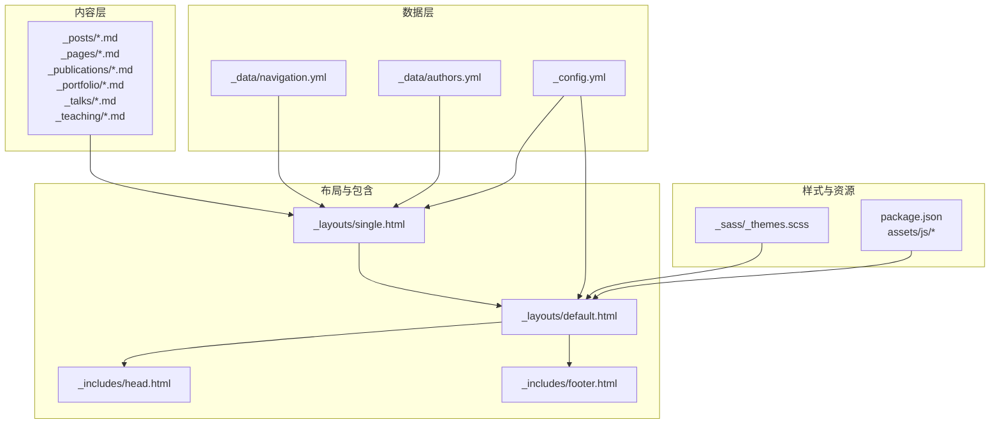
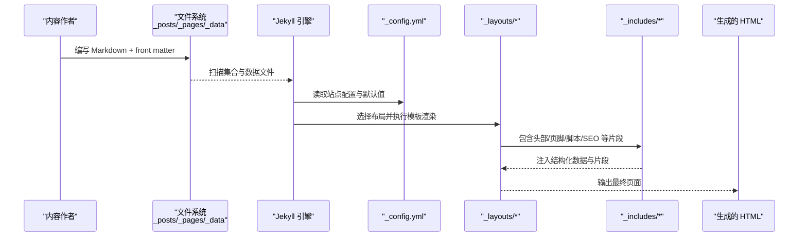
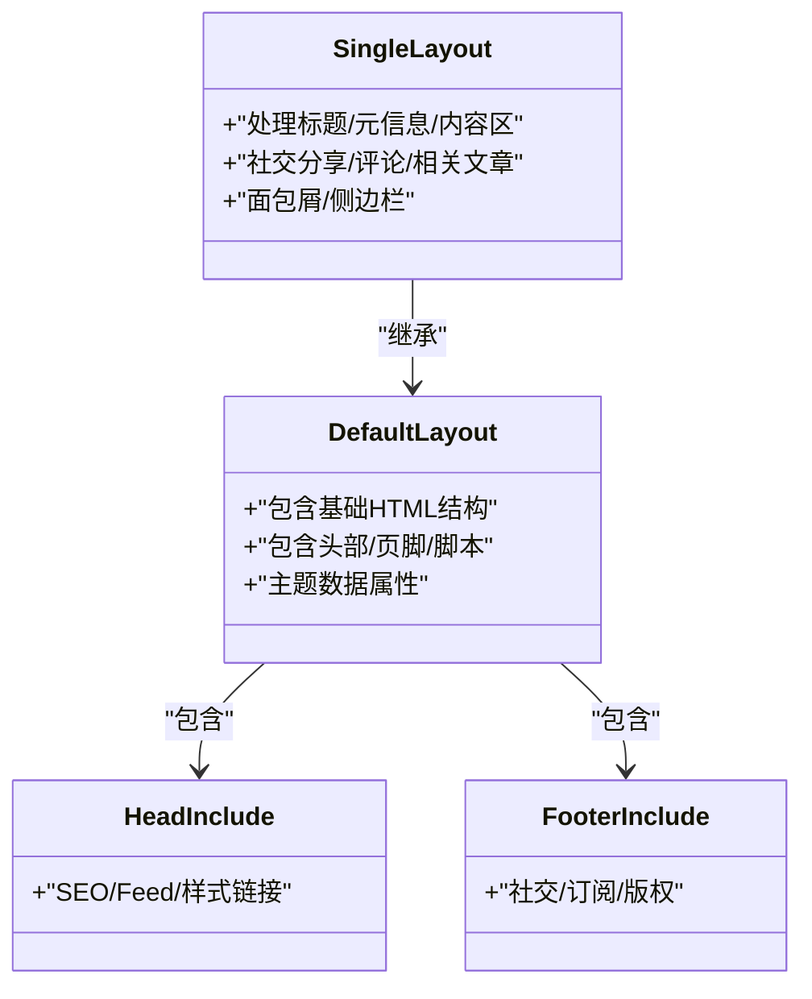
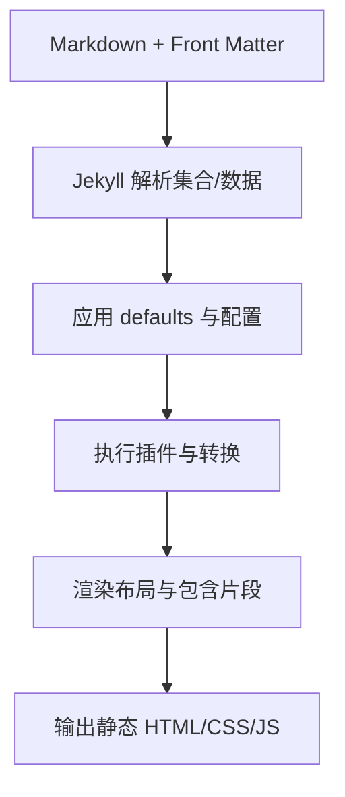
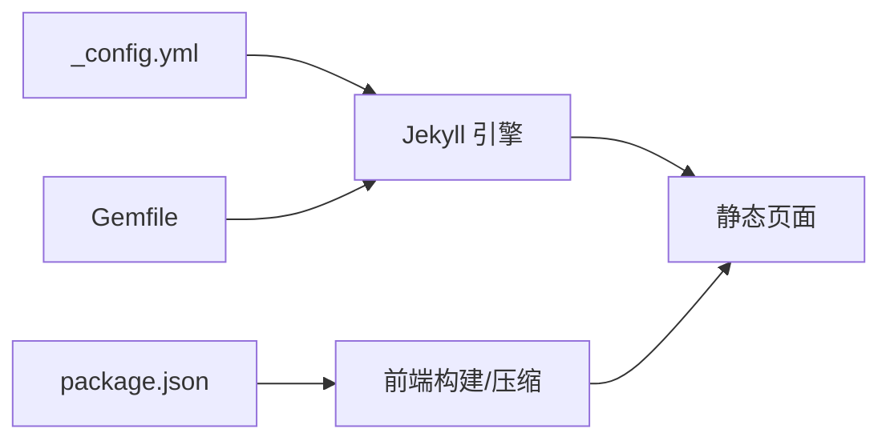

# 架构设计

<cite>
**本文引用的文件**
- [_config.yml](file://_config.yml)
- [Gemfile](file://Gemfile)
- [package.json](file://package.json)
- [README.md](file://README.md)
- [Dockerfile](file://Dockerfile)
- [docker-compose.yaml](file://docker-compose.yaml)
- [_layouts/default.html](file://_layouts/default.html)
- [_layouts/single.html](file://_layouts/single.html)
- [_includes/head.html](file://_includes/head.html)
- [_includes/footer.html](file://_includes/footer.html)
- [_sass/_themes.scss](file://_sass/_themes.scss)
- [_pages/about.md](file://_pages/about.md)
- [_posts/2025-03-11-my-first-blog.md](file://_posts/2025-03-11-my-first-blog.md)
- [_data/navigation.yml](file://_data/navigation.yml)
- [_data/authors.yml](file://_data/authors.yml)
</cite>

## 目录
1. [简介](#简介)
2. [项目结构](#项目结构)
3. [核心组件](#核心组件)
4. [架构总览](#架构总览)
5. [详细组件分析](#详细组件分析)
6. [依赖关系分析](#依赖关系分析)
7. [性能考量](#性能考量)
8. [故障排查指南](#故障排查指南)
9. [结论](#结论)
10. [附录](#附录)

## 简介
本文件面向开发者与内容运营人员，系统性阐述基于 Jekyll 的 Academic Pages 静态网站生成器的架构设计。文档以 MVC 设计模式为主线，解析“内容（Model）—布局（Controller）—视图（View）”在项目中的具体落位；同时梳理配置驱动设计、模板继承与组件化、主题系统与扩展机制、以及从内容输入到页面输出的完整数据流。

## 项目结构
该项目采用典型的 Jekyll 项目目录组织方式，围绕“内容 + 布局 + 数据 + 样式 + 资源”的分层结构展开：
- 内容层：Markdown 文档位于 _posts、_pages、_publications、_portfolio、_talks、_teaching 等集合目录，作为模型数据源。
- 布局层：_layouts 提供页面骨架与继承关系；_includes 提供可复用片段（头部、页脚、SEO、脚本等）。
- 数据层：_data 存放导航、作者、UI 文本、CV 等结构化数据，作为视图渲染的数据注入点。
- 样式层：_sass 定义 SCSS 主题变量与布局样式，配合 assets/css/main.scss 输出。
- 资源层：assets/js、assets/fonts、assets/images 等前端资源；package.json 管理前端依赖与构建脚本。
- 配置层：_config.yml 控制站点元信息、集合、插件、默认值、链接格式等；Gemfile 管理 Ruby 插件生态；Dockerfile/docker-compose.yaml 提供容器化运行环境。

**图表来源**
- [_config.yml](file://_config.yml)
- [_layouts/default.html](file://_layouts/default.html)
- [_layouts/single.html](file://_layouts/single.html)
- [_includes/head.html](file://_includes/head.html)
- [_includes/footer.html](file://_includes/footer.html)
- [_sass/_themes.scss](file://_sass/_themes.scss)
- [package.json](file://package.json)

**章节来源**
- [_config.yml](file://_config.yml)
- [_sass/_themes.scss](file://_sass/_themes.scss)
- [package.json](file://package.json)

## 核心组件
- 内容模型（Model）
  - 来源：各集合目录下的 Markdown 文件，包含 YAML 头信息（front matter）与正文内容。
  - 典型字段：title、date、layout、author_profile、categories、tags、permalink 等。
  - 示例路径：[_posts/2025-03-11-my-first-blog.md](file://_posts/2025-03-11-my-first-blog.md)，[_pages/about.md](file://_pages/about.md)

- 布局控制器（Controller）
  - 作用：通过 Jekyll 模板系统对内容进行装配与控制，决定页面如何渲染、是否启用分页、面包屑、侧边栏等。
  - 组成：_layouts/default.html 作为根布局，_layouts/single.html 作为单页布局，二者通过 include 片段组合形成完整的页面骨架。
  - 示例路径：[_layouts/default.html](file://_layouts/default.html)，[_layouts/single.html](file://_layouts/single.html)

- 视图（View）
  - 作用：使用 Liquid 模板语言渲染页面内容，结合 _includes 中的 SEO、头部、页脚、脚本等片段，输出最终 HTML。
  - 示例路径：[_includes/head.html](file://_includes/head.html)，[_includes/footer.html](file://_includes/footer.html)

- 配置驱动（Configuration-driven）
  - 作用：_config.yml 定义站点元信息、集合、默认值、插件、压缩策略、归档类型等，贯穿生成流程。
  - 示例路径：[_config.yml](file://_config.yml)

- 数据注入（Data Injection）
  - 作用：_data 下的 YAML 文件为视图提供导航、作者、UI 文本等结构化数据，增强可维护性与可定制性。
  - 示例路径：[_data/navigation.yml](file://_data/navigation.yml)，[_data/authors.yml](file://_data/authors.yml)

**章节来源**
- [_posts/2025-03-11-my-first-blog.md](file://_posts/2025-03-11-my-first-blog.md)
- [_pages/about.md](file://_pages/about.md)
- [_layouts/default.html](file://_layouts/default.html)
- [_layouts/single.html](file://_layouts/single.html)
- [_includes/head.html](file://_includes/head.html)
- [_includes/footer.html](file://_includes/footer.html)
- [_data/navigation.yml](file://_data/navigation.yml)
- [_data/authors.yml](file://_data/authors.yml)
- [_config.yml](file://_config.yml)

## 架构总览
下图展示了从内容输入到页面输出的端到端流程，体现 MVC 在 Jekyll 中的落地方式：

**图表来源**
- [_config.yml](file://_config.yml)
- [_layouts/default.html](file://_layouts/default.html)
- [_layouts/single.html](file://_layouts/single.html)
- [_includes/head.html](file://_includes/head.html)
- [_includes/footer.html](file://_includes/footer.html)

## 详细组件分析

### 组件一：内容模型（Model）与集合
- 模型形态
  - 各集合目录（如 _posts、_publications、_portfolio、_talks、_teaching）对应不同内容类型，Jekyll 通过 collections 配置识别并生成相应页面。
  - Markdown 文件头信息（front matter）定义页面元数据，如 title、date、layout、author_profile、categories、tags 等。
- 数据结构特征
  - 字段丰富且可扩展，便于在布局中按需读取。
  - 示例：博客文章包含 excerpt、read_time、comments、share、related 等字段，用于控制视图行为。
- 典型路径
  - 博文示例：[_posts/2025-03-11-my-first-blog.md](file://_posts/2025-03-11-my-first-blog.md)
  - 首页示例：[_pages/about.md](file://_pages/about.md)

**章节来源**
- [_posts/2025-03-11-my-first-blog.md](file://_posts/2025-03-11-my-first-blog.md)
- [_pages/about.md](file://_pages/about.md)
- [_config.yml](file://_config.yml)

### 组件二：布局控制器（Controller）与模板继承
- 布局层次
  - default.html 作为根布局，负责基础 HTML 结构、主题数据属性、包含 head/footer/scripts 等通用片段。
  - single.html 作为单页布局，负责文章类页面的标题、元信息、内容区、社交分享、评论、相关文章等。
- 继承与包含
  - single.html 通过 include 指令组合多个 _includes 片段，形成模块化的页面骨架。
  - 通过 layout 属性在 front matter 中选择布局，实现“同一模型、多套视图”的灵活装配。
- 典型路径
  - 根布局：[_layouts/default.html](file://_layouts/default.html)
  - 单页布局：[_layouts/single.html](file://_layouts/single.html)
  - 头部片段：[_includes/head.html](file://_includes/head.html)
  - 页脚片段：[_includes/footer.html](file://_includes/footer.html)

**图表来源**
- [_layouts/default.html](file://_layouts/default.html)
- [_layouts/single.html](file://_layouts/single.html)
- [_includes/head.html](file://_includes/head.html)
- [_includes/footer.html](file://_includes/footer.html)

**章节来源**
- [_layouts/default.html](file://_layouts/default.html)
- [_layouts/single.html](file://_layouts/single.html)
- [_includes/head.html](file://_includes/head.html)
- [_includes/footer.html](file://_includes/footer.html)

### 组件三：视图（View）与数据注入
- 视图渲染
  - 使用 Liquid 模板语法读取 page/site/data 等上下文变量，结合 include 片段完成最终 HTML 输出。
  - 示例：single.html 中根据 page.citation、paperurl、slidesurl、bibtexurl 等字段动态拼接推荐引用与下载链接。
- 数据注入
  - _data/navigation.yml 提供导航菜单结构；_data/authors.yml 提供作者信息；ui-text 等文本资源用于本地化标签。
- 典型路径
  - 导航数据：[_data/navigation.yml](file://_data/navigation.yml)
  - 作者数据：[_data/authors.yml](file://_data/authors.yml)
  - 视图片段：[_includes/head.html](file://_includes/head.html)，[_includes/footer.html](file://_includes/footer.html)

**章节来源**
- [_layouts/single.html](file://_layouts/single.html)
- [_data/navigation.yml](file://_data/navigation.yml)
- [_data/authors.yml](file://_data/authors.yml)
- [_includes/head.html](file://_includes/head.html)
- [_includes/footer.html](file://_includes/footer.html)

### 组件四：主题系统与扩展机制
- 主题变量与样式
  - _sass/_themes.scss 定义字体、断点、网格、品牌色等全局样式变量，统一视觉风格。
- 主题切换
  - 通过 _config.yml 的 site_theme 字段与布局中的 data-theme 属性，实现明暗主题的切换与持久化。
- 扩展机制
  - 新增布局：在 _layouts 下新增 *.html，front matter 中指定 layout 继承链。
  - 新增包含：在 _includes 下新增片段，通过 include 在布局中复用。
  - 新增数据：在 _data 下新增 YAML，通过 site.data.* 在模板中访问。
- 典型路径
  - 主题变量：[_sass/_themes.scss](file://_sass/_themes.scss)
  - 配置主题：[_config.yml](file://_config.yml)
  - 布局主题属性：[_layouts/default.html](file://_layouts/default.html)

**章节来源**
- [_sass/_themes.scss](file://_sass/_themes.scss)
- [_config.yml](file://_config.yml)
- [_layouts/default.html](file://_layouts/default.html)

### 组件五：数据流与生成流程
- 输入阶段
  - Markdown 内容 + front matter；_data 结构化数据；_config.yml 配置。
- 处理阶段
  - Jekyll 解析集合、应用 defaults、加载插件、执行压缩与归档。
- 输出阶段
  - 渲染布局与包含片段，生成静态 HTML；CSS 由 SCSS 编译输出；JS 由 NPM 脚本打包压缩。
- 典型路径
  - 配置与集合：[_config.yml](file://_config.yml)
  - 构建脚本：[package.json](file://package.json)

**图表来源**
- [_config.yml](file://_config.yml)
- [_layouts/default.html](file://_layouts/default.html)
- [_layouts/single.html](file://_layouts/single.html)
- [package.json](file://package.json)

**章节来源**
- [_config.yml](file://_config.yml)
- [package.json](file://package.json)

## 依赖关系分析
- Ruby 插件生态
  - Gemfile 声明 jekyll 及常用插件（feed、sitemap、redirect-from、emoji、webrick），确保生成能力与兼容性。
- 前端依赖与构建
  - package.json 管理 jQuery、fitvids、smooth-scroll、plotly 等前端库，提供压缩与监听脚本。
- 运行与开发环境
  - Dockerfile 与 docker-compose.yaml 提供容器化一键运行，避免本地环境差异。

**图表来源**
- [_config.yml](file://_config.yml)
- [Gemfile](file://Gemfile)
- [package.json](file://package.json)

**章节来源**
- [Gemfile](file://Gemfile)
- [package.json](file://package.json)
- [Dockerfile](file://Dockerfile)
- [docker-compose.yaml](file://docker-compose.yaml)

## 性能考量
- 构建优化
  - 使用压缩 HTML 插件与 SCSS 压缩输出，减少体积与请求次数。
  - 通过 include 片段复用头部/页脚/脚本，降低重复计算与模板复杂度。
- 资源管理
  - 前端资源通过 NPM 脚本统一压缩，建议在生产环境开启缓存与 CDN。
- 生成效率
  - 合理设置增量构建与排除规则，避免不必要的重渲染。
- 主题与样式
  - 将主题变量集中管理，减少样式重复与冲突，提升维护效率。

## 故障排查指南
- 本地预览失败
  - 确认已安装 Ruby、Bundler、Node.js；必要时使用本地安装路径；参考 README 的本地运行步骤。
- Docker 环境无法访问
  - 检查 docker-compose 映射端口与命令；确认工作目录权限；查看容器日志。
- 页面未按预期渲染
  - 检查 front matter 是否正确；确认 layout 选择与 include 片段是否存在；核对 _config.yml 的 defaults 与 collections 设置。
- 样式异常
  - 确认 SCSS 编译产物存在；检查主题变量与断点配置；验证 CSS 资源路径。

**章节来源**
- [README.md](file://README.md)
- [Dockerfile](file://Dockerfile)
- [docker-compose.yaml](file://docker-compose.yaml)
- [_config.yml](file://_config.yml)

## 结论
Academic Pages 以 Jekyll 为核心，采用配置驱动与模板继承的模块化架构，将内容（Model）、布局（Controller）、视图（View）清晰分离。通过 _data 的结构化数据注入、_sass 的主题变量体系、以及 Gemfile/package.json 的生态管理，实现了高可维护性与强扩展性的静态站点生成方案。开发者可据此快速搭建学术与个人主页，同时保留深度定制空间。

## 附录
- 快速定位参考
  - 配置与集合：[_config.yml](file://_config.yml)
  - 布局与包含：[_layouts/default.html](file://_layouts/default.html)、[_layouts/single.html](file://_layouts/single.html)、[_includes/head.html](file://_includes/head.html)、[_includes/footer.html](file://_includes/footer.html)
  - 数据：[_data/navigation.yml](file://_data/navigation.yml)、[_data/authors.yml](file://_data/authors.yml)
  - 样式：[_sass/_themes.scss](file://_sass/_themes.scss)
  - 构建：[package.json](file://package.json)
  - 运行：[Dockerfile](file://Dockerfile)、[docker-compose.yaml](file://docker-compose.yaml)