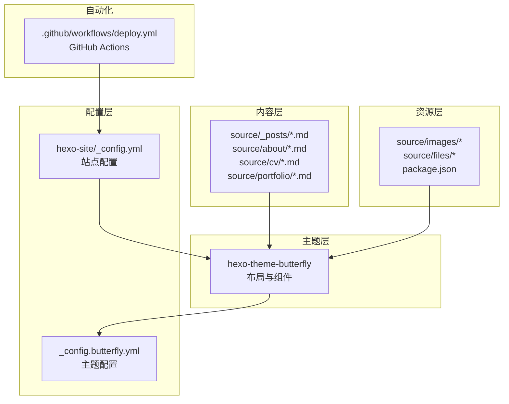
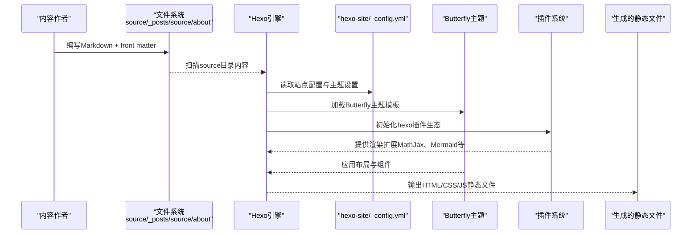
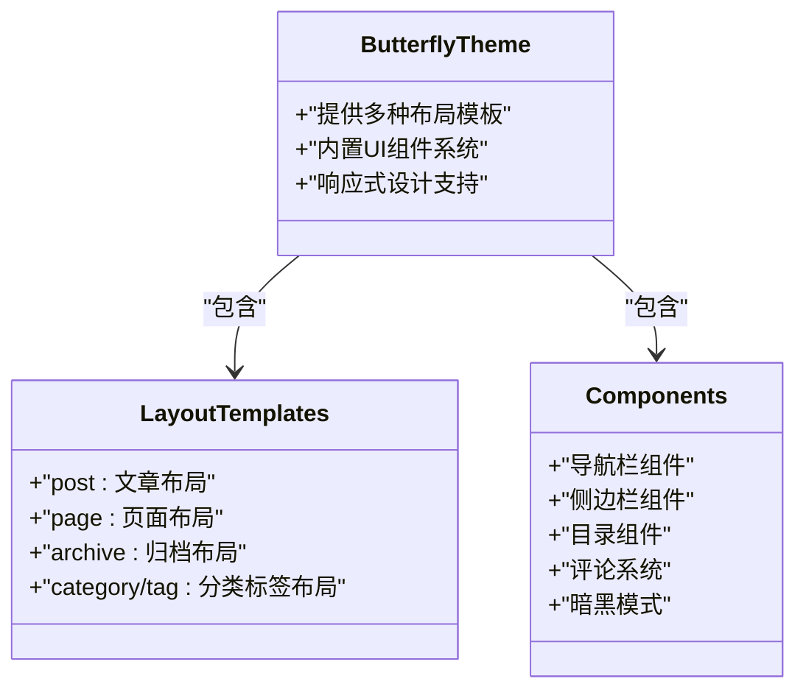
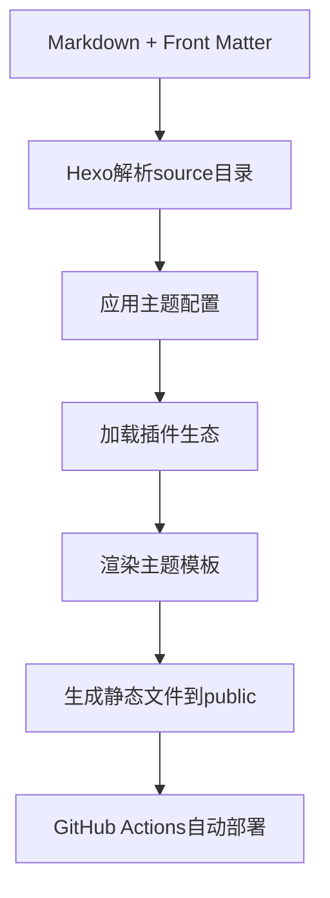
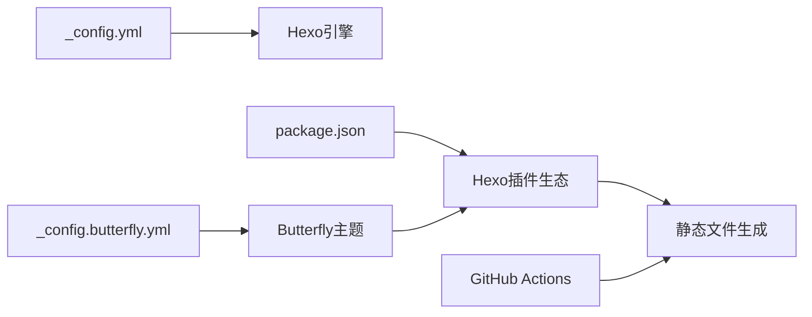

# 架构设计

<cite>
**本文引用的文件**
- [_config.yml](file://hexo-site/_config.yml)
- [_config.butterfly.yml](file://hexo-site/_config.butterfly.yml)
- [package.json](file://hexo-site/package.json)
- [deploy.yml](file://.github/workflows/deploy.yml)
- [index.md](file://hexo-site/source/index.md)
- [2025-03-11-useful-website.md](file://hexo-site/source/_posts/2025-03-11-useful-website.md)
- [index.md](file://hexo-site/source/about/index.md)
- [index.md](file://hexo-site/source/cv/index.md)
- [index.md](file://hexo-site/source/portfolio/index.md)
- [_config.yml](file://hexo-site/node_modules/hexo-theme-butterfly/_config.yml)
- [plugins.yml](file://hexo-site/node_modules/hexo-theme-butterfly/plugins.yml)
</cite>

## 更新摘要
**所做更改**
- 更新了整体架构模式，从Jekyll迁移到Hexo + Butterfly主题架构
- 重新设计了内容模型、布局系统和主题配置
- 更新了构建和部署流程，采用GitHub Actions自动化部署
- 重构了项目目录结构，采用Hexo标准的source目录组织方式
- 更新了数据流和生成流程，反映新的技术栈

## 目录
1. [简介](#简介)
2. [项目结构](#项目结构)
3. [核心组件](#核心组件)
4. [架构总览](#架构总览)
5. [详细组件分析](#详细组件分析)
6. [依赖关系分析](#依赖关系分析)
7. [性能考量](#性能考量)
8. [故障排查指南](#故障排查指南)
9. [结论](#结论)
10. [附录](#附录)

## 简介
本文件面向开发者与内容运营人员，系统性阐述基于 Hexo + Butterfly 主题的 Academic Pages 静态网站生成器架构设计。文档以 MVC 设计模式为主线，解析"内容（Model）—布局（Controller）—视图（View）"在项目中的具体落位；同时梳理配置驱动设计、主题继承与组件化、主题系统与扩展机制、以及从内容输入到页面输出的完整数据流。

**更新** 项目已从Jekyll迁移到Hexo架构，采用Butterfly主题提供现代化的学术和个人主页解决方案。

## 项目结构
该项目采用典型的 Hexo 项目目录组织方式，围绕"内容 + 主题 + 配置 + 资源"的分层结构展开：
- 内容层：Markdown 文档位于 source/_posts、source/about、source/cv、source/portfolio 等目录，作为模型数据源。
- 主题层：node_modules/hexo-theme-butterfly 提供 Butterfly 主题，包含完整的布局、样式和JavaScript组件。
- 配置层：hexo-site/_config.yml 控制站点元信息、主题配置、部署设置；hexo-site/_config.butterfly.yml 提供Butterfly主题的详细配置。
- 资源层：source/images、source/files 等前端资源；package.json 管理Node.js依赖与构建脚本。
- 自动化：.github/workflows/deploy.yml 提供GitHub Actions自动化部署流程。

**图表来源**
- [_config.yml](file://hexo-site/_config.yml)
- [_config.butterfly.yml](file://hexo-site/_config.butterfly.yml)
- [package.json](file://hexo-site/package.json)
- [deploy.yml](file://.github/workflows/deploy.yml)

**章节来源**
- [_config.yml](file://hexo-site/_config.yml)
- [_config.butterfly.yml](file://hexo-site/_config.butterfly.yml)
- [package.json](file://hexo-site/package.json)
- [deploy.yml](file://.github/workflows/deploy.yml)

## 核心组件
- 内容模型（Model）
  - 来源：Hexo的source目录下的Markdown文件，包含YAML头信息（front matter）与正文内容。
  - 典型字段：title、date、layout、categories、tags、toc、abbrlink等。
  - 示例路径：[2025-03-11-useful-website.md](file://hexo-site/source/_posts/2025-03-11-useful-website.md)，[index.md](file://hexo-site/source/about/index.md)

- 布局控制器（Controller）
  - 作用：通过Butterfly主题的模板系统对内容进行装配与控制，决定页面如何渲染、侧边栏显示、导航菜单等。
  - 组成：Butterfly主题提供多种布局模板，包括post、page、archive等，支持复杂的页面组合。
  - 示例路径：[index.md](file://hexo-site/source/index.md)

- 视图（View）
  - 作用：使用Butterfly主题的Liquid模板语言渲染页面内容，结合内置组件（导航、侧边栏、评论系统等），输出最终HTML。
  - 示例路径：[index.md](file://hexo-site/source/index.md)

- 配置驱动（Configuration-driven）
  - 作用：hexo-site/_config.yml 定义站点元信息、主题配置、部署设置等，贯穿生成流程。
  - 示例路径：[_config.yml](file://hexo-site/_config.yml)

- 主题配置（Theme Configuration）
  - 作用：_config.butterfly.yml 提供Butterfly主题的详细配置，包括导航、侧边栏、功能开关等。
  - 示例路径：[_config.butterfly.yml](file://hexo-site/_config.butterfly.yml)

**章节来源**
- [2025-03-11-useful-website.md](file://hexo-site/source/_posts/2025-03-11-useful-website.md)
- [index.md](file://hexo-site/source/about/index.md)
- [index.md](file://hexo-site/source/index.md)
- [_config.yml](file://hexo-site/_config.yml)
- [_config.butterfly.yml](file://hexo-site/_config.butterfly.yml)

## 架构总览
下图展示了从内容输入到页面输出的端到端流程，体现MVC在Hexo + Butterfly架构中的落地方式：

**图表来源**
- [_config.yml](file://hexo-site/_config.yml)
- [_config.butterfly.yml](file://hexo-site/_config.butterfly.yml)
- [package.json](file://hexo-site/package.json)

## 详细组件分析

### 组件一：内容模型（Model）与集合
- 模型形态
  - Hexo采用source目录作为内容源，支持多种内容类型（posts、pages、自定义类型）。
  - Markdown文件头信息（front matter）定义页面元数据，如title、date、layout、categories、tags等。
- 数据结构特征
  - 字段丰富且可扩展，便于在主题中按需读取。
  - 支持自定义字段（如toc、abbrlink、type等）来控制视图行为。
- 典型路径
  - 博文示例：[2025-03-11-useful-website.md](file://hexo-site/source/_posts/2025-03-11-useful-website.md)
  - 首页示例：[index.md](file://hexo-site/source/index.md)

**章节来源**
- [2025-03-11-useful-website.md](file://hexo-site/source/_posts/2025-03-11-useful-website.md)
- [index.md](file://hexo-site/source/index.md)
- [_config.yml](file://hexo-site/_config.yml)

### 组件二：布局控制器（Controller）与主题模板
- 布局层次
  - Butterfly主题提供多种布局模板，包括post、page、archive、category、tag等。
  - 支持复杂的页面组合和嵌套，通过front matter中的layout字段选择。
- 组件系统
  - 内置丰富的UI组件：导航栏、侧边栏、目录、评论系统、暗黑模式等。
  - 支持响应式设计和现代化的用户体验。
- 典型路径
  - 主页布局：[index.md](file://hexo-site/source/index.md)
  - 关于页面：[index.md](file://hexo-site/source/about/index.md)
  - 简历页面：[index.md](file://hexo-site/source/cv/index.md)

**图表来源**
- [_config.butterfly.yml](file://hexo-site/_config.butterfly.yml)
- [index.md](file://hexo-site/source/index.md)
- [index.md](file://hexo-site/source/about/index.md)

**章节来源**
- [index.md](file://hexo-site/source/index.md)
- [index.md](file://hexo-site/source/about/index.md)
- [index.md](file://hexo-site/source/cv/index.md)
- [_config.butterfly.yml](file://hexo-site/_config.butterfly.yml)

### 组件三：视图（View）与主题渲染
- 视图渲染
  - 使用Butterfly主题的Liquid模板语言渲染页面内容。
  - 支持复杂的模板继承和组件复用。
  - 内置多种页面组件和交互功能。
- 功能特性
  - 数学公式支持（MathJax/KaTeX）
  - 代码高亮与语法着色
  - 流程图和图表支持（Mermaid）
  - 字数统计和阅读时间估算
- 典型路径
  - 主页视图：[index.md](file://hexo-site/source/index.md)
  - 作品集视图：[index.md](file://hexo-site/source/portfolio/index.md)

**章节来源**
- [index.md](file://hexo-site/source/index.md)
- [index.md](file://hexo-site/source/portfolio/index.md)
- [_config.butterfly.yml](file://hexo-site/_config.butterfly.yml)

### 组件四：主题系统与扩展机制
- 主题配置
  - _config.butterfly.yml 提供详细的Butterfly主题配置选项。
  - 支持导航栏、侧边栏、组件、功能开关等全方位定制。
- 插件生态
  - package.json 管理Hexo插件生态，包括渲染器、生成器、部署器等。
  - 支持MathJax、Mermaid、sitemap、RSS等扩展功能。
- 扩展机制
  - 新增内容：在source目录下创建新的Markdown文件。
  - 新增布局：通过front matter中的layout字段选择。
  - 新增功能：通过插件系统添加新的渲染能力。
- 典型路径
  - 主题配置：[_config.butterfly.yml](file://hexo-site/_config.butterfly.yml)
  - 插件配置：[package.json](file://hexo-site/package.json)

**章节来源**
- [_config.butterfly.yml](file://hexo-site/_config.butterfly.yml)
- [package.json](file://hexo-site/package.json)

### 组件五：数据流与生成流程
- 输入阶段
  - Markdown内容 + front matter；Butterfly主题配置；Hexo站点配置。
- 处理阶段
  - Hexo解析source目录、应用主题配置、加载插件、执行渲染。
- 输出阶段
  - 生成静态HTML文件到public目录；支持一键部署到GitHub Pages。
- 典型路径
  - 配置与主题：[_config.yml](file://hexo-site/_config.yml)、[_config.butterfly.yml](file://hexo-site/_config.butterfly.yml)
  - 构建脚本：[package.json](file://hexo-site/package.json)

**图表来源**
- [_config.yml](file://hexo-site/_config.yml)
- [_config.butterfly.yml](file://hexo-site/_config.butterfly.yml)
- [package.json](file://hexo-site/package.json)
- [deploy.yml](file://.github/workflows/deploy.yml)

**章节来源**
- [_config.yml](file://hexo-site/_config.yml)
- [_config.butterfly.yml](file://hexo-site/_config.butterfly.yml)
- [package.json](file://hexo-site/package.json)
- [deploy.yml](file://.github/workflows/deploy.yml)

## 依赖关系分析
- Hexo插件生态
  - package.json 声明hexo核心、渲染器、生成器、部署器等插件。
  - 支持MathJax、Mermaid、sitemap、RSS等扩展功能。
- 主题依赖
  - hexo-theme-butterfly 提供完整的主题实现，包含布局、样式、JavaScript组件。
  - plugins.yml 定义主题使用的第三方库和CDN资源。
- 自动化部署
  - GitHub Actions工作流提供完整的CI/CD流程。
  - 支持Node.js环境、依赖安装、构建和部署。

**图表来源**
- [_config.yml](file://hexo-site/_config.yml)
- [_config.butterfly.yml](file://hexo-site/_config.butterfly.yml)
- [package.json](file://hexo-site/package.json)
- [deploy.yml](file://.github/workflows/deploy.yml)

**章节来源**
- [package.json](file://hexo-site/package.json)
- [deploy.yml](file://.github/workflows/deploy.yml)

## 性能考量
- 构建优化
  - Hexo的增量构建和缓存机制，减少不必要的重渲染。
  - Butterfly主题的懒加载和性能优化组件。
- 资源管理
  - 支持CDN资源加载和本地资源管理。
  - 插件系统提供代码压缩和优化功能。
- 生成效率
  - GitHub Actions提供云端构建环境，避免本地环境差异。
  - 支持并行构建和优化的构建流程。
- 主题与样式
  - Butterfly主题提供现代化的CSS架构和响应式设计。
  - 支持暗黑模式和主题切换功能。

## 故障排查指南
- 本地预览失败
  - 确认已安装Node.js、npm；执行npm install安装依赖。
  - 使用npm run server启动本地服务器进行预览。
- GitHub Actions部署失败
  - 检查GitHub Actions工作流配置和权限设置。
  - 确认deploy分支和发布目录配置正确。
- 页面未按预期渲染
  - 检查front matter中的layout字段和配置文件。
  - 确认Butterfly主题配置和插件设置。
- 样式异常
  - 确认Butterfly主题版本兼容性。
  - 检查自定义CSS和主题配置冲突。

**章节来源**
- [deploy.yml](file://.github/workflows/deploy.yml)
- [package.json](file://hexo-site/package.json)

## 结论
Academic Pages 已成功从Jekyll迁移到Hexo + Butterfly主题架构，采用现代化的技术栈提供了更强大的功能和更好的用户体验。通过Butterfly主题的模块化设计、丰富的插件生态、以及GitHub Actions的自动化部署，实现了高可维护性与强扩展性的静态站点生成方案。开发者可据此快速搭建学术与个人主页，同时享受现代化主题带来的丰富功能和良好的开发体验。

## 附录
- 快速定位参考
  - 配置与主题：[_config.yml](file://hexo-site/_config.yml)、[_config.butterfly.yml](file://hexo-site/_config.butterfly.yml)
  - 内容与布局：[index.md](file://hexo-site/source/index.md)、[2025-03-11-useful-website.md](file://hexo-site/source/_posts/2025-03-11-useful-website.md)
  - 主题组件：[index.md](file://hexo-site/source/about/index.md)、[index.md](file://hexo-site/source/cv/index.md)、[index.md](file://hexo-site/source/portfolio/index.md)
  - 插件生态：[package.json](file://hexo-site/package.json)
  - 自动化部署：[deploy.yml](file://.github/workflows/deploy.yml)