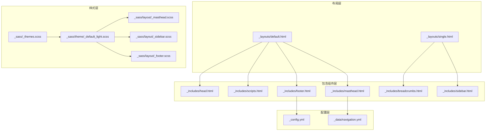
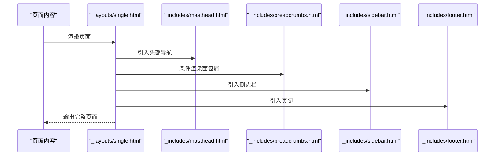
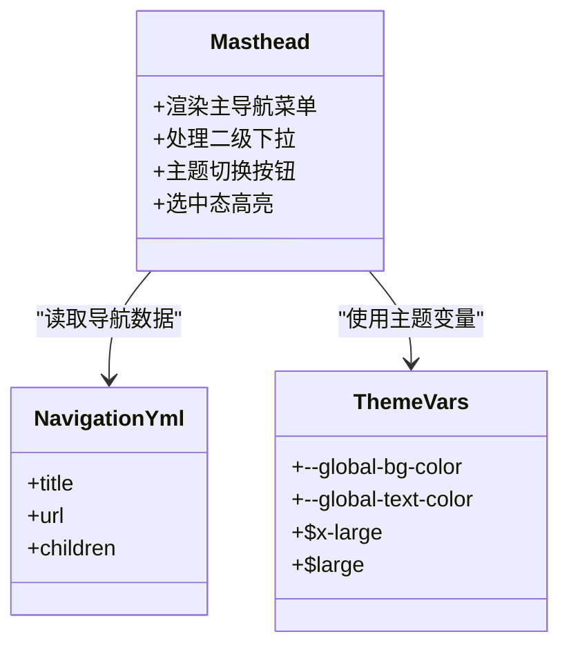
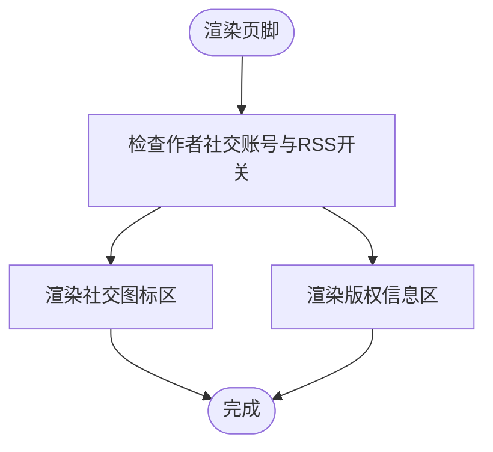
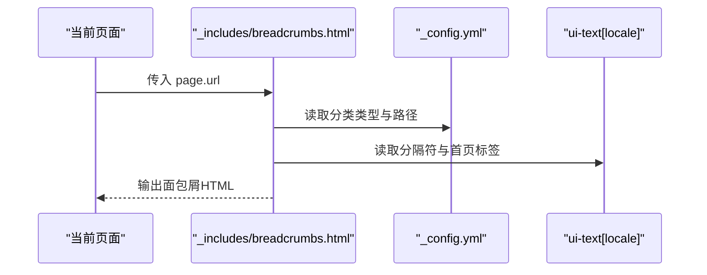
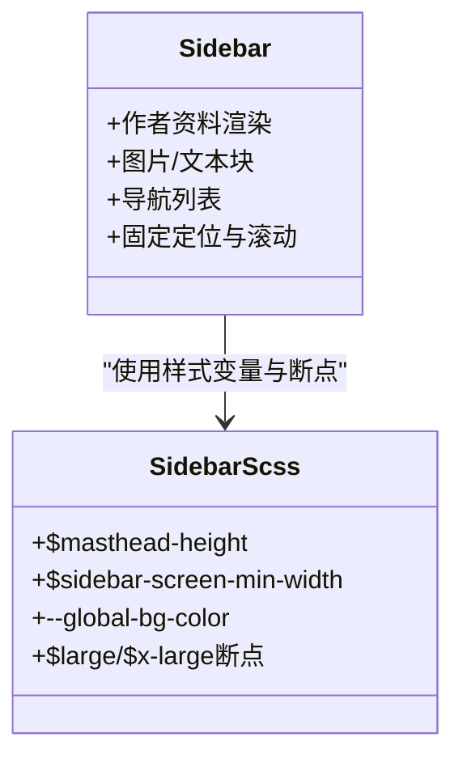
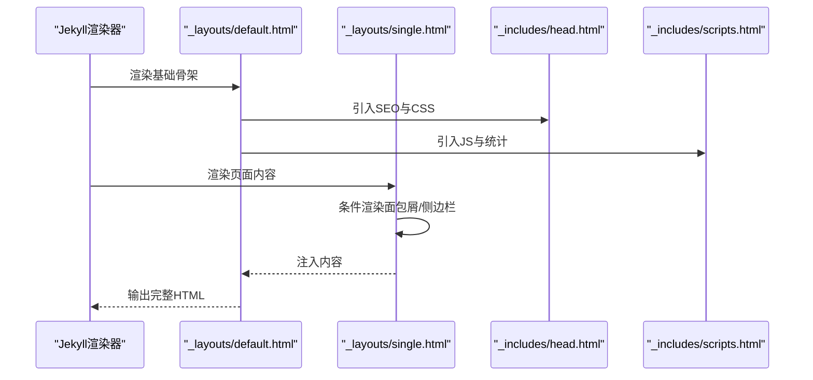
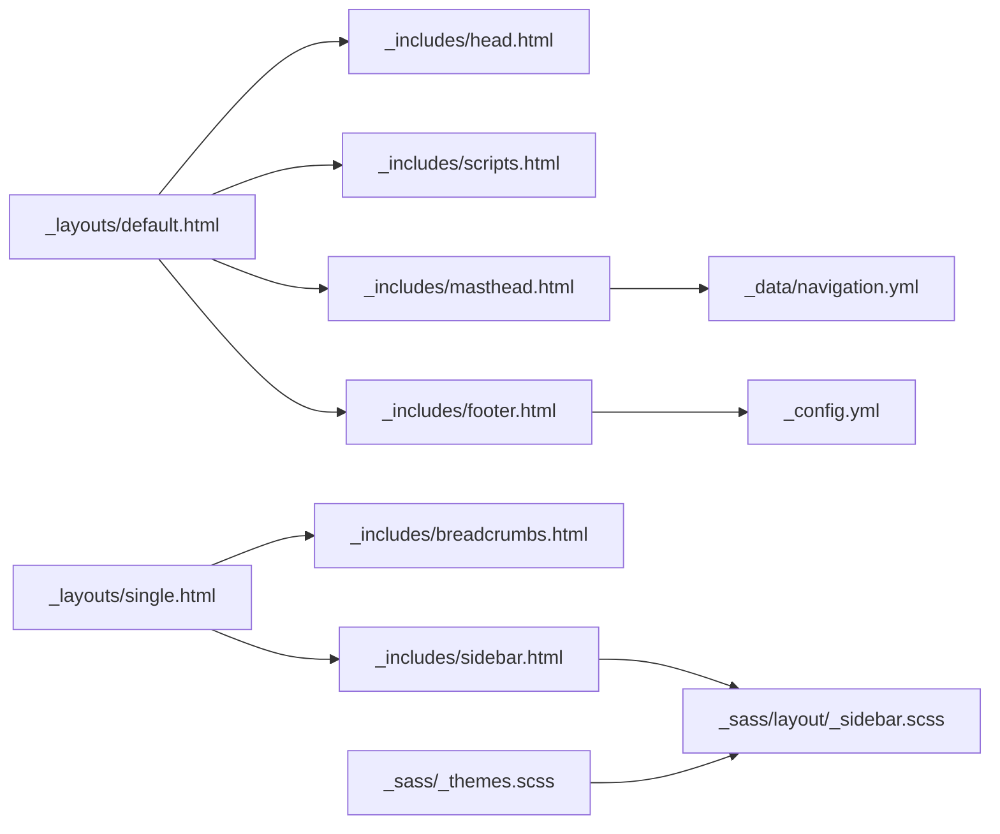

# UI组件系统

<cite>
**本文档引用的文件**
- [_includes/masthead.html](file://_includes/masthead.html)
- [_includes/footer.html](file://_includes/footer.html)
- [_includes/breadcrumbs.html](file://_includes/breadcrumbs.html)
- [_includes/sidebar.html](file://_includes/sidebar.html)
- [_includes/head.html](file://_includes/head.html)
- [_includes/scripts.html](file://_includes/scripts.html)
- [_layouts/default.html](file://_layouts/default.html)
- [_layouts/single.html](file://_layouts/single.html)
- [_config.yml](file://_config.yml)
- [_data/navigation.yml](file://_data/navigation.yml)
- [_sass/_themes.scss](file://_sass/_themes.scss)
- [_sass/theme/_default_light.scss](file://_sass/theme/_default_light.scss)
- [_sass/layout/_masthead.scss](file://_sass/layout/_masthead.scss)
- [_sass/layout/_sidebar.scss](file://_sass/layout/_sidebar.scss)
- [_sass/layout/_footer.scss](file://_sass/layout/_footer.scss)
</cite>

## 目录
1. [简介](#简介)
2. [项目结构](#项目结构)
3. [核心组件](#核心组件)
4. [架构总览](#架构总览)
5. [详细组件分析](#详细组件分析)
6. [依赖关系分析](#依赖关系分析)
7. [性能考虑](#性能考虑)
8. [故障排除指南](#故障排除指南)
9. [结论](#结论)
10. [附录](#附录)

## 简介
本文件系统性梳理了基于 Jekyll 的 UI 组件体系，重点覆盖可复用的模板组件（头部导航、页脚、面包屑导航、侧边栏等），解释其使用方式、参数配置与自定义选项，并阐述布局系统的工作原理（页面结构、内容区域划分、样式继承机制）。同时提供组件扩展与定制的最佳实践，帮助读者在不破坏现有结构的前提下进行二次开发。

## 项目结构
UI 组件主要由以下层次构成：
- 布局层：通过 _layouts 定义页面骨架与内容容器，控制全局结构与渲染顺序
- 包含组件层：通过 _includes 提供可复用的 UI 片段（如导航、页脚、面包屑、侧边栏）
- 样式层：通过 _sass 提供主题变量、布局样式与主题变体，实现统一风格与响应式设计
- 配置层：通过 _config.yml 与 _data/navigation.yml 控制站点行为与导航菜单

图表来源
- [_layouts/default.html:1-32](file://_layouts/default.html#L1-L32)
- [_layouts/single.html:1-110](file://_layouts/single.html#L1-L110)
- [_includes/head.html:1-17](file://_includes/head.html#L1-L17)
- [_includes/scripts.html:1-4](file://_includes/scripts.html#L1-L4)
- [_includes/masthead.html:1-48](file://_includes/masthead.html#L1-L48)
- [_includes/footer.html:1-26](file://_includes/footer.html#L1-L26)
- [_includes/breadcrumbs.html:1-41](file://_includes/breadcrumbs.html#L1-L41)
- [_includes/sidebar.html:1-25](file://_includes/sidebar.html#L1-L25)
- [_sass/theme/_default_light.scss:1-49](file://_sass/theme/_default_light.scss#L1-L49)
- [_sass/layout/_masthead.scss:1-81](file://_sass/layout/_masthead.scss#L1-L81)
- [_sass/layout/_sidebar.scss:1-325](file://_sass/layout/_sidebar.scss#L1-L325)
- [_sass/layout/_footer.scss:1-97](file://_sass/layout/_footer.scss#L1-L97)
- [_sass/_themes.scss:1-104](file://_sass/_themes.scss#L1-L104)
- [_config.yml:1-362](file://_config.yml#L1-L362)
- [_data/navigation.yml:1-40](file://_data/navigation.yml#L1-L40)

章节来源
- [_layouts/default.html:1-32](file://_layouts/default.html#L1-L32)
- [_layouts/single.html:1-110](file://_layouts/single.html#L1-L110)
- [_includes/head.html:1-17](file://_includes/head.html#L1-L17)
- [_includes/scripts.html:1-4](file://_includes/scripts.html#L1-L4)
- [_includes/masthead.html:1-48](file://_includes/masthead.html#L1-L48)
- [_includes/footer.html:1-26](file://_includes/footer.html#L1-L26)
- [_includes/breadcrumbs.html:1-41](file://_includes/breadcrumbs.html#L1-L41)
- [_includes/sidebar.html:1-25](file://_includes/sidebar.html#L1-L25)
- [_sass/_themes.scss:1-104](file://_sass/_themes.scss#L1-L104)
- [_sass/theme/_default_light.scss:1-49](file://_sass/theme/_default_light.scss#L1-L49)
- [_sass/layout/_masthead.scss:1-81](file://_sass/layout/_masthead.scss#L1-L81)
- [_sass/layout/_sidebar.scss:1-325](file://_sass/layout/_sidebar.scss#L1-L325)
- [_sass/layout/_footer.scss:1-97](file://_sass/layout/_footer.scss#L1-L97)
- [_config.yml:1-362](file://_config.yml#L1-L362)
- [_data/navigation.yml:1-40](file://_data/navigation.yml#L1-L40)

## 核心组件
本节对关键 UI 组件进行深入解析，涵盖职责、参数、行为与可定制点。

- 头部导航（masthead）
  - 职责：渲染站点主导航菜单，支持多级下拉、主题切换按钮与选中态高亮
  - 关键参数：来自 _data/navigation.yml 的导航项列表；当前页面路径用于选中态判断
  - 可定制点：导航项标题、链接、是否带子菜单；主题切换图标与交互
  - 参考路径：[_includes/masthead.html:1-48](file://_includes/masthead.html#L1-L48)，[_data/navigation.yml:1-40](file://_data/navigation.yml#L1-L40)

- 页脚（footer）
  - 职责：展示社交链接、RSS 订阅入口与版权信息
  - 关键参数：作者社交账号、RSS 开关、语言文案（ui-text）
  - 可定制点：添加/隐藏社交图标、自定义文案标签、版权年份更新
  - 参考路径：[_includes/footer.html:1-26](file://_includes/footer.html#L1-L26)，[_config.yml:1-362](file://_config.yml#L1-L362)

- 面包屑导航（breadcrumbs）
  - 职责：根据页面 URL 生成结构化面包屑，支持分类路径与分隔符
  - 关键参数：站点分类类型、分类路径、语言文案（分隔符、首页标签）
  - 可定制点：修改分隔符、首页标签、分类路径前缀
  - 参考路径：[_includes/breadcrumbs.html:1-41](file://_includes/breadcrumbs.html#L1-L41)，[_config.yml:1-362](file://_config.yml#L1-L362)

- 侧边栏（sidebar）
  - 职责：渲染作者资料、图片、文本与导航列表（可选）
  - 关键参数：页面或布局中的 author_profile、sidebar 列表（image、title、text、nav）
  - 可定制点：侧边栏宽度、固定定位、头像圆角、链接列表层级
  - 参考路径：[_includes/sidebar.html:1-25](file://_includes/sidebar.html#L1-L25)，[_sass/layout/_sidebar.scss:1-325](file://_sass/layout/_sidebar.scss#L1-L325)

- 页面骨架（default/single）
  - 职责：组合 head、masthead、内容区、footer、scripts；控制面包屑显示条件
  - 关键参数：布局继承、内容插槽、面包屑开关、侧边栏开关
  - 可定制点：添加自定义 head 片段、footer 自定义片段、内容区网格布局
  - 参考路径：[_layouts/default.html:1-32](file://_layouts/default.html#L1-L32)，[_layouts/single.html:1-110](file://_layouts/single.html#L1-L110)

章节来源
- [_includes/masthead.html:1-48](file://_includes/masthead.html#L1-L48)
- [_includes/footer.html:1-26](file://_includes/footer.html#L1-L26)
- [_includes/breadcrumbs.html:1-41](file://_includes/breadcrumbs.html#L1-L41)
- [_includes/sidebar.html:1-25](file://_includes/sidebar.html#L1-L25)
- [_layouts/default.html:1-32](file://_layouts/default.html#L1-L32)
- [_layouts/single.html:1-110](file://_layouts/single.html#L1-L110)
- [_config.yml:1-362](file://_config.yml#L1-L362)
- [_data/navigation.yml:1-40](file://_data/navigation.yml#L1-L40)

## 架构总览
UI 组件遵循“布局装配 + 组件拼装 + 主题样式”的三层架构：
- 布局装配：default/single 决定页面骨架与内容容器，按需引入面包屑与侧边栏
- 组件拼装：masthead、footer、breadcrumbs、sidebar 作为独立片段被布局调用
- 主题样式：通过 SCSS 变量与主题文件统一管理颜色、排版、断点与组件样式

图表来源
- [_layouts/single.html:1-110](file://_layouts/single.html#L1-L110)
- [_includes/masthead.html:1-48](file://_includes/masthead.html#L1-L48)
- [_includes/breadcrumbs.html:1-41](file://_includes/breadcrumbs.html#L1-L41)
- [_includes/sidebar.html:1-25](file://_includes/sidebar.html#L1-L25)
- [_includes/footer.html:1-26](file://_includes/footer.html#L1-L26)

## 详细组件分析

### 头部导航组件（masthead）
- 结构与行为
  - 顶层容器固定于顶部，支持动画入场与边框线
  - 导航菜单采用贪吃蛇式布局，移动端折叠为汉堡菜单
  - 支持二级下拉菜单，选中态通过类名与边框高亮
  - 主题切换按钮通过图标与 aria 属性提供无障碍支持
- 参数与数据源
  - 导航项来源于 _data/navigation.yml，支持 children 实现下拉
  - 当前页面路径用于判断选中态
- 样式继承
  - 使用主题变量（如 --global-bg-color、--global-text-color）实现主题色统一
  - 断点与容器宽度由共享变量控制
- 扩展建议
  - 新增导航项：在 _data/navigation.yml 中追加条目
  - 自定义样式：调整 _sass/layout/_masthead.scss 或主题 SCSS 文件
  - 交互增强：结合 _sass/layout/_masthead.scss 中的 hover/active 规则

图表来源
- [_includes/masthead.html:1-48](file://_includes/masthead.html#L1-L48)
- [_data/navigation.yml:1-40](file://_data/navigation.yml#L1-L40)
- [_sass/layout/_masthead.scss:1-81](file://_sass/layout/_masthead.scss#L1-L81)
- [_sass/_themes.scss:1-104](file://_sass/_themes.scss#L1-L104)

章节来源
- [_includes/masthead.html:1-48](file://_includes/masthead.html#L1-L48)
- [_data/navigation.yml:1-40](file://_data/navigation.yml#L1-L40)
- [_sass/layout/_masthead.scss:1-81](file://_sass/layout/_masthead.scss#L1-L81)
- [_sass/_themes.scss:1-104](file://_sass/_themes.scss#L1-L104)

### 页脚组件（footer）
- 结构与行为
  - 社交图标区与版权信息区分离，支持 RSS 订阅链接
  - 文案通过 ui-text 按语言加载，具备默认值回退
- 参数与数据源
  - 作者社交账号字段（github、bitbucket 等）
  - RSS 开关与路径配置
  - 语言文案（follow_label、feed_label、powered_by）
- 样式继承
  - 使用主题变量控制背景、文字与边框颜色
  - 在大屏断点下限制最大宽度，保持居中
- 扩展建议
  - 添加新社交平台：在作者配置中新增字段并在 footer 中渲染
  - 自定义版权信息：通过 ui-text 覆盖文案

图表来源
- [_includes/footer.html:1-26](file://_includes/footer.html#L1-L26)
- [_config.yml:1-362](file://_config.yml#L1-L362)

章节来源
- [_includes/footer.html:1-26](file://_includes/footer.html#L1-L26)
- [_config.yml:1-362](file://_config.yml#L1-L362)

### 面包屑导航（breadcrumbs）
- 结构与行为
  - 根据页面 URL 动态生成层级链接，首层为首页，末层为当前页标题
  - 分类路径与分隔符可通过配置与语言文案控制
- 参数与数据源
  - 分类类型（liquid/jekyll-archives）影响路径前缀
  - 分类路径与分隔符、首页标签来自配置与 ui-text
- 扩展建议
  - 自定义分隔符：在 ui-text 中设置 breadcrumb_separator
  - 自定义首页标签：在 ui-text 中设置 breadcrumb_home_label

图表来源
- [_includes/breadcrumbs.html:1-41](file://_includes/breadcrumbs.html#L1-L41)
- [_config.yml:1-362](file://_config.yml#L1-L362)

章节来源
- [_includes/breadcrumbs.html:1-41](file://_includes/breadcrumbs.html#L1-L41)
- [_config.yml:1-362](file://_config.yml#L1-L362)

### 侧边栏组件（sidebar）
- 结构与行为
  - 支持作者资料（头像、姓名、简介、社交链接）、图片、文本与导航列表
  - 在桌面端固定定位，支持滚动；移动端适配
- 参数与数据源
  - 页面或布局中的 author_profile、sidebar 列表（image、title、text、nav）
  - 导航列表通过 nav_list 片段渲染
- 样式继承
  - 使用主题变量控制背景、边框、链接颜色
  - 通过断点与网格系统控制宽度与悬浮效果
- 扩展建议
  - 新增侧边栏模块：在 sidebar 列表中添加对象
  - 自定义样式：调整 _sass/layout/_sidebar.scss 中的断点与颜色

图表来源
- [_includes/sidebar.html:1-25](file://_includes/sidebar.html#L1-L25)
- [_sass/layout/_sidebar.scss:1-325](file://_sass/layout/_sidebar.scss#L1-L325)
- [_sass/_themes.scss:1-104](file://_sass/_themes.scss#L1-L104)

章节来源
- [_includes/sidebar.html:1-25](file://_includes/sidebar.html#L1-L25)
- [_sass/layout/_sidebar.scss:1-325](file://_sass/layout/_sidebar.scss#L1-L325)
- [_sass/_themes.scss:1-104](file://_sass/_themes.scss#L1-L104)

### 页面骨架（default/single）
- 结构与行为
  - default 负责全局 HTML 结构、head、脚本与 footer
  - single 负责内容区、面包屑、侧边栏与文章主体
  - 条件渲染：仅在非首页且开启面包屑时显示面包屑
- 参数与数据源
  - 布局继承：single 继承 default
  - 内容插槽：{{ content }} 插入页面内容
  - 面包屑开关：site.breadcrumbs
  - 侧边栏开关：page.sidebar / layout.author_profile
- 扩展建议
  - 自定义 head：在 head/custom.html 中添加额外资源
  - 自定义 footer：在 footer/custom.html 中插入版权外链

图表来源
- [_layouts/default.html:1-32](file://_layouts/default.html#L1-L32)
- [_layouts/single.html:1-110](file://_layouts/single.html#L1-L110)
- [_includes/head.html:1-17](file://_includes/head.html#L1-L17)
- [_includes/scripts.html:1-4](file://_includes/scripts.html#L1-L4)

章节来源
- [_layouts/default.html:1-32](file://_layouts/default.html#L1-L32)
- [_layouts/single.html:1-110](file://_layouts/single.html#L1-L110)
- [_includes/head.html:1-17](file://_includes/head.html#L1-L17)
- [_includes/scripts.html:1-4](file://_includes/scripts.html#L1-L4)

## 依赖关系分析
- 组件耦合
  - default 与 single：单向依赖，single 依赖 default 的全局结构
  - masthead 与 navigation.yml：数据驱动，导航结构变化直接影响 UI
  - footer 与 _config.yml：配置驱动，作者信息与 RSS 开关影响渲染
  - breadcrumbs 与 _config.yml：分类类型与路径决定面包屑行为
  - sidebar 与 _sass/layout/_sidebar.scss：样式变量与断点控制布局
- 外部依赖
  - 主题系统：通过 _sass/_themes.scss 与主题 SCSS 文件提供变量与颜色
  - 语言文案：ui-text 提供多语言标签，避免硬编码
- 潜在循环依赖
  - 未发现直接循环依赖；组件间通过布局与包含关系解耦

图表来源
- [_layouts/default.html:1-32](file://_layouts/default.html#L1-L32)
- [_layouts/single.html:1-110](file://_layouts/single.html#L1-L110)
- [_includes/head.html:1-17](file://_includes/head.html#L1-L17)
- [_includes/scripts.html:1-4](file://_includes/scripts.html#L1-L4)
- [_includes/masthead.html:1-48](file://_includes/masthead.html#L1-L48)
- [_includes/footer.html:1-26](file://_includes/footer.html#L1-L26)
- [_includes/breadcrumbs.html:1-41](file://_includes/breadcrumbs.html#L1-L41)
- [_includes/sidebar.html:1-25](file://_includes/sidebar.html#L1-L25)
- [_data/navigation.yml:1-40](file://_data/navigation.yml#L1-L40)
- [_config.yml:1-362](file://_config.yml#L1-L362)
- [_sass/layout/_sidebar.scss:1-325](file://_sass/layout/_sidebar.scss#L1-L325)
- [_sass/_themes.scss:1-104](file://_sass/_themes.scss#L1-L104)

章节来源
- [_layouts/default.html:1-32](file://_layouts/default.html#L1-L32)
- [_layouts/single.html:1-110](file://_layouts/single.html#L1-L110)
- [_includes/masthead.html:1-48](file://_includes/masthead.html#L1-L48)
- [_includes/footer.html:1-26](file://_includes/footer.html#L1-L26)
- [_includes/breadcrumbs.html:1-41](file://_includes/breadcrumbs.html#L1-L41)
- [_includes/sidebar.html:1-25](file://_includes/sidebar.html#L1-L25)
- [_data/navigation.yml:1-40](file://_data/navigation.yml#L1-L40)
- [_config.yml:1-362](file://_config.yml#L1-L362)
- [_sass/layout/_sidebar.scss:1-325](file://_sass/layout/_sidebar.scss#L1-L325)
- [_sass/_themes.scss:1-104](file://_sass/_themes.scss#L1-L104)

## 性能考虑
- 资源压缩与按需加载
  - 使用 compress_html 插件压缩 HTML 输出，减少传输体积
  - 将脚本打包为单一入口，避免重复请求
- 样式优化
  - 通过主题变量集中管理颜色与尺寸，减少重复样式
  - 合理使用断点与容器宽度，避免过度重绘
- 渲染策略
  - 面包屑仅在必要时渲染（非首页且开启），降低 DOM 负担
  - 侧边栏在桌面端固定定位，减少滚动时的布局抖动

## 故障排除指南
- 导航不显示或下拉无效
  - 检查 _data/navigation.yml 是否正确配置 children
  - 确认页面路径与导航 url 是否匹配以触发选中态
  - 参考：[_includes/masthead.html:1-48](file://_includes/masthead.html#L1-L48)，[_data/navigation.yml:1-40](file://_data/navigation.yml#L1-L40)
- 面包屑路径错误
  - 检查分类类型与分类路径配置，确认分类归档页面存在
  - 参考：[_includes/breadcrumbs.html:1-41](file://_includes/breadcrumbs.html#L1-L41)，[_config.yml:1-362](file://_config.yml#L1-L362)
- 侧边栏不出现
  - 确认页面 front matter 中设置了 author_profile 或 sidebar
  - 参考：[_includes/sidebar.html:1-25](file://_includes/sidebar.html#L1-L25)
- 页脚社交图标缺失
  - 在作者配置中添加对应字段，或关闭 RSS 开关以避免条件渲染
  - 参考：[_includes/footer.html:1-26](file://_includes/footer.html#L1-L26)，[_config.yml:1-362](file://_config.yml#L1-L362)
- 样式异常或主题色不生效
  - 检查主题 SCSS 文件与共享变量是否正确编译
  - 参考：[_sass/theme/_default_light.scss:1-49](file://_sass/theme/_default_light.scss#L1-L49)，[_sass/_themes.scss:1-104](file://_sass/_themes.scss#L1-L104)

章节来源
- [_includes/masthead.html:1-48](file://_includes/masthead.html#L1-L48)
- [_data/navigation.yml:1-40](file://_data/navigation.yml#L1-L40)
- [_includes/breadcrumbs.html:1-41](file://_includes/breadcrumbs.html#L1-L41)
- [_config.yml:1-362](file://_config.yml#L1-L362)
- [_includes/sidebar.html:1-25](file://_includes/sidebar.html#L1-L25)
- [_includes/footer.html:1-26](file://_includes/footer.html#L1-L26)
- [_sass/theme/_default_light.scss:1-49](file://_sass/theme/_default_light.scss#L1-L49)
- [_sass/_themes.scss:1-104](file://_sass/_themes.scss#L1-L104)

## 结论
本 UI 组件系统通过布局装配、组件拼装与主题样式的分层设计，实现了高内聚、低耦合的可复用结构。开发者可在不破坏整体架构的前提下，通过配置与样式变量快速扩展导航、页脚、面包屑与侧边栏等组件，并借助断点与主题系统实现一致的视觉体验与良好的可维护性。

## 附录
- 最佳实践清单
  - 使用 _data/navigation.yml 管理导航结构，避免在模板中硬编码
  - 通过 ui-text 提供国际化文案，确保跨语言一致性
  - 在 _sass/_themes.scss 中集中管理主题变量，避免散落颜色值
  - 仅在必要时渲染面包屑与侧边栏，提升性能
  - 通过布局继承与包含关系组织页面结构，保持代码整洁