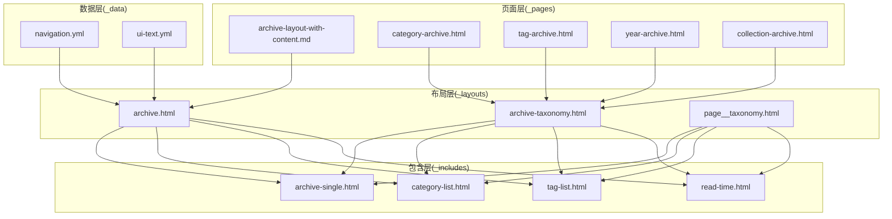
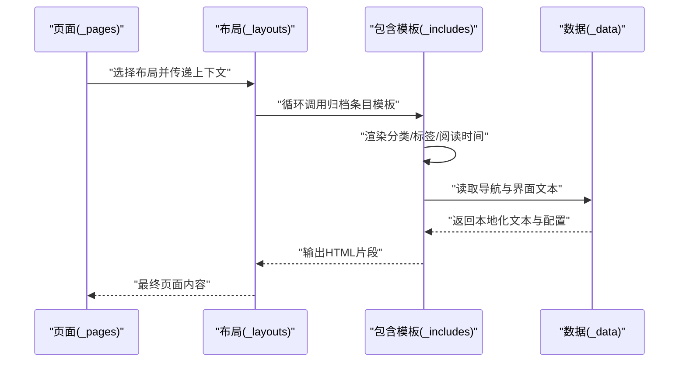
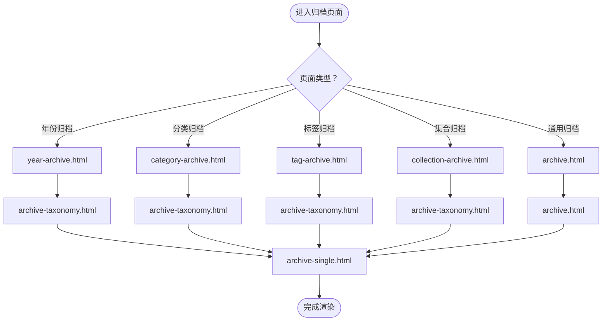
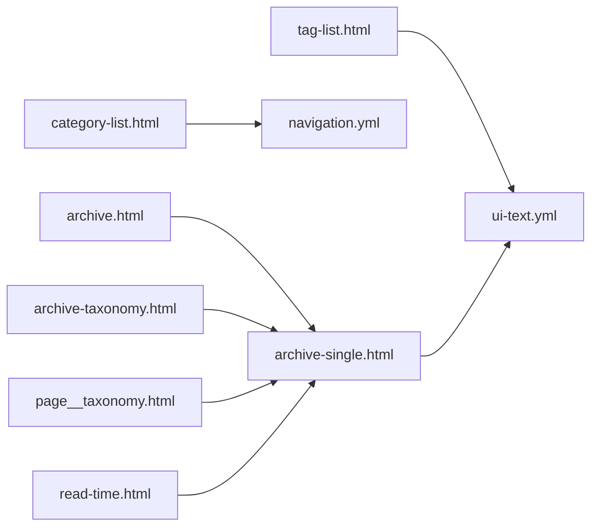

# 内容展示组件

<cite>
**本文档引用的文件**
- [_includes/archive-single.html](file://_includes/archive-single.html)
- [_includes/category-list.html](file://_includes/category-list.html)
- [_includes/tag-list.html](file://_includes/tag-list.html)
- [_includes/read-time.html](file://_includes/read-time.html)
- [_layouts/archive.html](file://_layouts/archive.html)
- [_layouts/archive-taxonomy.html](file://_layouts/archive-taxonomy.html)
- [_layouts/page__taxonomy.html](file://_layouts/page__taxonomy.html)
- [_pages/archive-layout-with-content.md](file://_pages/archive-layout-with-content.md)
- [_pages/category-archive.html](file://_pages/category-archive.html)
- [_pages/tag-archive.html](file://_pages/tag-archive.html)
- [_pages/year-archive.html](file://_pages/year-archive.html)
- [_pages/collection-archive.html](file://_pages/collection-archive.html)
- [_config.yml](file://_config.yml)
- [_data/navigation.yml](file://_data/navigation.yml)
- [_data/ui-text.yml](file://_data/ui-text.yml)
</cite>

## 目录
1. [简介](#简介)
2. [项目结构](#项目结构)
3. [核心组件](#核心组件)
4. [架构总览](#架构总览)
5. [详细组件分析](#详细组件分析)
6. [依赖关系分析](#依赖关系分析)
7. [性能考虑](#性能考虑)
8. [故障排除指南](#故障排除指南)
9. [结论](#结论)
10. [附录](#附录)

## 简介
本文件面向Jekyll主题使用者与开发者，系统性梳理内容展示组件的设计与实现，重点覆盖以下能力：
- 文章归档：按年份、分类、标签等维度组织内容列表
- 分类列表：展示站点所有分类及其统计信息
- 标签云：按权重展示标签，支持自定义样式
- 阅读时间显示：基于字数估算阅读时长，提升用户体验

同时说明这些组件如何与Jekyll集合（collections）系统集成，如何通过数据文件与配置进行样式与内容定制，并提供参数配置与扩展建议。

## 项目结构
该Jekyll站点采用标准布局与包含模板分离的组织方式：
- 布局层：_layouts 提供页面骨架与归档布局
- 包含层：_includes 提供可复用的UI片段（归档条目、分类列表、标签云、阅读时间等）
- 页面层：_pages 定义具体页面（如分类归档、标签归档、年份归档、集合归档）
- 数据层：_data 提供导航、界面文本与作者信息等

**图表来源**
- [_layouts/archive.html](file://_layouts/archive.html)
- [_layouts/archive-taxonomy.html](file://_layouts/archive-taxonomy.html)
- [_layouts/page__taxonomy.html](file://_layouts/page__taxonomy.html)
- [_includes/archive-single.html](file://_includes/archive-single.html)
- [_includes/category-list.html](file://_includes/category-list.html)
- [_includes/tag-list.html](file://_includes/tag-list.html)
- [_includes/read-time.html](file://_includes/read-time.html)
- [_pages/archive-layout-with-content.md](file://_pages/archive-layout-with-content.md)
- [_pages/category-archive.html](file://_pages/category-archive.html)
- [_pages/tag-archive.html](file://_pages/tag-archive.html)
- [_pages/year-archive.html](file://_pages/year-archive.html)
- [_pages/collection-archive.html](file://_pages/collection-archive.html)
- [_data/navigation.yml](file://_data/navigation.yml)
- [_data/ui-text.yml](file://_data/ui-text.yml)

**章节来源**
- [_layouts/archive.html](file://_layouts/archive.html)
- [_layouts/archive-taxonomy.html](file://_layouts/archive-taxonomy.html)
- [_layouts/page__taxonomy.html](file://_layouts/page__taxonomy.html)
- [_includes/archive-single.html](file://_includes/archive-single.html)
- [_includes/category-list.html](file://_includes/category-list.html)
- [_includes/tag-list.html](file://_includes/tag-list.html)
- [_includes/read-time.html](file://_includes/read-time.html)
- [_pages/archive-layout-with-content.md](file://_pages/archive-layout-with-content.md)
- [_pages/category-archive.html](file://_pages/category-archive.html)
- [_pages/tag-archive.html](file://_pages/tag-archive.html)
- [_pages/year-archive.html](file://_pages/year-archive.html)
- [_pages/collection-archive.html](file://_pages/collection-archive.html)
- [_data/navigation.yml](file://_data/navigation.yml)
- [_data/ui-text.yml](file://_data/ui-text.yml)

## 核心组件
本节概述四个核心内容展示组件的功能定位与协作关系：
- 归档条目模板：用于渲染单个内容项在归档页中的展示形式
- 分类列表：渲染站点分类导航与统计
- 标签云：渲染标签权重云，支持自定义样式
- 阅读时间：根据内容字数估算阅读时长并展示

这些组件通过布局与页面的组合，配合Jekyll的集合系统与数据文件，实现灵活的内容组织与呈现。

**章节来源**
- [_includes/archive-single.html](file://_includes/archive-single.html)
- [_includes/category-list.html](file://_includes/category-list.html)
- [_includes/tag-list.html](file://_includes/tag-list.html)
- [_includes/read-time.html](file://_includes/read-time.html)

## 架构总览
下图展示了从页面到布局再到包含模板的数据流与控制流：

**图表来源**
- [_layouts/archive.html](file://_layouts/archive.html)
- [_layouts/archive-taxonomy.html](file://_layouts/archive-taxonomy.html)
- [_layouts/page__taxonomy.html](file://_layouts/page__taxonomy.html)
- [_includes/archive-single.html](file://_includes/archive-single.html)
- [_includes/category-list.html](file://_includes/category-list.html)
- [_includes/tag-list.html](file://_includes/tag-list.html)
- [_includes/read-time.html](file://_includes/read-time.html)
- [_data/navigation.yml](file://_data/navigation.yml)
- [_data/ui-text.yml](file://_data/ui-text.yml)

## 详细组件分析

### 归档条目模板（archive-single）
- 功能：渲染单个内容项在归档页中的展示，通常包含标题、摘要、日期、分类、标签等字段
- 关键点：
  - 支持自定义摘要截断与“阅读更多”链接
  - 可选显示作者信息、社交分享按钮等
  - 与布局层的归档页配合，形成列表视图
- 扩展建议：
  - 添加图片缩略图或特色图
  - 支持置顶、专题等特殊标记
  - 自定义排序规则（如按阅读量、评分）

**章节来源**
- [_includes/archive-single.html](file://_includes/archive-single.html)

### 分类列表（category-list）
- 功能：列出站点所有分类，支持统计各分类下的内容数量
- 关键点：
  - 通过Jekyll的分类变量遍历生成
  - 可结合导航数据文件进行本地化与菜单定制
  - 支持高亮当前分类
- 参数与样式：
  - 可通过CSS类名与容器结构自定义样式
  - 结合导航配置实现菜单式布局
- 扩展建议：
  - 添加分类描述与图标
  - 支持层级分类（主分类/子分类）
  - 按内容数量排序或自定义顺序

**章节来源**
- [_includes/category-list.html](file://_includes/category-list.html)
- [_data/navigation.yml](file://_data/navigation.yml)

### 标签云（tag-list）
- 功能：按权重展示标签，权重越高字号越大
- 关键点：
  - 基于标签计数计算权重
  - 支持随机颜色或固定色系
  - 可限制显示数量与最小/最大字号
- 参数与样式：
  - 字号范围、颜色方案、对齐方式
  - 可切换为列表式或圆形云朵式
- 扩展建议：
  - 添加搜索过滤
  - 支持热度排序与时间窗口筛选
  - 与分类联动，实现多维筛选

**章节来源**
- [_includes/tag-list.html](file://_includes/tag-list.html)

### 阅读时间（read-time）
- 功能：根据内容字数估算阅读时长，提示用户预期阅读耗时
- 关键点：
  - 基于平均字词长度与阅读速度估算
  - 可配置单位（分钟/秒）、精度与阈值
  - 与归档条目模板组合，显示在摘要区域
- 参数与样式：
  - 单位与文案本地化
  - 图标与颜色搭配
- 扩展建议：
  - 考虑图片/视频等媒体对阅读时长的影响
  - 支持不同语言的字词长度模型
  - 与收藏/进度条联动

**章节来源**
- [_includes/read-time.html](file://_includes/read-time.html)

### 归档布局与页面
- archive.html：通用归档布局，适用于文章、演讲、出版物等集合
- archive-taxonomy.html：分类/标签归档布局，强调分类/标签维度
- page__taxonomy.html：页面级分类/标签展示，常用于文章详情页侧边栏
- 页面示例：
  - 年份归档：按年份分组内容
  - 分类归档：按分类分组内容
  - 标签归档：按标签分组内容
  - 集合归档：针对非_posts集合（如_publications、_talks等）的统一展示

**图表来源**
- [_layouts/archive.html](file://_layouts/archive.html)
- [_layouts/archive-taxonomy.html](file://_layouts/archive-taxonomy.html)
- [_layouts/page__taxonomy.html](file://_layouts/page__taxonomy.html)
- [_pages/year-archive.html](file://_pages/year-archive.html)
- [_pages/category-archive.html](file://_pages/category-archive.html)
- [_pages/tag-archive.html](file://_pages/tag-archive.html)
- [_pages/collection-archive.html](file://_pages/collection-archive.html)
- [_includes/archive-single.html](file://_includes/archive-single.html)

**章节来源**
- [_layouts/archive.html](file://_layouts/archive.html)
- [_layouts/archive-taxonomy.html](file://_layouts/archive-taxonomy.html)
- [_layouts/page__taxonomy.html](file://_layouts/page__taxonomy.html)
- [_pages/year-archive.html](file://_pages/year-archive.html)
- [_pages/category-archive.html](file://_pages/category-archive.html)
- [_pages/tag-archive.html](file://_pages/tag-archive.html)
- [_pages/collection-archive.html](file://_pages/collection-archive.html)

## 依赖关系分析
- 组件耦合：
  - 归档布局与归档条目模板强耦合，前者负责分组与排序，后者负责单条渲染
  - 分类/标签列表与页面布局弱耦合，通过变量传递实现解耦
  - 阅读时间与归档条目模板松耦合，可按需插入
- 外部依赖：
  - 数据文件（导航、界面文本）影响分类/标签列表与页面文案
  - Jekyll集合系统决定内容来源与元数据可用性
- 潜在问题：
  - 若集合未正确声明，分类/标签可能为空
  - 若数据文件缺失，界面文本可能回退为默认值

**图表来源**
- [_layouts/archive.html](file://_layouts/archive.html)
- [_layouts/archive-taxonomy.html](file://_layouts/archive-taxonomy.html)
- [_layouts/page__taxonomy.html](file://_layouts/page__taxonomy.html)
- [_includes/archive-single.html](file://_includes/archive-single.html)
- [_includes/category-list.html](file://_includes/category-list.html)
- [_includes/tag-list.html](file://_includes/tag-list.html)
- [_includes/read-time.html](file://_includes/read-time.html)
- [_data/navigation.yml](file://_data/navigation.yml)
- [_data/ui-text.yml](file://_data/ui-text.yml)

**章节来源**
- [_layouts/archive.html](file://_layouts/archive.html)
- [_layouts/archive-taxonomy.html](file://_layouts/archive-taxonomy.html)
- [_layouts/page__taxonomy.html](file://_layouts/page__taxonomy.html)
- [_includes/archive-single.html](file://_includes/archive-single.html)
- [_includes/category-list.html](file://_includes/category-list.html)
- [_includes/tag-list.html](file://_includes/tag-list.html)
- [_includes/read-time.html](file://_includes/read-time.html)
- [_data/navigation.yml](file://_data/navigation.yml)
- [_data/ui-text.yml](file://_data/ui-text.yml)

## 性能考虑
- 渲染优化：
  - 合理使用分页（paginator）减少单页渲染压力
  - 对大型集合启用懒加载或虚拟滚动（如适用）
- 计算优化：
  - 阅读时间计算尽量缓存结果，避免重复计算
  - 标签云权重计算可在构建阶段预处理
- 资源优化：
  - 压缩CSS/JS与图片资源
  - 使用CDN加速静态资源

## 故障排除指南
- 分类/标签为空：
  - 检查内容是否设置正确的分类/标签元数据
  - 确认集合已正确声明并在配置中启用
- 导航文本异常：
  - 检查数据文件是否存在且格式正确
  - 确认本地化键值与页面引用一致
- 阅读时间不准确：
  - 调整字词长度与阅读速度参数
  - 排除代码块、公式等非文本内容的影响
- 样式错乱：
  - 检查CSS类名与容器结构是否与模板一致
  - 确认主题样式未被覆盖

**章节来源**
- [_data/navigation.yml](file://_data/navigation.yml)
- [_data/ui-text.yml](file://_data/ui-text.yml)
- [_includes/read-time.html](file://_includes/read-time.html)

## 结论
本套内容展示组件以布局与包含模板为核心，通过Jekyll集合系统与数据文件实现灵活的内容组织与呈现。归档条目模板承担单条内容渲染职责，分类/标签列表与标签云提供多维导航，阅读时间增强用户体验。通过合理配置与扩展，可满足多样化的内容展示需求。

## 附录

### 参数配置与扩展方法
- 归档条目模板
  - 可配置字段：标题、摘要、日期、分类、标签、作者、社交分享
  - 扩展方向：图片缩略图、置顶标记、专题推荐
- 分类列表
  - 可配置：本地化文案、高亮当前分类、排序方式
  - 扩展方向：层级分类、分类描述与图标
- 标签云
  - 可配置：字号范围、颜色方案、显示数量
  - 扩展方向：搜索过滤、热度排序、多维筛选
- 阅读时间
  - 可配置：单位、精度、阈值、文案
  - 扩展方向：媒体影响、多语言模型、进度联动

**章节来源**
- [_includes/archive-single.html](file://_includes/archive-single.html)
- [_includes/category-list.html](file://_includes/category-list.html)
- [_includes/tag-list.html](file://_includes/tag-list.html)
- [_includes/read-time.html](file://_includes/read-time.html)
- [_data/ui-text.yml](file://_data/ui-text.yml)