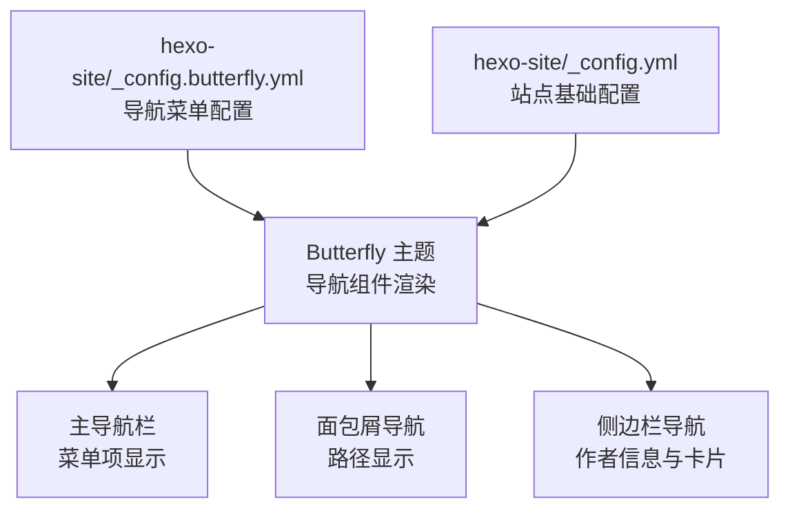
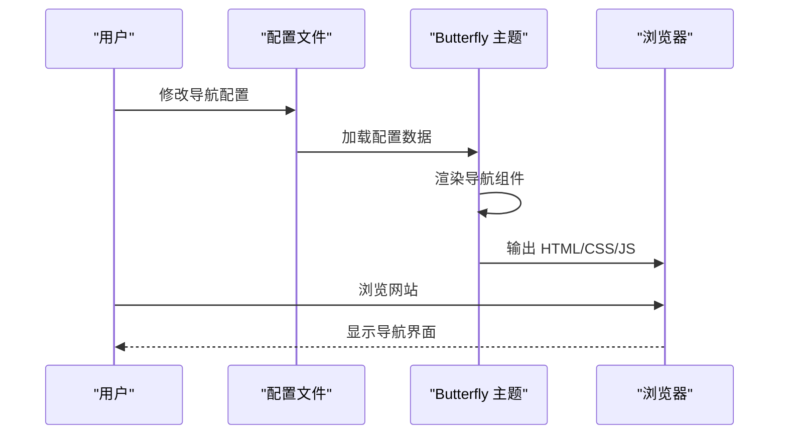
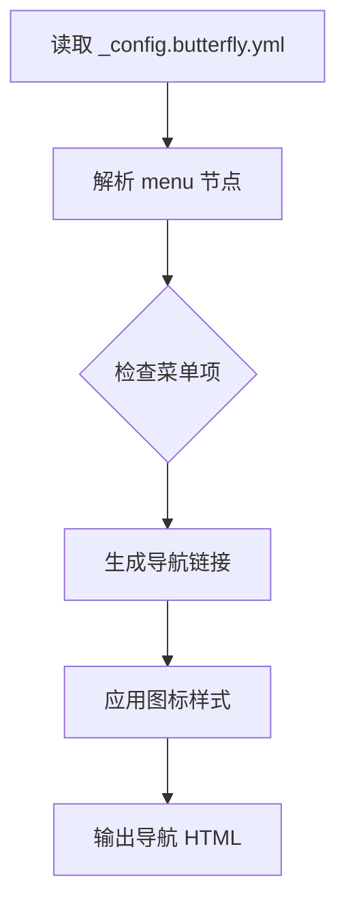
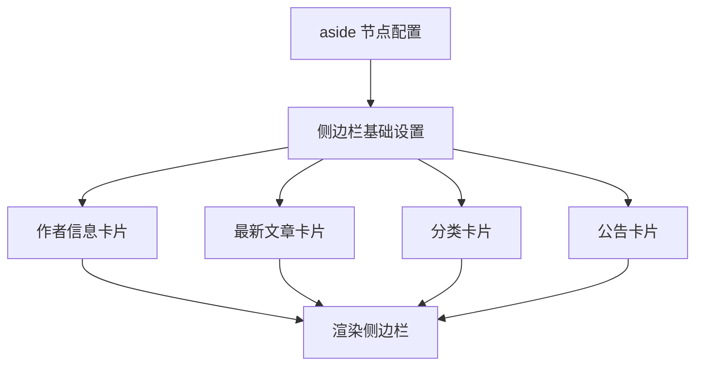

# 导航组件

<cite>
**本文引用的文件**
- [hexo-site/_config.butterfly.yml](file://hexo-site/_config.butterfly.yml)
- [hexo-site/_config.yml](file://hexo-site/_config.yml)
</cite>

## 更新摘要
**所做更改**
- 删除了故障排除指南章节，因为导航修复相关文档已被清理
- 更新了项目结构说明，反映实际使用的Butterfly主题配置
- 简化了导航系统的描述，专注于当前稳定的实现方式
- 移除了对已删除文件的引用和依赖关系分析

## 目录
1. [简介](#简介)
2. [项目结构](#项目结构)
3. [核心组件](#核心组件)
4. [架构总览](#架构总览)
5. [详细组件分析](#详细组件分析)
6. [性能考虑](#性能考虑)
7. [结论](#结论)
8. [附录](#附录)

## 简介
本文件系统性梳理该 Hexo 网站的导航体系，基于当前使用的 Butterfly 主题配置。重点说明导航菜单的配置方法、面包屑导航的启用方式、侧边栏导航的设置，以及响应式设计与移动端适配策略。文档反映了导航系统的清理状态，当前版本已无需额外的导航修复指南。

## 项目结构
导航系统基于 Butterfly 主题的配置实现，核心配置文件如下：
- 主题配置：hexo-site/_config.butterfly.yml 提供导航菜单配置
- 站点配置：hexo-site/_config.yml 控制站点基础设置和面包屑开关
- 主题渲染：Butterfly 主题负责导航组件的实际渲染和样式应用

**图表来源**
- [hexo-site/_config.butterfly.yml:26-35](file://hexo-site/_config.butterfly.yml#L26-L35)
- [hexo-site/_config.yml:96-96](file://hexo-site/_config.yml#L96-L96)

**章节来源**
- [hexo-site/_config.butterfly.yml:26-35](file://hexo-site/_config.butterfly.yml#L26-L35)
- [hexo-site/_config.yml:96-96](file://hexo-site/_config.yml#L96-L96)

## 核心组件
- 导航菜单
  - 配置位置：hexo-site/_config.butterfly.yml 的 menu 节点
  - 支持图标、外链和站内链接配置
  - 自动应用样式和响应式行为
- 面包屑导航
  - 通过 _config.yml 的 breadcrumbs 字段控制启用
  - 自动生成页面路径导航
- 侧边栏导航
  - 通过 _config.butterfly.yml 的 aside 节点配置
  - 支持作者信息卡片、最新文章、分类等模块

**章节来源**
- [hexo-site/_config.butterfly.yml:26-35](file://hexo-site/_config.butterfly.yml#L26-L35)
- [hexo-site/_config.yml:96-96](file://hexo-site/_config.yml#L96-L96)
- [hexo-site/_config.butterfly.yml:88-144](file://hexo-site/_config.butterfly.yml#L88-L144)

## 架构总览
导航系统采用"配置驱动 + 主题渲染"的架构。通过 YAML 配置文件定义导航结构，Butterfly 主题负责模板渲染、样式应用和交互逻辑。系统自动处理响应式布局和移动端适配。

**图表来源**
- [hexo-site/_config.butterfly.yml:26-35](file://hexo-site/_config.butterfly.yml#L26-L35)
- [hexo-site/_config.yml:96-96](file://hexo-site/_config.yml#L96-L96)

## 详细组件分析

### 导航菜单配置
- 配置格式
  - 菜单项：名称: /路径/ || 图标类名
  - 支持 Font Awesome 图标
  - 可配置显示/隐藏
- 默认菜单项
  - 首页：/ || fas fa-home
  - 文章：/archives/ || fas fa-archive
  - 关于我：/cv/ || fas fa-file-alt
- 使用方法
  - 注释或删除不需要的菜单项即可隐藏
  - 修改路径和图标实现个性化定制

**图表来源**
- [hexo-site/_config.butterfly.yml:26-35](file://hexo-site/_config.butterfly.yml#L26-L35)

**章节来源**
- [hexo-site/_config.butterfly.yml:26-35](file://hexo-site/_config.butterfly.yml#L26-L35)

### 面包屑导航配置
- 启用方式
  - 在 _config.yml 中设置 breadcrumbs 字段
  - 控制面包屑导航的显示/隐藏
- 渲染机制
  - 自动根据页面 URL 生成路径
  - 首项为首页链接，末项为当前页面标题
  - 中间项根据分类类型生成相应链接

**章节来源**
- [hexo-site/_config.yml:96-96](file://hexo-site/_config.yml#L96-L96)

### 侧边栏导航配置
- 侧边栏设置
  - enable：是否启用侧边栏
  - mobile：移动端是否显示
  - position：侧边栏位置（left/right）
- 侧边栏模块
  - 作者信息卡片：个人简介、社交链接
  - 最新文章：最近发布的文章列表
  - 分类卡片：文章分类统计
  - 公告卡片：网站公告信息

**图表来源**
- [hexo-site/_config.butterfly.yml:88-144](file://hexo-site/_config.butterfly.yml#L88-L144)

**章节来源**
- [hexo-site/_config.butterfly.yml:88-144](file://hexo-site/_config.butterfly.yml#L88-L144)

## 性能考虑
- 配置文件大小：_config.butterfly.yml 中的导航配置应保持简洁，避免过多菜单项影响加载性能
- 主题渲染：Butterfly 主题已优化导航组件的渲染性能，建议使用默认配置以获得最佳性能
- 样式体积：主题内置的导航样式经过压缩，建议保持默认主题配置以减少额外样式加载
- 响应式性能：移动端导航采用轻量级实现，避免复杂的 JavaScript 逻辑

## 结论
该导航系统基于 Butterfly 主题的配置实现，具有简洁、稳定、易维护的特点。通过合理的配置管理，开发者可以轻松定制导航菜单、启用面包屑导航、配置侧边栏模块。系统已通过清理优化，无需额外的导航修复指南，当前版本运行稳定可靠。

## 附录

### 导航菜单配置指南（hexo-site/_config.butterfly.yml）
- 菜单格式：菜单名: /路径/ || 图标类名
- 图标参考：Font Awesome 图标库
- 隐藏方法：注释或删除不需要的菜单项
- 示例配置：首页、文章、关于我等常用菜单项

**章节来源**
- [hexo-site/_config.butterfly.yml:26-35](file://hexo-site/_config.butterfly.yml#L26-L35)

### 面包屑导航配置
- 启用条件：_config.yml 中设置 breadcrumbs 字段
- 显示规则：自动根据页面层级生成导航路径
- 自定义选项：可根据需要调整面包屑的显示位置和样式

**章节来源**
- [hexo-site/_config.yml:96-96](file://hexo-site/_config.yml#L96-L96)

### 侧边栏配置选项
- 基础设置：enable、mobile、position 等
- 卡片模块：作者信息、最新文章、分类、公告等
- 样式定制：可通过主题提供的样式选项进行个性化调整

**章节来源**
- [hexo-site/_config.butterfly.yml:88-144](file://hexo-site/_config.butterfly.yml#L88-L144)