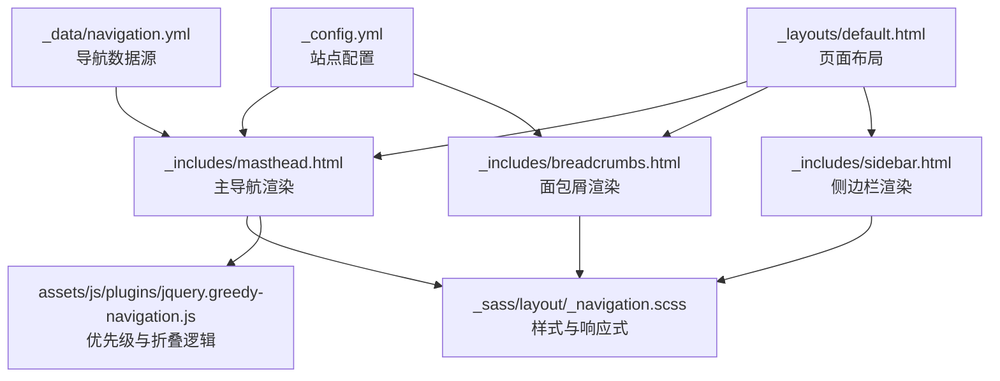
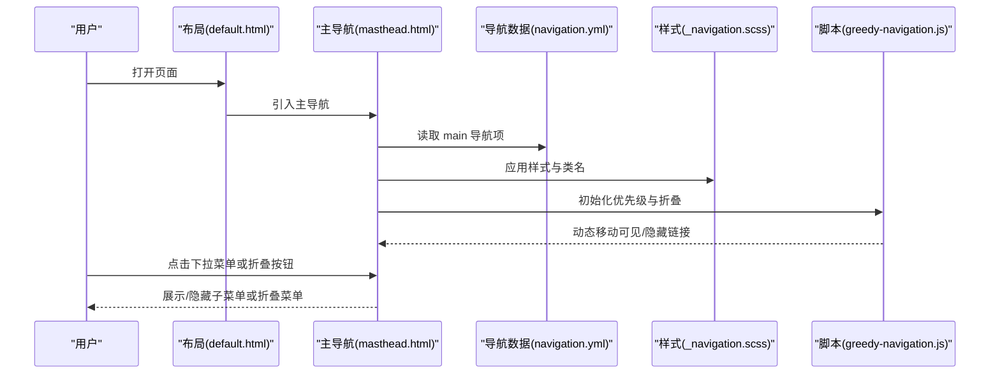
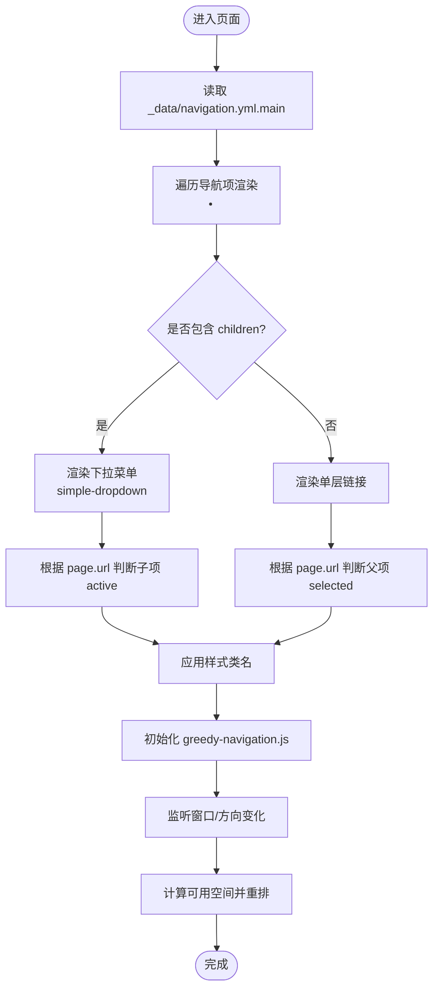
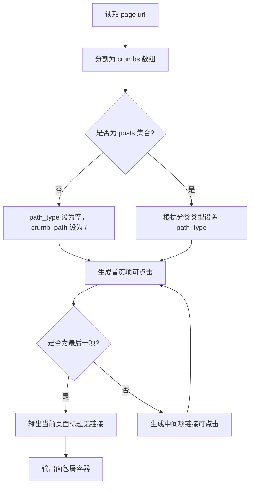
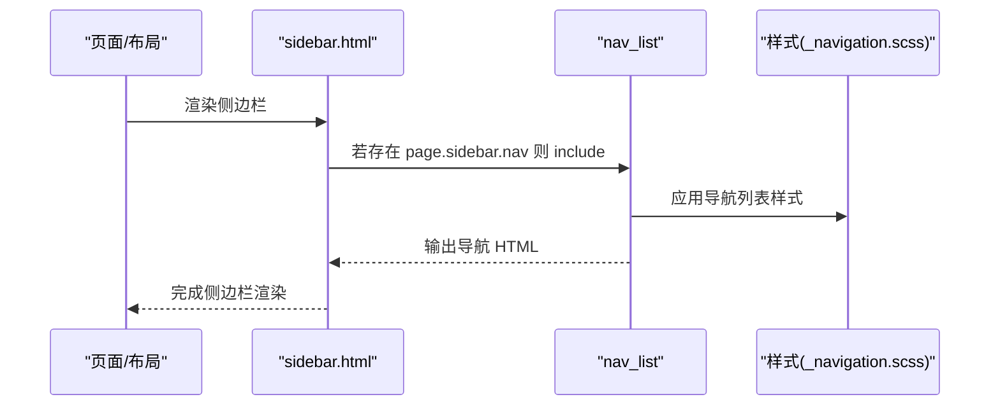
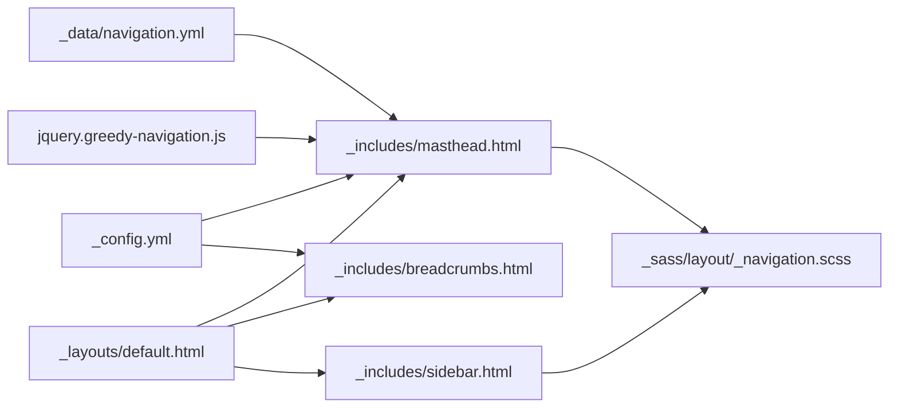
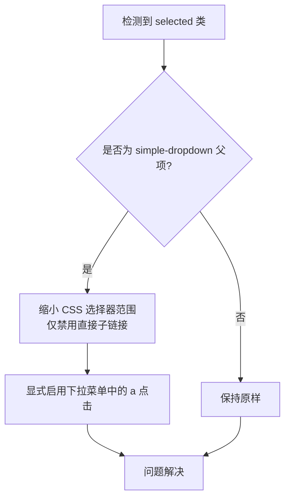

# 导航组件

<cite>
**本文引用的文件**
- [_data/navigation.yml](file://_data/navigation.yml)
- [_includes/masthead.html](file://_includes/masthead.html)
- [_includes/breadcrumbs.html](file://_includes/breadcrumbs.html)
- [_includes/sidebar.html](file://_includes/sidebar.html)
- [_sass/layout/_navigation.scss](file://_sass/layout/_navigation.scss)
- [assets/js/plugins/jquery.greedy-navigation.js](file://assets/js/plugins/jquery.greedy-navigation.js)
- [_layouts/default.html](file://_layouts/default.html)
- [_config.yml](file://_config.yml)
- [BUGFIX_NAVIGATION.md](file://BUGFIX_NAVIGATION.md)
</cite>

## 目录
1. [简介](#简介)
2. [项目结构](#项目结构)
3. [核心组件](#核心组件)
4. [架构总览](#架构总览)
5. [详细组件分析](#详细组件分析)
6. [依赖关系分析](#依赖关系分析)
7. [性能考虑](#性能考虑)
8. [故障排除指南](#故障排除指南)
9. [结论](#结论)
10. [附录](#附录)

## 简介
本文件系统性梳理该 Jekyll 网站的导航体系，覆盖主导航栏、面包屑导航与侧边栏导航三大模块。重点说明导航数据来源（_data/navigation.yml）、如何自定义导航项与链接、如何设置激活状态、以及响应式设计与移动端适配策略。同时提供针对已知问题的修复建议与最佳实践。

## 项目结构
导航相关的核心文件分布如下：
- 数据层：_data/navigation.yml 提供主导航数据
- 视图层：_includes/masthead.html 渲染主导航；_includes/breadcrumbs.html 渲染面包屑；_includes/sidebar.html 渲染侧边栏导航
- 样式层：_sass/layout/_navigation.scss 定义导航样式与响应式行为
- 交互层：assets/js/plugins/jquery.greedy-navigation.js 实现主导航优先级与折叠逻辑
- 布局层：_layouts/default.html 将导航嵌入页面骨架
- 配置层：_config.yml 控制站点主题、面包屑开关等全局行为
- 问题修复：BUGFIX_NAVIGATION.md 记录并解决主导航下拉菜单点击失效问题

**图表来源**
- [_data/navigation.yml:1-40](file://_data/navigation.yml#L1-L40)
- [_includes/masthead.html:1-48](file://_includes/masthead.html#L1-L48)
- [_includes/breadcrumbs.html:1-41](file://_includes/breadcrumbs.html#L1-L41)
- [_includes/sidebar.html:1-25](file://_includes/sidebar.html#L1-L25)
- [_sass/layout/_navigation.scss:1-527](file://_sass/layout/_navigation.scss#L1-L527)
- [assets/js/plugins/jquery.greedy-navigation.js:1-86](file://assets/js/plugins/jquery.greedy-navigation.js#L1-L86)
- [_layouts/default.html:1-32](file://_layouts/default.html#L1-L32)
- [_config.yml:1-362](file://_config.yml#L1-L362)

**章节来源**
- [_data/navigation.yml:1-40](file://_data/navigation.yml#L1-L40)
- [_includes/masthead.html:1-48](file://_includes/masthead.html#L1-L48)
- [_includes/breadcrumbs.html:1-41](file://_includes/breadcrumbs.html#L1-L41)
- [_includes/sidebar.html:1-25](file://_includes/sidebar.html#L1-L25)
- [_sass/layout/_navigation.scss:1-527](file://_sass/layout/_navigation.scss#L1-L527)
- [assets/js/plugins/jquery.greedy-navigation.js:1-86](file://assets/js/plugins/jquery.greedy-navigation.js#L1-L86)
- [_layouts/default.html:1-32](file://_layouts/default.html#L1-L32)
- [_config.yml:1-362](file://_config.yml#L1-L362)

## 核心组件
- 主导航栏（主导航）
  - 数据来源：_data/navigation.yml 的 main 节点
  - 渲染模板：_includes/masthead.html
  - 样式与交互：_sass/layout/_navigation.scss 与 jquery.greedy-navigation.js
- 面包屑导航
  - 渲染模板：_includes/breadcrumbs.html
  - 样式：_sass/layout/_navigation.scss
  - 开关：_config.yml 的 breadcrumbs 字段
- 侧边栏导航
  - 渲染模板：_includes/sidebar.html
  - 子列表渲染：通过 include nav_list（位于 _includes/nav_list）实现
  - 样式：_sass/layout/_navigation.scss

**章节来源**
- [_data/navigation.yml:10-40](file://_data/navigation.yml#L10-L40)
- [_includes/masthead.html:1-48](file://_includes/masthead.html#L1-L48)
- [_includes/breadcrumbs.html:1-41](file://_includes/breadcrumbs.html#L1-L41)
- [_includes/sidebar.html:1-25](file://_includes/sidebar.html#L1-L25)
- [_sass/layout/_navigation.scss:9-527](file://_sass/layout/_navigation.scss#L9-L527)
- [assets/js/plugins/jquery.greedy-navigation.js:1-86](file://assets/js/plugins/jquery.greedy-navigation.js#L1-L86)
- [_config.yml:96-96](file://_config.yml#L96-L96)

## 架构总览
主导航采用“数据驱动 + 模板渲染 + 样式控制 + 交互脚本”的分层架构。数据从 YAML 注入到 Liquid 模板中，再由 SCSS 控制外观与响应式断点，最后由 JavaScript 实现优先级与折叠逻辑。面包屑与侧边栏遵循相同的分层思路，分别在各自模板中渲染并应用样式。

**图表来源**
- [_layouts/default.html:17-17](file://_layouts/default.html#L17-L17)
- [_includes/masthead.html:11-38](file://_includes/masthead.html#L11-L38)
- [_data/navigation.yml:10-40](file://_data/navigation.yml#L10-L40)
- [_sass/layout/_navigation.scss:175-320](file://_sass/layout/_navigation.scss#L175-L320)
- [assets/js/plugins/jquery.greedy-navigation.js:16-70](file://assets/js/plugins/jquery.greedy-navigation.js#L16-L70)

## 详细组件分析

### 主导航栏（主导航）
- 数据模型
  - main 节点包含多个导航项，每项支持 title、url 与可选 children（二级菜单）
  - 支持外链（以 http 开头）与站内相对路径
- 渲染逻辑
  - 遍历 site.data.navigation.main 输出主导航项
  - 对带 children 的项渲染为下拉菜单，子项使用独立的链接与激活判断
  - 对于非 http 链接自动拼接 base_path
- 激活状态
  - 一级菜单：当 page.url 包含 link.url 且 link.url 不为根路径时添加 selected 类
  - 二级菜单：当 page.url 等于 child.url 时添加 active 类
- 样式与交互
  - greedy-nav 控制布局与动画
  - visible-links/hidden-links 决定显示/折叠
  - simple-dropdown 实现下拉菜单
  - jquery.greedy-navigation.js 动态计算可用空间，将溢出项移入隐藏列表，并控制折叠按钮显示/隐藏

**图表来源**
- [_data/navigation.yml:10-40](file://_data/navigation.yml#L10-L40)
- [_includes/masthead.html:11-38](file://_includes/masthead.html#L11-L38)
- [_sass/layout/_navigation.scss:175-320](file://_sass/layout/_navigation.scss#L175-L320)
- [assets/js/plugins/jquery.greedy-navigation.js:16-70](file://assets/js/plugins/jquery.greedy-navigation.js#L16-L70)

**章节来源**
- [_data/navigation.yml:10-40](file://_data/navigation.yml#L10-L40)
- [_includes/masthead.html:11-38](file://_includes/masthead.html#L11-L38)
- [_sass/layout/_navigation.scss:175-320](file://_sass/layout/_navigation.scss#L175-L320)
- [assets/js/plugins/jquery.greedy-navigation.js:16-86](file://assets/js/plugins/jquery.greedy-navigation.js#L16-L86)

### 面包屑导航
- 渲染流程
  - 读取页面 URL 并按 “/” 分割生成层级
  - 首项固定为首页，最后一项为当前页面标题
  - 中间项根据分类类型（Liquid/Jekyll Archives）决定链接前缀
- 激活状态
  - 当前页面项为纯文本（无链接），其余项为可点击链接
- 样式
  - breadcrumbs 外层容器与 ol/li 结构，配合断点控制间距与宽度
- 开关
  - 通过 _config.yml 的 breadcrumbs 字段控制是否启用

**图表来源**
- [_includes/breadcrumbs.html:19-40](file://_includes/breadcrumbs.html#L19-L40)
- [_config.yml:96-96](file://_config.yml#L96-L96)

**章节来源**
- [_includes/breadcrumbs.html:1-41](file://_includes/breadcrumbs.html#L1-L41)
- [_config.yml:96-96](file://_config.yml#L96-L96)

### 侧边栏导航
- 渲染入口
  - _includes/sidebar.html 条件加载作者资料与自定义块，若存在 page.sidebar.nav 则调用 nav_list 渲染导航
- 导航列表
  - nav_list 通过 include 引入，渲染为有序/无序列表，支持 active 状态高亮
- 样式
  - .nav__list/.nav__title/.nav__sub-title 控制标题、分组与活动项样式

**图表来源**
- [_includes/sidebar.html:20-22](file://_includes/sidebar.html#L20-L22)
- [_sass/layout/_navigation.scss:327-376](file://_sass/layout/_navigation.scss#L327-L376)

**章节来源**
- [_includes/sidebar.html:1-25](file://_includes/sidebar.html#L1-L25)
- [_sass/layout/_navigation.scss:327-376](file://_sass/layout/_navigation.scss#L327-L376)

## 依赖关系分析
- 数据依赖：masthead.html 依赖 navigation.yml 的 main 节点
- 样式依赖：导航组件广泛依赖 _navigation.scss 的类名与断点
- 交互依赖：greedy-navigation.js 依赖 masthead.html 的 DOM 结构（#site-nav、.visible-links、.hidden-links）
- 布局依赖：default.html 将 masthead/breadcrumbs/sidebar 组织到页面骨架
- 配置依赖：_config.yml 控制 breadcrumbs 开关与站点主题等

**图表来源**
- [_data/navigation.yml:10-40](file://_data/navigation.yml#L10-L40)
- [_includes/masthead.html:11-38](file://_includes/masthead.html#L11-L38)
- [_includes/breadcrumbs.html:1-41](file://_includes/breadcrumbs.html#L1-L41)
- [_includes/sidebar.html:1-25](file://_includes/sidebar.html#L1-L25)
- [_sass/layout/_navigation.scss:1-527](file://_sass/layout/_navigation.scss#L1-L527)
- [assets/js/plugins/jquery.greedy-navigation.js:8-12](file://assets/js/plugins/jquery.greedy-navigation.js#L8-L12)
- [_layouts/default.html:17-26](file://_layouts/default.html#L17-L26)
- [_config.yml:96-96](file://_config.yml#L96-L96)

**章节来源**
- [_data/navigation.yml:10-40](file://_data/navigation.yml#L10-L40)
- [_includes/masthead.html:11-38](file://_includes/masthead.html#L11-L38)
- [_includes/breadcrumbs.html:1-41](file://_includes/breadcrumbs.html#L1-L41)
- [_includes/sidebar.html:1-25](file://_includes/sidebar.html#L1-L25)
- [_sass/layout/_navigation.scss:1-527](file://_sass/layout/_navigation.scss#L1-L527)
- [assets/js/plugins/jquery.greedy-navigation.js:8-12](file://assets/js/plugins/jquery.greedy-navigation.js#L8-L12)
- [_layouts/default.html:17-26](file://_layouts/default.html#L17-L26)
- [_config.yml:96-96](file://_config.yml#L96-L96)

## 性能考虑
- 导航数据体积：navigation.yml 中的 main 节点应保持精简，避免过多深层嵌套，减少模板渲染与脚本计算负担
- 样式体积：_navigation.scss 含大量断点与动画，建议在生产环境使用压缩样式
- 交互性能：greedy-navigation.js 在 resize/orientationchange 事件中重算，建议避免频繁触发或在脚本中加入节流
- 面包屑：仅在需要时启用（_config.yml breadcrumbs），减少不必要的 DOM 生成

[本节为通用指导，不涉及具体文件分析]

## 故障排除指南
- 下拉菜单点击失效（已在全站范围内修复）
  - 症状：在特定页面（如“全部文章”）时，主导航的下拉菜单子项无法点击
  - 根因：CSS 选择器误将下拉菜单中的所有 a 禁用点击
  - 修复方案
    - 主要修复：缩小选择器范围至直接子元素，并对下拉菜单中的 a 显式恢复点击能力
    - 辅助修复：使用事件委托在悬停时动态恢复下拉菜单子链接的点击能力
  - 验证步骤：在修复后分别访问首页、“全部文章”、“技术教程”等页面，确认下拉菜单可正常点击

**图表来源**
- [BUGFIX_NAVIGATION.md:35-67](file://BUGFIX_NAVIGATION.md#L35-L67)
- [BUGFIX_NAVIGATION.md:73-89](file://BUGFIX_NAVIGATION.md#L73-L89)

**章节来源**
- [BUGFIX_NAVIGATION.md:1-149](file://BUGFIX_NAVIGATION.md#L1-L149)

## 结论
该导航系统以数据驱动为核心，结合 Liquid 模板、SCSS 样式与 JavaScript 交互，实现了灵活、可扩展且具备响应式能力的导航体验。通过规范的数据结构与样式类名约定，开发者可以轻松新增/调整导航项、设置激活状态，并在不同设备上获得一致的可用性。针对已知的下拉菜单点击问题，已提供明确的修复路径与验证方法，确保功能稳定可靠。

[本节为总结性内容，不涉及具体文件分析]

## 附录

### 导航数据配置指南（_data/navigation.yml）
- 结构说明
  - main：主导航数组
  - 每个导航项支持字段：title（显示文本）、url（链接地址）、children（可选，二级菜单）
  - 外链以 http 开头，站内链接使用相对路径
- 示例参考
  - 论文、报告、教学、作品集、简历、导航等一级菜单
  - “博客文章”包含 children，用于分类导航

**章节来源**
- [_data/navigation.yml:10-40](file://_data/navigation.yml#L10-L40)

### 激活状态与类名对照
- 一级菜单激活：selected（当 page.url 包含 link.url 且 link.url 不为根路径）
- 二级菜单激活：active（当 page.url 等于 child.url）
- 下拉菜单触发：simple-dropdown（父项）、simple-dropdown-menu（子菜单容器）

**章节来源**
- [_includes/masthead.html:17-38](file://_includes/masthead.html#L17-L38)
- [_sass/layout/_navigation.scss:450-526](file://_sass/layout/_navigation.scss#L450-L526)

### 响应式设计与移动端适配
- 断点与布局
  - greedy-nav 在不同断点下调整可见/隐藏链接数量，折叠按钮在空间不足时显示
  - 样式中包含多级断点（large/x-large 等），控制容器宽度与间距
- 移动端交互
  - 折叠按钮切换隐藏菜单显示/隐藏
  - 窗口尺寸变化与屏幕方向变化时自动重排

**章节来源**
- [_sass/layout/_navigation.scss:175-320](file://_sass/layout/_navigation.scss#L175-L320)
- [assets/js/plugins/jquery.greedy-navigation.js:74-84](file://assets/js/plugins/jquery.greedy-navigation.js#L74-L84)