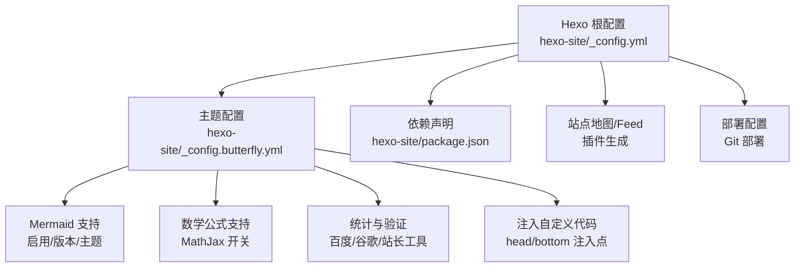
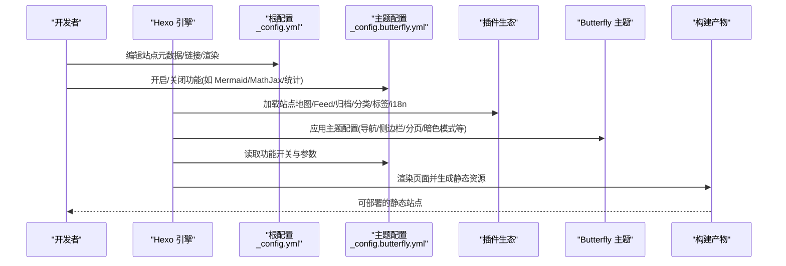
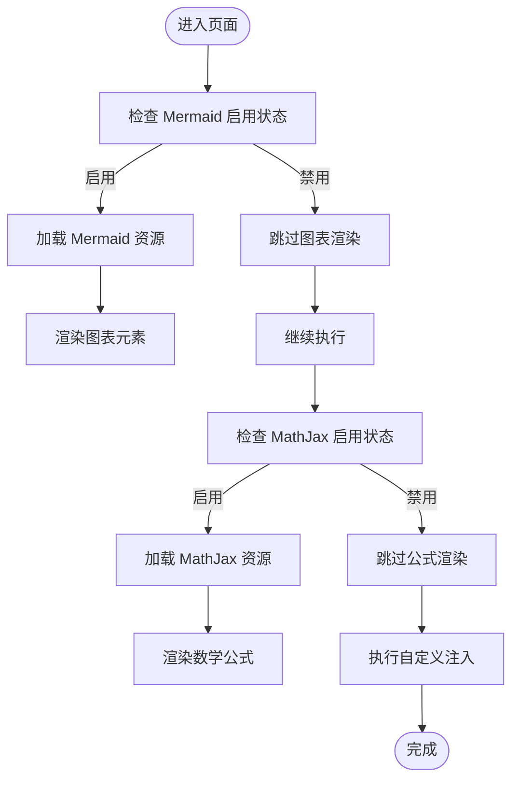
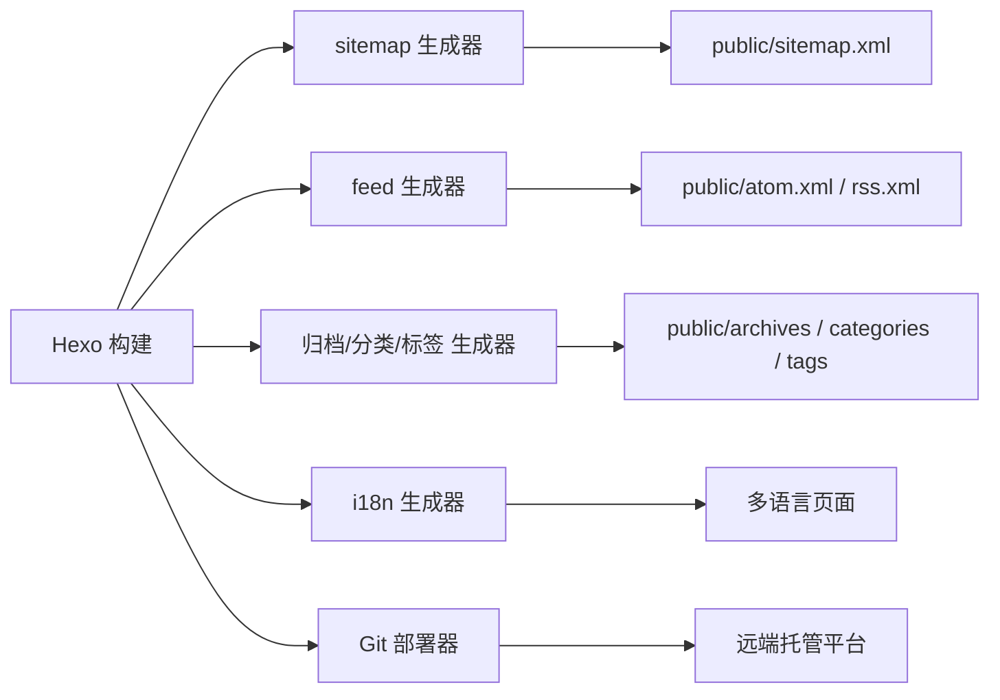
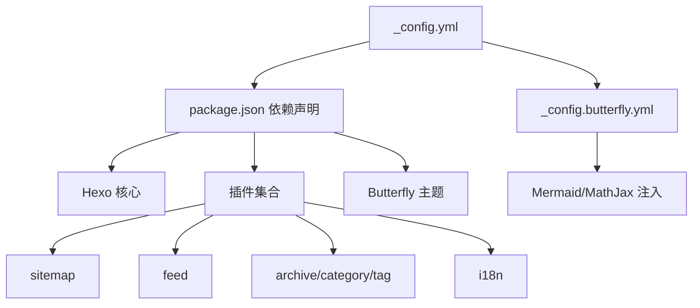

# 工具组件

<cite>
**本文引用的文件**
- [hexo-site/_config.yml](file://hexo-site/_config.yml)
- [hexo-site/_config.butterfly.yml](file://hexo-site/_config.butterfly.yml)
- [hexo-site/package.json](file://hexo-site/package.json)
</cite>

## 目录
1. [简介](#简介)
2. [项目结构](#项目结构)
3. [核心组件](#核心组件)
4. [架构总览](#架构总览)
5. [组件详细分析](#组件详细分析)
6. [依赖关系分析](#依赖关系分析)
7. [性能考量](#性能考量)
8. [故障排查指南](#故障排查指南)
9. [结论](#结论)
10. [附录](#附录)

## 简介
本文件聚焦于工具组件的配置与使用，涵盖以下方面：
- 头部元数据：站点标题、描述、关键词、语言与时区等基础元信息。
- 脚本加载：通过主题配置控制第三方库（如 Mermaid、MathJax）的启用与版本管理。
- SEO 优化：站点地图生成、RSS/Feed 输出、页面链接规范化与静态资源部署策略。
- 浏览器升级提示：在旧版浏览器环境下提供升级提示，改善兼容性体验。

这些组件共同提升用户体验与搜索引擎优化效果，并为后续扩展与性能优化提供清晰的配置路径。

## 项目结构
该站点基于 Hexo 构建，采用 Butterfly 主题。关键配置集中在 Hexo 根配置与主题配置文件中，分别负责站点级设置与主题级功能开关。

图表来源
- [hexo-site/_config.yml:1-110](file://hexo-site/_config.yml#L1-L110)
- [hexo-site/_config.butterfly.yml:1-339](file://hexo-site/_config.butterfly.yml#L1-L339)
- [hexo-site/package.json:1-35](file://hexo-site/package.json#L1-L35)

章节来源
- [hexo-site/_config.yml:1-110](file://hexo-site/_config.yml#L1-L110)
- [hexo-site/_config.butterfly.yml:1-339](file://hexo-site/_config.butterfly.yml#L1-L339)
- [hexo-site/package.json:1-35](file://hexo-site/package.json#L1-L35)

## 核心组件
- 站点元数据与基础设置：站点标题、副标题、描述、关键词、语言与时区等，直接影响 SEO 与多语言支持。
- 页面链接与渲染：永久链接格式、美化链接尾缀、高亮与排版工具配置。
- 主题功能开关：导航、侧边栏卡片、分页、暗色模式、TOC、搜索、分享、数学公式、Mermaid 图表等。
- 统计与验证：可选集成百度统计、Google Analytics 或其他验证服务。
- 自定义注入：在页面头部或底部注入自定义脚本或样式，满足特定需求。
- 插件生态：站点地图、RSS/Atom Feed、归档、分类、标签、i18n 等生成器与部署工具。

章节来源
- [hexo-site/_config.yml:5-83](file://hexo-site/_config.yml#L5-L83)
- [hexo-site/_config.butterfly.yml:10-339](file://hexo-site/_config.butterfly.yml#L10-L339)

## 架构总览
下图展示从配置到输出的整体流程：Hexo 读取根配置与主题配置，加载所需插件与主题，渲染页面并生成静态资源；主题配置进一步细化前端行为（如图表与公式渲染）。

图表来源
- [hexo-site/_config.yml:1-110](file://hexo-site/_config.yml#L1-L110)
- [hexo-site/_config.butterfly.yml:1-339](file://hexo-site/_config.butterfly.yml#L1-L339)
- [hexo-site/package.json:14-32](file://hexo-site/package.json#L14-L32)

## 组件详细分析

### 头部元数据与 SEO 基础
- 站点标题、副标题、描述与关键词：用于搜索引擎索引与社交分享摘要生成。
- 语言与时区：影响日期时间显示与国际化支持。
- URL 与永久链接：控制站点地址与文章链接结构，利于 SEO 与缓存策略。
- 链接美化与尾缀：可移除链接尾部的 index.html 或 .html，减少冗余。
- 渲染与高亮：选择高亮方案与行号显示，提升阅读体验。

章节来源
- [hexo-site/_config.yml:5-21](file://hexo-site/_config.yml#L5-L21)
- [hexo-site/_config.yml:72-83](file://hexo-site/_config.yml#L72-L83)
- [hexo-site/_config.yml:47-56](file://hexo-site/_config.yml#L47-L56)

### 脚本加载与前端增强
- Mermaid 支持：可启用客户端渲染，指定版本与主题，适合技术类文章中的流程图/时序图。
- 数学公式支持：可启用 MathJax 并按页渲染，满足学术与技术内容的公式展示。
- 代码块增强：主题提供代码块主题、复制按钮、语言标识等选项。
- 注入自定义代码：可在页面头部或底部注入脚本或样式，实现统计、分享、自定义交互等。

图表来源
- [hexo-site/_config.butterfly.yml:175-179](file://hexo-site/_config.butterfly.yml#L175-L179)
- [hexo-site/_config.butterfly.yml:167-169](file://hexo-site/_config.butterfly.yml#L167-L169)
- [hexo-site/_config.butterfly.yml:323-326](file://hexo-site/_config.butterfly.yml#L323-L326)

章节来源
- [hexo-site/_config.butterfly.yml:167-179](file://hexo-site/_config.butterfly.yml#L167-L179)
- [hexo-site/_config.butterfly.yml:323-326](file://hexo-site/_config.butterfly.yml#L323-L326)

### SEO 优化与站点地图
- 站点地图：通过站点地图生成器插件输出 sitemap.xml，便于搜索引擎抓取。
- RSS/Atom Feed：提供订阅入口，提升用户留存与传播。
- 归档/分类/标签/i18n：完善内容组织与索引，提升可发现性。
- 部署：使用 Git 部署器将构建产物推送到远端托管平台。

图表来源
- [hexo-site/package.json:18-25](file://hexo-site/package.json#L18-L25)
- [hexo-site/_config.yml:106-110](file://hexo-site/_config.yml#L106-L110)

章节来源
- [hexo-site/package.json:18-25](file://hexo-site/package.json#L18-L25)
- [hexo-site/_config.yml:106-110](file://hexo-site/_config.yml#L106-L110)

### 浏览器升级提示
- 功能定位：在不支持现代 Web 特性的旧版浏览器中，提示用户升级以获得最佳体验。
- 实现方式：通常通过主题提供的注入点或自定义 HTML 片段实现，结合条件注释或 JS 判断。
- 配置建议：仅在必要时启用，避免对现代浏览器造成干扰；可配合 CDN 与异步加载优化性能。

说明：本节为通用实践指导，具体实现需参考主题模板与注入配置。

### 主题功能与用户体验
- 导航与侧边栏：固定导航、作者卡片、近期文章、分类/标签/归档卡片等，提升信息可达性。
- 分页与阅读模式：可配置分页样式与阅读模式，改善长文阅读体验。
- 暗色模式与翻译：支持夜间模式切换与中英文简繁转换，满足不同用户偏好。
- TOC 与分享：目录树与社交分享按钮，增强内容导航与传播。

章节来源
- [hexo-site/_config.butterfly.yml:10-108](file://hexo-site/_config.butterfly.yml#L10-L108)
- [hexo-site/_config.butterfly.yml:219-248](file://hexo-site/_config.butterfly.yml#L219-L248)
- [hexo-site/_config.butterfly.yml:254-261](file://hexo-site/_config.butterfly.yml#L254-L261)
- [hexo-site/_config.butterfly.yml:207-214](file://hexo-site/_config.butterfly.yml#L207-L214)

## 依赖关系分析
Hexo 通过根配置与主题配置协同工作，主题配置进一步细化前端行为与第三方库集成。依赖声明明确了插件与主题版本，确保构建稳定性。

图表来源
- [hexo-site/_config.yml:1-110](file://hexo-site/_config.yml#L1-L110)
- [hexo-site/_config.butterfly.yml:1-339](file://hexo-site/_config.butterfly.yml#L1-L339)
- [hexo-site/package.json:14-32](file://hexo-site/package.json#L14-L32)

章节来源
- [hexo-site/package.json:14-32](file://hexo-site/package.json#L14-L32)
- [hexo-site/_config.yml:1-110](file://hexo-site/_config.yml#L1-L110)
- [hexo-site/_config.butterfly.yml:1-339](file://hexo-site/_config.butterfly.yml#L1-L339)

## 性能考量
- 资源加载优化
  - 将图表与公式按需加载：仅在需要的页面启用 Mermaid/MathJax，避免全局加载导致首屏延迟。
  - 使用 CDN 与异步加载：通过主题注入点引入外部资源时，优先使用 CDN 并设置异步加载属性。
- 渲染与构建
  - 控制高亮与行号：在大量代码块场景下，适当关闭行号或限制高亮范围，降低渲染压力。
  - 合理使用图片懒加载：根据内容类型启用懒加载，平衡首屏速度与交互体验。
- SEO 与可发现性
  - 保持链接尾缀一致性：统一移除 index.html 或 .html，减少重复内容风险。
  - 完善站点地图与订阅源：确保搜索引擎与订阅工具能够稳定抓取与更新。
- 主题与插件选择
  - 仅启用必要功能：关闭未使用的卡片、统计与注入项，减少不必要的请求与脚本执行。

## 故障排查指南
- 页面未显示 Mermaid/数学公式
  - 检查主题配置中对应功能是否启用，确认版本与主题设置正确。
  - 若为按页渲染，请确认目标页面包含相应标记或 Front Matter 设置。
- 统计/验证未生效
  - 检查主题配置中的统计与验证字段是否填写完整，确认域名与验证代码无误。
- 站点地图/订阅源缺失
  - 确认已安装并启用相应插件，检查生成目录与部署配置是否正确。
- 部署失败或资源未更新
  - 清理构建缓存后重新构建，核对部署配置与权限设置。

章节来源
- [hexo-site/_config.butterfly.yml:266-285](file://hexo-site/_config.butterfly.yml#L266-L285)
- [hexo-site/package.json:18-25](file://hexo-site/package.json#L18-L25)
- [hexo-site/_config.yml:106-110](file://hexo-site/_config.yml#L106-L110)

## 结论
通过合理配置站点元数据、主题功能与插件生态，可以有效提升用户体验与搜索引擎优化表现。建议遵循“按需启用、异步加载、统一规范”的原则，在保证功能完整性的同时兼顾性能与可维护性。

## 附录
- 快速对照清单
  - 元数据：标题/副标题/描述/关键词/语言/时区/URL/链接格式
  - 功能开关：Mermaid/MathJax/暗色模式/TOC/分页/侧边栏卡片
  - 注入：头部/底部自定义脚本或样式
  - 插件：sitemap/feed/archive/category/tag/i18n
  - 部署：Git 部署器与远端配置