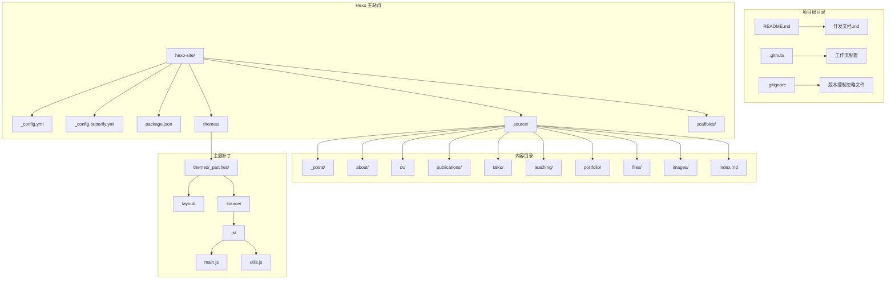
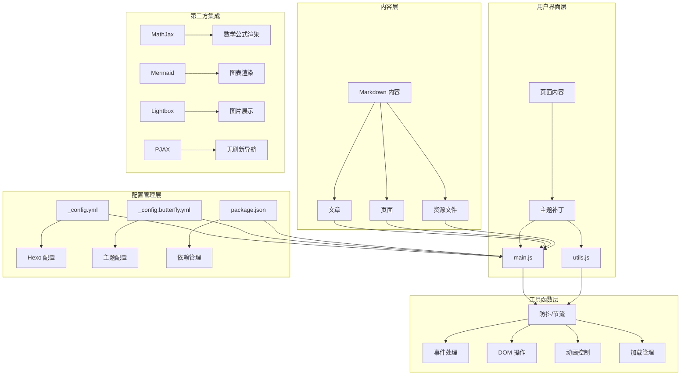
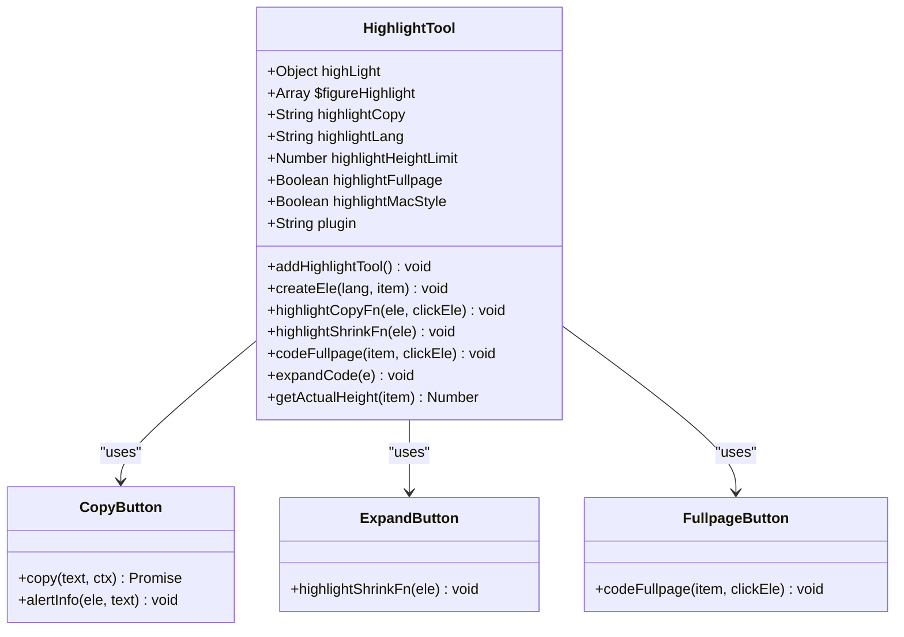
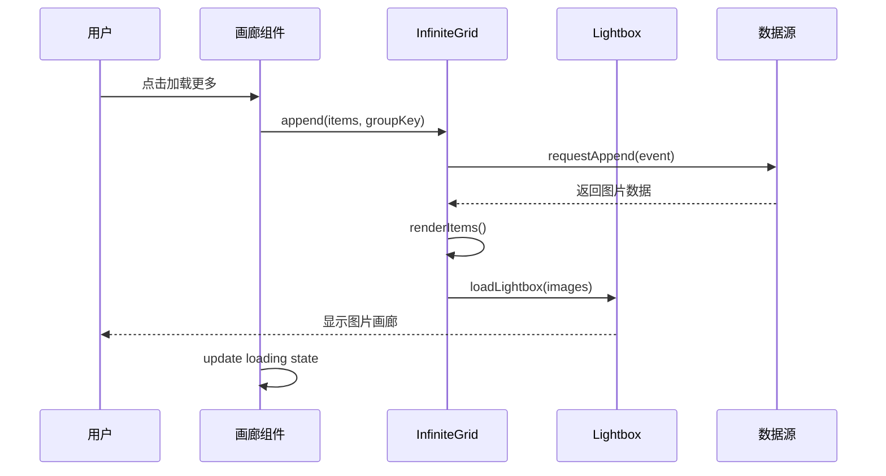
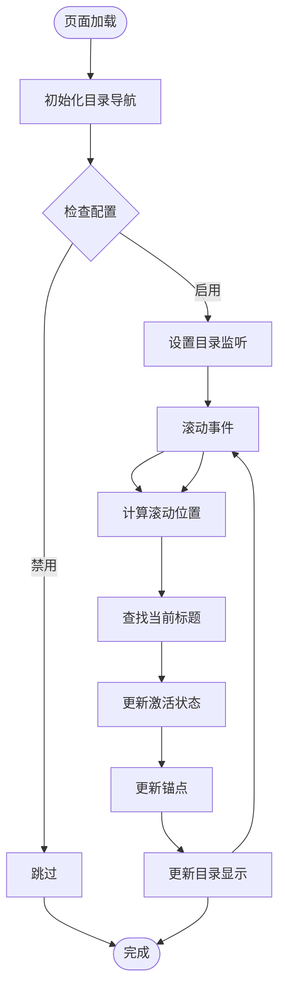
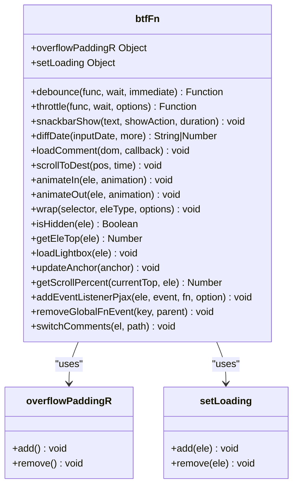
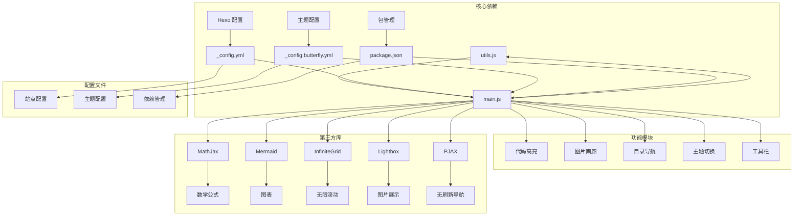

# 工具组件

<cite>
**本文档引用的文件**
- [README.md](file://README.md)
- [开发文档.md](file://开发文档.md)
- [package.json](file://hexo-site/package.json)
- [_config.yml](file://hexo-site/_config.yml)
- [_config.butterfly.yml](file://hexo-site/_config.butterfly.yml)
- [main.js](file://hexo-site/themes/_patches/source/js/main.js)
- [utils.js](file://hexo-site/themes/_patches/source/js/utils.js)
- [index.md](file://hexo-site/source/index.md)
- [about/index.md](file://hexo-site/source/about/index.md)
- [2025-03-11-useful-website.md](file://hexo-site/source/_posts/2025-03-11-useful-website.md)
</cite>

## 目录
1. [简介](#简介)
2. [项目结构](#项目结构)
3. [核心工具组件](#核心工具组件)
4. [架构概览](#架构概览)
5. [详细组件分析](#详细组件分析)
6. [依赖关系分析](#依赖关系分析)
7. [性能考虑](#性能考虑)
8. [故障排除指南](#故障排除指南)
9. [结论](#结论)

## 简介

这是一个基于 Hexo + Butterfly 主题构建的个人学术网站项目。该项目提供了完整的工具组件系统，包括代码高亮、图片处理、目录导航、主题切换等功能。项目采用模块化的 JavaScript 架构，通过工具函数和组件化的方式提供丰富的用户体验。

## 项目结构

项目采用典型的 Hexo 博客结构，主要包含以下核心目录：



**图表来源**
- [package.json:1-36](file://hexo-site/package.json#L1-L36)
- [开发文档.md:7-32](file://开发文档.md#L7-L32)

**章节来源**
- [开发文档.md:7-32](file://开发文档.md#L7-L32)
- [package.json:1-36](file://hexo-site/package.json#L1-L36)

## 核心工具组件

### JavaScript 工具库

项目的核心工具组件主要集中在 `themes/_patches/source/js/` 目录下，包含两个主要文件：

#### utils.js - 基础工具函数库

该文件提供了 33 个核心工具函数，涵盖以下功能领域：

- **防抖和节流函数**：debounce 和 throttle，用于优化滚动和窗口调整事件
- **溢出处理**：overflowPaddingR，管理侧边栏打开时的页面溢出处理
- **用户界面反馈**：snackbarShow，提供 Snackbar 样式的用户通知
- **日期计算**：diffDate，计算相对日期和时间差
- **评论加载**：loadComment，基于 IntersectionObserver 的懒加载机制
- **平滑滚动**：scrollToDest，提供原生和动画两种滚动实现
- **动画控制**：animateIn/animateOut，管理元素的进入和退出动画
- **DOM 操作**：wrap，提供灵活的 DOM 包装功能
- **图片加载**：loadLightbox，支持多种图片灯箱服务
- **加载状态管理**：setLoading，提供统一的加载指示器
- **锚点更新**：updateAnchor，维护 URL 锚点同步
- **滚动百分比**：getScrollPercent，计算页面滚动进度
- **事件绑定**：addEventListenerPjax，支持 PJAX 导航的事件管理
- **评论切换**：switchComments，动态切换不同评论系统

#### main.js - 主要功能实现

该文件实现了 15 个主要功能模块：

- **响应式菜单调整**：adjustMenu，根据屏幕尺寸动态调整导航菜单
- **侧边栏控制**：sidebarFn，管理移动端侧边栏的打开和关闭
- **代码高亮工具**：addHighlightTool，提供复制、展开、全屏等功能
- **图片画廊**：addJustifiedGallery，实现无限滚动图片画廊
- **目录导航**：scrollFnToDo，处理文章目录和锚点导航
- **主题切换**：handleThemeChange，支持明暗主题切换
- **右侧工具栏**：rightSideFn，管理右侧悬浮工具栏的各种功能
- **子菜单控制**：clickFnOfSubMenu，处理侧边栏子菜单的展开/收起
- **版权保护**：addCopyright，复制内容时自动添加版权信息
- **运行时间显示**：addRuntime，显示网站运行时长
- **最后更新时间**：addLastPushDate，显示内容最后更新时间
- **表格包装**：addTableWrap，为表格添加适当的包装
- **标签隐藏**：clickFnOfTagHide，实现标签内容的折叠/展开
- **标签页功能**：tabsFn，支持多标签页内容切换
- **懒加载**：lazyloadImg，优化图片加载性能

**章节来源**
- [utils.js:1-335](file://hexo-site/themes/_patches/source/js/utils.js#L1-L335)
- [main.js:1-951](file://hexo-site/themes/_patches/source/js/main.js#L1-L951)

## 架构概览

项目采用了模块化的前端架构，通过工具函数和组件化的方式实现功能分离：



**图表来源**
- [main.js:1-951](file://hexo-site/themes/_patches/source/js/main.js#L1-L951)
- [utils.js:1-335](file://hexo-site/themes/_patches/source/js/utils.js#L1-L335)
- [_config.yml:1-149](file://hexo-site/_config.yml#L1-L149)
- [_config.butterfly.yml:1-773](file://hexo-site/_config.butterfly.yml#L1-L773)

## 详细组件分析

### 代码高亮工具组件

代码高亮是项目中最复杂的工具组件之一，提供了丰富的功能：



**图表来源**
- [main.js:57-242](file://hexo-site/themes/_patches/source/js/main.js#L57-L242)

该组件支持以下特性：
- **复制功能**：一键复制代码到剪贴板
- **语言标识**：自动识别代码语言并显示
- **展开/收起**：控制代码块的展开和折叠
- **全屏模式**：提供代码的全屏查看模式
- **高度限制**：超过指定高度的代码块自动添加展开按钮
- **Mac 风格**：可选的 Mac 风格工具栏

**章节来源**
- [main.js:57-242](file://hexo-site/themes/_patches/source/js/main.js#L57-L242)

### 图片画廊组件

图片画廊组件实现了无限滚动的图片展示功能：



**图表来源**
- [main.js:280-384](file://hexo-site/themes/_patches/source/js/main.js#L280-L384)

该组件的主要功能包括：
- **无限滚动**：基于 InfiniteGrid 实现的无限滚动
- **懒加载**：按需加载图片数据
- **响应式布局**：支持不同屏幕尺寸的自适应布局
- **加载按钮**：可选的"加载更多"按钮
- **图片灯箱**：集成多种图片展示服务

**章节来源**
- [main.js:280-384](file://hexo-site/themes/_patches/source/js/main.js#L280-L384)

### 目录导航组件

目录导航组件提供了智能的文章目录和锚点导航功能：



**图表来源**
- [main.js:472-587](file://hexo-site/themes/_patches/source/js/main.js#L472-L587)

该组件的核心功能：
- **智能定位**：根据滚动位置自动定位到对应的标题
- **激活状态**：为当前可见的标题添加激活样式
- **锚点同步**：保持 URL 锚点与当前标题同步
- **自动滚动**：点击目录项时自动滚动到对应位置
- **百分比显示**：显示页面滚动百分比

**章节来源**
- [main.js:472-587](file://hexo-site/themes/_patches/source/js/main.js#L472-L587)

### 主题切换组件

主题切换组件提供了明暗主题的无缝切换功能：

```mermaid
stateDiagram-v2
[*] --> LightMode
LightMode --> DarkMode : 切换到暗色主题
DarkMode --> LightMode : 切换到亮色主题
LightMode :
- 设置 data-theme="light"
- 激活亮色模式
- 保存到本地存储
- 触发主题变更事件
DarkMode :
- 设置 data-theme="dark"
- 激活暗色模式
- 保存到本地存储
- 触发主题变更事件
note right of LightMode
Snackbar 通知
保存用户偏好
更新全局主题变量
end note
note right of DarkMode
Snackbar 通知
保存用户偏好
更新全局主题变量
end note
```

**图表来源**
- [main.js:627-638](file://hexo-site/themes/_patches/source/js/main.js#L627-L638)

**章节来源**
- [main.js:627-638](file://hexo-site/themes/_patches/source/js/main.js#L627-L638)

### 工具函数库分析

工具函数库提供了项目所需的基础功能支持：



**图表来源**
- [utils.js:2-335](file://hexo-site/themes/_patches/source/js/utils.js#L2-L335)

**章节来源**
- [utils.js:1-335](file://hexo-site/themes/_patches/source/js/utils.js#L1-L335)

## 依赖关系分析

项目中的工具组件之间存在清晰的依赖关系：



**图表来源**
- [package.json:14-34](file://hexo-site/package.json#L14-L34)
- [main.js:1-951](file://hexo-site/themes/_patches/source/js/main.js#L1-L951)
- [utils.js:1-335](file://hexo-site/themes/_patches/source/js/utils.js#L1-L335)

**章节来源**
- [package.json:14-34](file://hexo-site/package.json#L14-L34)
- [开发文档.md:539-557](file://开发文档.md#L539-L557)

## 性能考虑

项目在性能方面采用了多项优化策略：

### 事件处理优化
- **防抖和节流**：使用 debounce 和 throttle 函数优化滚动和窗口调整事件
- **懒加载**：图片懒加载减少初始页面加载时间
- **IntersectionObserver**：使用现代浏览器 API 实现高效的元素可见性检测

### 内存管理
- **事件清理**：PJAX 导航时自动清理事件监听器
- **DOM 优化**：避免不必要的 DOM 操作和重绘
- **缓存机制**：缓存标题位置信息减少重复计算

### 资源优化
- **按需加载**：只在需要时加载特定功能模块
- **代码分割**：将大型功能拆分为独立模块
- **压缩优化**：生产环境自动压缩 JavaScript 代码

## 故障排除指南

### 常见问题及解决方案

#### 代码高亮功能异常
**问题**：代码块缺少复制按钮或展开功能
**解决方案**：
1. 检查 `_config.butterfly.yml` 中的 `code_blocks` 配置
2. 确认 `highlight` 插件已正确安装
3. 验证代码块的 HTML 结构是否正确

#### 图片画廊加载失败
**问题**：图片无法正常显示或加载
**解决方案**：
1. 检查图片路径是否正确
2. 确认 InfiniteGrid 库已正确加载
3. 验证图片数据格式是否符合要求

#### 目录导航不工作
**问题**：文章目录无法正确显示或跳转
**解决方案**：
1. 检查文章是否包含有效的标题结构
2. 确认 `toc` 配置已启用
3. 验证锚点链接的正确性

#### 主题切换失效
**问题**：明暗主题切换功能异常
**解决方案**：
1. 检查 `data-theme` 属性的设置
2. 确认 CSS 变量的正确性
3. 验证本地存储的读写权限

**章节来源**
- [开发文档.md:514-537](file://开发文档.md#L514-L537)

## 结论

该项目的工具组件系统展现了现代静态网站开发的最佳实践。通过模块化的架构设计、完善的工具函数库和丰富的交互功能，为用户提供了优质的浏览体验。

主要优势包括：
- **模块化设计**：功能清晰分离，便于维护和扩展
- **性能优化**：采用多种优化策略确保良好的用户体验
- **兼容性强**：支持多种浏览器和设备
- **易于定制**：通过配置文件轻松调整功能和外观

建议的后续改进方向：
- 添加更多的主题选项和自定义功能
- 优化移动端的触摸交互体验
- 增强无障碍访问支持
- 扩展插件生态系统