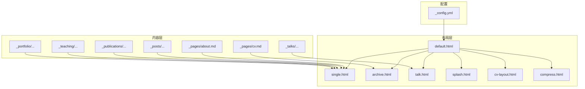
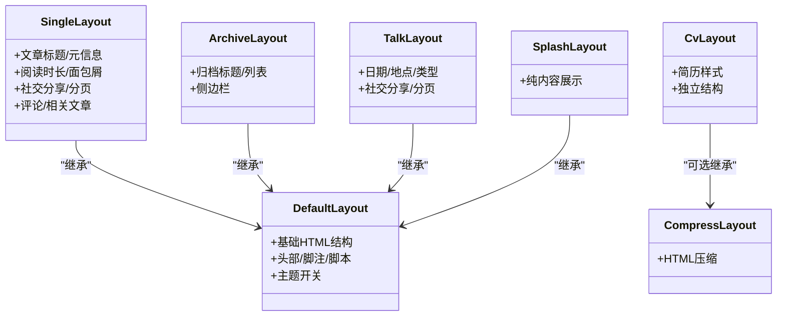
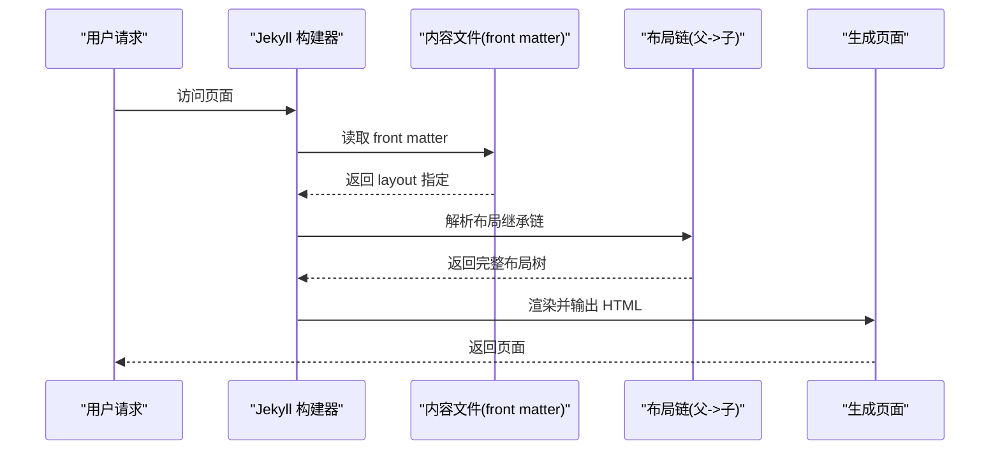
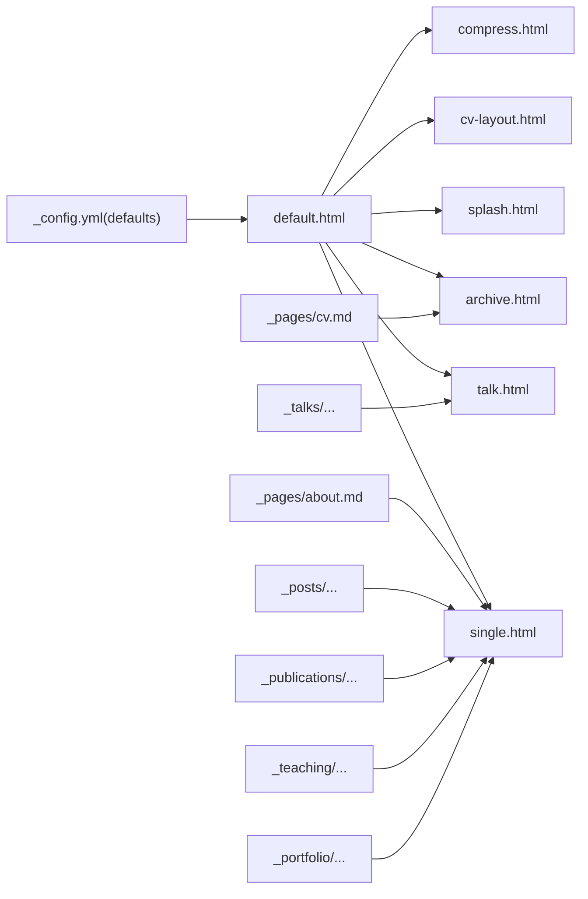

# 布局系统

<cite>
**本文引用的文件**
- [_config.yml](file://_config.yml)
- [_layouts/default.html](file://_layouts/default.html)
- [_layouts/single.html](file://_layouts/single.html)
- [_layouts/archive.html](file://_layouts/archive.html)
- [_layouts/cv-layout.html](file://_layouts/cv-layout.html)
- [_layouts/compress.html](file://_layouts/compress.html)
- [_layouts/talk.html](file://_layouts/talk.html)
- [_layouts/splash.html](file://_layouts/splash.html)
- [_pages/about.md](file://_pages/about.md)
- [_pages/cv.md](file://_pages/cv.md)
- [_posts/2025-03-11-my-first-blog.md](file://_posts/2025-03-11-my-first-blog.md)
- [_publications/2024-02-17-paper-title-number-4.md](file://_publications/2024-02-17-paper-title-number-4.md)
- [_teaching/2014-spring-teaching-1.md](file://_teaching/2014-spring-teaching-1.md)
- [_portfolio/portfolio-1.md](file://_portfolio/portfolio-1.md)
- [_talks/2012-03-01-talk-1.md](file://_talks/2012-03-01-talk-1.md)
</cite>

## 目录
1. [简介](#简介)
2. [项目结构](#项目结构)
3. [核心组件](#核心组件)
4. [架构总览](#架构总览)
5. [详细组件分析](#详细组件分析)
6. [依赖分析](#依赖分析)
7. [性能考虑](#性能考虑)
8. [故障排查指南](#故障排查指南)
9. [结论](#结论)
10. [附录](#附录)

## 简介
本文件系统性阐述该 Jekyll 网站的布局体系与工作原理，覆盖默认布局、单页布局、档案布局、演讲布局、启动页布局以及简历专用布局等类型；解释布局继承链路、front matter 中的布局指定方式、以及布局文件间的嵌套关系；并给出自定义布局的创建方法与最佳实践。

## 项目结构
该站点采用典型的 Jekyll 结构，布局文件集中于 _layouts 目录，页面与集合内容位于 _pages、_posts、_publications、_teaching、_portfolio、_talks 等目录中，全局配置位于根目录的 _config.yml。布局之间通过 front matter 的 layout 字段形成继承链，最终渲染为完整的 HTML 页面。

图示来源
- [_config.yml](file://_config.yml)
- [_layouts/default.html](file://_layouts/default.html)
- [_layouts/single.html](file://_layouts/single.html)
- [_layouts/archive.html](file://_layouts/archive.html)
- [_layouts/talk.html](file://_layouts/talk.html)
- [_layouts/splash.html](file://_layouts/splash.html)
- [_layouts/cv-layout.html](file://_layouts/cv-layout.html)
- [_layouts/compress.html](file://_layouts/compress.html)
- [_pages/about.md](file://_pages/about.md)
- [_pages/cv.md](file://_pages/cv.md)
- [_posts/2025-03-11-my-first-blog.md](file://_posts/2025-03-11-my-first-blog.md)
- [_publications/2024-02-17-paper-title-number-4.md](file://_publications/2024-02-17-paper-title-number-4.md)
- [_teaching/2014-spring-teaching-1.md](file://_teaching/2014-spring-teaching-1.md)
- [_portfolio/portfolio-1.md](file://_portfolio/portfolio-1.md)
- [_talks/2012-03-01-talk-1.md](file://_talks/2012-03-01-talk-1.md)

章节来源
- [_config.yml](file://_config.yml)
- [_layouts/default.html](file://_layouts/default.html)
- [_layouts/single.html](file://_layouts/single.html)
- [_layouts/archive.html](file://_layouts/archive.html)
- [_layouts/talk.html](file://_layouts/talk.html)
- [_layouts/splash.html](file://_layouts/splash.html)
- [_layouts/cv-layout.html](file://_layouts/cv-layout.html)
- [_layouts/compress.html](file://_layouts/compress.html)
- [_pages/about.md](file://_pages/about.md)
- [_pages/cv.md](file://_pages/cv.md)
- [_posts/2025-03-11-my-first-blog.md](file://_posts/2025-03-11-my-first-blog.md)
- [_publications/2024-02-17-paper-title-number-4.md](file://_publications/2024-02-17-paper-title-number-4.md)
- [_teaching/2014-spring-teaching-1.md](file://_teaching/2014-spring-teaching-1.md)
- [_portfolio/portfolio-1.md](file://_portfolio/portfolio-1.md)
- [_talks/2012-03-01-talk-1.md](file://_talks/2012-03-01-talk-1.md)

## 核心组件
- 默认布局 default：作为大多数布局的基底，负责基础 HTML 结构、头部、脚注、脚本与主题开关等通用元素。
- 单页布局 single：面向文章类内容，包含标题、元信息、阅读时长、面包屑、社交分享、分页、评论、相关文章等丰富模块。
- 档案布局 archive：面向归档页面，强调列表式呈现与侧边栏。
- 演讲布局 talk：面向 talks 集合的条目，突出日期、地点、类型等元信息。
- 启动页布局 splash：面向无头图的纯内容页面，简洁展示正文。
- 简历布局 cv-layout：面向简历页面，提供独立的样式与结构。
- 压缩布局 compress：对 HTML 进行压缩处理，减少体积。

章节来源
- [_layouts/default.html](file://_layouts/default.html)
- [_layouts/single.html](file://_layouts/single.html)
- [_layouts/archive.html](file://_layouts/archive.html)
- [_layouts/talk.html](file://_layouts/talk.html)
- [_layouts/splash.html](file://_layouts/splash.html)
- [_layouts/cv-layout.html](file://_layouts/cv-layout.html)
- [_layouts/compress.html](file://_layouts/compress.html)

## 架构总览
Jekyll 在构建时根据内容文件的 front matter 决定使用哪个布局。若未显式指定，将依据 _config.yml 中 defaults 的规则进行推断。布局之间可互相嵌套，例如 single 继承 default，archive 继承 default，talk 继承 default，cv-layout 也可选择继承 compress 或直接独立存在。

图示来源
- [_layouts/default.html](file://_layouts/default.html)
- [_layouts/single.html](file://_layouts/single.html)
- [_layouts/archive.html](file://_layouts/archive.html)
- [_layouts/talk.html](file://_layouts/talk.html)
- [_layouts/splash.html](file://_layouts/splash.html)
- [_layouts/cv-layout.html](file://_layouts/cv-layout.html)
- [_layouts/compress.html](file://_layouts/compress.html)

## 详细组件分析

### 默认布局 default
- 作用：提供基础 HTML 结构与通用模块占位，作为其他布局的父级。
- 特点：包含基础路径、语言属性、主题开关、头部、浏览器升级提示、主导航、内容区占位、页脚与脚本等。
- 与其他布局的关系：single、archive、talk、splash 均继承自 default；cv-layout 可选择继承 compress；compress 本身不依赖 default。

章节来源
- [_layouts/default.html](file://_layouts/default.html)

### 单页布局 single
- 作用：用于文章、页面、集合条目（除 talks）的详细展示。
- 特点：支持封面图/覆盖色、面包屑、作者资料、阅读时长、元信息（发表/修改时间）、社交分享、分页、评论、相关文章等。
- 使用场景：博客文章、公开页面、teaching/publications/portfolio 等集合条目。

章节来源
- [_layouts/single.html](file://_layouts/single.html)
- [_posts/2025-03-11-my-first-blog.md](file://_posts/2025-03-11-my-first-blog.md)
- [_publications/2024-02-17-paper-title-number-4.md](file://_publications/2024-02-17-paper-title-number-4.md)
- [_teaching/2014-spring-teaching-1.md](file://_teaching/2014-spring-teaching-1.md)
- [_portfolio/portfolio-1.md](file://_portfolio/portfolio-1.md)

### 档案布局 archive
- 作用：用于分类/标签/年份等归档页面，强调列表式内容。
- 特点：支持封面图/覆盖色、面包屑、侧边栏、归档标题与内容区。
- 使用场景：分类归档、标签归档、年份归档等聚合页。

章节来源
- [_layouts/archive.html](file://_layouts/archive.html)
- [_pages/cv.md](file://_pages/cv.md)

### 演讲布局 talk
- 作用：专门用于 talks 集合条目的展示。
- 特点：包含日期、地点、类型等元信息，支持链接、社交分享、分页与评论。
- 使用场景：talks 集合的条目页面。

章节来源
- [_layouts/talk.html](file://_layouts/talk.html)
- [_talks/2012-03-01-talk-1.md](file://_talks/2012-03-01-talk-1.md)

### 启动页布局 splash
- 作用：用于无头图的纯内容页面，强调正文展示。
- 特点：简洁结构，仅包含内容区与必要的元信息占位。
- 使用场景：简单页面或特定入口页。

章节来源
- [_layouts/splash.html](file://_layouts/splash.html)

### 简历布局 cv-layout
- 作用：简历专用布局，提供独立的样式与结构。
- 特点：独立的 HTML 结构、额外样式表引入、主体容器与页脚。
- 使用场景：简历页面。

章节来源
- [_layouts/cv-layout.html](file://_layouts/cv-layout.html)
- [_pages/cv.md](file://_pages/cv.md)

### 压缩布局 compress
- 作用：对输出 HTML 进行压缩，减少体积。
- 特点：通过插件规则移除多余空白、换行、注释等。
- 使用场景：default 或 cv-layout 的可选包装。

章节来源
- [_layouts/compress.html](file://_layouts/compress.html)
- [_config.yml](file://_config.yml)

### 布局继承与 front matter 指定
- 显式指定：内容文件 front matter 中的 layout 键决定使用哪个布局。
- 默认推断：_config.yml 中 defaults 规则按集合类型自动设置默认布局。
- 继承链：子布局通过 front matter 引用父布局，最终由 default 提供基础结构。

图示来源
- [_config.yml](file://_config.yml)
- [_pages/about.md](file://_pages/about.md)
- [_pages/cv.md](file://_pages/cv.md)
- [_posts/2025-03-11-my-first-blog.md](file://_posts/2025-03-11-my-first-blog.md)
- [_publications/2024-02-17-paper-title-number-4.md](file://_publications/2024-02-17-paper-title-number-4.md)
- [_teaching/2014-spring-teaching-1.md](file://_teaching/2014-spring-teaching-1.md)
- [_portfolio/portfolio-1.md](file://_portfolio/portfolio-1.md)
- [_talks/2012-03-01-talk-1.md](file://_talks/2012-03-01-talk-1.md)

## 依赖分析
- 配置驱动：_config.yml 的 defaults 决定集合类型的默认布局，避免每个内容文件重复声明。
- 布局耦合：single、archive、talk、splash 共同依赖 default；cv-layout 可独立或与 compress 协作。
- 插件影响：compress 依赖 HTML 压缩插件；面包屑、评论、社交分享等依赖相应 include 模块。

图示来源
- [_config.yml](file://_config.yml)
- [_layouts/default.html](file://_layouts/default.html)
- [_layouts/single.html](file://_layouts/single.html)
- [_layouts/archive.html](file://_layouts/archive.html)
- [_layouts/talk.html](file://_layouts/talk.html)
- [_layouts/splash.html](file://_layouts/splash.html)
- [_layouts/cv-layout.html](file://_layouts/cv-layout.html)
- [_layouts/compress.html](file://_layouts/compress.html)
- [_pages/about.md](file://_pages/about.md)
- [_pages/cv.md](file://_pages/cv.md)
- [_posts/2025-03-11-my-first-blog.md](file://_posts/2025-03-11-my-first-blog.md)
- [_publications/2024-02-17-paper-title-number-4.md](file://_publications/2024-02-17-paper-title-number-4.md)
- [_teaching/2014-spring-teaching-1.md](file://_teaching/2014-spring-teaching-1.md)
- [_portfolio/portfolio-1.md](file://_portfolio/portfolio-1.md)
- [_talks/2012-03-01-talk-1.md](file://_talks/2012-03-01-talk-1.md)

章节来源
- [_config.yml](file://_config.yml)
- [_layouts/default.html](file://_layouts/default.html)
- [_layouts/single.html](file://_layouts/single.html)
- [_layouts/archive.html](file://_layouts/archive.html)
- [_layouts/talk.html](file://_layouts/talk.html)
- [_layouts/splash.html](file://_layouts/splash.html)
- [_layouts/cv-layout.html](file://_layouts/cv-layout.html)
- [_layouts/compress.html](file://_layouts/compress.html)
- [_pages/about.md](file://_pages/about.md)
- [_pages/cv.md](file://_pages/cv.md)
- [_posts/2025-03-11-my-first-blog.md](file://_posts/2025-03-11-my-first-blog.md)
- [_publications/2024-02-17-paper-title-number-4.md](file://_publications/2024-02-17-paper-title-number-4.md)
- [_teaching/2014-spring-teaching-1.md](file://_teaching/2014-spring-teaching-1.md)
- [_portfolio/portfolio-1.md](file://_portfolio/portfolio-1.md)
- [_talks/2012-03-01-talk-1.md](file://_talks/2012-03-01-talk-1.md)

## 性能考虑
- 使用 compress 布局或启用 HTML 压缩插件以减小输出体积。
- 合理控制 include 模块数量，避免重复加载资源。
- 对于大量集合条目，优先使用 archive 布局的列表结构，减少冗余 DOM。

## 故障排查指南
- 布局未生效
  - 检查内容文件 front matter 是否正确设置 layout。
  - 若未设置，确认 _config.yml defaults 是否覆盖了该集合类型。
- 继承链断裂
  - 确认父布局存在且命名正确；子布局 front matter 中的 layout 应指向父布局。
- 压缩异常
  - 检查 compress_html 插件配置是否正确，开发环境可临时忽略压缩以定位问题。
- 面包屑/评论/社交分享缺失
  - 确认对应 include 文件存在且配置开启；检查 site.breadcrumbs、comments.provider 等开关。

章节来源
- [_config.yml](file://_config.yml)
- [_layouts/compress.html](file://_layouts/compress.html)
- [_pages/about.md](file://_pages/about.md)
- [_pages/cv.md](file://_pages/cv.md)

## 结论
该站点的布局体系以 default 为核心，通过 single、archive、talk、splash、cv-layout 等子布局满足不同内容形态的展示需求；借助 _config.yml 的 defaults 与 front matter 的 layout 指定，实现灵活而统一的页面生成流程。建议在新增页面时遵循“先确定内容类型 -> 选择合适布局 -> 必要时继承父布局”的思路，确保一致性与可维护性。

## 附录

### 自定义布局创建步骤
- 选择父布局：在 front matter 中通过 layout 指向现有布局（如 default）。
- 新增布局文件：在 _layouts 下创建新布局，复用 include 模块以保持一致性。
- 配置默认值：如需为某集合类型设置默认布局，可在 _config.yml defaults 中添加 scope 与 values。
- 测试与验证：本地预览，检查 include 模块、面包屑、评论等功能是否正常。

章节来源
- [_config.yml](file://_config.yml)
- [_layouts/default.html](file://_layouts/default.html)
- [_layouts/single.html](file://_layouts/single.html)
- [_layouts/archive.html](file://_layouts/archive.html)
- [_layouts/talk.html](file://_layouts/talk.html)
- [_layouts/splash.html](file://_layouts/splash.html)
- [_layouts/cv-layout.html](file://_layouts/cv-layout.html)
- [_layouts/compress.html](file://_layouts/compress.html)