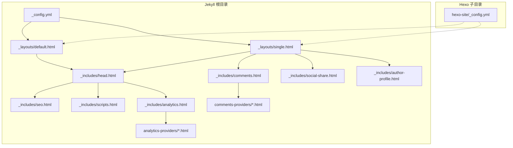
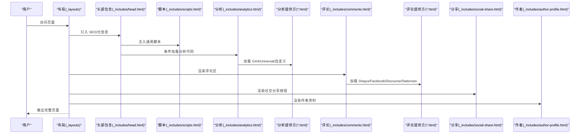
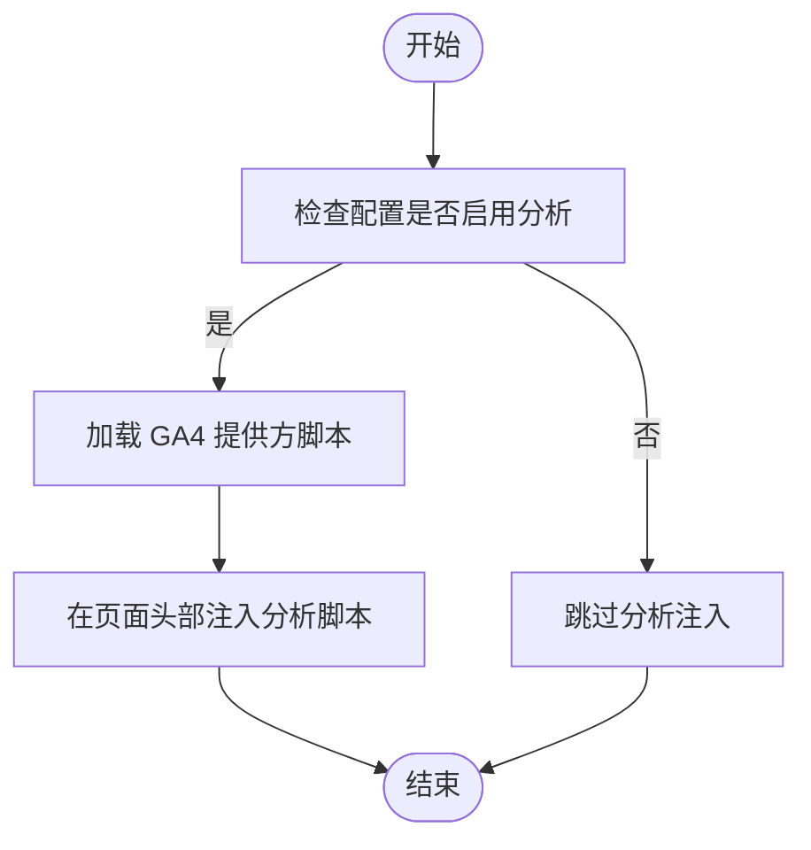
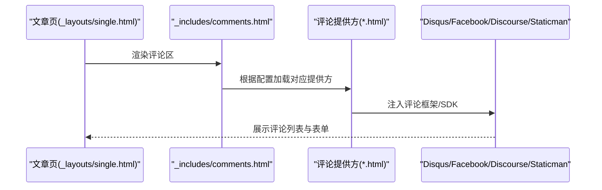
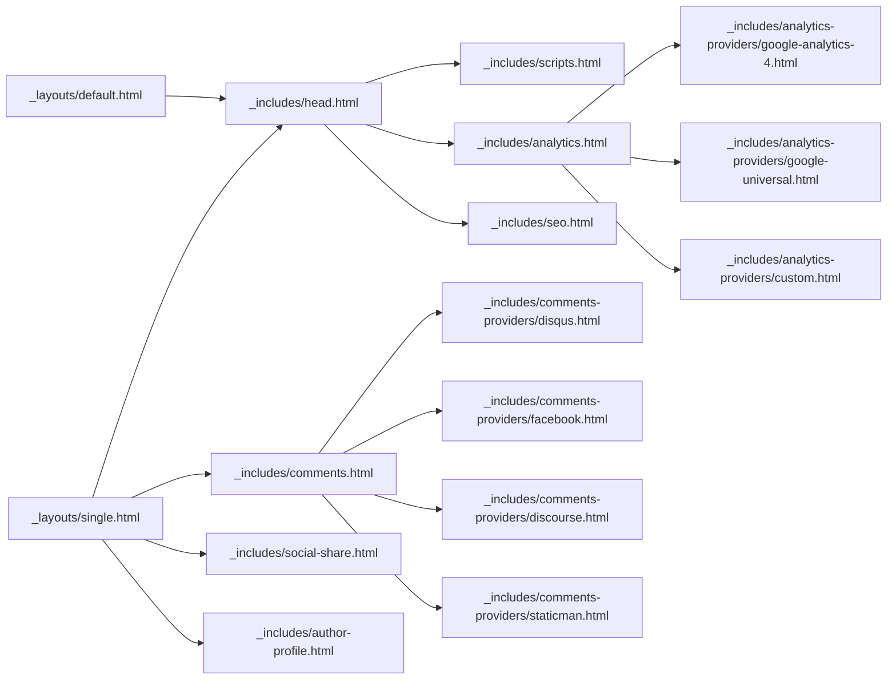

# 社交集成组件

<cite>
**本文引用的文件**
- [_config.yml](file://_config.yml)
- [hexo-site/_config.yml](file://hexo-site/_config.yml)
- [_includes/analytics-providers/google-analytics-4.html](file://_includes/analytics-providers/google-analytics-4.html)
- [_includes/analytics-providers/google-universal.html](file://_includes/analytics-providers/google-universal.html)
- [_includes/analytics-providers/custom.html](file://_includes/analytics-providers/custom.html)
- [_includes/comments-providers/disqus.html](file://_includes/comments-providers/disqus.html)
- [_includes/comments-providers/facebook.html](file://_includes/comments-providers/facebook.html)
- [_includes/comments-providers/discourse.html](file://_includes/comments-providers/discourse.html)
- [_includes/comments-providers/staticman.html](file://_includes/comments-providers/staticman.html)
- [_includes/comments-providers/scripts.html](file://_includes/comments-providers/scripts.html)
- [_includes/social-share.html](file://_includes/social-share.html)
- [_includes/author-profile.html](file://_includes/author-profile.html)
- [_includes/analytics.html](file://_includes/analytics.html)
- [_includes/comments.html](file://_includes/comments.html)
- [_includes/scripts.html](file://_includes/scripts.html)
- [_includes/head.html](file://_includes/head.html)
- [_includes/seo.html](file://_includes/seo.html)
- [_layouts/default.html](file://_layouts/default.html)
- [_layouts/single.html](file://_layouts/single.html)
- [_pages/about.md](file://_pages/about.md)
- [_pages/terms.md](file://_pages/terms.md)
</cite>

## 目录
1. [简介](#简介)
2. [项目结构](#项目结构)
3. [核心组件](#核心组件)
4. [架构总览](#架构总览)
5. [详细组件分析](#详细组件分析)
6. [依赖关系分析](#依赖关系分析)
7. [性能考虑](#性能考虑)
8. [故障排除指南](#故障排除指南)
9. [结论](#结论)
10. [附录](#附录)

## 简介
本文件面向“社交集成组件”的配置与使用，覆盖以下主题：
- 作者资料展示：在页面中呈现作者信息与社交链接
- 社交分享按钮：为文章或页面提供一键分享到社交媒体的功能
- 分析工具集成：接入 Google Analytics（GA4 与 Universal）等分析服务
- 评论系统：支持 Disqus、Facebook、Discourse、Staticman 等多种评论方案
- 第三方服务的 API 配置与隐私设置指导：帮助你在合规前提下启用功能

本项目基于 Jekyll 模板与 Hexo 主题的混合结构，通过布局、包含文件与配置项实现社交与分析能力的模块化装配。

## 项目结构
该站点采用 Jekyll 与 Hexo 双重结构：
- Jekyll 根目录包含主题布局、包含文件、数据与页面
- hexo-site 子目录为 Hexo 配置与内容源，用于生成静态资源或作为额外部署目标

关键社交与分析相关文件分布如下：
- 分析提供方：_includes/analytics-providers/*.html
- 评论提供方：_includes/comments-providers/*.html
- 公共包含：_includes/analytics.html、_includes/comments.html、_includes/social-share.html、_includes/author-profile.html、_includes/scripts.html、_includes/head.html、_includes/seo.html
- 布局：_layouts/default.html、_layouts/single.html
- 配置：_config.yml（Jekyll）、hexo-site/_config.yml（Hexo）

图示来源
- [_config.yml](file://_config.yml)
- [_layouts/default.html](file://_layouts/default.html)
- [_layouts/single.html](file://_layouts/single.html)
- [_includes/head.html](file://_includes/head.html)
- [_includes/seo.html](file://_includes/seo.html)
- [_includes/scripts.html](file://_includes/scripts.html)
- [_includes/analytics.html](file://_includes/analytics.html)
- [_includes/analytics-providers/google-analytics-4.html](file://_includes/analytics-providers/google-analytics-4.html)
- [_includes/comments.html](file://_includes/comments.html)
- [_includes/comments-providers/disqus.html](file://_includes/comments-providers/disqus.html)
- [_includes/social-share.html](file://_includes/social-share.html)
- [_includes/author-profile.html](file://_includes/author-profile.html)
- [hexo-site/_config.yml](file://hexo-site/_config.yml)

章节来源
- [_config.yml](file://_config.yml)
- [hexo-site/_config.yml](file://hexo-site/_config.yml)

## 核心组件
- 作者资料展示：通过作者档案模板渲染作者头像、简介与社交链接
- 社交分享按钮：在文章页注入分享控件，支持多平台一键分享
- 分析工具集成：按需加载 GA4 或 Universal Analytics 脚本
- 评论系统：根据页面配置选择 Disqus、Facebook、Discourse 或 Staticman

章节来源
- [_includes/author-profile.html](file://_includes/author-profile.html)
- [_includes/social-share.html](file://_includes/social-share.html)
- [_includes/analytics.html](file://_includes/analytics.html)
- [_includes/comments.html](file://_includes/comments.html)

## 架构总览
社交与分析组件通过布局与包含文件进行装配，形成“配置驱动 + 模板渲染”的模式。Jekyll 在构建时将各包含文件合并进布局，最终输出静态页面。

图示来源
- [_layouts/default.html](file://_layouts/default.html)
- [_layouts/single.html](file://_layouts/single.html)
- [_includes/head.html](file://_includes/head.html)
- [_includes/scripts.html](file://_includes/scripts.html)
- [_includes/analytics.html](file://_includes/analytics.html)
- [_includes/analytics-providers/google-analytics-4.html](file://_includes/analytics-providers/google-analytics-4.html)
- [_includes/analytics-providers/google-universal.html](file://_includes/analytics-providers/google-universal.html)
- [_includes/analytics-providers/custom.html](file://_includes/analytics-providers/custom.html)
- [_includes/comments.html](file://_includes/comments.html)
- [_includes/comments-providers/disqus.html](file://_includes/comments-providers/disqus.html)
- [_includes/comments-providers/facebook.html](file://_includes/comments-providers/facebook.html)
- [_includes/comments-providers/discourse.html](file://_includes/comments-providers/discourse.html)
- [_includes/comments-providers/staticman.html](file://_includes/comments-providers/staticman.html)
- [_includes/social-share.html](file://_includes/social-share.html)
- [_includes/author-profile.html](file://_includes/author-profile.html)

## 详细组件分析

### 作者资料展示
- 组件职责：在页面侧边栏或文章页展示作者头像、姓名、简介与社交链接
- 关键文件：
  - 作者档案模板：_includes/author-profile.html
  - 页面示例：_pages/about.md（可参考其 front matter 中的作者字段）
- 配置要点：
  - 使用作者数据源（如 _data/authors.yml 或页面 front matter）提供作者信息
  - 在布局中引入作者档案包含文件以渲染
- 隐私建议：
  - 若作者信息包含真实联系方式，建议仅公开必要信息，避免泄露个人隐私

章节来源
- [_includes/author-profile.html](file://_includes/author-profile.html)
- [_pages/about.md](file://_pages/about.md)

### 社交分享按钮
- 组件职责：为当前页面生成一键分享到社交平台的按钮
- 关键文件：
  - 分享按钮模板：_includes/social-share.html
  - 页面布局：_layouts/single.html（在文章页启用）
- 集成方式：
  - 在文章布局中引入社交分享包含文件
  - 确保页面具备可分享的 URL 与标题（由 SEO 包含文件提供）
- 隐私建议：
  - 分享按钮通常会调用平台接口，注意遵循平台的隐私政策与数据处理要求

章节来源
- [_includes/social-share.html](file://_includes/social-share.html)
- [_layouts/single.html](file://_layouts/single.html)
- [_includes/seo.html](file://_includes/seo.html)

### 分析工具集成
- 组件职责：在页面中注入分析脚本，采集访问行为数据
- 支持的提供方：
  - GA4：_includes/analytics-providers/google-analytics-4.html
  - Universal（旧版 GA）：_includes/analytics-providers/google-universal.html
  - 自定义：_includes/analytics-providers/custom.html
- 关键文件：
  - 分析主包含：_includes/analytics.html
  - 头部包含：_includes/head.html（负责引入脚本与 SEO）
- 配置步骤（以 GA4 为例）：
  1) 在 _includes/analytics-providers/google-analytics-4.html 中填写你的测量 ID
  2) 在 _includes/analytics.html 中启用 GA4 提供方
  3) 在 _includes/head.html 中确保分析包含被引入
- 隐私与合规建议：
  - 启用匿名化 IP（如适用）
  - 明确隐私政策，提供用户撤回同意的途径
  - 遵循所在地区的数据保护法规（如 GDPR、CCPA）

图示来源
- [_includes/analytics.html](file://_includes/analytics.html)
- [_includes/analytics-providers/google-analytics-4.html](file://_includes/analytics-providers/google-analytics-4.html)
- [_includes/analytics-providers/google-universal.html](file://_includes/analytics-providers/google-universal.html)
- [_includes/analytics-providers/custom.html](file://_includes/analytics-providers/custom.html)
- [_includes/head.html](file://_includes/head.html)

章节来源
- [_includes/analytics.html](file://_includes/analytics.html)
- [_includes/analytics-providers/google-analytics-4.html](file://_includes/analytics-providers/google-analytics-4.html)
- [_includes/analytics-providers/google-universal.html](file://_includes/analytics-providers/google-universal.html)
- [_includes/analytics-providers/custom.html](file://_includes/analytics-providers/custom.html)
- [_includes/head.html](file://_includes/head.html)

### 评论系统
- 组件职责：在文章页提供评论展示与提交入口
- 支持的提供方：
  - Disqus：_includes/comments-providers/disqus.html
  - Facebook：_includes/comments-providers/facebook.html
  - Discourse：_includes/comments-providers/discourse.html
  - Staticman：_includes/comments-providers/staticman.html
  - 通用脚本：_includes/comments-providers/scripts.html（可放置第三方评论所需的全局脚本）
- 关键文件：
  - 评论主包含：_includes/comments.html
  - 页面布局：_layouts/single.html（在文章页启用）
- 集成步骤（以 Disqus 为例）：
  1) 在 _includes/comments-providers/disqus.html 中填写你的短名称
  2) 在 _includes/comments.html 中启用 Disqus 提供方
  3) 在文章布局中引入评论包含文件
- 隐私与合规建议：
  - 明确评论存储与处理规则
  - 提供删除请求通道与数据最小化原则
  - 对第三方评论服务的 Cookie 与追踪进行透明披露

图示来源
- [_layouts/single.html](file://_layouts/single.html)
- [_includes/comments.html](file://_includes/comments.html)
- [_includes/comments-providers/disqus.html](file://_includes/comments-providers/disqus.html)
- [_includes/comments-providers/facebook.html](file://_includes/comments-providers/facebook.html)
- [_includes/comments-providers/discourse.html](file://_includes/comments-providers/discourse.html)
- [_includes/comments-providers/staticman.html](file://_includes/comments-providers/staticman.html)
- [_includes/comments-providers/scripts.html](file://_includes/comments-providers/scripts.html)

章节来源
- [_includes/comments.html](file://_includes/comments.html)
- [_includes/comments-providers/disqus.html](file://_includes/comments-providers/disqus.html)
- [_includes/comments-providers/facebook.html](file://_includes/comments-providers/facebook.html)
- [_includes/comments-providers/discourse.html](file://_includes/comments-providers/discourse.html)
- [_includes/comments-providers/staticman.html](file://_includes/comments-providers/staticman.html)
- [_includes/comments-providers/scripts.html](file://_includes/comments-providers/scripts.html)
- [_layouts/single.html](file://_layouts/single.html)

### 第三方服务 API 配置与隐私设置指导
- Google Analytics（GA4/Universal）
  - 在对应提供方文件中填写测量 ID 或跟踪 ID
  - 在分析主包含中启用相应提供方
  - 遵循平台隐私政策，提供数据处理声明
- Disqus
  - 在提供方文件中填写短名称
  - 在评论主包含中启用
  - 明确评论存储与审核机制
- Facebook
  - 在提供方文件中配置应用 ID 与页面 URL
  - 在评论主包含中启用
  - 注意平台的数据使用条款与本地化合规要求
- Discourse
  - 在提供方文件中配置论坛 URL 与嵌入参数
  - 在评论主包含中启用
- Staticman
  - 在提供方文件中配置仓库、分支与验证参数
  - 在评论主包含中启用
  - 明确评论审核与垃圾过滤策略

章节来源
- [_includes/analytics-providers/google-analytics-4.html](file://_includes/analytics-providers/google-analytics-4.html)
- [_includes/analytics-providers/google-universal.html](file://_includes/analytics-providers/google-universal.html)
- [_includes/comments-providers/disqus.html](file://_includes/comments-providers/disqus.html)
- [_includes/comments-providers/facebook.html](file://_includes/comments-providers/facebook.html)
- [_includes/comments-providers/discourse.html](file://_includes/comments-providers/discourse.html)
- [_includes/comments-providers/staticman.html](file://_includes/comments-providers/staticman.html)

## 依赖关系分析
- 布局对包含文件的依赖：
  - default.html 与 single.html 依赖 head.html、scripts.html、analytics.html、comments.html、social-share.html、author-profile.html
- 包含文件对提供方的依赖：
  - analytics.html 依赖 analytics-providers/* 提供方
  - comments.html 依赖 comments-providers/* 提供方
- 配置对行为的影响：
  - Jekyll 配置（_config.yml）与 Hexo 配置（hexo-site/_config.yml）影响站点基础设置与主题选择

图示来源
- [_layouts/default.html](file://_layouts/default.html)
- [_layouts/single.html](file://_layouts/single.html)
- [_includes/head.html](file://_includes/head.html)
- [_includes/scripts.html](file://_includes/scripts.html)
- [_includes/analytics.html](file://_includes/analytics.html)
- [_includes/analytics-providers/google-analytics-4.html](file://_includes/analytics-providers/google-analytics-4.html)
- [_includes/analytics-providers/google-universal.html](file://_includes/analytics-providers/google-universal.html)
- [_includes/analytics-providers/custom.html](file://_includes/analytics-providers/custom.html)
- [_includes/comments.html](file://_includes/comments.html)
- [_includes/comments-providers/disqus.html](file://_includes/comments-providers/disqus.html)
- [_includes/comments-providers/facebook.html](file://_includes/comments-providers/facebook.html)
- [_includes/comments-providers/discourse.html](file://_includes/comments-providers/discourse.html)
- [_includes/comments-providers/staticman.html](file://_includes/comments-providers/staticman.html)
- [_includes/social-share.html](file://_includes/social-share.html)
- [_includes/author-profile.html](file://_includes/author-profile.html)

章节来源
- [_layouts/default.html](file://_layouts/default.html)
- [_layouts/single.html](file://_layouts/single.html)
- [_includes/head.html](file://_includes/head.html)
- [_includes/analytics.html](file://_includes/analytics.html)
- [_includes/comments.html](file://_includes/comments.html)
- [_includes/social-share.html](file://_includes/social-share.html)
- [_includes/author-profile.html](file://_includes/author-profile.html)

## 性能考虑
- 脚本加载优化：
  - 将分析与评论脚本置于页面底部，减少对首屏渲染的影响
  - 使用异步加载或延迟加载策略（在脚本包含文件中实现）
- 资源压缩与缓存：
  - 利用 CDN 与浏览器缓存提升第三方脚本加载速度
- 选择性启用：
  - 在开发环境禁用分析与评论，减少不必要的网络请求
- 图片与媒体：
  - 作者头像与分享图标应进行压缩与懒加载

## 故障排除指南
- 分析未生效
  - 检查分析主包含是否被布局引入
  - 确认提供方文件中的 ID 已正确填写
  - 使用浏览器开发者工具查看网络请求与控制台错误
- 评论无法显示
  - 检查评论主包含是否启用对应提供方
  - 确认提供方文件中的配置项（如短名称、仓库、分支等）正确
  - 查看浏览器控制台是否存在跨域或脚本加载失败
- 分享按钮无响应
  - 确认分享包含文件已在文章布局中引入
  - 检查页面 URL 与标题是否由 SEO 包含正确设置
- 隐私与合规问题
  - 审视第三方服务的隐私政策与数据处理条款
  - 在页面显著位置提供隐私政策链接与用户权利说明

章节来源
- [_includes/analytics.html](file://_includes/analytics.html)
- [_includes/comments.html](file://_includes/comments.html)
- [_includes/social-share.html](file://_includes/social-share.html)
- [_includes/seo.html](file://_includes/seo.html)

## 结论
通过“配置驱动 + 模块化包含”的方式，本项目实现了作者资料、社交分享、分析与评论等社交集成能力。建议在启用第三方服务时，优先考虑性能与隐私合规，并在生产环境中进行充分测试与监控。

## 附录
- 相关配置文件路径
  - Jekyll 站点配置：_config.yml
  - Hexo 站点配置：hexo-site/_config.yml
- 常用包含文件
  - 头部与脚本：_includes/head.html、_includes/scripts.html
  - 分析与评论：_includes/analytics.html、_includes/comments.html
  - 分享与作者：_includes/social-share.html、_includes/author-profile.html
- 提供方文件
  - 分析：_includes/analytics-providers/google-analytics-4.html、_includes/analytics-providers/google-universal.html、_includes/analytics-providers/custom.html
  - 评论：_includes/comments-providers/disqus.html、_includes/comments-providers/facebook.html、_includes/comments-providers/discourse.html、_includes/comments-providers/staticman.html、_includes/comments-providers/scripts.html