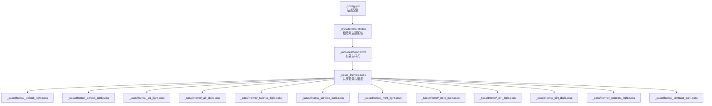
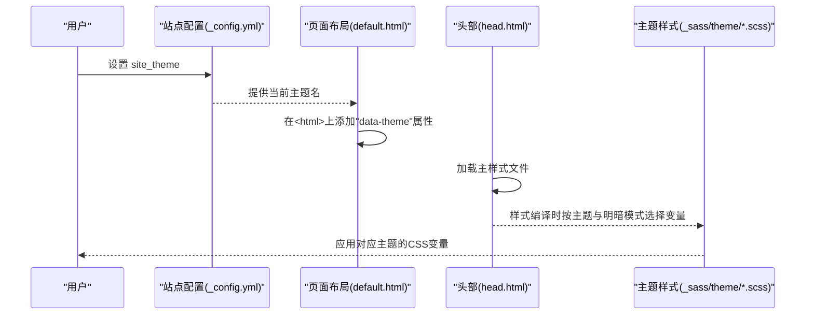
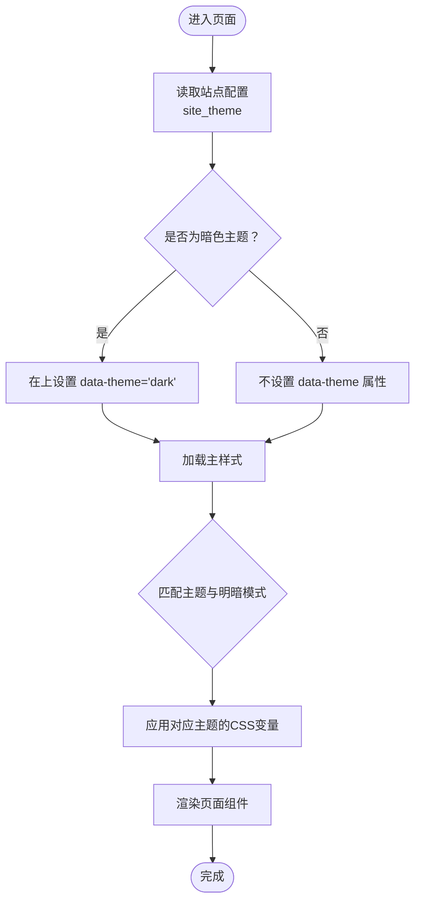
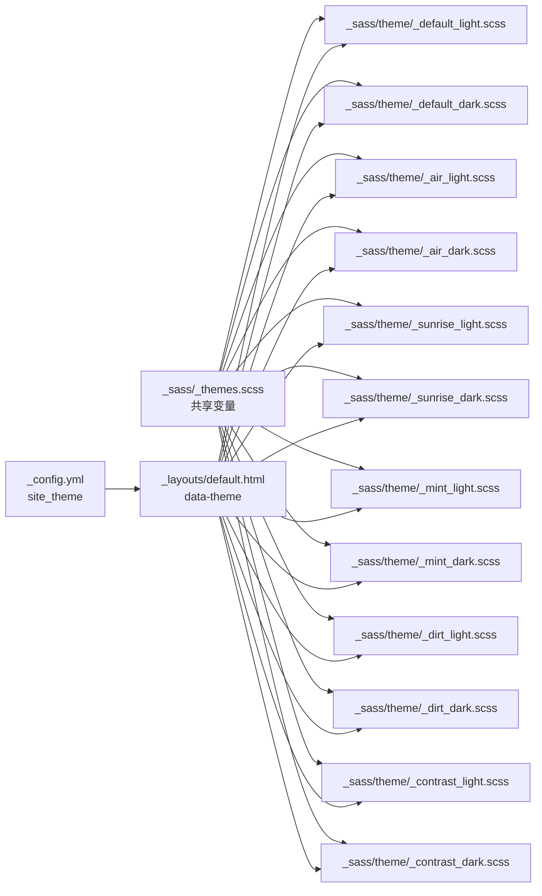

# 主题系统

<cite>
**本文引用的文件**
- [_config.yml](file://_config.yml)
- [default.html](file://_layouts/default.html)
- [head.html](file://_includes/head.html)
- [_themes.scss](file://_sass/_themes.scss)
- [_default_light.scss](file://_sass/theme/_default_light.scss)
- [_default_dark.scss](file://_sass/theme/_default_dark.scss)
- [_air_light.scss](file://_sass/theme/_air_light.scss)
- [_air_dark.scss](file://_sass/theme/_air_dark.scss)
- [_sunrise_light.scss](file://_sass/theme/_sunrise_light.scss)
- [_sunrise_dark.scss](file://_sass/theme/_sunrise_dark.scss)
- [_mint_light.scss](file://_sass/theme/_mint_light.scss)
- [_mint_dark.scss](file://_sass/theme/_mint_dark.scss)
- [_dirt_light.scss](file://_sass/theme/_dirt_light.scss)
- [_dirt_dark.scss](file://_sass/theme/_dirt_dark.scss)
- [_contrast_light.scss](file://_sass/theme/_contrast_light.scss)
- [_contrast_dark.scss](file://_sass/theme/_contrast_dark.scss)
</cite>

## 目录
1. [简介](#简介)
2. [项目结构](#项目结构)
3. [核心组件](#核心组件)
4. [架构总览](#架构总览)
5. [详细组件分析](#详细组件分析)
6. [依赖关系分析](#依赖关系分析)
7. [性能考量](#性能考量)
8. [故障排查指南](#故障排查指南)
9. [结论](#结论)
10. [附录](#附录)

## 简介
本文件系统性阐述 Academic Pages 主题系统的主题体系与实现机制，覆盖六大主题变体（默认、空气、日出、薄荷、泥土、对比度）的设计理念与视觉特色；解释主题切换机制与实现原理；提供主题定制方法（颜色变量、字体设置、间距调整等）；并给出主题选择指南与最佳实践，帮助用户依据个人偏好与学术领域进行合理选择。

## 项目结构
Academic Pages 的主题系统由以下关键部分组成：
- 全局站点配置：通过站点配置项控制当前主题与语言环境等。
- 布局层：在页面根元素上应用主题数据属性，驱动 CSS 变量生效。
- 样式层：以 SCSS 模块化组织主题变量与 CSS 变量，按“主题名_明暗模式”命名，形成完整的主题矩阵。
- 共享样式：统一的排版、断点、网格与品牌色常量，作为各主题的基础。

图表来源
- [_config.yml:10-11](file://_config.yml#L10-L11)
- [default.html](file://_layouts/default.html#L8)
- [head.html](file://_includes/head.html#L16)
- [_themes.scss:10-44](file://_sass/_themes.scss#L10-L44)
- [_default_light.scss:30-47](file://_sass/theme/_default_light.scss#L30-L47)
- [_default_dark.scss:38-55](file://_sass/theme/_default_dark.scss#L38-L55)
- [_air_light.scss:38-55](file://_sass/theme/_air_light.scss#L38-L55)
- [_air_dark.scss:38-55](file://_sass/theme/_air_dark.scss#L38-L55)
- [_sunrise_light.scss:40-57](file://_sass/theme/_sunrise_light.scss#L40-L57)
- [_sunrise_dark.scss:42-59](file://_sass/theme/_sunrise_dark.scss#L42-L59)
- [_mint_light.scss:40-58](file://_sass/theme/_mint_light.scss#L40-L58)
- [_mint_dark.scss:36-54](file://_sass/theme/_mint_dark.scss#L36-L54)
- [_dirt_light.scss:36-53](file://_sass/theme/_dirt_light.scss#L36-L53)
- [_dirt_dark.scss:40-56](file://_sass/theme/_dirt_dark.scss#L40-L56)
- [_contrast_light.scss:42-62](file://_sass/theme/_contrast_light.scss#L42-L62)
- [_contrast_dark.scss:38-58](file://_sass/theme/_contrast_dark.scss#L38-L58)

章节来源
- [_config.yml:10-11](file://_config.yml#L10-L11)
- [default.html](file://_layouts/default.html#L8)
- [head.html](file://_includes/head.html#L16)
- [_themes.scss:10-44](file://_sass/_themes.scss#L10-L44)

## 核心组件
- 主题配置入口：站点配置中通过主题键值指定当前主题名称，支持六个主题之一。
- 布局注入：在页面根元素上注入主题数据属性，用于选择对应明/暗主题的 CSS 变量块。
- 样式变量矩阵：每个主题提供明/暗两套 SCSS 变量与 CSS 自定义属性映射，确保全局一致的色彩与排版。
- 共享样式：统一的字体、字号、断点、网格与品牌色常量，保证跨主题一致性。

章节来源
- [_config.yml:10-11](file://_config.yml#L10-L11)
- [default.html](file://_layouts/default.html#L8)
- [_themes.scss:10-44](file://_sass/_themes.scss#L10-L44)

## 架构总览
Academic Pages 的主题系统采用“配置驱动 + 布局注入 + SCSS 变量矩阵”的三层架构：
- 配置层：站点配置决定当前主题名称。
- 布局层：根元素的数据属性触发 CSS 变量切换。
- 样式层：按主题与明暗模式划分 SCSS 文件，输出统一的 CSS 变量，供页面组件使用。

图表来源
- [_config.yml:10-11](file://_config.yml#L10-L11)
- [default.html](file://_layouts/default.html#L8)
- [head.html](file://_includes/head.html#L16)
- [_default_light.scss:30-47](file://_sass/theme/_default_light.scss#L30-L47)
- [_default_dark.scss:38-55](file://_sass/theme/_default_dark.scss#L38-L55)

## 详细组件分析

### 主题变体概览与设计理念
六大主题围绕不同的视觉语义与可读性目标设计，分别适用于不同风格与场景：

- 默认主题（Default）
  - 设计理念：平衡专业与现代感，强调内容可读性与信息层级。
  - 视觉特色：蓝灰主色调，适中的对比度，适合广泛学术领域。
  - 明/暗模式：通过 CSS 变量映射实现统一的背景、文字、链接与边框色彩。

- 空气主题（Air）
  - 设计理念：轻盈通透，强调留白与呼吸感。
  - 视觉特色：浅灰背景与柔和蓝色点缀，营造轻松氛围。
  - 明/暗模式：浅色系为主，深色模式下采用深灰蓝调，保持高可读性。

- 日出主题（Sunrise）
  - 设计理念：温暖与活力，突出个性与创意。
  - 视觉特色：暖橙红色主色与米色背景，搭配明亮的页脚装饰。
  - 明/暗模式：浅色模式强调暖色与低饱和，深色模式强化暖色层次与对比。

- 薄荷主题（Mint）
  - 设计理念：清新与专业，强调自然与科技感。
  - 视觉特色：薄荷绿主色与浅灰背景，页脚强调绿色点缀。
  - 明/暗模式：浅色模式偏冷绿与柔和，深色模式采用更深绿与高对比。

- 泥土主题（Dirt）
  - 设计理念：稳重与内敛，强调传统与学术感。
  - 视觉特色：大地色系与米色背景，强调质感与层次。
  - 明/暗模式：浅色模式以暖灰与米色为主，深色模式采用深棕与暖灰。

- 对比度主题（Contrast）
  - 设计理念：高对比与无障碍友好，强调清晰度与可访问性。
  - 视觉特色：黑白主色与强对比边界，强调文本与交互元素。
  - 明/暗模式：浅色模式强调黑与蓝的高对比，深色模式强调白与蓝的高对比。

章节来源
- [_default_light.scss:5-18](file://_sass/theme/_default_light.scss#L5-L18)
- [_default_dark.scss:6-26](file://_sass/theme/_default_dark.scss#L6-L26)
- [_air_light.scss:6-18](file://_sass/theme/_air_light.scss#L6-L18)
- [_air_dark.scss:6-18](file://_sass/theme/_air_dark.scss#L6-L18)
- [_sunrise_light.scss:5-21](file://_sass/theme/_sunrise_light.scss#L5-L21)
- [_sunrise_dark.scss:5-23](file://_sass/theme/_sunrise_dark.scss#L5-L23)
- [_mint_light.scss:5-18](file://_sass/theme/_mint_light.scss#L5-L18)
- [_mint_dark.scss:5-14](file://_sass/theme/_mint_dark.scss#L5-L14)
- [_dirt_light.scss:1-17](file://_sass/theme/_dirt_light.scss#L1-L17)
- [_dirt_dark.scss:5-18](file://_sass/theme/_dirt_dark.scss#L5-L18)
- [_contrast_light.scss:5-23](file://_sass/theme/_contrast_light.scss#L5-L23)
- [_contrast_dark.scss:5-18](file://_sass/theme/_contrast_dark.scss#L5-L18)

### 主题切换机制与实现原理
Academic Pages 的主题切换基于“配置 + 数据属性 + CSS 变量”的组合：
- 配置阶段：站点配置中设置当前主题名称。
- 布局阶段：页面根元素根据配置注入主题数据属性，用于选择明/暗主题块。
- 样式阶段：每个主题提供明/暗两套 SCSS 变量，并映射为 CSS 自定义属性，供页面组件使用。

图表来源
- [_config.yml:10-11](file://_config.yml#L10-L11)
- [default.html](file://_layouts/default.html#L8)
- [_default_light.scss:30-47](file://_sass/theme/_default_light.scss#L30-L47)
- [_default_dark.scss:38-55](file://_sass/theme/_default_dark.scss#L38-L55)

章节来源
- [_config.yml:10-11](file://_config.yml#L10-L11)
- [default.html](file://_layouts/default.html#L8)

### 主题定制方法
主题定制围绕 SCSS 变量与 CSS 自定义属性展开，主要维度如下：

- 颜色变量
  - 主色与辅助色：各主题定义主色与危险/信息/提示/成功/警告等语义色。
  - 文字与背景：定义正文、标题、链接、页脚、边框等颜色。
  - 代码与图注：定义代码背景、代码文字、图注颜色等。
  - 示例路径参考：[默认主题明/暗色变量:5-18](file://_sass/theme/_default_light.scss#L5-L18), [空气主题明/暗色变量:6-18](file://_sass/theme/_air_light.scss#L6-L18), [日出主题明/暗色变量:5-21](file://_sass/theme/_sunrise_light.scss#L5-L21), [薄荷主题明/暗色变量:5-18](file://_sass/theme/_mint_light.scss#L5-L18), [泥土主题明/暗色变量:1-17](file://_sass/theme/_dirt_light.scss#L1-L17), [对比度主题明/暗色变量:5-23](file://_sass/theme/_contrast_light.scss#L5-L23)。

- 字体与排版
  - 全局字体族、标题字体族、说明字体族与字号等级。
  - 行距、缩进、断点与网格参数。
  - 示例路径参考：[共享排版与断点:10-44](file://_sass/_themes.scss#L10-L44)。

- 间距与圆角
  - 边框半径、阴影、过渡时间、导航图标尺寸、侧栏宽度等。
  - 示例路径参考：[默认主题尺寸与圆角:20-27](file://_sass/theme/_default_light.scss#L20-L27), [空气主题尺寸与圆角:28-35](file://_sass/theme/_air_light.scss#L28-L35), [日出主题尺寸与圆角:30-37](file://_sass/theme/_sunrise_light.scss#L30-L37), [薄荷主题尺寸与圆角:30-37](file://_sass/theme/_mint_light.scss#L30-L37), [泥土主题尺寸与圆角:26-33](file://_sass/theme/_dirt_light.scss#L26-L33), [对比度主题尺寸与圆角:32-39](file://_sass/theme/_contrast_light.scss#L32-L39)。

- CSS 变量映射
  - 各主题通过 CSS 自定义属性统一暴露变量，供页面组件直接使用。
  - 示例路径参考：[默认主题 CSS 变量:30-47](file://_sass/theme/_default_light.scss#L30-L47), [空气主题 CSS 变量:38-55](file://_sass/theme/_air_light.scss#L38-L55), [日出主题 CSS 变量:40-57](file://_sass/theme/_sunrise_light.scss#L40-L57), [薄荷主题 CSS 变量:40-58](file://_sass/theme/_mint_light.scss#L40-L58), [泥土主题 CSS 变量:36-53](file://_sass/theme/_dirt_light.scss#L36-L53), [对比度主题 CSS 变量:42-62](file://_sass/theme/_contrast_light.scss#L42-L62)。

章节来源
- [_themes.scss:10-44](file://_sass/_themes.scss#L10-L44)
- [_default_light.scss:5-47](file://_sass/theme/_default_light.scss#L5-L47)
- [_air_light.scss:6-55](file://_sass/theme/_air_light.scss#L6-L55)
- [_sunrise_light.scss:5-57](file://_sass/theme/_sunrise_light.scss#L5-L57)
- [_mint_light.scss:5-58](file://_sass/theme/_mint_light.scss#L5-L58)
- [_dirt_light.scss:1-53](file://_sass/theme/_dirt_light.scss#L1-L53)
- [_contrast_light.scss:5-62](file://_sass/theme/_contrast_light.scss#L5-L62)

### 主题选择指南与最佳实践
- 学术论文与报告：推荐默认或泥土主题，强调专业与稳重。
- 创意与设计类内容：推荐空气或日出主题，强调通透与活力。
- 科技与工程类：推荐默认或薄荷主题，强调清晰与专业。
- 无障碍与高对比需求：优先对比度主题，确保高对比与可读性。
- 个人博客与随笔：可选空气或日出，营造轻松氛围。
- 多主题共存策略：可在不同页面通过配置切换主题，或通过构建流程生成多版本。

章节来源
- [_config.yml:10-11](file://_config.yml#L10-L11)

### 主题预览与自定义示例
- 主题预览截图
  - 默认主题：[默认主题明/暗变量:5-47](file://_sass/theme/_default_light.scss#L5-L47), [默认主题明/暗变量:6-55](file://_sass/theme/_default_dark.scss#L6-L55)
  - 空气主题：[空气主题明/暗变量:6-55](file://_sass/theme/_air_light.scss#L6-L55), [空气主题明/暗变量:6-55](file://_sass/theme/_air_dark.scss#L6-L55)
  - 日出主题：[日出主题明/暗变量:5-57](file://_sass/theme/_sunrise_light.scss#L5-L57), [日出主题明/暗变量:5-59](file://_sass/theme/_sunrise_dark.scss#L5-L59)
  - 薄荷主题：[薄荷主题明/暗变量:5-58](file://_sass/theme/_mint_light.scss#L5-L58), [薄荷主题明/暗变量:5-54](file://_sass/theme/_mint_dark.scss#L5-L54)
  - 泥土主题：[泥土主题明/暗变量:1-53](file://_sass/theme/_dirt_light.scss#L1-L53), [泥土主题明/暗变量:5-56](file://_sass/theme/_dirt_dark.scss#L5-L56)
  - 对比度主题：[对比度主题明/暗变量:5-62](file://_sass/theme/_contrast_light.scss#L5-L62), [对比度主题明/暗变量:5-58](file://_sass/theme/_contrast_dark.scss#L5-L58)

- 自定义示例
  - 修改主色与链接色：在对应主题的明/暗 SCSS 文件中调整主色与链接变量，然后重新编译。
  - 调整排版与断点：在共享样式中修改字号、断点与网格参数，影响所有主题。
  - 新增主题：复制现有主题文件，重命名并调整变量，再在布局中引入对应 CSS 变量块。

章节来源
- [_default_light.scss:5-47](file://_sass/theme/_default_light.scss#L5-L47)
- [_air_light.scss:6-55](file://_sass/theme/_air_light.scss#L6-L55)
- [_sunrise_light.scss:5-57](file://_sass/theme/_sunrise_light.scss#L5-L57)
- [_mint_light.scss:5-58](file://_sass/theme/_mint_light.scss#L5-L58)
- [_dirt_light.scss:1-53](file://_sass/theme/_dirt_light.scss#L1-L53)
- [_contrast_light.scss:5-62](file://_sass/theme/_contrast_light.scss#L5-L62)
- [_themes.scss:10-44](file://_sass/_themes.scss#L10-L44)

## 依赖关系分析
主题系统内部依赖关系清晰，遵循“共享变量 → 主题矩阵 → 布局注入”的分层设计：
- 共享变量：统一字体、断点、网格与品牌色，被所有主题复用。
- 主题矩阵：每个主题提供明/暗两套变量与 CSS 变量映射，彼此独立且可替换。
- 布局注入：根元素的数据属性决定使用哪一套 CSS 变量，实现零 JS 切换。

图表来源
- [_themes.scss:10-44](file://_sass/_themes.scss#L10-L44)
- [_default_light.scss:30-47](file://_sass/theme/_default_light.scss#L30-L47)
- [_default_dark.scss:38-55](file://_sass/theme/_default_dark.scss#L38-L55)
- [_air_light.scss:38-55](file://_sass/theme/_air_light.scss#L38-L55)
- [_air_dark.scss:38-55](file://_sass/theme/_air_dark.scss#L38-L55)
- [_sunrise_light.scss:40-57](file://_sass/theme/_sunrise_light.scss#L40-L57)
- [_sunrise_dark.scss:42-59](file://_sass/theme/_sunrise_dark.scss#L42-L59)
- [_mint_light.scss:40-58](file://_sass/theme/_mint_light.scss#L40-L58)
- [_mint_dark.scss:36-54](file://_sass/theme/_mint_dark.scss#L36-L54)
- [_dirt_light.scss:36-53](file://_sass/theme/_dirt_light.scss#L36-L53)
- [_dirt_dark.scss:40-56](file://_sass/theme/_dirt_dark.scss#L40-L56)
- [_contrast_light.scss:42-62](file://_sass/theme/_contrast_light.scss#L42-L62)
- [_contrast_dark.scss:38-58](file://_sass/theme/_contrast_dark.scss#L38-L58)
- [_config.yml:10-11](file://_config.yml#L10-L11)
- [default.html](file://_layouts/default.html#L8)

章节来源
- [_themes.scss:10-44](file://_sass/_themes.scss#L10-L44)
- [_config.yml:10-11](file://_config.yml#L10-L11)
- [default.html](file://_layouts/default.html#L8)

## 性能考量
- 编译体积：每个主题独立编译为 CSS 变量块，建议仅启用所需主题以减少打包体积。
- 运行时开销：主题切换通过数据属性与 CSS 变量实现，无 JS 依赖，运行时开销极低。
- 可维护性：模块化主题文件便于扩展与维护，新增主题只需复制模板并调整变量。

## 故障排查指南
- 主题未生效
  - 检查站点配置中的主题键值是否正确。
  - 确认布局中根元素已注入数据属性。
  - 章节来源
    - [_config.yml:10-11](file://_config.yml#L10-L11)
    - [default.html](file://_layouts/default.html#L8)

- 明/暗主题不匹配
  - 确认明/暗主题 SCSS 文件中的 CSS 变量映射完整。
  - 章节来源
    - [_default_light.scss:30-47](file://_sass/theme/_default_light.scss#L30-L47)
    - [_default_dark.scss:38-55](file://_sass/theme/_default_dark.scss#L38-L55)

- 字体或排版异常
  - 检查共享样式中的字体与断点设置。
  - 章节来源
    - [_themes.scss:10-44](file://_sass/_themes.scss#L10-L44)

## 结论
Academic Pages 的主题系统通过“配置 + 数据属性 + CSS 变量”的简洁架构，实现了六大主题的统一管理与灵活切换。其模块化设计既保证了跨主题的一致性，又提供了充分的定制空间。建议在实际使用中结合内容类型与受众特征选择合适主题，并遵循最小化启用原则以优化性能。

## 附录
- 快速定位
  - 主题配置：[_config.yml:10-11](file://_config.yml#L10-L11)
  - 布局注入：[default.html](file://_layouts/default.html#L8)
  - 共享变量：[_themes.scss:10-44](file://_sass/_themes.scss#L10-L44)
  - 主题矩阵：见各主题 SCSS 文件路径