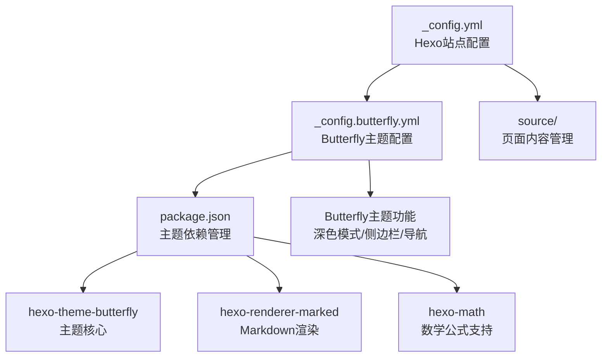
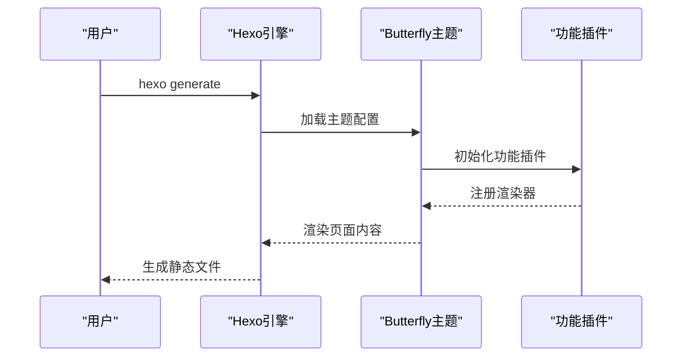
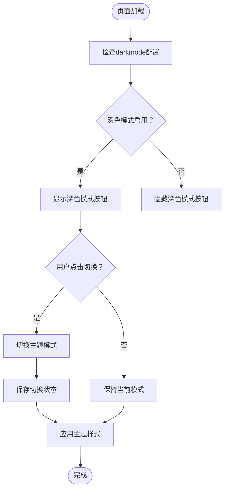
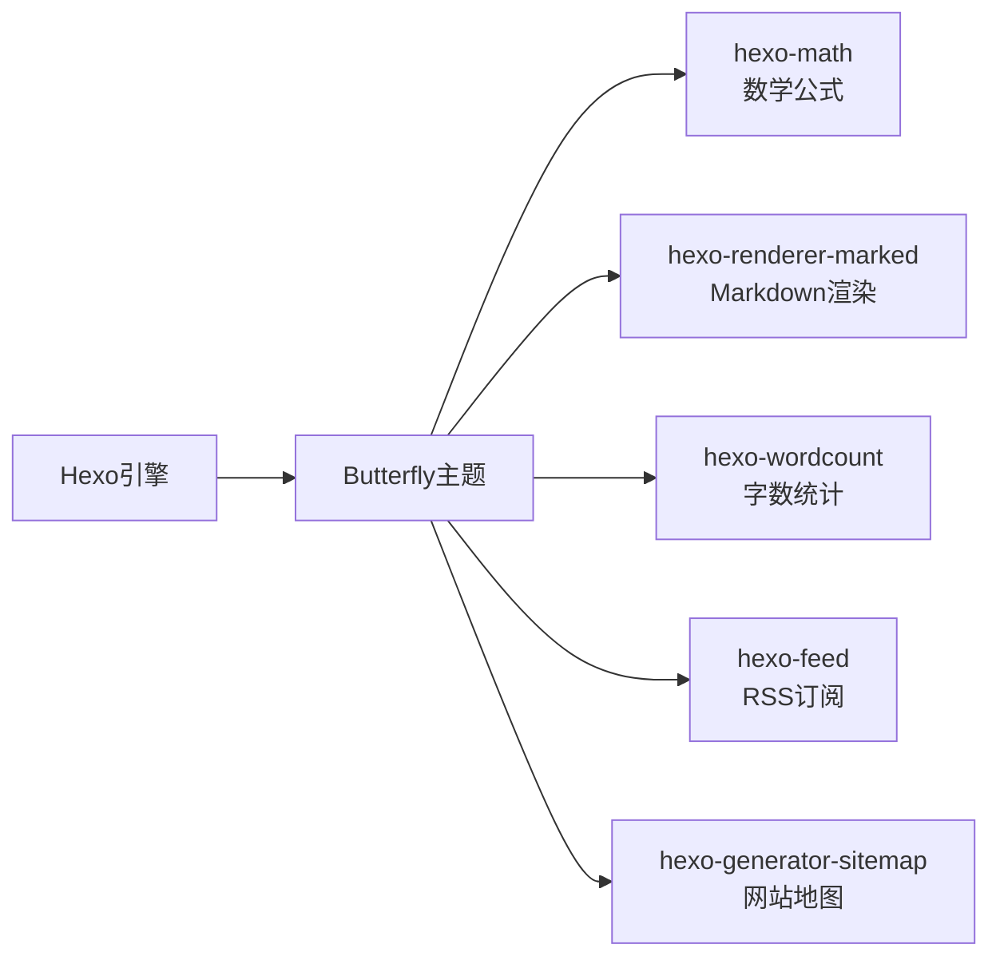

# 主题系统

<cite>
**本文引用的文件**
- [_config.yml](file://hexo-site/_config.yml)
- [_config.butterfly.yml](file://hexo-site/_config.butterfly.yml)
- [package.json](file://hexo-site/package.json)
- [index.md](file://hexo-site/source/index.md)
</cite>

## 更新摘要
**所做更改**
- 更新主题系统架构，从Jekyll原生主题迁移到Butterfly主题
- 重构配置结构，移除SCSS主题变量系统
- 新增Butterfly主题配置方法和功能特性
- 更新主题切换机制为Butterfly内置功能
- 移除原有的六大主题变体概念

## 目录
1. [简介](#简介)
2. [项目结构](#项目结构)
3. [核心组件](#核心组件)
4. [架构总览](#架构总览)
5. [详细组件分析](#详细组件分析)
6. [依赖关系分析](#依赖关系分析)
7. [性能考量](#性能考量)
8. [故障排查指南](#故障排查指南)
9. [结论](#结论)
10. [附录](#附录)

## 简介
本文档系统性阐述基于Butterfly主题的Academic Pages主题系统与实现机制。由于项目已从Jekyll原生主题迁移到Butterfly主题，本版本重点介绍Butterfly主题的配置方法、功能特性和定制选项，包括深色模式、侧边栏、导航栏、代码高亮等核心功能。文档涵盖Butterfly主题的配置结构、主题切换机制、功能特性定制方法，以及最佳实践建议。

## 项目结构
Academic Pages 的Butterfly主题系统由以下关键部分组成：
- **Hexo站点配置**：通过_hexo配置文件控制站点基本信息和主题选择
- **Butterfly主题配置**：通过_config.butterfly.yml文件控制主题功能和外观
- **主题依赖管理**：通过package.json管理Butterfly主题及相关插件
- **页面内容管理**：通过source目录下的Markdown文件管理页面内容



**图表来源**
- [_config.yml:119](file://hexo-site/_config.yml#L119)
- [_config.butterfly.yml:1-459](file://hexo-site/_config.butterfly.yml#L1-459)
- [package.json:14-32](file://hexo-site/package.json#L14-L32)

**章节来源**
- [_config.yml:119](file://hexo-site/_config.yml#L119)
- [_config.butterfly.yml:1-459](file://hexo-site/_config.butterfly.yml#L1-459)
- [package.json:14-32](file://hexo-site/package.json#L14-L32)

## 核心组件
- **主题选择**：在_hexo配置中通过theme字段指定使用butterfly主题
- **功能配置**：通过_butterfly配置文件控制导航栏、侧边栏、深色模式等功能
- **依赖管理**：通过package.json管理主题及相关插件的版本和安装
- **内容渲染**：通过hexo-renderer-marked插件处理Markdown内容渲染

**章节来源**
- [_config.yml:119](file://hexo-site/_config.yml#L119)
- [_config.butterfly.yml:1-459](file://hexo-site/_config.butterfly.yml#L1-459)
- [package.json:14-32](file://hexo-site/package.json#L14-L32)

## 架构总览
Academic Pages 的Butterfly主题系统采用"Hexo配置 + Butterfly主题配置 + 功能插件"的三层架构：
- **Hexo配置层**：控制站点基本信息和主题选择
- **Butterfly配置层**：控制主题功能和外观设置
- **功能插件层**：提供数学公式、代码高亮、深色模式等增强功能



**图表来源**
- [_config.yml:119](file://hexo-site/_config.yml#L119)
- [_config.butterfly.yml:1-459](file://hexo-site/_config.butterfly.yml#L1-459)
- [package.json:14-32](file://hexo-site/package.json#L14-L32)

## 详细组件分析

### Butterfly主题配置系统
Butterfly主题通过_config.butterfly.yml文件提供全面的功能配置：

- **导航栏配置**：控制Logo显示、固定导航、菜单项设置
- **侧边栏配置**：控制侧边栏开关、位置、移动端显示
- **深色模式**：内置深色模式切换功能，支持按钮显示
- **代码高亮**：支持多种高亮主题和功能选项
- **数学公式**：集成MathJax支持LaTeX数学公式渲染
- **图表支持**：集成Mermaid支持图表渲染

**章节来源**
- [_config.butterfly.yml:11-459](file://hexo-site/_config.butterfly.yml#L11-459)

### 主题切换机制与实现原理
Butterfly主题的主题切换基于内置的深色模式功能：
- **配置启用**：在darkmode配置中启用深色模式功能
- **按钮控制**：通过button选项控制深色模式切换按钮的显示
- **状态持久化**：深色模式状态会在浏览器中持久保存
- **自动检测**：可根据系统偏好自动切换主题



**图表来源**
- [_config.butterfly.yml:268-271](file://hexo-site/_config.butterfly.yml#L268-271)

### 功能特性定制方法
Butterfly主题提供丰富的功能特性定制选项：

- **导航栏定制**
  - Logo路径设置：通过logo字段设置网站Logo
  - 固定导航：通过fixed选项控制导航栏固定行为
  - 菜单项配置：通过menu字段添加导航菜单项

- **侧边栏定制**
  - 侧边栏开关：通过enable控制侧边栏启用状态
  - 位置设置：通过position控制侧边栏左右位置
  - 移动端显示：通过mobile控制移动端侧边栏显示

- **深色模式定制**
  - 功能启用：通过enable控制深色模式功能
  - 按钮显示：通过button控制切换按钮显示
  - 自动检测：可根据系统偏好自动切换

- **代码高亮定制**
  - 主题选择：通过theme字段选择高亮主题
  - 功能选项：支持macStyle、height_limit等高级功能
  - 语言显示：通过language控制语言标签显示

**章节来源**
- [_config.butterfly.yml:11-459](file://hexo-site/_config.butterfly.yml#L11-459)

### 主题选择指南与最佳实践
- **学术论文与报告**：推荐启用深色模式，减少长时间阅读疲劳
- **创意与设计类内容**：可选择浅色模式，提高色彩辨识度
- **代码与技术类内容**：推荐启用代码高亮功能，提升代码可读性
- **数学公式内容**：确保MathJax功能正常启用
- **图表展示**：启用Mermaid支持，便于绘制各种图表
- **移动端体验**：合理配置侧边栏和导航栏，优化移动端浏览

**章节来源**
- [_config.butterfly.yml:268-271](file://hexo-site/_config.butterfly.yml#L268-271)

### 主题预览与自定义示例
- **深色模式预览**
  - 启用深色模式：设置darkmode.enable为true
  - 显示切换按钮：设置darkmode.button为true
  - 效果展示：页面右下角出现深色模式切换按钮

- **导航栏自定义示例**
  ```yaml
  nav:
    logo: /images/logo.png
    display_title: true
    fixed: true
  menu:
    首页: / || fas fa-home
    博客: /archives/ || fas fa-archive
  ```

- **侧边栏自定义示例**
  ```yaml
  aside:
    enable: true
    position: left
    mobile: true
  ```

**章节来源**
- [_config.butterfly.yml:268-271](file://hexo-site/_config.butterfly.yml#L268-271)
- [_config.butterfly.yml:11-459](file://hexo-site/_config.butterfly.yml#L11-459)

## 依赖关系分析
Butterfly主题系统依赖关系清晰，遵循"Hexo引擎 + Butterfly主题 + 功能插件"的分层设计：
- **Hexo引擎**：提供静态网站生成能力
- **Butterfly主题**：提供完整的UI框架和功能
- **功能插件**：提供数学公式、代码高亮、Markdown渲染等增强功能



**图表来源**
- [package.json:14-32](file://hexo-site/package.json#L14-L32)

**章节来源**
- [package.json:14-32](file://hexo-site/package.json#L14-L32)

## 性能考量
- **主题体积**：Butterfly主题相对轻量，但功能丰富
- **渲染性能**：Butterfly主题优化了页面渲染性能
- **插件管理**：合理启用所需插件，避免不必要的功能开销
- **资源优化**：可通过CDN加速静态资源加载

## 故障排查指南
- **主题未生效**
  - 检查_hexo配置中的theme字段是否设置为butterfly
  - 确认package.json中已安装hexo-theme-butterfly

- **功能插件失效**
  - 检查相应插件是否正确安装
  - 确认插件版本兼容性

- **页面渲染错误**
  - 检查Markdown语法是否正确
  - 确认Front Matter格式正确

- **深色模式不工作**
  - 检查darkmode配置是否正确
  - 确认浏览器JavaScript功能正常

**章节来源**
- [_config.yml:119](file://hexo-site/_config.yml#L119)
- [_config.butterfly.yml:268-271](file://hexo-site/_config.butterfly.yml#L268-271)
- [package.json:14-32](file://hexo-site/package.json#L14-L32)

## 结论
Academic Pages 的Butterfly主题系统通过"Hexo配置 + Butterfly主题配置 + 功能插件"的架构，实现了功能丰富且易于定制的主题系统。相比原有的Jekyll主题，Butterfly主题提供了更完善的深色模式、侧边栏、导航栏等核心功能，同时保持了良好的性能表现。建议在实际使用中根据内容类型和受众特征合理配置主题功能，并充分利用Butterfly主题提供的各种增强功能。

## 附录
- **快速定位**
  - Hexo配置：[_config.yml:119](file://hexo-site/_config.yml#L119)
  - Butterfly配置：[_config.butterfly.yml:1-459](file://hexo-site/_config.butterfly.yml#L1-459)
  - 依赖管理：[package.json:14-32](file://hexo-site/package.json#L14-L32)
  - 页面内容：[index.md](file://hexo-site/source/index.md)