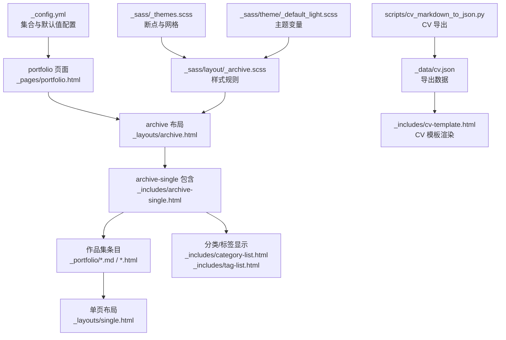
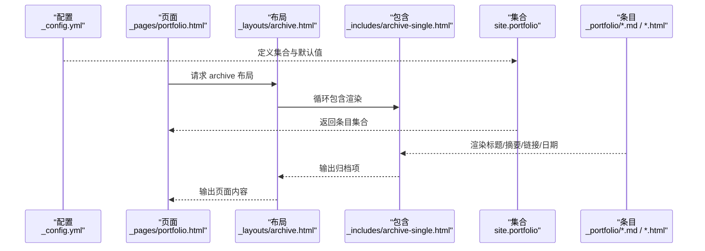
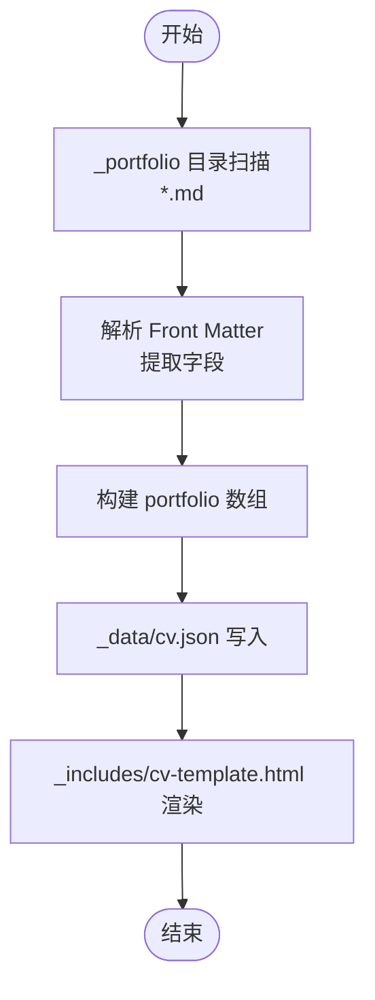
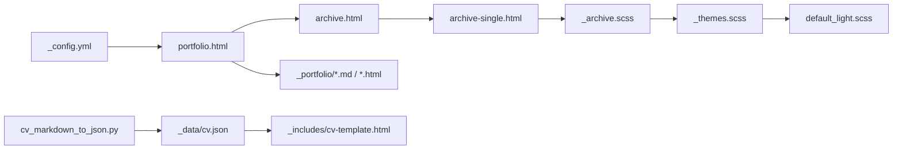

# 作品集管理

<cite>
**本文档引用的文件**
- [_config.yml](file://_config.yml)
- [portfolio.html](file://_pages/portfolio.html)
- [portfolio-1.md](file://_portfolio/portfolio-1.md)
- [portfolio-2.html](file://_portfolio/portfolio-2.html)
- [archive.html](file://_layouts/archive.html)
- [single.html](file://_layouts/single.html)
- [archive-single.html](file://_includes/archive-single.html)
- [category-list.html](file://_includes/category-list.html)
- [tag-list.html](file://_includes/tag-list.html)
- [page__taxonomy.html](file://_includes/page__taxonomy.html)
- [base_path](file://_includes/base_path)
- [_archive.scss](file://_sass/layout/_archive.scss)
- [_themes.scss](file://_sass/_themes.scss)
- [default_light.scss](file://_sass/theme/_default_light.scss)
- [cv-markdown-to-json.py](file://scripts/cv_markdown_to_json.py)
- [cv.json](file://_data/cv.json)
- [cv-template.html](file://_includes/cv-template.html)
- [index.md（Hexo 作品集）](file://hexo-site/source/portfolio/index.md)
</cite>

## 目录
1. [简介](#简介)
2. [项目结构](#项目结构)
3. [核心组件](#核心组件)
4. [架构总览](#架构总览)
5. [详细组件分析](#详细组件分析)
6. [依赖关系分析](#依赖关系分析)
7. [性能考量](#性能考量)
8. [故障排查指南](#故障排查指南)
9. [结论](#结论)
10. [附录](#附录)

## 简介
本文件面向使用 Jekyll 模板构建的个人网站，系统性讲解“作品集管理”的创建与维护方法，涵盖以下方面：
- 作品集条目的创建与 Front Matter 配置
- 技术栈与内容组织方式（Markdown/HTML）
- 图片与视频嵌入实践
- 页面布局与响应式设计
- 分类、筛选与展示样式的自定义
- 与 CV 导出脚本及模板的集成

## 项目结构
该站点采用 Jekyll Collection（作品集为 portfolio 集合）进行组织，核心目录与文件如下：
- 配置：[_config.yml](file://_config.yml)
- 页面：[_pages/portfolio.html](file://_pages/portfolio.html)
- 作品集集合：[_portfolio/](file://_portfolio/)
- 布局与包含：[_layouts/](file://_layouts/)、[_includes/](file://_includes/)
- 样式：[_sass/](file://_sass/)
- 脚本与数据：[scripts/](file://scripts/)、[_data/](file://_data/)
- Hexo 对照示例：[hexo-site/source/portfolio/index.md](file://hexo-site/source/portfolio/index.md)

图表来源
- [_config.yml:230-293](file://_config.yml#L230-L293)
- [portfolio.html:1-15](file://_pages/portfolio.html#L1-L15)
- [archive.html:1-25](file://_layouts/archive.html#L1-L25)
- [archive-single.html:1-85](file://_includes/archive-single.html#L1-L85)
- [portfolio-1.md:1-8](file://_portfolio/portfolio-1.md#L1-L8)
- [portfolio-2.html:1-8](file://_portfolio/portfolio-2.html#L1-L8)
- [_archive.scss:1-246](file://_sass/layout/_archive.scss#L1-L246)
- [_themes.scss:46-75](file://_sass/_themes.scss#L46-L75)
- [default_light.scss:1-49](file://_sass/theme/_default_light.scss#L1-L49)
- [cv-markdown-to-json.py:339-365](file://scripts/cv_markdown-to-json.py#L339-L365)
- [cv.json:143-151](file://_data/cv.json#L143-L151)
- [cv-template.html:228-251](file://_includes/cv-template.html#L228-L251)

章节来源
- [_config.yml:223-293](file://_config.yml#L223-L293)
- [portfolio.html:1-15](file://_pages/portfolio.html#L1-L15)

## 核心组件
- 集合与默认值
  - 在配置中启用 portfolio 集合，并为其设置默认布局、分享、评论等行为。
- 作品集页面
  - 使用 archive 布局遍历 site.portfolio 并以 archive-single 包含渲染。
- 条目模板
  - 作品集条目通过 Front Matter 提供标题、摘要、集合等元信息；内容支持 Markdown 或 HTML。
- 分类与标签
  - 通过 page__taxonomy 引入分类/标签列表，结合 category-list/tag-list 实现链接化展示。
- 样式与主题
  - SCSS 提供响应式网格、悬停效果、断点与主题色变量，确保在桌面与移动端一致体验。

章节来源
- [_config.yml:230-293](file://_config.yml#L230-L293)
- [portfolio.html:1-15](file://_pages/portfolio.html#L1-L15)
- [archive-single.html:1-85](file://_includes/archive-single.html#L1-L85)
- [page__taxonomy.html:1-9](file://_includes/page__taxonomy.html#L1-L9)
- [category-list.html:1-30](file://_includes/category-list.html#L1-L30)
- [tag-list.html:1-28](file://_includes/tag-list.html#L1-L28)

## 架构总览
下图展示了从配置到页面渲染的关键流程：Jekyll 读取配置与集合，生成 portfolio 页面，再逐条渲染作品集条目。

图表来源
- [_config.yml:230-293](file://_config.yml#L230-L293)
- [portfolio.html:1-15](file://_pages/portfolio.html#L1-L15)
- [archive.html:1-25](file://_layouts/archive.html#L1-L25)
- [archive-single.html:1-85](file://_includes/archive-single.html#L1-L85)
- [portfolio-1.md:1-8](file://_portfolio/portfolio-1.md#L1-L8)
- [portfolio-2.html:1-8](file://_portfolio/portfolio-2.html#L1-L8)

## 详细组件分析

### 作品集条目 Front Matter 配置
- 必填字段
  - title：条目标题
  - excerpt：摘要或简介，可内嵌图片
  - collection：必须为 portfolio
- 可选字段（用于页面渲染）
  - date：发布/完成日期
  - venue：发表/机构信息
  - link：外部链接按钮
  - tags/categories：用于分类/标签展示
- 内容格式
  - 支持 Markdown 或 HTML；可在 excerpt 中直接嵌入图片或简单富文本

章节来源
- [portfolio-1.md:1-8](file://_portfolio/portfolio-1.md#L1-L8)
- [portfolio-2.html:1-8](file://_portfolio/portfolio-2.html#L1-L8)
- [archive-single.html:49-53](file://_includes/archive-single.html#L49-L53)
- [page__taxonomy.html:1-9](file://_includes/page__taxonomy.html#L1-L9)

### 作品集页面布局与渲染
- 页面层
  - portfolio.html 使用 archive 布局，遍历 site.portfolio 并逐条包含 archive-single.html
- 布局层
  - archive.html 负责面包屑、侧边栏与归档容器输出
- 包含层
  - archive-single.html 处理标题、链接、日期、摘要、下载链接等
- 单页布局
  - single.html 适用于需要更丰富展示的条目详情页（由默认布局控制）

章节来源
- [portfolio.html:1-15](file://_pages/portfolio.html#L1-L15)
- [archive.html:1-25](file://_layouts/archive.html#L1-L25)
- [archive-single.html:1-85](file://_includes/archive-single.html#L1-L85)
- [single.html:1-110](file://_layouts/single.html#L1-L110)

### 图片与视频嵌入
- 图片嵌入
  - 在条目内容或 excerpt 中插入 img 标签即可
  - archive-single.html 支持根据 teaser 设置缩略图（当 grid 视图时）
- 视频嵌入
  - 可在内容中插入视频标签；archive-single.html 已内置对内容的渲染处理
- 资源路径
  - 使用 base_path 保证资源在不同部署环境下的正确解析

章节来源
- [portfolio-1.md](file://_portfolio/portfolio-1.md#L3)
- [portfolio-2.html](file://_portfolio/portfolio-2.html#L3)
- [archive-single.html:17-26](file://_includes/archive-single.html#L17-L26)
- [base_path](file://_includes/base_path)

### 分类、筛选与展示样式
- 分类/标签
  - 通过 page__taxonomy 引入分类/标签列表，自动链接至归档页
- 展示样式
  - 列表视图与网格视图由 archive-single.html 与 SCSS 控制
  - 响应式断点由 _themes.scss 定义，适配小屏与大屏
- 自定义建议
  - 可在条目 Front Matter 中添加 categories/tags
  - 通过修改 _sass/layout/_archive.scss 调整网格列数、间距与悬停效果

章节来源
- [page__taxonomy.html:1-9](file://_includes/page__taxonomy.html#L1-L9)
- [category-list.html:1-30](file://_includes/category-list.html#L1-L30)
- [tag-list.html:1-28](file://_includes/tag-list.html#L1-L28)
- [_archive.scss:114-152](file://_sass/layout/_archive.scss#L114-L152)
- [_themes.scss:46-75](file://_sass/_themes.scss#L46-L75)

### 与 CV 导出的集成
- 数据来源
  - scripts/cv_markdown_to_json.py 解析 _portfolio 下的 Markdown 条目，提取 Front Matter 并写入 _data/cv.json
- 模板渲染
  - _includes/cv-template.html 读取 cv.json 中的 portfolio 数组并渲染为 CV 页面段落
- 注意事项
  - 仅解析 .md 文件；若需 HTML 条目也纳入，请扩展脚本逻辑

图表来源
- [cv-markdown-to-json.py:339-365](file://scripts/cv_markdown-to-json.py#L339-L365)
- [cv.json:143-151](file://_data/cv.json#L143-L151)
- [cv-template.html:228-251](file://_includes/cv-template.html#L228-L251)

章节来源
- [cv-markdown-to-json.py:339-365](file://scripts/cv_markdown-to-json.py#L339-L365)
- [cv.json:143-151](file://_data/cv.json#L143-L151)
- [cv-template.html:228-251](file://_includes/cv-template.html#L228-L251)

### 响应式设计与用户体验优化
- 断点与网格
  - 使用 Susy 网格系统与断点变量，网格列数随屏幕宽度变化
- 视觉反馈
  - 悬停时缩略图与标题带阴影与下划线，提升交互感知
- 可访问性
  - 使用语义化结构与适当的标题层级，确保屏幕阅读器友好

章节来源
- [_themes.scss:46-75](file://_sass/_themes.scss#L46-L75)
- [_archive.scss:114-152](file://_sass/layout/_archive.scss#L114-L152)
- [archive.html:1-25](file://_layouts/archive.html#L1-L25)

## 依赖关系分析
- 配置依赖
  - _config.yml 决定集合、默认布局与输出行为
- 页面依赖
  - portfolio.html 依赖 archive 布局与 archive-single 包含
- 样式依赖
  - archive 布局与 archive-single 依赖 SCSS 主题与断点变量
- 数据依赖
  - CV 模板依赖 _data/cv.json 中的 portfolio 字段

图表来源
- [_config.yml:230-293](file://_config.yml#L230-L293)
- [portfolio.html:1-15](file://_pages/portfolio.html#L1-L15)
- [archive.html:1-25](file://_layouts/archive.html#L1-L25)
- [archive-single.html:1-85](file://_includes/archive-single.html#L1-L85)
- [_archive.scss:1-246](file://_sass/layout/_archive.scss#L1-L246)
- [_themes.scss:46-75](file://_sass/_themes.scss#L46-L75)
- [default_light.scss:1-49](file://_sass/theme/_default_light.scss#L1-L49)
- [cv-markdown-to-json.py:339-365](file://scripts/cv_markdown-to-json.py#L339-L365)
- [cv.json:143-151](file://_data/cv.json#L143-L151)
- [cv-template.html:228-251](file://_includes/cv-template.html#L228-L251)

章节来源
- [_config.yml:230-293](file://_config.yml#L230-L293)
- [portfolio.html:1-15](file://_pages/portfolio.html#L1-L15)
- [_archive.scss:1-246](file://_sass/layout/_archive.scss#L1-L246)

## 性能考量
- 资源压缩
  - 配置中开启 HTML 压缩，减少传输体积
- 图片优化
  - 建议使用合适尺寸与格式，避免超大图片影响加载速度
- 样式按需
  - 仅引入必要主题与断点，避免冗余 SCSS

章节来源
- [_config.yml:358-362](file://_config.yml#L358-L362)

## 故障排查指南
- 作品集页面未显示条目
  - 检查条目是否位于 _portfolio 目录且 Front Matter 中 collection 为 portfolio
  - 确认 _config.yml 中已启用 portfolio 集合
- 链接或图片路径异常
  - 使用 base_path 变量确保路径在不同部署环境下正确
- 分类/标签不显示
  - 确保条目包含 categories/tags，且 page__taxonomy 被包含
- CV 导出为空
  - 确认 _portfolio 下存在 .md 文件，脚本仅解析 Markdown

章节来源
- [portfolio.html:1-15](file://_pages/portfolio.html#L1-L15)
- [portfolio-1.md:1-8](file://_portfolio/portfolio-1.md#L1-L8)
- [portfolio-2.html:1-8](file://_portfolio/portfolio-2.html#L1-L8)
- [_config.yml:230-293](file://_config.yml#L230-L293)
- [base_path](file://_includes/base_path)
- [page__taxonomy.html:1-9](file://_includes/page__taxonomy.html#L1-L9)
- [cv-markdown-to-json.py:339-365](file://scripts/cv_markdown-to-json.py#L339-L365)

## 结论
本项目通过 Jekyll Collection 将作品集条目与页面解耦，配合布局与包含模板实现统一渲染；SCSS 提供响应式网格与视觉反馈；CV 导出脚本将作品集数据整合进简历页面。遵循本文档的 Front Matter 规范与样式自定义建议，可快速扩展与维护高质量的作品集展示。

## 附录
- 作品集页面示例（Hexo 对照）
  - 参考 [index.md（Hexo 作品集）:1-51](file://hexo-site/source/portfolio/index.md#L1-L51)，了解另一种静态页面的组织方式与样式实现思路

章节来源
- [index.md（Hexo 作品集）:1-51](file://hexo-site/source/portfolio/index.md#L1-L51)