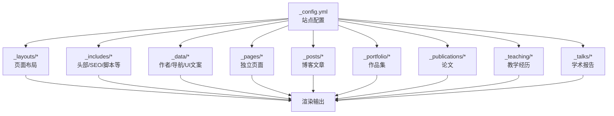
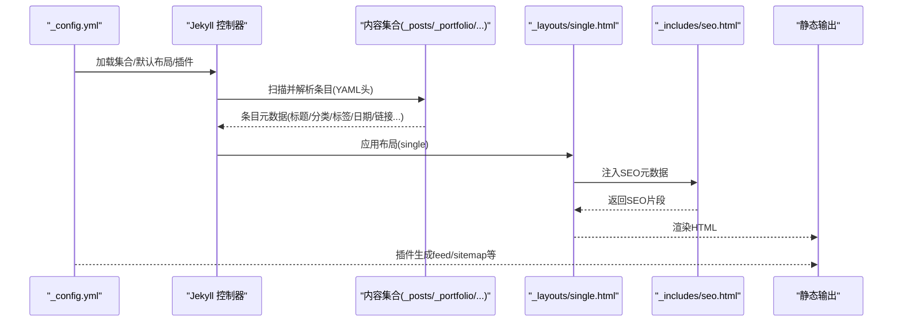
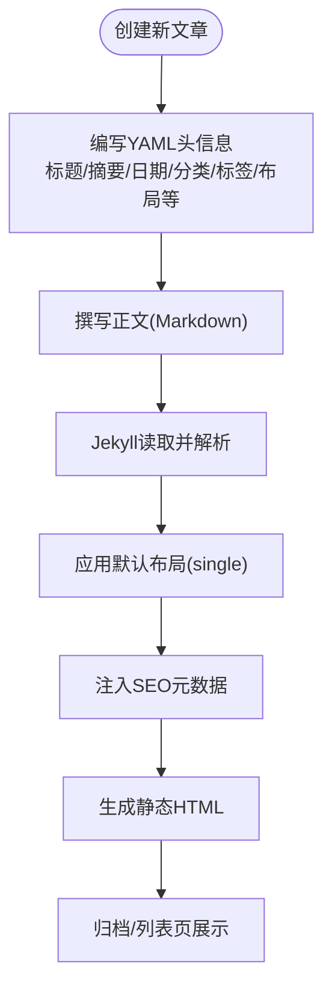
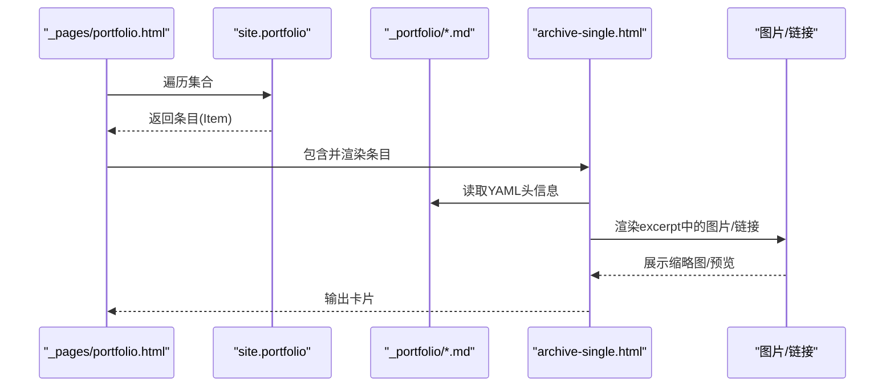
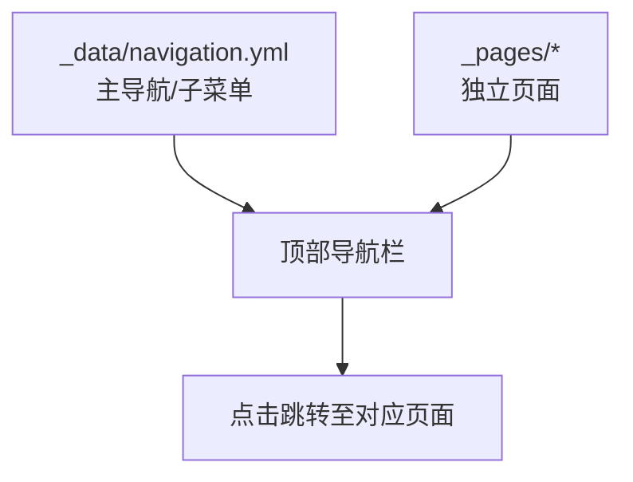
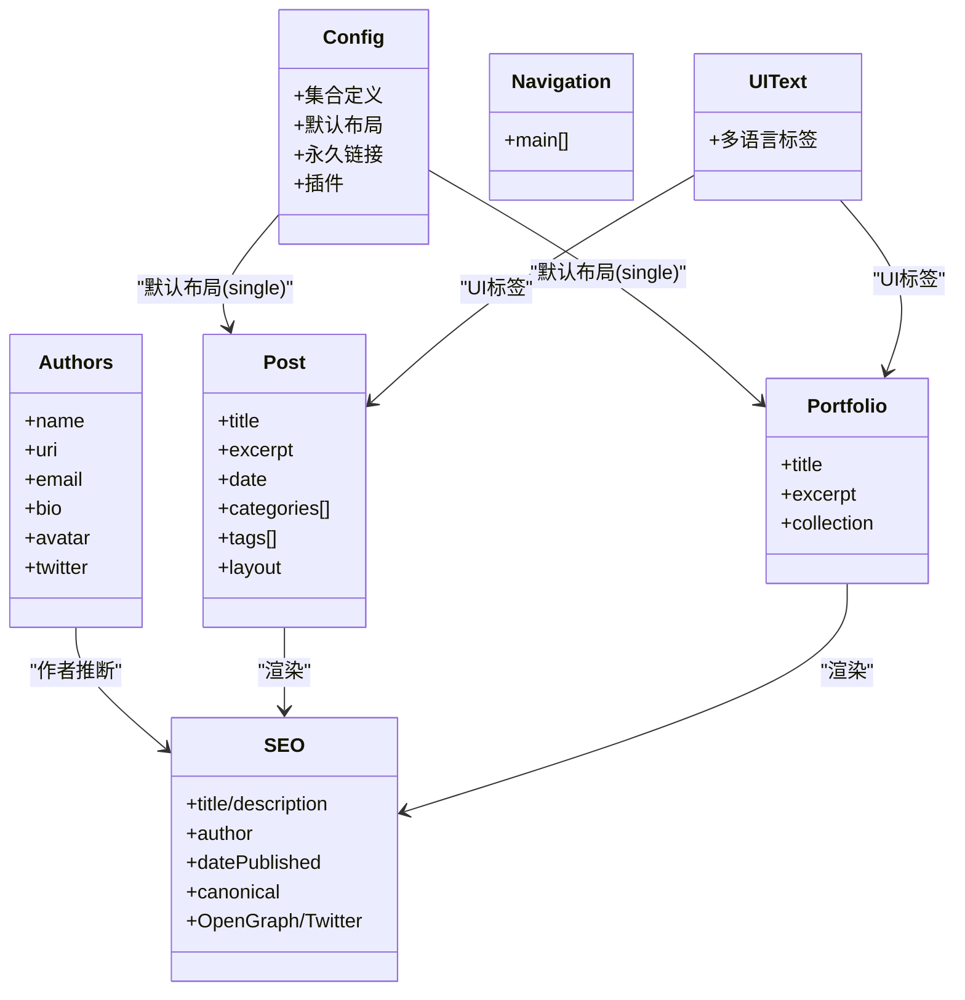
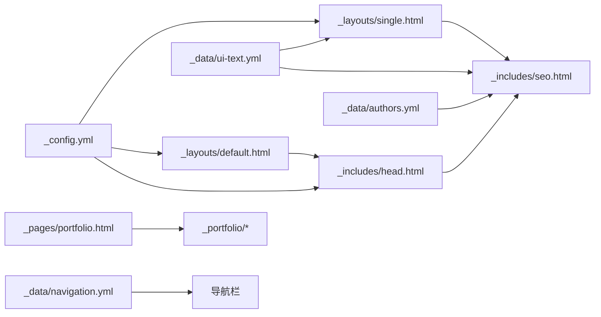

# 内容管理系统

<cite>
**本文引用的文件**
- [_config.yml](file://_config.yml)
- [README.md](file://README.md)
- [_data/authors.yml](file://_data/authors.yml)
- [_data/navigation.yml](file://_data/navigation.yml)
- [_data/ui-text.yml](file://_data/ui-text.yml)
- [_layouts/default.html](file://_layouts/default.html)
- [_layouts/single.html](file://_layouts/single.html)
- [_includes/head.html](file://_includes/head.html)
- [_includes/seo.html](file://_includes/seo.html)
- [_pages/portfolio.html](file://_pages/portfolio.html)
- [_posts/2025-03-11-my-first-blog.md](file://_posts/2025-03-11-my-first-blog.md)
- [_portfolio/portfolio-1.md](file://_portfolio/portfolio-1.md)
- [_publications/2024-02-17-paper-title-number-4.md](file://_publications/2024-02-17-paper-title-number-4.md)
- [_teaching/2014-spring-teaching-1.md](file://_teaching/2014-spring-teaching-1.md)
- [_talks/2012-03-01-talk-1.md](file://_talks/2012-03-01-talk-1.md)
</cite>

## 目录
1. [简介](#简介)
2. [项目结构](#项目结构)
3. [核心组件](#核心组件)
4. [架构总览](#架构总览)
5. [详细组件分析](#详细组件分析)
6. [依赖关系分析](#依赖关系分析)
7. [性能考虑](#性能考虑)
8. [故障排查指南](#故障排查指南)
9. [结论](#结论)
10. [附录](#附录)

## 简介
本内容管理系统基于 Jekyll 构建，面向学术与个人作品展示场景，提供以下能力：
- 博客文章管理：支持文章创作、分类、标签、发布时间、阅读时长、评论、社交分享、相关推荐等。
- 作品集展示：支持项目条目展示、图片处理、外链管理。
- 页面管理：支持独立页面（如 CV、公开资料、归档页等）的创建与管理。
- SEO 优化：内置 SEO 元数据生成、Open Graph、Twitter Card、结构化数据等。

系统通过配置文件集中控制站点主题、导航、集合类型、默认布局与元数据，结合 Liquid 模板实现内容渲染与展示。

## 项目结构
仓库采用 Jekyll 标准目录组织方式，按“内容集合 + 布局与包含 + 数据 + 静态资源”分层：
- 配置与说明：根目录下的配置文件与使用说明
- 内容集合：
  - 博客文章：_posts
  - 作品集：_portfolio
  - 论文：_publications
  - 教学经历：_teaching
  - 学术报告：_talks
- 页面：_pages（独立页面）
- 布局与包含：_layouts、_includes（主题框架、SEO、导航、侧边栏等）
- 数据：_data（作者、导航、UI 文案）
- 资源：assets（CSS/JS/字体/图片）

图表来源
- [_config.yml](file://_config.yml)
- [_layouts/default.html](file://_layouts/default.html)
- [_layouts/single.html](file://_layouts/single.html)
- [_includes/head.html](file://_includes/head.html)
- [_includes/seo.html](file://_includes/seo.html)
- [_pages/portfolio.html](file://_pages/portfolio.html)
- [_posts/2025-03-11-my-first-blog.md](file://_posts/2025-03-11-my-first-blog.md)
- [_portfolio/portfolio-1.md](file://_portfolio/portfolio-1.md)
- [_publications/2024-02-17-paper-title-number-4.md](file://_publications/2024-02-17-paper-title-number-4.md)
- [_teaching/2014-spring-teaching-1.md](file://_teaching/2014-spring-teaching-1.md)
- [_talks/2012-03-01-talk-1.md](file://_talks/2012-03-01-talk-1.md)

章节来源
- [_config.yml](file://_config.yml)
- [_data/navigation.yml](file://_data/navigation.yml)
- [_layouts/default.html](file://_layouts/default.html)
- [_layouts/single.html](file://_layouts/single.html)
- [_includes/head.html](file://_includes/head.html)
- [_includes/seo.html](file://_includes/seo.html)
- [_pages/portfolio.html](file://_pages/portfolio.html)

## 核心组件
- 站点配置与集合
  - 通过配置文件定义集合类型、默认布局、永久链接、分页、插件等，统一控制各集合的渲染行为。
  - 默认布局为 single，适用于文章、作品集、论文、教学、报告等集合的单页展示。
- 布局与包含
  - default.html 提供基础 HTML 结构与包含头尾部、脚本等。
  - single.html 负责文章类内容的标题、元信息、正文、社交分享、评论、相关推荐等。
  - head.html 引入 SEO 片段与样式。
  - seo.html 动态生成 SEO 元数据（标题、描述、作者、时间、结构化数据、验证标签等）。
- 数据与导航
  - authors.yml 定义作者信息，用于 SEO 作者推断与展示。
  - navigation.yml 定义主导航与子菜单，支撑博客分类入口与多级导航。
  - ui-text.yml 提供多语言 UI 文案（分页、标签、分类、日期、评论等）。
- 页面与集合
  - portfolio.html 使用 archive 布局聚合作品集条目。
  - 各集合条目通过 YAML 头信息声明集合、分类、标签、日期、链接等元数据。

章节来源
- [_config.yml](file://_config.yml)
- [_layouts/default.html](file://_layouts/default.html)
- [_layouts/single.html](file://_layouts/single.html)
- [_includes/head.html](file://_includes/head.html)
- [_includes/seo.html](file://_includes/seo.html)
- [_data/authors.yml](file://_data/authors.yml)
- [_data/navigation.yml](file://_data/navigation.yml)
- [_data/ui-text.yml](file://_data/ui-text.yml)
- [_pages/portfolio.html](file://_pages/portfolio.html)

## 架构总览
Jekyll 在构建阶段读取配置、内容与模板，生成静态 HTML。系统的关键流程如下：
- 配置解析：读取 _config.yml 中集合、默认值、插件、SEO 设置等。
- 内容解析：按集合读取 _posts、_portfolio、_publications、_teaching、_talks 下的条目，解析 YAML 头信息。
- 模板渲染：根据条目所属集合应用默认布局（single），组合 _includes（head、seo、scripts 等）。
- 输出生成：写入静态页面与归档页，配合插件生成 feed、sitemap、重定向等。

图表来源
- [_config.yml](file://_config.yml)
- [_layouts/single.html](file://_layouts/single.html)
- [_includes/seo.html](file://_includes/seo.html)

## 详细组件分析

### 博客文章管理
- 内容组织
  - 文件命名：YYYY-MM-DD-title.md，日期需与头信息 date 一致。
  - YAML 头信息字段：title、excerpt、date、layout、author_profile、read_time、comments、share、related、categories、tags 等。
- 显示逻辑
  - 默认布局 single，渲染标题、日期、阅读时长、分类/标签、正文、社交分享、评论区、相关推荐。
  - SEO 片段动态生成标题、描述、作者、发布时间、canonical、Open Graph、Twitter Card 等。
- 发布与归档
  - 永久链接由配置中的 permalink 控制；可启用分页插件进行列表分页。
- 示例参考
  - [博客条目示例](file://_posts/2025-03-11-my-first-blog.md)

图表来源
- [_config.yml](file://_config.yml)
- [_layouts/single.html](file://_layouts/single.html)
- [_includes/seo.html](file://_includes/seo.html)
- [_posts/2025-03-11-my-first-blog.md](file://_posts/2025-03-11-my-first-blog.md)

章节来源
- [_posts/2025-03-11-my-first-blog.md](file://_posts/2025-03-11-my-first-blog.md)
- [_layouts/single.html](file://_layouts/single.html)
- [_includes/seo.html](file://_includes/seo.html)
- [_config.yml](file://_config.yml)

### 作品集展示系统
- 内容组织
  - 放置于 _portfolio 目录，文件名建议遵循 YYYY-MM-DD-title.md 或语义化命名。
  - YAML 头信息包含 title、excerpt、collection: portfolio 等。
- 显示逻辑
  - portfolio 页面使用 archive 布局，遍历 site.portfolio 集合并以 archive-single 模板渲染。
  - 支持在 excerpt 中嵌入图片，实现缩略图效果。
- 图片与链接
  - 可在正文或 excerpt 中插入图片；外链通过 page.link 字段或正文链接实现。
- 示例参考
  - [作品集条目示例](file://_portfolio/portfolio-1.md)
  - [作品集页面示例](file://_pages/portfolio.html)

图表来源
- [_pages/portfolio.html](file://_pages/portfolio.html)
- [_portfolio/portfolio-1.md](file://_portfolio/portfolio-1.md)

章节来源
- [_pages/portfolio.html](file://_pages/portfolio.html)
- [_portfolio/portfolio-1.md](file://_portfolio/portfolio-1.md)
- [_config.yml](file://_config.yml)

### 页面管理系统
- 独立页面
  - 放置于 _pages 目录，如 about.md、cv.md、sitemap.md 等。
  - YAML 头信息指定 layout: single、title、permalink 等。
- 导航集成
  - 导航配置在 _data/navigation.yml，支持多级菜单（如博客分类入口）。
- 示例参考
  - [作品集页面](file://_pages/portfolio.html)
  - [导航配置](file://_data/navigation.yml)

图表来源
- [_data/navigation.yml](file://_data/navigation.yml)
- [_pages/portfolio.html](file://_pages/portfolio.html)

章节来源
- [_data/navigation.yml](file://_data/navigation.yml)
- [_pages/portfolio.html](file://_pages/portfolio.html)

### 数据模型与显示逻辑
- 数据模型
  - 作者：_data/authors.yml，用于 SEO 作者推断与展示。
  - 导航：_data/navigation.yml，定义导航顺序与子菜单。
  - UI 文案：_data/ui-text.yml，提供多语言标签（分页、标签、分类、日期、评论等）。
- 显示逻辑
  - single.html 统一渲染文章类内容，包含标题、日期、分类/标签、正文、社交分享、评论、相关推荐。
  - head.html 引入 SEO 片段，seo.html 动态生成标题、描述、作者、时间戳、canonical、Open Graph、Twitter Card、结构化数据等。
- 示例参考
  - [UI 文案](file://_data/ui-text.yml)
  - [作者数据](file://_data/authors.yml)
  - [SEO 片段](file://_includes/seo.html)
  - [单页布局](file://_layouts/single.html)

图表来源
- [_config.yml](file://_config.yml)
- [_data/authors.yml](file://_data/authors.yml)
- [_data/navigation.yml](file://_data/navigation.yml)
- [_data/ui-text.yml](file://_data/ui-text.yml)
- [_layouts/single.html](file://_layouts/single.html)
- [_includes/seo.html](file://_includes/seo.html)
- [_posts/2025-03-11-my-first-blog.md](file://_posts/2025-03-11-my-first-blog.md)
- [_portfolio/portfolio-1.md](file://_portfolio/portfolio-1.md)

章节来源
- [_data/authors.yml](file://_data/authors.yml)
- [_data/navigation.yml](file://_data/navigation.yml)
- [_data/ui-text.yml](file://_data/ui-text.yml)
- [_layouts/single.html](file://_layouts/single.html)
- [_includes/seo.html](file://_includes/seo.html)
- [_posts/2025-03-11-my-first-blog.md](file://_posts/2025-03-11-my-first-blog.md)
- [_portfolio/portfolio-1.md](file://_portfolio/portfolio-1.md)

## 依赖关系分析
- 配置驱动
  - _config.yml 是系统中枢，决定集合类型、默认布局、永久链接、分页、插件与 SEO 设置。
- 模板耦合
  - single.html 依赖 _includes/seo.html 生成 SEO 元数据；依赖 _includes/head.html 引入 head 片段。
  - default.html 作为基础模板，被 single.html 继承，统一包含头部、脚本与页脚。
- 数据耦合
  - authors.yml 与 ui-text.yml 被 single.html 与 seo.html 使用，影响作者推断与 UI 文案。
- 集合与页面
  - portfolio.html 依赖 site.portfolio 集合；导航依赖 _data/navigation.yml。

图表来源
- [_config.yml](file://_config.yml)
- [_layouts/default.html](file://_layouts/default.html)
- [_layouts/single.html](file://_layouts/single.html)
- [_includes/head.html](file://_includes/head.html)
- [_includes/seo.html](file://_includes/seo.html)
- [_data/authors.yml](file://_data/authors.yml)
- [_data/ui-text.yml](file://_data/ui-text.yml)
- [_pages/portfolio.html](file://_pages/portfolio.html)
- [_portfolio/portfolio-1.md](file://_portfolio/portfolio-1.md)
- [_data/navigation.yml](file://_data/navigation.yml)

章节来源
- [_config.yml](file://_config.yml)
- [_layouts/default.html](file://_layouts/default.html)
- [_layouts/single.html](file://_layouts/single.html)
- [_includes/head.html](file://_includes/head.html)
- [_includes/seo.html](file://_includes/seo.html)
- [_data/authors.yml](file://_data/authors.yml)
- [_data/ui-text.yml](file://_data/ui-text.yml)
- [_pages/portfolio.html](file://_pages/portfolio.html)
- [_portfolio/portfolio-1.md](file://_portfolio/portfolio-1.md)
- [_data/navigation.yml](file://_data/navigation.yml)

## 性能考虑
- HTML 压缩
  - 配置中启用压缩插件，减少输出体积，提升加载速度。
- 资源优化
  - 使用压缩样式与脚本；避免在 excerpt 中放置过大的图片；必要时在服务器端或 CDN 进行图片优化。
- 渲染策略
  - 控制每页文章数量与分页；合理使用 related_posts，避免过多关联计算。
- 缓存与部署
  - GitHub Pages 等托管平台通常具备缓存机制；静态输出无需服务端计算，天然具备高性能。

章节来源
- [_config.yml](file://_config.yml)

## 故障排查指南
- 本地运行
  - 按照说明安装 Ruby、Bundler、Node.js，执行 bundle install；若权限不足，使用本地路径安装；通过 jekyll serve 启动本地预览。
- Docker/DevContainer
  - 使用提供的 Dockerfile 或 VS Code Dev Container 快速启动开发环境。
- 常见问题
  - 文件权限错误：按说明设置本地 Gem 安装路径后重试。
  - 本地无法热更新：修改模板或配置文件需重启 Jekyll；Markdown/HTML 修改应自动刷新。
- 插件与兼容性
  - 若升级或更换主题，注意检查插件白名单与配置兼容性。

章节来源
- [README.md](file://README.md)

## 结论
本内容管理系统以 Jekyll 为核心，通过配置驱动集合与布局，结合 SEO 片段与多语言 UI 文案，实现了博客文章、作品集、论文、教学与报告的统一管理与展示。其模块化设计便于扩展与维护，适合学术与个人作品展示场景。建议在实际使用中严格遵循文件命名规范、YAML 头信息约定与 SEO 最佳实践，以获得更好的可维护性与搜索可见性。

## 附录
- 内容创作指南
  - 博客文章：使用 YYYY-MM-DD-title.md 命名，完善标题、摘要、日期、分类、标签与布局。
  - 作品集：在 YAML 头信息中声明 collection: portfolio，并在 excerpt 中添加缩略图。
  - 页面：在 _pages 下创建独立页面，设置 title、layout、permalink 等。
- SEO 优化建议
  - 填写清晰的标题与描述；为文章设置发布/修改时间；使用 canonical 链接避免重复；配置 og:image 与 twitter:card；启用结构化数据与站点验证。