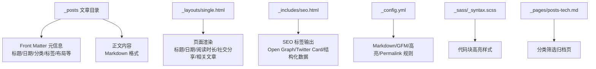
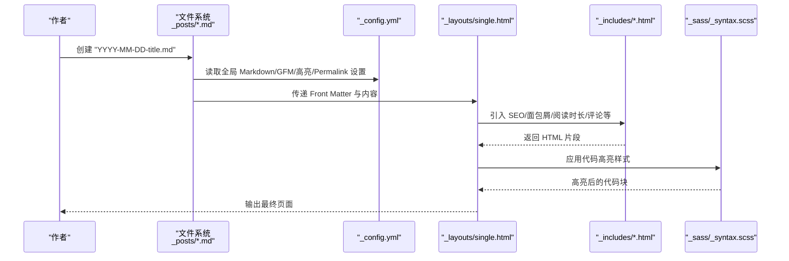
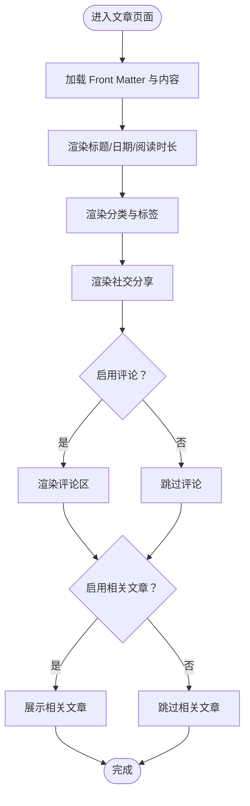
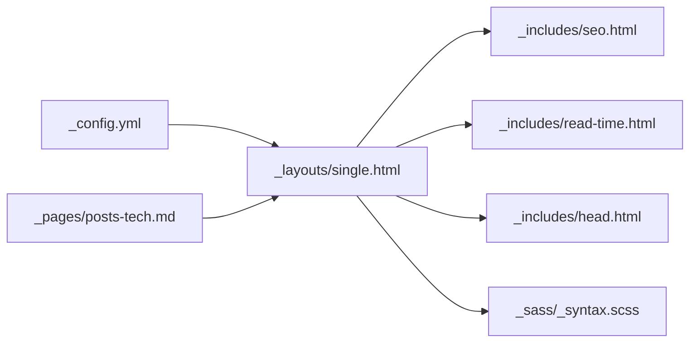

# 博客文章管理

<cite>
**本文引用的文件**
- [_config.yml](file://_config.yml)
- [README.md](file://README.md)
- [_posts/2025-03-11-my-first-blog.md](file://_posts/2025-03-11-my-first-blog.md)
- [_posts/2025-03-11-python-basics.md](file://_posts/2025-03-11-python-basics.md)
- [_layouts/single.html](file://_layouts/single.html)
- [_includes/head.html](file://_includes/head.html)
- [_includes/seo.html](file://_includes/seo.html)
- [_includes/read-time.html](file://_includes/read-time.html)
- [_sass/_syntax.scss](file://_sass/_syntax.scss)
- [_pages/posts-tech.md](file://_pages/posts-tech.md)
- [hexo-site/_config.yml](file://hexo-site/_config.yml)
- [hexo-site/scaffolds/post.md](file://hexo-site/scaffolds/post.md)
- [_drafts/post-draft.md](file://_drafts/post-draft.md)
</cite>

## 目录
1. [简介](#简介)
2. [项目结构](#项目结构)
3. [核心组件](#核心组件)
4. [架构总览](#架构总览)
5. [详细组件分析](#详细组件分析)
6. [依赖关系分析](#依赖关系分析)
7. [性能考虑](#性能考虑)
8. [故障排查指南](#故障排查指南)
9. [结论](#结论)
10. [附录](#附录)

## 简介
本文件面向博客文章的创建、编辑与发布全流程，结合当前仓库中的 Jekyll 配置与模板实现，系统说明 Front Matter 参数、文章命名规范、内容组织与显示逻辑，并提供 Markdown 使用指南、图片插入方法、代码高亮设置、SEO 优化策略、分类与标签管理、以及基于现有脚本的批量处理与自动化思路。读者无需深入技术背景即可按步骤完成高质量文章发布。

## 项目结构
本博客采用 Jekyll 静态站点生成器，核心目录与职责如下：
- _posts：存放正式发布的文章，采用“YYYY-MM-DD-title.md”的命名规范，Front Matter 定义元信息与布局行为
- _drafts：草稿区，未公开的文章可先放于此，便于本地预览与迭代
- _layouts：页面布局模板，single.html 为文章详情页默认布局
- _includes：可复用片段，如 SEO、面包屑、阅读时长、评论等
- _sass：样式与代码高亮主题
- _pages：独立页面（如分类归档页）
- _config.yml：全局站点配置，控制 Markdown 处理、高亮、集合、默认值、链接结构等
- hexo-site：另一个同构但不同框架的站点配置与脚手架，可作为批量生成参考

图表来源
- [_posts/2025-03-11-my-first-blog.md:1-41](file://_posts/2025-03-11-my-first-blog.md#L1-L41)
- [_layouts/single.html:1-110](file://_layouts/single.html#L1-L110)
- [_includes/seo.html:1-147](file://_includes/seo.html#L1-L147)
- [_config.yml:203-220](file://_config.yml#L203-L220)
- [_sass/_syntax.scss:1-125](file://_sass/_syntax.scss#L1-L125)
- [_pages/posts-tech.md:1-14](file://_pages/posts-tech.md#L1-L14)

章节来源
- [_config.yml:203-220](file://_config.yml#L203-L220)
- [_posts/2025-03-11-my-first-blog.md:1-41](file://_posts/2025-03-11-my-first-blog.md#L1-L41)
- [_layouts/single.html:1-110](file://_layouts/single.html#L1-L110)
- [_includes/seo.html:1-147](file://_includes/seo.html#L1-L147)
- [_sass/_syntax.scss:1-125](file://_sass/_syntax.scss#L1-L125)
- [_pages/posts-tech.md:1-14](file://_pages/posts-tech.md#L1-L14)

## 核心组件
- Front Matter 元信息：控制文章布局、作者资料、评论、社交分享、相关推荐、分类与标签等
- Permalink 与日期：通过 _config.yml 控制文章 URL 结构；文章文件名需与 date 保持一致或更精确
- 渲染与显示：single.html 负责标题、日期、阅读时长、分类标签、社交分享、评论与相关文章展示
- SEO：seo.html 动态生成 Open Graph、Twitter Card、结构化数据与站点验证 meta
- 代码高亮：kramdown + Rouge，样式由 _sass/_syntax.scss 提供
- 分类与标签：通过 categories/tags 在 Front Matter 中声明，配合归档页进行筛选

章节来源
- [_config.yml:302](file://_config.yml#L302)
- [_posts/2025-03-11-my-first-blog.md:11-16](file://_posts/2025-03-11-my-first-blog.md#L11-L16)
- [_layouts/single.html:20-109](file://_layouts/single.html#L20-L109)
- [_includes/seo.html:1-147](file://_includes/seo.html#L1-L147)
- [_sass/_syntax.scss:1-125](file://_sass/_syntax.scss#L1-L125)

## 架构总览
下图展示了从文章创建到页面渲染的关键路径，包括 Front Matter 解析、布局应用、SEO 注入与代码高亮处理。

图表来源
- [_config.yml:203-220](file://_config.yml#L203-L220)
- [_layouts/single.html:1-110](file://_layouts/single.html#L1-L110)
- [_includes/seo.html:1-147](file://_includes/seo.html#L1-L147)
- [_sass/_syntax.scss:1-125](file://_sass/_syntax.scss#L1-L125)

## 详细组件分析

### Front Matter 参数与命名规范
- 必填与常见参数
  - title：文章标题
  - date：发布时间，需与文件名日期一致或更精确（例如带时区的时间戳）
  - layout：页面布局，默认 single
  - categories：分类数组（用于归档与筛选）
  - tags：标签数组（用于标签云与关联）
  - excerpt：列表页摘要（可选）
  - author_profile/read_time/comments/share/related：控制作者资料、阅读时长、评论、社交分享、相关文章的显示
- 命名规范
  - 文件名必须遵循“YYYY-MM-DD-title.md”，确保 Jekyll 正确解析日期并排序
  - 若需要更精确的时间，可在 date 中指定时分秒与时区
- 示例参考
  - [文章示例一:1-41](file://_posts/2025-03-11-my-first-blog.md#L1-L41)
  - [文章示例二:1-41](file://_posts/2025-03-11-python-basics.md#L1-L41)

章节来源
- [_posts/2025-03-11-my-first-blog.md:1-16](file://_posts/2025-03-11-my-first-blog.md#L1-L16)
- [_posts/2025-03-11-python-basics.md:1-16](file://_posts/2025-03-11-python-basics.md#L1-L16)

### 内容组织结构与显示逻辑
- 页面布局
  - single.html 负责标题、日期、阅读时长、分类标签、社交分享、评论与相关文章的拼装
  - 通过 include 片段复用公共模块，提升一致性与可维护性
- 显示逻辑要点
  - 根据 page.read_time 计算阅读时长，依据 words_per_minute 配置动态显示
  - 根据 page.comments 与站点 comments.provider 决定是否渲染评论区
  - 相关文章通过 site.related_posts 生成，限制数量以避免冗余
- SEO 注入
  - head.html 引入 seo.html，动态生成 title、description、canonical、Open Graph、Twitter Card 等
  - 支持多语言 UI 文案，通过 site.data.ui-text 获取本地化文本
- 代码高亮
  - kramdown + Rouge，SCSS 中定义了高亮配色与容器样式，确保代码块美观易读

图表来源
- [_layouts/single.html:20-109](file://_layouts/single.html#L20-L109)
- [_includes/read-time.html:1-17](file://_includes/read-time.html#L1-L17)
- [_includes/seo.html:1-147](file://_includes/seo.html#L1-L147)

章节来源
- [_layouts/single.html:20-109](file://_layouts/single.html#L20-L109)
- [_includes/read-time.html:1-17](file://_includes/read-time.html#L1-L17)
- [_includes/seo.html:1-147](file://_includes/seo.html#L1-L147)

### Markdown 语法与媒体插入
- 基础语法
  - 支持 GitHub Flavored Markdown（GFM），标题、列表、表格、删除线、任务清单等
  - 代码块自动高亮，语言标识决定高亮规则
- 图片插入
  - 使用标准 Markdown 语法插入图片，建议将图片放入 images 或相对路径中，确保部署后可访问
  - 可在评论中使用 Markdown 插入图片（参考评论示例）
- 表达式与公式
  - 本仓库未启用 MathJax/KaTeX，若需数学公式，请在主题或插件层面扩展

章节来源
- [_config.yml:211-219](file://_config.yml#L211-L219)
- [_data/comments/welcome-to-jekyll/comment-1470942493518.yml:1](file://_data/comments/welcome-to-jekyll/comment-1470942493518.yml#L1-L6)

### 代码高亮设置
- 处理器与样式
  - Markdown 处理器：kramdown
  - 代码高亮：Rouge
  - 样式：_sass/_syntax.scss 定义了容器外观与颜色方案
- 使用建议
  - 在代码块中明确语言标识，提升高亮准确性
  - 如需调整配色或字体大小，可在 SCSS 中修改对应变量

章节来源
- [_config.yml:203-204](file://_config.yml#L203-L204)
- [_sass/_syntax.scss:1-125](file://_sass/_syntax.scss#L1-L125)

### SEO 优化技巧
- 标题与描述
  - 通过 page.title 与 page.excerpt 自动生成 SEO 标题与描述
- 结构化数据
  - 生成 JSON-LD 的 Person/Organization 结构化数据，增强搜索引擎理解
- 社交卡片
  - 自动注入 Open Graph 与 Twitter Card，支持 og:image 与 twitter:card
- 链接规范化
  - 输出 canonical 链接，避免重复内容
- 站点验证
  - 支持 Google/Bing/Yandex/Alexa 等站点验证 meta

章节来源
- [_includes/seo.html:1-147](file://_includes/seo.html#L1-L147)
- [_includes/head.html:1-17](file://_includes/head.html#L1-L17)

### 分类与标签管理策略
- 声明方式
  - 在 Front Matter 中通过 categories 与 tags 数组声明
- 展示与筛选
  - single.html 展示分类与标签
  - posts-tech.md 展示如何按分类筛选并渲染归档
- 归档页
  - 通过 Liquid 循环遍历 site.posts，使用 contains 进行分类匹配
- 建议
  - 统一分类与标签命名风格，避免同义词导致分散
  - 合理控制标签数量，避免过度稀释

章节来源
- [_posts/2025-03-11-my-first-blog.md:11-16](file://_posts/2025-03-11-my-first-blog.md#L11-L16)
- [_posts/2025-03-11-python-basics.md:11-16](file://_posts/2025-03-11-python-basics.md#L11-L16)
- [_pages/posts-tech.md:9-13](file://_pages/posts-tech.md#L9-L13)

### 批量处理与自动化
- Hexo 脚手架与配置
  - hexo-site/scaffolds/post.md 提供 Hexo 新建文章的 Front Matter 模板
  - hexo-site/_config.yml 提供 Hexo 的 permalink、高亮、分页等配置
- 自动化思路
  - 可参考 markdown_generator 下的脚本，将外部数据（如 TSV）转换为 Markdown 文章
  - 使用脚本统一生成 Front Matter 的日期、标题、分类与标签字段，减少手工录入错误
- 注意事项
  - 本仓库主站为 Jekyll，Hexo 配置仅作参考；如需在 Jekyll 中引入自动化，可直接在 Python/Jupyter 脚本中生成符合 Jekyll 规范的文件

章节来源
- [hexo-site/scaffolds/post.md:1-6](file://hexo-site/scaffolds/post.md#L1-L6)
- [hexo-site/_config.yml:1-110](file://hexo-site/_config.yml#L1-L110)

## 依赖关系分析
- 配置层：_config.yml 决定 Markdown 输入、高亮、Permalink、集合与默认值
- 模板层：_layouts/single.html 依赖 _includes 下的多个片段（SEO、面包屑、阅读时长、评论等）
- 样式层：_sass/_syntax.scss 为代码高亮提供样式
- 页面层：_pages/posts-tech.md 通过 Liquid 逻辑筛选文章并渲染归档

图表来源
- [_config.yml:203-220](file://_config.yml#L203-L220)
- [_layouts/single.html:1-110](file://_layouts/single.html#L1-L110)
- [_includes/seo.html:1-147](file://_includes/seo.html#L1-L147)
- [_includes/read-time.html:1-17](file://_includes/read-time.html#L1-L17)
- [_includes/head.html:1-17](file://_includes/head.html#L1-L17)
- [_sass/_syntax.scss:1-125](file://_sass/_syntax.scss#L1-L125)
- [_pages/posts-tech.md:1-14](file://_pages/posts-tech.md#L1-L14)

章节来源
- [_config.yml:203-220](file://_config.yml#L203-L220)
- [_layouts/single.html:1-110](file://_layouts/single.html#L1-L110)
- [_includes/seo.html:1-147](file://_includes/seo.html#L1-L147)
- [_includes/read-time.html:1-17](file://_includes/read-time.html#L1-L17)
- [_includes/head.html:1-17](file://_includes/head.html#L1-L17)
- [_sass/_syntax.scss:1-125](file://_sass/_syntax.scss#L1-L125)
- [_pages/posts-tech.md:1-14](file://_pages/posts-tech.md#L1-L14)

## 性能考虑
- HTML 压缩：compress_html 插件在生产环境压缩 HTML，减少体积
- 代码高亮：Rouge 生成的 CSS 与内联样式应尽量保持简洁，避免过多复杂容器嵌套
- 图片资源：建议使用合适的尺寸与格式，必要时在构建阶段进行压缩
- 分页与归档：合理设置分页数量，避免一次性渲染过多文章导致首屏延迟

章节来源
- [_config.yml:358-362](file://_config.yml#L358-L362)

## 故障排查指南
- 文章不显示或排序异常
  - 检查文件名是否符合“YYYY-MM-DD-title.md”格式
  - 确认 Front Matter 中 date 与文件名日期一致或更精确
- Permalink 与链接异常
  - 查看 _config.yml 中 permalink 设置，确认与期望的 URL 结构一致
- SEO 标签缺失
  - 确认 _includes/head.html 引入了 _includes/seo.html
  - 检查 _includes/seo.html 是否正确生成 title、description、canonical 等
- 代码高亮不生效
  - 确认 kramdown 与 Rouge 已启用
  - 检查 _sass/_syntax.scss 是否被正确编译到 main.css
- 评论功能未出现
  - 检查 _config.yml 中 comments.provider 是否配置
  - 确认页面 Front Matter 中 comments: true

章节来源
- [_config.yml:302](file://_config.yml#L302)
- [_posts/2025-03-11-my-first-blog.md:3-5](file://_posts/2025-03-11-my-first-blog.md#L3-L5)
- [_includes/head.html:5](file://_includes/head.html#L5-L5)
- [_includes/seo.html:21-49](file://_includes/seo.html#L21-L49)
- [_config.yml:203-204](file://_config.yml#L203-L204)
- [_sass/_syntax.scss:1-125](file://_sass/_syntax.scss#L1-L125)
- [_config.yml:101-127](file://_config.yml#L101-L127)
- [_posts/2025-03-11-my-first-blog.md:8](file://_posts/2025-03-11-my-first-blog.md#L8-L8)

## 结论
本博客系统以 Jekyll 为核心，通过清晰的 Front Matter 规范、合理的布局与 SEO 片段、以及可定制的代码高亮样式，实现了从创建到发布的完整闭环。配合分类与标签的筛选机制，能够高效组织内容并提升用户体验。对于批量与自动化需求，可参考 Hexo 脚手架与现有脚本思路，在保证与 Jekyll 规范兼容的前提下扩展工作流。

## 附录

### Front Matter 参数速查
- 必填
  - title：文章标题
  - date：发布时间（与文件名日期一致或更精确）
- 常用
  - layout：页面布局（默认 single）
  - author_profile/read_time/comments/share/related：控制作者资料、阅读时长、评论、社交分享、相关文章
  - categories：分类数组
  - tags：标签数组
  - excerpt：列表页摘要

章节来源
- [_posts/2025-03-11-my-first-blog.md:1-16](file://_posts/2025-03-11-my-first-blog.md#L1-L16)
- [_posts/2025-03-11-python-basics.md:1-16](file://_posts/2025-03-11-python-basics.md#L1-L16)

### 本地开发与预览
- 使用 Bundler 安装依赖后运行本地服务，实时预览更改
- Docker 与 VS Code Dev Container 提供跨平台开发体验

章节来源
- [README.md:18-72](file://README.md#L18-L72)