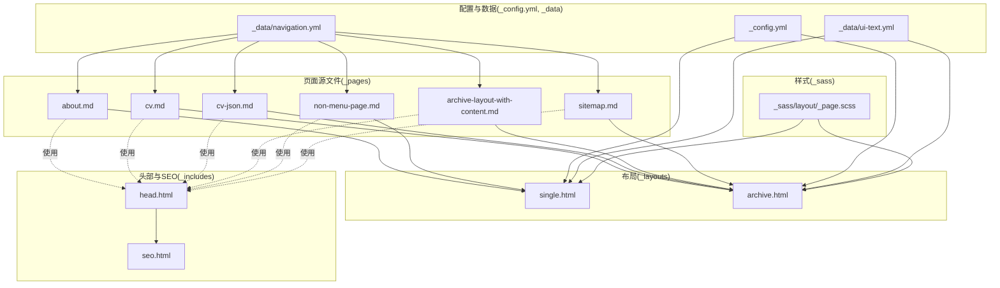
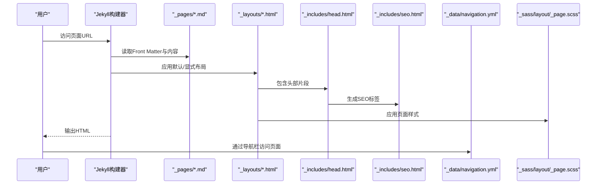
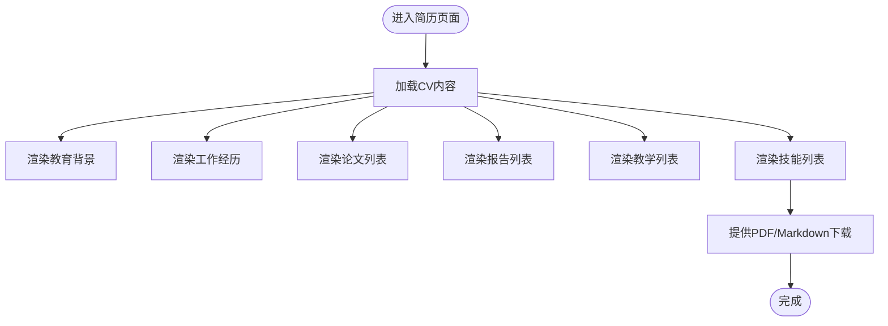
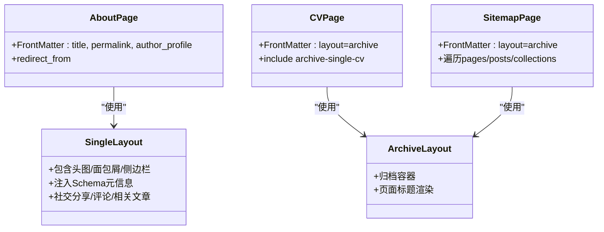
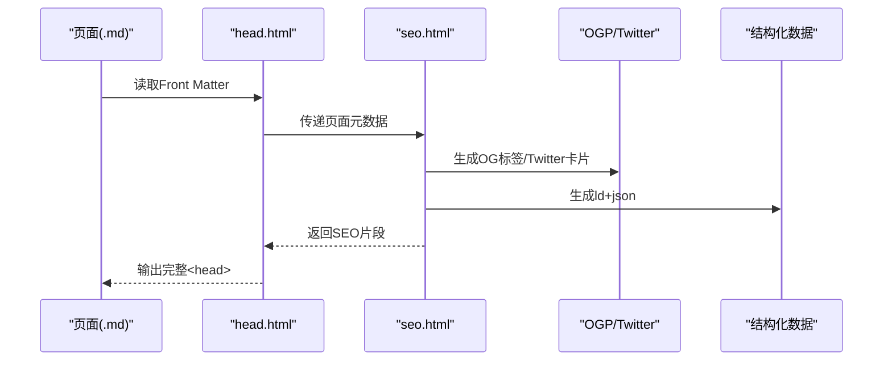
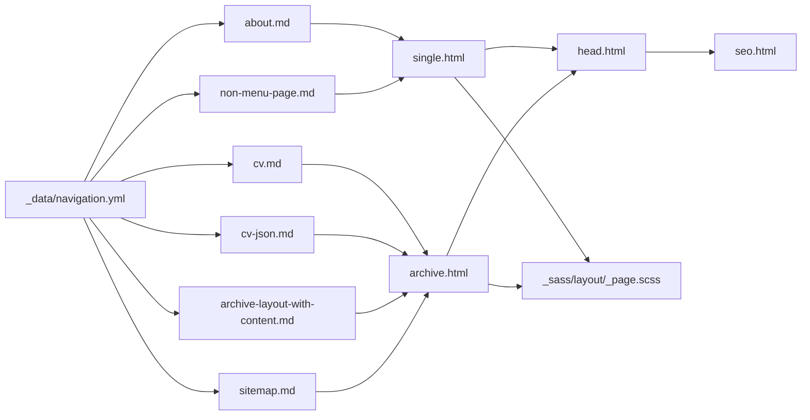

# 页面管理

<cite>
**本文引用的文件**
- [_config.yml](file://_config.yml)
- [_data/navigation.yml](file://_data/navigation.yml)
- [_data/ui-text.yml](file://_data/ui-text.yml)
- [_pages/about.md](file://_pages/about.md)
- [_pages/cv.md](file://_pages/cv.md)
- [_pages/cv-json.md](file://_pages/cv-json.md)
- [_pages/archive-layout-with-content.md](file://_pages/archive-layout-with-content.md)
- [_pages/non-menu-page.md](file://_pages/non-menu-page.md)
- [_pages/sitemap.md](file://_pages/sitemap.md)
- [_layouts/single.html](file://_layouts/single.html)
- [_layouts/archive.html](file://_layouts/archive.html)
- [_includes/head.html](file://_includes/head.html)
- [_includes/seo.html](file://_includes/seo.html)
- [_sass/layout/_page.scss](file://_sass/layout/_page.scss)
</cite>

## 目录
1. [简介](#简介)
2. [项目结构](#项目结构)
3. [核心组件](#核心组件)
4. [架构总览](#架构总览)
5. [详细组件分析](#详细组件分析)
6. [依赖关系分析](#依赖关系分析)
7. [性能考量](#性能考量)
8. [故障排查指南](#故障排查指南)
9. [结论](#结论)
10. [附录](#附录)

## 简介
本章节面向希望独立创建与管理页面（如“关于”、“简历”、“归档”等）的用户，系统讲解页面的创建、布局选择、内容组织、导航集成、模板使用、页面间链接管理、元数据与SEO配置以及多语言支持方法。文档以实际源码为依据，结合Jekyll的默认集合与布局机制，帮助你在不修改主题核心的前提下完成页面化定制。

## 项目结构
围绕页面管理的关键目录与文件如下：
- 页面源文件：位于 _pages 下，采用 Front Matter 声明页面元数据与布局
- 布局系统：位于 _layouts，单页使用 single，归档类使用 archive
- 导航配置：位于 _data/navigation.yml，控制顶部导航栏顺序与子菜单
- 多语言文本：位于 _data/ui-text.yml，支撑界面文案本地化
- SEO与头部：位于 _includes/head.html 与 _includes/seo.html
- 样式：位于 _sass/layout/_page.scss，控制页面排版与交互

**图示来源**
- [_pages/about.md](file://_pages/about.md)
- [_pages/cv.md](file://_pages/cv.md)
- [_pages/cv-json.md](file://_pages/cv-json.md)
- [_pages/archive-layout-with-content.md](file://_pages/archive-layout-with-content.md)
- [_pages/non-menu-page.md](file://_pages/non-menu-page.md)
- [_pages/sitemap.md](file://_pages/sitemap.md)
- [_layouts/single.html](file://_layouts/single.html)
- [_layouts/archive.html](file://_layouts/archive.html)
- [_includes/head.html](file://_includes/head.html)
- [_includes/seo.html](file://_includes/seo.html)
- [_config.yml](file://_config.yml)
- [_data/navigation.yml](file://_data/navigation.yml)
- [_data/ui-text.yml](file://_data/ui-text.yml)
- [_sass/layout/_page.scss](file://_sass/layout/_page.scss)

**章节来源**
- [_config.yml](file://_config.yml)
- [_data/navigation.yml](file://_data/navigation.yml)
- [_data/ui-text.yml](file://_data/ui-text.yml)
- [_pages/about.md](file://_pages/about.md)
- [_pages/cv.md](file://_pages/cv.md)
- [_pages/cv-json.md](file://_pages/cv-json.md)
- [_pages/archive-layout-with-content.md](file://_pages/archive-layout-with-content.md)
- [_pages/non-menu-page.md](file://_pages/non-menu-page.md)
- [_pages/sitemap.md](file://_pages/sitemap.md)
- [_layouts/single.html](file://_layouts/single.html)
- [_layouts/archive.html](file://_layouts/archive.html)
- [_includes/head.html](file://_includes/head.html)
- [_includes/seo.html](file://_includes/seo.html)
- [_sass/layout/_page.scss](file://_sass/layout/_page.scss)

## 核心组件
- 页面集合与默认值
  - Jekyll 默认将 _pages 下的文件识别为 pages 集合；通过 defaults 可为 pages 设置统一的默认布局与行为
  - 单页默认布局为 single，归档类页面默认布局为 archive
- 导航系统
  - 导航顺序与子菜单在 _data/navigation.yml 中定义，标题与链接指向各页面的 permalink
- SEO与头部
  - _includes/head.html 引入 _includes/seo.html，后者根据页面元数据生成 title、description、canonical、Open Graph、Twitter Card 等
- 多语言支持
  - _data/ui-text.yml 提供多语言文案键值，布局与组件通过 site.data.ui-text[site.locale] 获取对应语言文本
- 样式与排版
  - _sass/layout/_page.scss 控制页面标题、内容区、面包屑、侧边栏、分享、评论、相关文章等区域的排版与交互

**章节来源**
- [_config.yml](file://_config.yml)
- [_data/navigation.yml](file://_data/navigation.yml)
- [_data/ui-text.yml](file://_data/ui-text.yml)
- [_includes/head.html](file://_includes/head.html)
- [_includes/seo.html](file://_includes/seo.html)
- [_sass/layout/_page.scss](file://_sass/layout/_page.scss)

## 架构总览
页面从“源文件 → 布局 → 头部/SEO → 导航/样式”的完整渲染链路如下：

**图示来源**
- [_pages/about.md](file://_pages/about.md)
- [_layouts/single.html](file://_layouts/single.html)
- [_layouts/archive.html](file://_layouts/archive.html)
- [_includes/head.html](file://_includes/head.html)
- [_includes/seo.html](file://_includes/seo.html)
- [_data/navigation.yml](file://_data/navigation.yml)
- [_sass/layout/_page.scss](file://_sass/layout/_page.scss)

## 详细组件分析

### 关于页面（about）
- 元数据要点
  - permalink 固定首页路径，便于搜索引擎收录
  - author_profile 控制侧栏作者信息展示
  - redirect_from 定义旧路径跳转，避免断链
- 内容组织
  - 使用标题层级与段落组织“关于站点”“支持功能”“快速导航”“联系方式”等模块
- 导航集成
  - 在导航配置中可添加“关于”入口，或直接通过 permalink 访问
- SEO与多语言
  - 标题与描述由 SEO 片段根据页面元数据生成；界面文案由 ui-text.yml 本地化

**章节来源**
- [_pages/about.md](file://_pages/about.md)
- [_data/navigation.yml](file://_data/navigation.yml)
- [_includes/seo.html](file://_includes/seo.html)
- [_data/ui-text.yml](file://_data/ui-text.yml)

### 简历页面（cv 与 cv-json）
- Markdown 简历（cv.md）
  - 布局：archive
  - 内容：教育背景、工作经历、技能、论文、报告、教学、服务与领导力等
  - 数据：通过 include archive-single-cv.html 或 archive-single-talk-cv.html 渲染集合条目
- JSON 简历（cv-json.md）
  - 布局：archive
  - 内容：通过 include cv-template.html 渲染 JSON 数据
  - 下载：提供 PDF 与 Markdown 版本下载链接
- 导航集成
  - 在导航配置中添加“简历”入口，指向 /cv/ 或 /cv-json/

**图示来源**
- [_pages/cv.md](file://_pages/cv.md)
- [_pages/cv-json.md](file://_pages/cv-json.md)

**章节来源**
- [_pages/cv.md](file://_pages/cv.md)
- [_pages/cv-json.md](file://_pages/cv-json.md)
- [_data/navigation.yml](file://_data/navigation.yml)

### 归档页面（archive-layout-with-content）
- 布局：archive
- 作用：演示主题样式的各类标记（标题、表格、列表、按钮、通知、HTML标签、引用、强调、键盘、预格式文本、强/弱/插入/删除、上/下标、变量等）
- 内容组织：通过 include archive-single.html 遍历 site.pages 展示页面列表
- 导航集成：可在导航中添加“归档”入口，或作为独立页面展示

**章节来源**
- [_pages/archive-layout-with-content.md](file://_pages/archive-layout-with-content.md)
- [_layouts/archive.html](file://_layouts/archive.html)

### 非菜单页面（non-menu-page）
- 元数据要点
  - permalink 指定访问路径
  - author_profile 控制作者信息展示
  - redirect_from 定义旧路径跳转
- 适用场景：仅内部使用或测试用途的页面，无需出现在导航中

**章节来源**
- [_pages/non-menu-page.md](file://_pages/non-menu-page.md)

### 站点地图（sitemap）
- 布局：archive
- 功能：列出站点内所有页面与文章，并按集合分组展示
- 价值：便于搜索引擎抓取与用户浏览全站内容

**章节来源**
- [_pages/sitemap.md](file://_pages/sitemap.md)
- [_layouts/archive.html](file://_layouts/archive.html)

### 布局与样式（single 与 archive）
- single.html
  - 适用于大多数页面（如 about、非菜单页面）
  - 支持 hero 图片/覆盖层、面包屑、侧边栏、作者资料、社交分享、评论、相关文章等
  - 通过 page.* 元数据注入 Schema.org 元信息（标题、摘要、日期等）
- archive.html
  - 适用于归档类页面（如 cv、archive-layout-with-content、sitemap）
  - 提供 archive 容器与标题渲染

**图示来源**
- [_layouts/single.html](file://_layouts/single.html)
- [_layouts/archive.html](file://_layouts/archive.html)
- [_pages/about.md](file://_pages/about.md)
- [_pages/cv.md](file://_pages/cv.md)
- [_pages/sitemap.md](file://_pages/sitemap.md)

**章节来源**
- [_layouts/single.html](file://_layouts/single.html)
- [_layouts/archive.html](file://_layouts/archive.html)
- [_sass/layout/_page.scss](file://_sass/layout/_page.scss)

### SEO与头部（head 与 seo）
- head.html
  - 引入 base_path，包含 SEO 片段，输出 canonical、RSS 订阅链接，加载主样式
- seo.html
  - 根据页面 title/description/excerpt/date/author 等生成：
    - 页面标题与描述
    - canonical 链接
    - Open Graph（og:*）与 Twitter Card（twitter:*）
    - 分页 prev/next 链接
    - 结构化数据（ld+json）
    - 站点验证 meta（Google/Bing/Alexa/Yandex）

**图示来源**
- [_includes/head.html](file://_includes/head.html)
- [_includes/seo.html](file://_includes/seo.html)

**章节来源**
- [_includes/head.html](file://_includes/head.html)
- [_includes/seo.html](file://_includes/seo.html)

### 导航集成（navigation.yml）
- 顶层导航顺序与子菜单在 main 中定义
- 子菜单 children 可嵌套多级，标题与链接指向各页面的 permalink
- 若某页面未出现在导航中，不影响其正常访问；可通过 redirect_from 维护历史链接

**章节来源**
- [_data/navigation.yml](file://_data/navigation.yml)

### 多语言支持（ui-text.yml）
- ui-text.yml 提供多语言键值（如分页、面包屑、标签、分类、日期、评论等）
- 布局与组件通过 site.data.ui-text[site.locale] 获取对应语言文本
- locale 在 _config.yml 中设置（例如 zh-CN），确保界面文案正确渲染

**章节来源**
- [_data/ui-text.yml](file://_data/ui-text.yml)
- [_config.yml](file://_config.yml)
- [_layouts/single.html](file://_layouts/single.html)
- [_layouts/archive.html](file://_layouts/archive.html)

## 依赖关系分析
- 页面到布局
  - about、non-menu-page → single.html
  - cv、cv-json、archive-layout-with-content、sitemap → archive.html
- 布局到头部/SEO
  - 所有页面布局均包含 head.html，进而引入 seo.html
- 导航到页面
  - _data/navigation.yml 的 url 与页面 permalink 对应
- 样式到布局
  - _sass/layout/_page.scss 为 single 与 archive 布局提供通用样式

**图示来源**
- [_pages/about.md](file://_pages/about.md)
- [_pages/non-menu-page.md](file://_pages/non-menu-page.md)
- [_pages/cv.md](file://_pages/cv.md)
- [_pages/cv-json.md](file://_pages/cv-json.md)
- [_pages/archive-layout-with-content.md](file://_pages/archive-layout-with-content.md)
- [_pages/sitemap.md](file://_pages/sitemap.md)
- [_layouts/single.html](file://_layouts/single.html)
- [_layouts/archive.html](file://_layouts/archive.html)
- [_includes/head.html](file://_includes/head.html)
- [_includes/seo.html](file://_includes/seo.html)
- [_data/navigation.yml](file://_data/navigation.yml)
- [_sass/layout/_page.scss](file://_sass/layout/_page.scss)

**章节来源**
- [_config.yml](file://_config.yml)
- [_data/navigation.yml](file://_data/navigation.yml)
- [_includes/head.html](file://_includes/head.html)
- [_includes/seo.html](file://_includes/seo.html)
- [_layouts/single.html](file://_layouts/single.html)
- [_layouts/archive.html](file://_layouts/archive.html)
- [_sass/layout/_page.scss](file://_sass/layout/_page.scss)

## 性能考量
- HTML 压缩
  - 通过 compress_html 插件在生产环境压缩 HTML 输出，减少传输体积
- 资源加载
  - 主样式在 head.html 中统一加载，避免重复请求
- 分页与归档
  - archive 布局适合大量条目的展示；配合分页插件可降低单页渲染压力
- 缓存策略
  - 合理设置浏览器缓存与 CDN 缓存，提升二次访问速度

**章节来源**
- [_config.yml](file://_config.yml)
- [_includes/head.html](file://_includes/head.html)

## 故障排查指南
- 页面无法显示或404
  - 检查页面 Front Matter 中的 permalink 是否正确
  - 确认 _config.yml 的 include 是否包含 _pages
- 导航缺失或顺序错误
  - 检查 _data/navigation.yml 的 main 列表与 children 子菜单
- SEO 标签异常
  - 检查 _includes/seo.html 生成的 canonical、title、description、Open Graph、Twitter Card
  - 确认 _config.yml 中的 site.url、site.baseurl、locale 等配置
- 多语言文案未生效
  - 检查 _data/ui-text.yml 中是否存在对应 locale 键值
  - 确认 _config.yml 的 locale 设置与 ui-text.yml 的语言键一致
- 页面样式异常
  - 检查 _sass/layout/_page.scss 是否被正确编译
  - 确认布局是否包含必要的 include（如 sidebar、breadcrumbs 等）

**章节来源**
- [_config.yml](file://_config.yml)
- [_data/navigation.yml](file://_data/navigation.yml)
- [_includes/seo.html](file://_includes/seo.html)
- [_data/ui-text.yml](file://_data/ui-text.yml)
- [_sass/layout/_page.scss](file://_sass/layout/_page.scss)

## 结论
通过合理利用 Jekyll 的页面集合、默认布局与数据配置，可以高效地创建与维护独立页面。借助 archive 与 single 布局、SEO 片段、导航配置与多语言文案，既能保证页面内容的丰富性，也能兼顾 SEO 与国际化需求。建议在新增页面时遵循统一的 Front Matter 规范与命名约定，以便于后续维护与扩展。

## 附录

### 页面创建与管理操作清单
- 新建页面
  - 在 _pages 下创建 .md 文件，编写 Front Matter（如 title、permalink、layout、author_profile 等）
  - 如需跳转历史路径，使用 redirect_from
- 选择布局
  - 单页内容：使用 single（默认）
  - 归档/列表：使用 archive
- 内容组织
  - 使用标题层级与段落组织信息
  - 使用 include 片段渲染集合条目（如 archive-single、archive-single-cv 等）
- 导航集成
  - 在 _data/navigation.yml 中添加入口，设置标题与链接
  - 子菜单通过 children 实现
- SEO与元数据
  - 在 Front Matter 中提供 title、description、date、author 等
  - 确保 _includes/seo.html 正常生成标签
- 多语言支持
  - 在 _data/ui-text.yml 中补充对应语言键值
  - 在 _config.yml 设置 locale（如 zh-CN）

**章节来源**
- [_pages/about.md](file://_pages/about.md)
- [_pages/cv.md](file://_pages/cv.md)
- [_pages/cv-json.md](file://_pages/cv-json.md)
- [_pages/archive-layout-with-content.md](file://_pages/archive-layout-with-content.md)
- [_pages/non-menu-page.md](file://_pages/non-menu-page.md)
- [_pages/sitemap.md](file://_pages/sitemap.md)
- [_layouts/single.html](file://_layouts/single.html)
- [_layouts/archive.html](file://_layouts/archive.html)
- [_includes/seo.html](file://_includes/seo.html)
- [_data/navigation.yml](file://_data/navigation.yml)
- [_data/ui-text.yml](file://_data/ui-text.yml)
- [_config.yml](file://_config.yml)