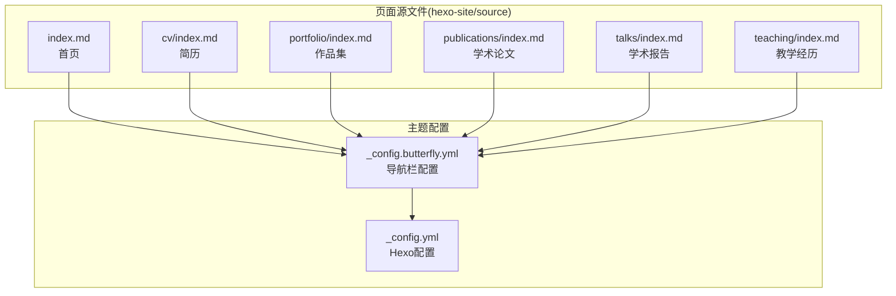
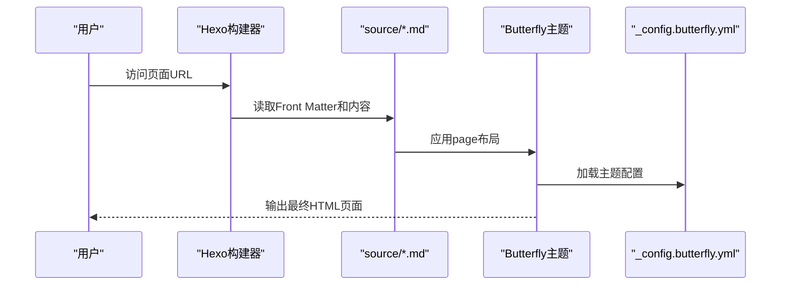
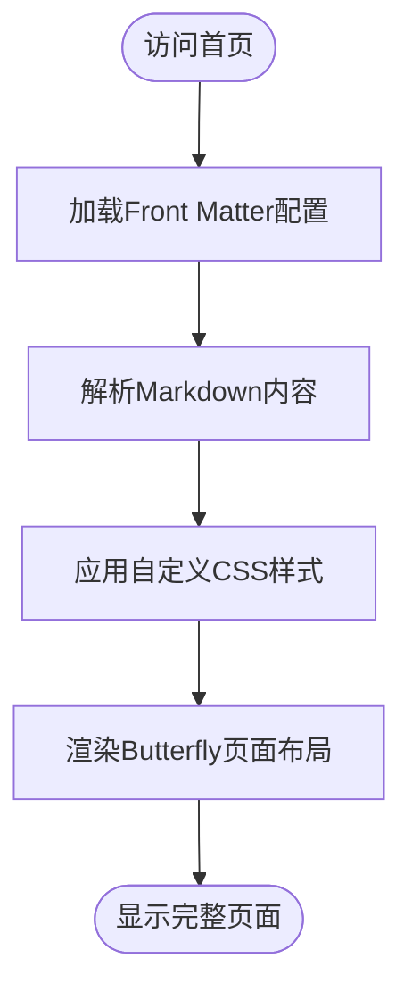
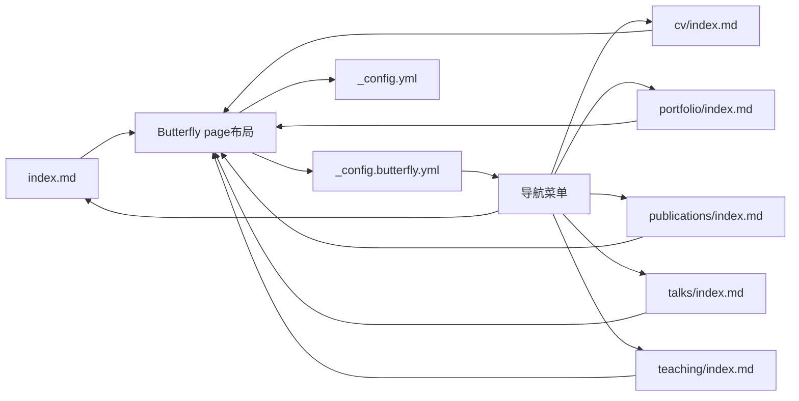

# 页面管理

<cite>
**本文引用的文件**
- [_config.yml](file://hexo-site/_config.yml)
- [_config.butterfly.yml](file://hexo-site/_config.butterfly.yml)
- [index.md](file://hexo-site/source/index.md)
- [cv/index.md](file://hexo-site/source/cv/index.md)
- [portfolio/index.md](file://hexo-site/source/portfolio/index.md)
- [publications/index.md](file://hexo-site/source/publications/index.md)
- [talks/index.md](file://hexo-site/source/talks/index.md)
- [teaching/index.md](file://hexo-site/source/teaching/index.md)
</cite>

## 更新摘要
**所做更改**
- 更新了页面结构以反映新的 Hexo + Butterfly 主题实现
- 新增了首页、简历、作品集、学术论文、学术报告、教学页面的完整实现
- 更新了导航配置和页面元数据规范
- 重新设计了页面布局和样式系统

## 目录
1. [简介](#简介)
2. [项目结构](#项目结构)
3. [核心组件](#核心组件)
4. [架构总览](#架构总览)
5. [详细组件分析](#详细组件分析)
6. [依赖关系分析](#依赖关系分析)
7. [性能考量](#性能考量)
8. [故障排查指南](#故障排查指南)
9. [结论](#结论)
10. [附录](#附录)

## 简介
本章节面向希望独立创建与管理学术型个人网站页面的用户，系统讲解基于 Hexo + Butterfly 主题的页面创建、布局选择、内容组织、导航集成、模板使用、页面间链接管理、元数据与SEO配置以及多语言支持方法。文档以实际源码为依据，结合 Hexo 的页面系统与 Butterfly 主题的布局机制，帮助您创建专业的学术主页、简历、作品集等独立页面。

## 项目结构
围绕页面管理的关键目录与文件如下：
- 页面源文件：位于 hexo-site/source 下，采用 Front Matter 声明页面元数据与布局
- 主题配置：位于 hexo-site/_config.butterfly.yml，控制导航栏、侧边栏、样式等
- 站点配置：位于 hexo-site/_config.yml，控制 Hexo 基本配置
- 页面类型：首页、简历、作品集、学术论文、学术报告、教学页面等

**图示来源**
- [index.md](file://hexo-site/source/index.md)
- [cv/index.md](file://hexo-site/source/cv/index.md)
- [portfolio/index.md](file://hexo-site/source/portfolio/index.md)
- [publications/index.md](file://hexo-site/source/publications/index.md)
- [talks/index.md](file://hexo-site/source/talks/index.md)
- [teaching/index.md](file://hexo-site/source/teaching/index.md)
- [_config.butterfly.yml](file://hexo-site/_config.butterfly.yml)
- [_config.yml](file://hexo-site/_config.yml)

**章节来源**
- [index.md](file://hexo-site/source/index.md)
- [cv/index.md](file://hexo-site/source/cv/index.md)
- [portfolio/index.md](file://hexo-site/source/portfolio/index.md)
- [publications/index.md](file://hexo-site/source/publications/index.md)
- [talks/index.md](file://hexo-site/source/talks/index.md)
- [teaching/index.md](file://hexo-site/source/teaching/index.md)
- [_config.butterfly.yml](file://hexo-site/_config.butterfly.yml)
- [_config.yml](file://hexo-site/_config.yml)

## 核心组件
- 页面系统
  - Hexo 将 source 目录下的文件识别为页面；通过 Front Matter 设置页面元数据
  - 所有页面使用统一的 page 布局，支持 comments 和 aside 配置
- 导航系统
  - 导航菜单在 _config.butterfly.yml 的 menu 配置中定义
  - 支持图标类名、路径映射和显示名称配置
- 主题样式
  - Butterfly 主题提供现代化的页面渲染和响应式设计
  - 支持暗色模式、数学公式、Mermaid 图表等功能
- 内容组织
  - 页面采用 Markdown 格式编写，支持 HTML 样式标签
  - 每个页面都有明确的类型标识（type 字段）

**章节来源**
- [_config.yml](file://hexo-site/_config.yml)
- [_config.butterfly.yml](file://hexo-site/_config.butterfly.yml)

## 架构总览
页面从"源文件 → Front Matter → Butterfly 主题 → 最终渲染"的完整处理链路如下：

**图示来源**
- [index.md](file://hexo-site/source/index.md)
- [_config.butterfly.yml](file://hexo-site/_config.butterfly.yml)

## 详细组件分析

### 首页（index.md）
- 元数据要点
  - layout: page（使用 Butterfly 主题的 page 布局）
  - comments: false（禁用评论功能）
  - aside: true（启用侧边栏）
- 内容组织
  - 采用自定义 CSS 样式，包含欢迎区域、关于站点、联系方式、底部引言等模块
  - 使用网格布局和卡片设计，提供现代化的用户体验
- 导航集成
  - 在导航配置中设置为首页入口（/）

**图示来源**
- [index.md](file://hexo-site/source/index.md)

**章节来源**
- [index.md](file://hexo-site/source/index.md)
- [_config.butterfly.yml](file://hexo-site/_config.butterfly.yml)

### 简历页面（cv/index.md）
- 元数据要点
  - title: 简历（中文标题）
  - type: cv（页面类型标识）
  - layout: page（使用 Butterfly 主题的 page 布局）
  - comments: false（禁用评论）
- 内容组织
  - 教育背景：包含 Ph.D、M.S.、B.S. 学位信息
  - 工作经历：按时间顺序排列的学术职位
  - 技能列表：支持子技能的层次化展示
  - 学术成果：论文和报告列表
- 导航集成
  - 在导航配置中添加"简历"入口，指向 /cv/

**章节来源**
- [cv/index.md](file://hexo-site/source/cv/index.md)
- [_config.butterfly.yml](file://hexo-site/_config.butterfly.yml)

### 作品集页面（portfolio/index.md）
- 元数据要点
  - title: 作品集（中文标题）
  - type: portfolio（页面类型标识）
  - layout: page（使用 Butterfly 主题的 page 布局）
  - comments: false（禁用评论）
- 内容组织
  - 采用网格布局展示作品项目
  - 支持图片、文本、链接等多种内容形式
  - 响应式设计，适配不同屏幕尺寸
- 导航集成
  - 在导航配置中添加"作品集"入口，指向 /portfolio/

**章节来源**
- [portfolio/index.md](file://hexo-site/source/portfolio/index.md)
- [_config.butterfly.yml](file://hexo-site/_config.butterfly.yml)

### 学术论文页面（publications/index.md）
- 元数据要点
  - title: 论文（中文标题）
  - type: publications（页面类型标识）
  - layout: page（使用 Butterfly 主题的 page 布局）
  - comments: false（禁用评论）
- 内容组织
  - 按年份分类的期刊文章和会议论文
  - 支持 PDF 下载链接
  - 数学公式渲染支持（MathJax）
- 导航集成
  - 在导航配置中添加"论文"入口，指向 /publications/

**章节来源**
- [publications/index.md](file://hexo-site/source/publications/index.md)
- [_config.butterfly.yml](file://hexo-site/_config.butterfly.yml)

### 学术报告页面（talks/index.md）
- 元数据要点
  - title: 学术报告（中文标题）
  - type: talks（页面类型标识）
  - layout: page（使用 Butterfly 主题的 page 布局）
  - comments: false（禁用评论）
- 内容组织
  - 会议演讲和教程的分类展示
  - 包含日期、地点等详细信息
  - 支持富文本格式的内容描述
- 导航集成
  - 在导航配置中添加"报告"入口，指向 /talks/

**章节来源**
- [talks/index.md](file://hexo-site/source/talks/index.md)
- [_config.butterfly.yml](file://hexo-site/_config.butterfly.yml)

### 教学页面（teaching/index.md）
- 元数据要点
  - title: 教学（中文标题）
  - type: teaching（页面类型标识）
  - layout: page（使用 Butterfly 主题的 page 布局）
  - comments: false（禁用评论）
- 内容组织
  - 本科课程的教学经历
  - 按学期和年份组织的教学活动
  - 支持详细的课程描述和评价
- 导航集成
  - 在导航配置中添加"教学"入口，指向 /teaching/

**章节来源**
- [teaching/index.md](file://hexo-site/source/teaching/index.md)
- [_config.butterfly.yml](file://hexo-site/_config.butterfly.yml)

### 导航配置（_config.butterfly.yml）
- 导航菜单配置
  - menu 部分定义所有导航项：首页、博客、简历等
  - 支持 Font Awesome 图标类名
  - 路径映射到对应的页面 URL
- 社交媒体链接
  - social 部分配置 GitHub、邮箱等外部链接
  - 支持颜色定制和显示名称
- 主题外观
  - logo、favicon、头像等视觉元素配置
  - 背景、侧边栏、暗色模式等主题设置

**章节来源**
- [_config.butterfly.yml](file://hexo-site/_config.butterfly.yml)

## 依赖关系分析
- 页面到主题
  - 所有页面（index、cv、portfolio、publications、talks、teaching）都使用 Butterfly 主题的 page 布局
- 页面到配置
  - 页面配置受 _config.yml 和 _config.butterfly.yml 的双重影响
- 导航到页面
  - 导航菜单项与页面 URL 完全对应
- 样式到页面
  - 自定义 CSS 样式与页面内容紧密结合

**图示来源**
- [index.md](file://hexo-site/source/index.md)
- [cv/index.md](file://hexo-site/source/cv/index.md)
- [portfolio/index.md](file://hexo-site/source/portfolio/index.md)
- [publications/index.md](file://hexo-site/source/publications/index.md)
- [talks/index.md](file://hexo-site/source/talks/index.md)
- [teaching/index.md](file://hexo-site/source/teaching/index.md)
- [_config.butterfly.yml](file://hexo-site/_config.butterfly.yml)
- [_config.yml](file://hexo-site/_config.yml)

**章节来源**
- [index.md](file://hexo-site/source/index.md)
- [cv/index.md](file://hexo-site/source/cv/index.md)
- [portfolio/index.md](file://hexo-site/source/portfolio/index.md)
- [publications/index.md](file://hexo-site/source/publications/index.md)
- [talks/index.md](file://hexo-site/source/talks/index.md)
- [teaching/index.md](file://hexo-site/source/teaching/index.md)
- [_config.butterfly.yml](file://hexo-site/_config.butterfly.yml)
- [_config.yml](file://hexo-site/_config.yml)

## 性能考量
- 页面加载优化
  - 所有页面禁用评论功能，减少 JavaScript 依赖
  - 使用 Butterfly 主题的轻量级布局系统
- 资源管理
  - 图片资源统一放置在 /images/ 目录
  - CSS 样式内联在页面中，减少 HTTP 请求
- 响应式设计
  - 支持移动端自适应，提升用户体验
- 主题配置
  - 合理配置侧边栏和导航栏，避免过度渲染

**章节来源**
- [_config.butterfly.yml](file://hexo-site/_config.butterfly.yml)
- [index.md](file://hexo-site/source/index.md)

## 故障排查指南
- 页面无法显示或404
  - 检查页面 Front Matter 中的 layout 和 type 配置
  - 确认导航配置中的路径与页面 URL 一致
- 导航缺失或显示异常
  - 检查 _config.butterfly.yml 中的 menu 配置
  - 确认图标类名和路径格式正确
- 样式显示问题
  - 检查自定义 CSS 语法是否正确
  - 确认页面中的 HTML 结构完整
- 主题配置错误
  - 检查 _config.butterfly.yml 的 YAML 格式
  - 确认缩进和冒号使用正确

**章节来源**
- [_config.butterfly.yml](file://hexo-site/_config.butterfly.yml)
- [index.md](file://hexo-site/source/index.md)

## 结论
通过合理利用 Hexo 的页面系统和 Butterfly 主题的强大功能，可以高效地创建专业的学术型个人网站。新的页面结构采用了统一的 Front Matter 规范和页面类型标识，配合现代化的主题配置，既保证了页面的专业性和美观性，也简化了维护和扩展流程。建议在新增页面时遵循现有的元数据规范和命名约定，以便于后续的管理和升级。

## 附录

### 页面创建与管理操作清单
- 新建页面
  - 在 hexo-site/source 下创建 .md 文件
  - 编写 Front Matter（title、type、layout、comments 等）
  - 在 _config.butterfly.yml 中添加导航菜单项
- 内容组织
  - 使用清晰的标题层级和段落结构
  - 合理使用 HTML 标签和 CSS 样式
  - 支持数学公式和图表渲染
- 导航集成
  - 在 menu 配置中添加页面入口
  - 设置合适的图标和显示名称
- 主题配置
  - 在 _config.butterfly.yml 中调整外观设置
  - 配置社交媒体链接和徽章
- 性能优化
  - 合理使用图片和多媒体资源
  - 避免过度的 JavaScript 依赖
  - 确保页面加载速度

**章节来源**
- [index.md](file://hexo-site/source/index.md)
- [cv/index.md](file://hexo-site/source/cv/index.md)
- [portfolio/index.md](file://hexo-site/source/portfolio/index.md)
- [publications/index.md](file://hexo-site/source/publications/index.md)
- [talks/index.md](file://hexo-site/source/talks/index.md)
- [teaching/index.md](file://hexo-site/source/teaching/index.md)
- [_config.butterfly.yml](file://hexo-site/_config.butterfly.yml)
- [_config.yml](file://hexo-site/_config.yml)