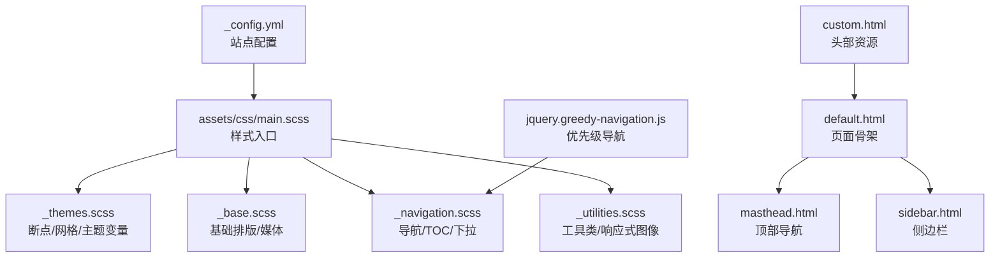
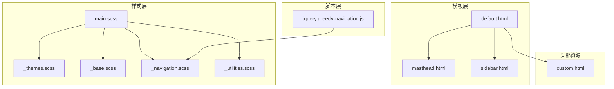
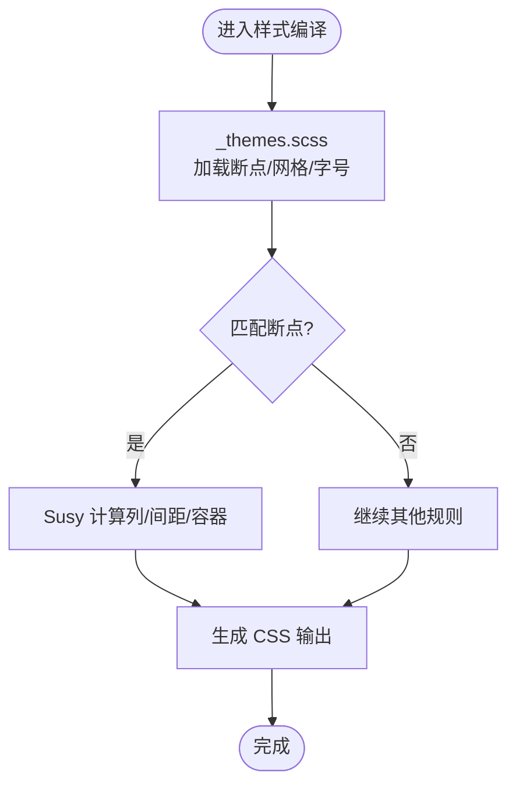
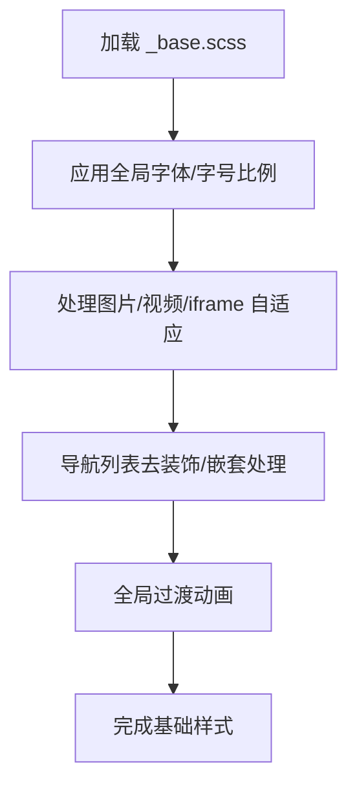
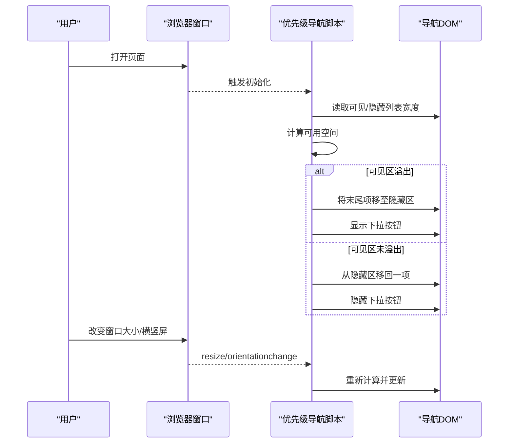
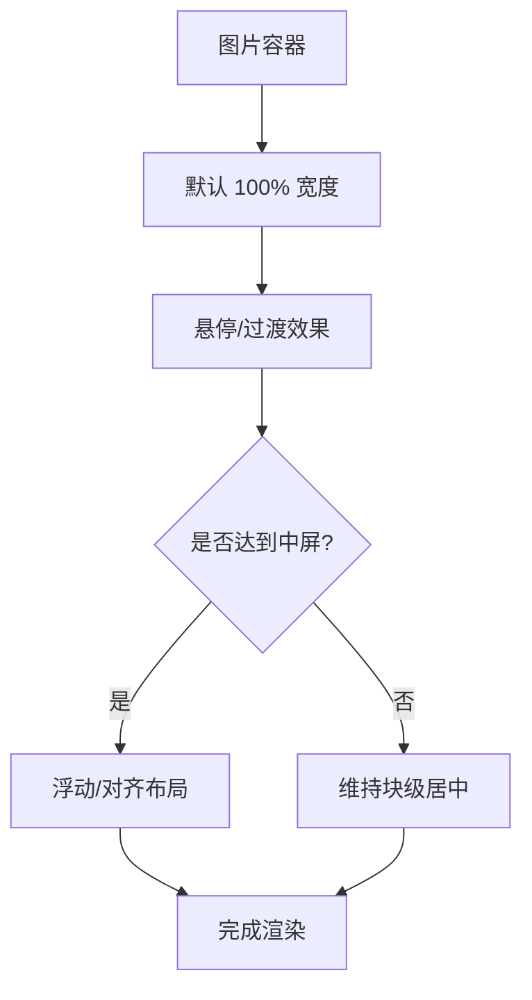
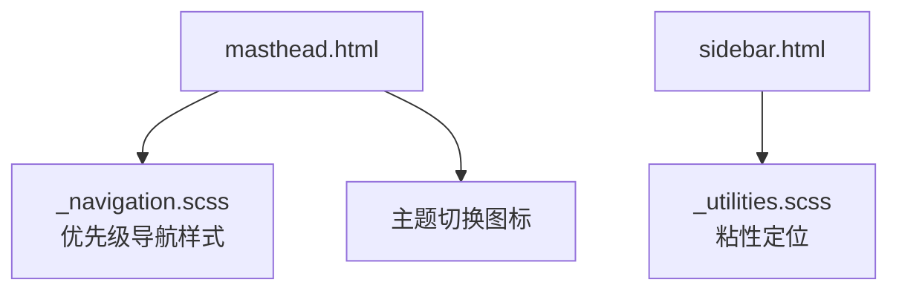
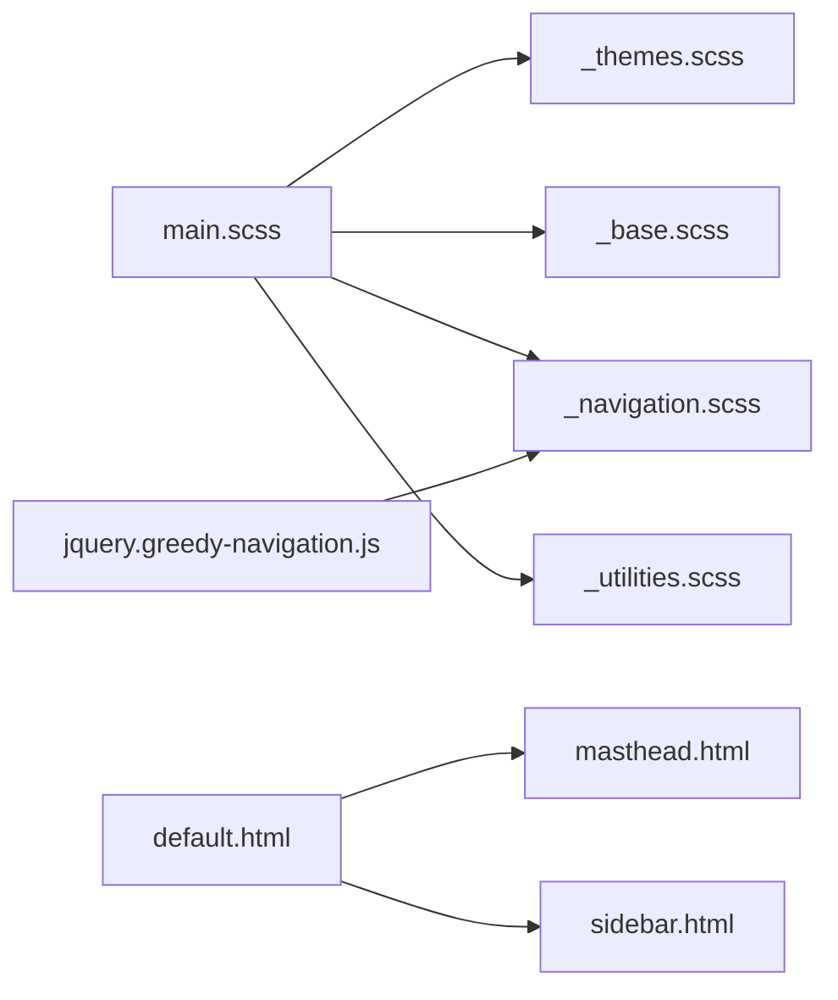

# 响应式设计

<cite>
**本文引用的文件**
- [_config.yml](file://_config.yml)
- [main.scss](file://assets/css/main.scss)
- [_themes.scss](file://_sass/_themes.scss)
- [_base.scss](file://_sass/layout/_base.scss)
- [_navigation.scss](file://_sass/layout/_navigation.scss)
- [_utilities.scss](file://_sass/include/_utilities.scss)
- [jquery.greedy-navigation.js](file://assets/js/plugins/jquery.greedy-navigation.js)
- [custom.html](file://_includes/head/custom.html)
- [masthead.html](file://_includes/masthead.html)
- [sidebar.html](file://_includes/sidebar.html)
- [default.html](file://_layouts/default.html)
</cite>

## 目录
1. [简介](#简介)
2. [项目结构](#项目结构)
3. [核心组件](#核心组件)
4. [架构总览](#架构总览)
5. [详细组件分析](#详细组件分析)
6. [依赖关系分析](#依赖关系分析)
7. [性能考量](#性能考量)
8. [故障排查指南](#故障排查指南)
9. [结论](#结论)
10. [附录](#附录)

## 简介
本文件系统性梳理该 Jekyll 网站的响应式设计体系，覆盖断点与网格、布局与导航、图片与字体、触摸交互与可访问性等维度，并提供跨设备测试与性能优化建议。文档以实际源码为依据，辅以可视化图示帮助非技术读者理解。

## 项目结构
该项目采用 Jekyll 模板化结构，样式通过 SCSS 编译输出，脚本按需加载，布局由 Liquid 模板拼装。与响应式密切相关的目录与文件如下：
- 样式入口：assets/css/main.scss 引入断点、主题、布局与工具类
- 主题与断点：_sass/_themes.scss 定义断点、字号、网格与品牌色
- 基础与布局：_sass/layout/_base.scss、_sass/layout/_navigation.scss
- 工具类：_sass/include/_utilities.scss 提供响应式图像、对齐、容器等实用类
- 导航与交互：assets/js/plugins/jquery.greedy-navigation.js 实现优先级导航
- 头部与图标：_includes/head/custom.html 提供 favicon、manifest、主题色
- 页面骨架：_layouts/default.html、_includes/masthead.html、_includes/sidebar.html

图表来源
- [_config.yml:1-362](file://_config.yml#L1-L362)
- [main.scss:1-43](file://assets/css/main.scss#L1-L43)
- [_themes.scss:46-76](file://_sass/_themes.scss#L46-L76)
- [_base.scss:1-365](file://_sass/layout/_base.scss#L1-L365)
- [_navigation.scss:1-527](file://_sass/layout/_navigation.scss#L1-L527)
- [_utilities.scss:1-501](file://_sass/include/_utilities.scss#L1-L501)
- [jquery.greedy-navigation.js:1-86](file://assets/js/plugins/jquery.greedy-navigation.js#L1-L86)
- [default.html:1-32](file://_layouts/default.html#L1-L32)
- [masthead.html:1-48](file://_includes/masthead.html#L1-L48)
- [sidebar.html:1-25](file://_includes/sidebar.html#L1-L25)
- [custom.html:1-18](file://_includes/head/custom.html#L1-L18)

章节来源
- [_config.yml:1-362](file://_config.yml#L1-L362)
- [main.scss:1-43](file://assets/css/main.scss#L1-L43)
- [_themes.scss:46-76](file://_sass/_themes.scss#L46-L76)
- [_base.scss:1-365](file://_sass/layout/_base.scss#L1-L365)
- [_navigation.scss:1-527](file://_sass/layout/_navigation.scss#L1-L527)
- [_utilities.scss:1-501](file://_sass/include/_utilities.scss#L1-L501)
- [jquery.greedy-navigation.js:1-86](file://assets/js/plugins/jquery.greedy-navigation.js#L1-L86)
- [default.html:1-32](file://_layouts/default.html#L1-L32)
- [masthead.html:1-48](file://_includes/masthead.html#L1-L48)
- [sidebar.html:1-25](file://_includes/sidebar.html#L1-L25)
- [custom.html:1-18](file://_includes/head/custom.html#L1-L18)

## 核心组件
- 断点与网格
  - 断点定义：小屏、中屏、宽中屏、大屏、超大屏，用于媒体查询与 Susy 网格定位
  - 网格：Susy 流式网格，列数、列宽、间距、容器宽度在主题中集中配置
- 基础排版与媒体
  - 全局字体、字号比例、行高、标题层级；图片自适应与过渡动画
- 导航系统
  - 优先级导航（溢出自动折叠到下拉菜单）、面包屑、TOC、简单下拉菜单
- 工具类
  - 图片对齐与响应式展示、容器包裹、粘性侧栏、模态框、可见性控制
- 头部与图标
  - favicon、Apple Touch Icon、manifest、主题色，提升移动端体验与 PWA 支持

章节来源
- [_themes.scss:46-76](file://_sass/_themes.scss#L46-L76)
- [_base.scss:10-365](file://_sass/layout/_base.scss#L10-L365)
- [_navigation.scss:175-320](file://_sass/layout/_navigation.scss#L175-L320)
- [_utilities.scss:130-195](file://_sass/include/_utilities.scss#L130-L195)
- [custom.html:8-15](file://_includes/head/custom.html#L8-L15)

## 架构总览
整体响应式架构围绕“断点 + 网格 + 组件样式 + 脚本交互”展开。Liquid 模板负责内容组织，SCSS 负责样式与布局，JS 负责动态行为（如导航折叠）。

图表来源
- [default.html:1-32](file://_layouts/default.html#L1-L32)
- [masthead.html:1-48](file://_includes/masthead.html#L1-L48)
- [sidebar.html:1-25](file://_includes/sidebar.html#L1-L25)
- [main.scss:1-43](file://assets/css/main.scss#L1-L43)
- [_themes.scss:46-76](file://_sass/_themes.scss#L46-L76)
- [_base.scss:1-365](file://_sass/layout/_base.scss#L1-L365)
- [_navigation.scss:1-527](file://_sass/layout/_navigation.scss#L1-L527)
- [_utilities.scss:1-501](file://_sass/include/_utilities.scss#L1-L501)
- [jquery.greedy-navigation.js:1-86](file://assets/js/plugins/jquery.greedy-navigation.js#L1-L86)
- [custom.html:1-18](file://_includes/head/custom.html#L1-L18)

## 详细组件分析

### 断点与网格
- 断点
  - 小屏、中屏、宽中屏、大屏、超大屏，配合媒体查询与 Susy 的 span/prefix/suffix 实现流式布局
- 网格
  - Susy 配置包含列数、列宽、间距、容器宽度、盒模型等，统一约束页面栅格系统
- 字号与比例
  - 文档字号、标题字号比例在主题中集中定义，保证各级标题在不同断点下的可读性

图表来源
- [_themes.scss:46-76](file://_sass/_themes.scss#L46-L76)

章节来源
- [_themes.scss:46-76](file://_sass/_themes.scss#L46-L76)

### 基础排版与媒体
- 排版
  - 全局字体族、标题层级、段落行高、代码块样式、强调与删除线等
- 媒体
  - 图片自适应宽度、悬浮阴影与圆角、半图/三分之一图在中屏以上切换
- 动画
  - 全局过渡时间与动画序列，提升交互流畅度

图表来源
- [_base.scss:10-365](file://_sass/layout/_base.scss#L10-L365)

章节来源
- [_base.scss:10-365](file://_sass/layout/_base.scss#L10-L365)

### 导航系统
- 优先级导航（Greedy Navigation）
  - 动态计算可用空间，将溢出项移入隐藏菜单，按钮显示/隐藏与状态切换
  - 响应窗口尺寸变化与横竖屏切换，实时重排
- 面包屑、分页、目录
  - 面包屑容器宽度与断点适配；TOC 在小屏隐藏子子级链接；分页按钮在窄屏合理布局
- 下拉菜单
  - 简单下拉菜单支持悬停显示与图标旋转反馈

图表来源
- [jquery.greedy-navigation.js:16-86](file://assets/js/plugins/jquery.greedy-navigation.js#L16-L86)
- [_navigation.scss:175-320](file://_sass/layout/_navigation.scss#L175-L320)

章节来源
- [jquery.greedy-navigation.js:1-86](file://assets/js/plugins/jquery.greedy-navigation.js#L1-L86)
- [_navigation.scss:175-320](file://_sass/layout/_navigation.scss#L175-L320)

### 响应式图片与字体缩放
- 图片
  - 图片默认占满容器宽度，配合圆角与过渡；在中屏及以上提供左/右对齐与浮动布局
  - 半图/三分之一图在中屏以上按比例分配宽度
- 字体
  - 使用相对单位与字号比例，标题层级在不同断点保持可读性
- 动画与过渡
  - 元素过渡时间统一，提升滑动与切换体验

图表来源
- [_base.scss:193-245](file://_sass/layout/_base.scss#L193-L245)
- [_utilities.scss:135-157](file://_sass/include/_utilities.scss#L135-L157)

章节来源
- [_base.scss:193-245](file://_sass/layout/_base.scss#L193-L245)
- [_utilities.scss:135-157](file://_sass/include/_utilities.scss#L135-L157)

### 顶部导航与侧边栏
- 顶部导航
  - 使用优先级导航，按钮位于右侧，点击展开隐藏菜单；支持主题切换图标
- 侧边栏
  - 粘性定位在大屏生效，顶部留白与主标题高度一致；支持作者信息与导航列表

图表来源
- [masthead.html:1-48](file://_includes/masthead.html#L1-L48)
- [_navigation.scss:175-320](file://_sass/layout/_navigation.scss#L175-L320)
- [_utilities.scss:380-392](file://_sass/include/_utilities.scss#L380-L392)
- [sidebar.html:1-25](file://_includes/sidebar.html#L1-L25)

章节来源
- [masthead.html:1-48](file://_includes/masthead.html#L1-L48)
- [_navigation.scss:175-320](file://_sass/layout/_navigation.scss#L175-L320)
- [_utilities.scss:380-392](file://_sass/include/_utilities.scss#L380-L392)
- [sidebar.html:1-25](file://_includes/sidebar.html#L1-L25)

### 头部资源与可访问性
- 头部资源
  - 提供多尺寸 favicon、Apple Touch Icon、SVG 主题图标、manifest，增强移动端书签与 PWA 行为
- 可访问性
  - 提供 visually-hidden 屏幕阅读器快捷入口与聚焦样式，确保键盘可达性

章节来源
- [custom.html:8-15](file://_includes/head/custom.html#L8-L15)
- [_utilities.scss:28-61](file://_sass/include/_utilities.scss#L28-L61)

## 依赖关系分析
- 样式依赖
  - main.scss 作为入口，按顺序引入断点、主题、布局与工具类，确保变量与混入先于使用
- 组件耦合
  - 导航脚本与导航样式强耦合，需同步维护断点与 DOM 结构
- 模板依赖
  - default.html 依赖 masthead.html 与 sidebar.html，三者共同构成页面骨架

图表来源
- [main.scss:11-43](file://assets/css/main.scss#L11-L43)
- [_themes.scss:46-76](file://_sass/_themes.scss#L46-L76)
- [_base.scss:1-365](file://_sass/layout/_base.scss#L1-L365)
- [_navigation.scss:1-527](file://_sass/layout/_navigation.scss#L1-L527)
- [_utilities.scss:1-501](file://_sass/include/_utilities.scss#L1-L501)
- [jquery.greedy-navigation.js:1-86](file://assets/js/plugins/jquery.greedy-navigation.js#L1-L86)
- [default.html:1-32](file://_layouts/default.html#L1-L32)
- [masthead.html:1-48](file://_includes/masthead.html#L1-L48)
- [sidebar.html:1-25](file://_includes/sidebar.html#L1-L25)

章节来源
- [main.scss:11-43](file://assets/css/main.scss#L11-L43)
- [_themes.scss:46-76](file://_sass/_themes.scss#L46-L76)
- [_navigation.scss:1-527](file://_sass/layout/_navigation.scss#L1-L527)
- [jquery.greedy-navigation.js:1-86](file://assets/js/plugins/jquery.greedy-navigation.js#L1-L86)
- [default.html:1-32](file://_layouts/default.html#L1-L32)
- [masthead.html:1-48](file://_includes/masthead.html#L1-L48)
- [sidebar.html:1-25](file://_includes/sidebar.html#L1-L25)

## 性能考量
- 构建与压缩
  - 使用 Jekyll 压缩 HTML 与 SCSS 输出，减少传输体积
- 资源优化
  - 提供多尺寸图标与 SVG 主题图标，降低加载失败风险
- 渐进增强
  - 导航脚本在模块化脚本中按需加载，避免阻塞首屏
- 可访问性
  - 屏幕阅读器快捷入口与键盘可达性，提升移动端可访问体验

章节来源
- [_config.yml:356-362](file://_config.yml#L356-L362)
- [custom.html:8-15](file://_includes/head/custom.html#L8-L15)
- [default.html:1-32](file://_layouts/default.html#L1-L32)

## 故障排查指南
- 导航按钮不显示或无法展开
  - 检查优先级导航脚本是否正确加载与执行
  - 确认断点与容器宽度计算逻辑是否与样式一致
- 图片显示异常或布局错位
  - 检查图片容器与对齐类是否正确应用
  - 确认中屏及以上断点下的浮动与宽度计算
- 侧边栏粘性失效
  - 检查大屏断点条件与粘性定位声明
- 主题切换无效
  - 确认主题变量与根 CSS 变量是否正确注入

章节来源
- [jquery.greedy-navigation.js:16-86](file://assets/js/plugins/jquery.greedy-navigation.js#L16-L86)
- [_utilities.scss:380-392](file://_sass/include/_utilities.scss#L380-L392)
- [_base.scss:193-245](file://_sass/layout/_base.scss#L193-L245)
- [masthead.html:1-48](file://_includes/masthead.html#L1-L48)

## 结论
该站点以 SCSS 断点与 Susy 网格为核心，结合优先级导航与工具类，构建了覆盖多设备的响应式体验。通过头部资源与可访问性辅助，进一步完善移动端与无障碍体验。建议在后续迭代中持续关注跨设备测试与性能优化，确保在不同网络与设备条件下稳定呈现。

## 附录
- 跨设备测试清单
  - 小屏（<600px）、中屏（600–768px）、宽中屏（768–900px）、大屏（900–1280px）、超大屏（>1280px）
  - 横竖屏切换、手势滚动、触摸点击、键盘导航
  - 网络模拟（慢网/离线）、PWA 安装提示、图标显示
- 性能优化建议
  - 合理拆分与延迟加载脚本
  - 使用现代图片格式与懒加载
  - 减少重绘与重排，利用 transform 与 opacity 动画
  - 压缩与缓存静态资源