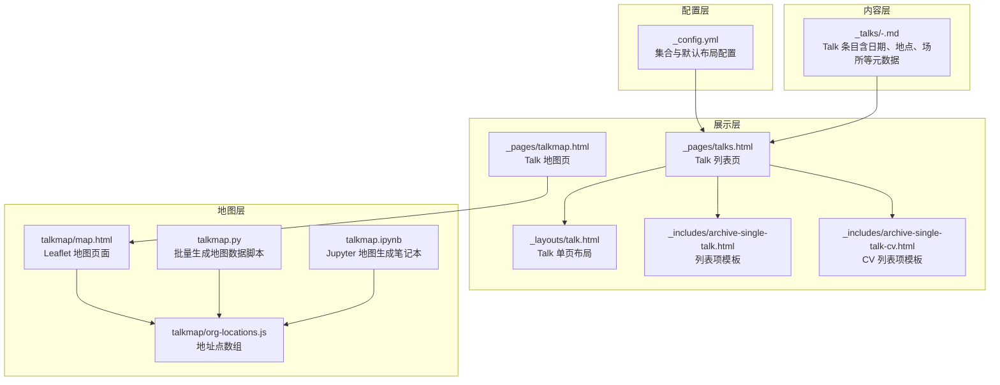
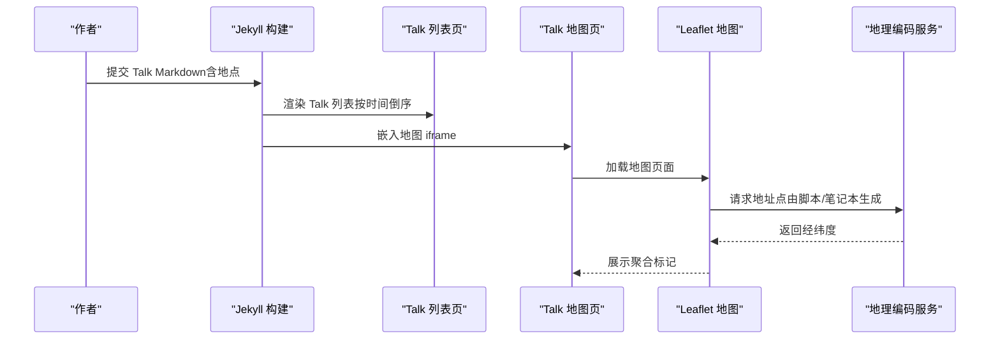
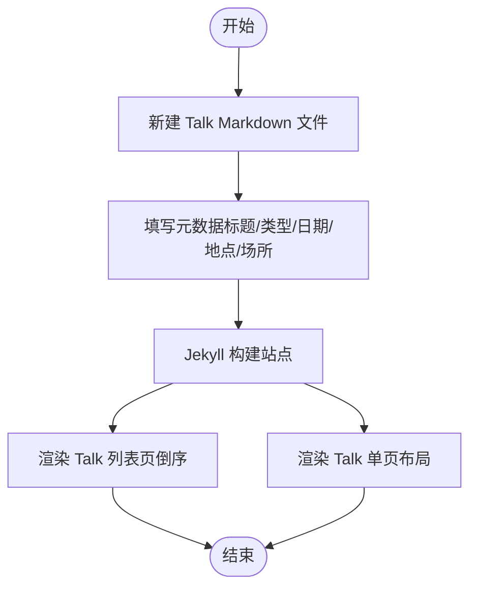
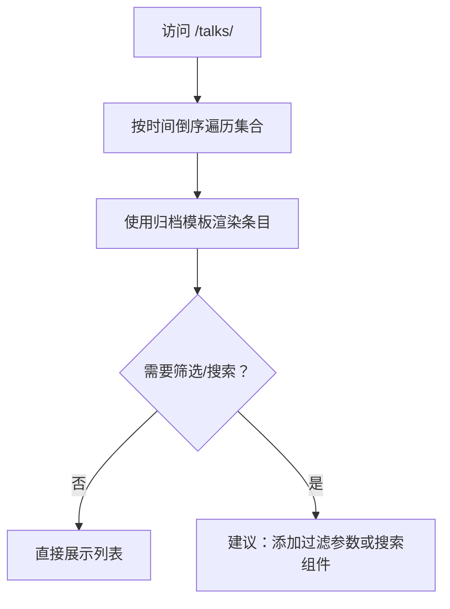
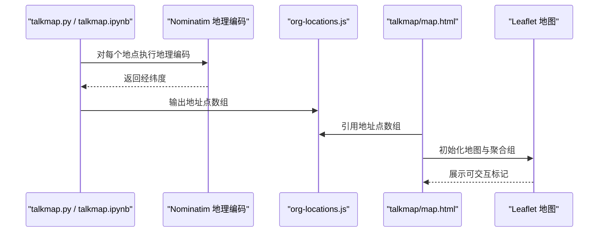
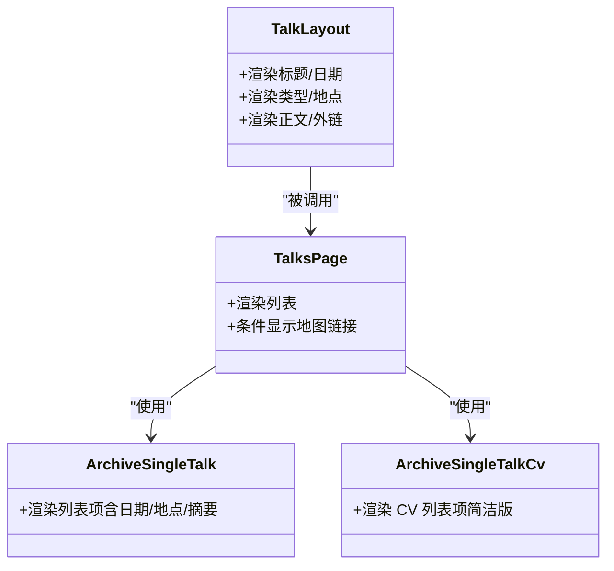
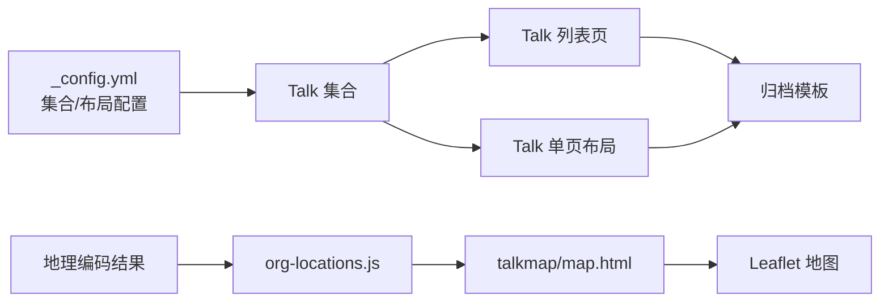

# 会议展示功能

<cite>
**本文引用的文件**
- [_config.yml](file://_config.yml)
- [_talks/2012-03-01-talk-1.md](file://_talks/2012-03-01-talk-1.md)
- [_talks/2013-03-01-tutorial-1.md](file://_talks/2013-03-01-tutorial-1.md)
- [_talks/2014-02-01-talk-2.md](file://_talks/2014-02-01-talk-2.md)
- [_talks/2014-03-01-talk-3.md](file://_talks/2014-03-01-talk-3.md)
- [_layouts/talk.html](file://_layouts/talk.html)
- [_includes/archive-single-talk.html](file://_includes/archive-single-talk.html)
- [_includes/archive-single-talk-cv.html](file://_includes/archive-single-talk-cv.html)
- [_pages/talks.html](file://_pages/talks.html)
- [_pages/talkmap.html](file://_pages/talkmap.html)
- [talkmap/map.html](file://talkmap/map.html)
- [talkmap/org-locations.js](file://talkmap/org-locations.js)
- [talkmap.py](file://talkmap.py)
- [talkmap.ipynb](file://talkmap.ipynb)
</cite>

## 目录
1. [简介](#简介)
2. [项目结构](#项目结构)
3. [核心组件](#核心组件)
4. [架构总览](#架构总览)
5. [详细组件分析](#详细组件分析)
6. [依赖关系分析](#依赖关系分析)
7. [性能考虑](#性能考虑)
8. [故障排除指南](#故障排除指南)
9. [结论](#结论)
10. [附录](#附录)

## 简介
本文件系统性阐述“会议展示功能”的设计与实现，覆盖学术报告与演讲（Talk）的创建、分类与展示流程；TalkMap 地理可视化功能的地理数据处理、地图集成与交互展示；会议列表的排序规则、筛选与搜索机制；以及会议内容管理的最佳实践（时间安排、地点标注、参与人员管理）。目标是帮助非技术读者也能清晰理解整体工作流，并为维护者提供可操作的技术参考。

## 项目结构
围绕会议展示功能的关键目录与文件如下：
- 配置层：站点配置控制 Talk 列表页是否显示地图链接
- 内容层：Talk 条目以 Markdown 文件形式存放在集合中
- 布局与归档：Talk 单页布局与列表归档模板
- 地图层：Talk 地点数据生成与 Leaflet 地图集成

图表来源
- [_config.yml:233-293](file://_config.yml#L233-L293)
- [_pages/talks.html:14-16](file://_pages/talks.html#L14-L16)
- [_pages/talkmap.html:8-9](file://_pages/talkmap.html#L8-L9)
- [talkmap/map.html:24-44](file://talkmap/map.html#L24-L44)
- [talkmap/org-locations.js:1-22](file://talkmap/org-locations.js#L1-L22)
- [talkmap.py:1-57](file://talkmap.py#L1-L57)
- [talkmap.ipynb:1-163](file://talkmap.ipynb#L1-L163)

章节来源
- [_config.yml:233-293](file://_config.yml#L233-L293)
- [_pages/talks.html:1-17](file://_pages/talks.html#L1-L17)
- [_pages/talkmap.html:1-10](file://_pages/talkmap.html#L1-L10)

## 核心组件
- Talk 条目与集合
  - Talk 条目以 Markdown 文件形式存储在集合中，包含标题、类型、日期、地点、场所等元数据字段
  - 集合配置启用 Talk 的输出与永久链接
- 列表页与单页布局
  - 列表页按时间倒序展示 Talk，支持通过配置开关显示地图链接
  - 单页布局负责渲染 Talk 的标题、日期、类型、地点、描述与外部链接
- 地理可视化（TalkMap）
  - 使用 Leaflet 与 MarkerCluster 实现交互式地图
  - 通过 Python 脚本或 Jupyter 笔记本从 Talk 元数据提取地点并进行地理编码，生成地址点数组供前端渲染

章节来源
- [_talks/2012-03-01-talk-1.md:1-12](file://_talks/2012-03-01-talk-1.md#L1-L12)
- [_talks/2013-03-01-tutorial-1.md:1-14](file://_talks/2013-03-01-tutorial-1.md#L1-L14)
- [_talks/2014-02-01-talk-2.md:1-14](file://_talks/2014-02-01-talk-2.md#L1-L14)
- [_talks/2014-03-01-talk-3.md:1-12](file://_talks/2014-03-01-talk-3.md#L1-L12)
- [_config.yml:233-293](file://_config.yml#L233-L293)
- [_layouts/talk.html:38-45](file://_layouts/talk.html#L38-L45)
- [_includes/archive-single-talk.html:38-39](file://_includes/archive-single-talk.html#L38-L39)
- [_includes/archive-single-talk-cv.html:36-37](file://_includes/archive-single-talk-cv.html#L36-L37)
- [_pages/talks.html:8-12](file://_pages/talks.html#L8-L12)
- [talkmap/map.html:24-44](file://talkmap/map.html#L24-L44)
- [talkmap/org-locations.js:1-22](file://talkmap/org-locations.js#L1-L22)
- [talkmap.py:27-56](file://talkmap.py#L27-L56)
- [talkmap.ipynb:89-128](file://talkmap.ipynb#L89-L128)

## 架构总览
下图展示了从内容到展示的整体流程：Talk 条目经由 Jekyll 集合生成静态页面；列表页负责排序与呈现；TalkMap 通过地理编码生成地址点并在地图上聚类展示。

图表来源
- [_pages/talks.html:14-16](file://_pages/talks.html#L14-L16)
- [_pages/talkmap.html:8-9](file://_pages/talkmap.html#L8-L9)
- [talkmap/map.html:24-44](file://talkmap/map.html#L24-L44)
- [talkmap.py:27-56](file://talkmap.py#L27-L56)
- [talkmap.ipynb:89-128](file://talkmap.ipynb#L89-L128)

## 详细组件分析

### Talk 条目创建与分类
- 创建流程
  - 在集合目录中新增 Markdown 文件，设置必要的元数据（标题、类型、日期、地点、场所等）
  - 类型字段用于区分不同类型的演讲（如 Talk、Tutorial、Conference proceedings talk 等）
- 展示逻辑
  - 列表页按时间倒序遍历集合，使用归档模板渲染每个条目
  - 单页布局读取条目元数据，渲染标题、日期、类型、地点与正文内容

图表来源
- [_talks/2012-03-01-talk-1.md:1-12](file://_talks/2012-03-01-talk-1.md#L1-L12)
- [_talks/2013-03-01-tutorial-1.md:1-14](file://_talks/2013-03-01-tutorial-1.md#L1-L14)
- [_talks/2014-02-01-talk-2.md:1-14](file://_talks/2014-02-01-talk-2.md#L1-L14)
- [_talks/2014-03-01-talk-3.md:1-12](file://_talks/2014-03-01-talk-3.md#L1-L12)
- [_pages/talks.html:14-16](file://_pages/talks.html#L14-L16)
- [_layouts/talk.html:38-45](file://_layouts/talk.html#L38-L45)

章节来源
- [_talks/2012-03-01-talk-1.md:1-12](file://_talks/2012-03-01-talk-1.md#L1-L12)
- [_talks/2013-03-01-tutorial-1.md:1-14](file://_talks/2013-03-01-tutorial-1.md#L1-L14)
- [_talks/2014-02-01-talk-2.md:1-14](file://_talks/2014-02-01-talk-2.md#L1-L14)
- [_talks/2014-03-01-talk-3.md:1-12](file://_talks/2014-03-01-talk-3.md#L1-L12)
- [_pages/talks.html:14-16](file://_pages/talks.html#L14-L16)
- [_layouts/talk.html:38-45](file://_layouts/talk.html#L38-L45)

### Talk 列表排序、筛选与搜索
- 排序规则
  - 列表页对集合进行时间倒序排列，确保最新的演讲优先展示
- 筛选与搜索
  - 当前实现未提供基于类型、地点或年份的动态筛选
  - 搜索能力依赖于静态页面构建与浏览器端文本匹配，未内置专用搜索框
- 建议
  - 可通过添加过滤参数或引入轻量搜索库增强交互体验（不改变现有静态生成模式）

图表来源
- [_pages/talks.html:14-16](file://_pages/talks.html#L14-L16)
- [_includes/archive-single-talk.html:38-39](file://_includes/archive-single-talk.html#L38-L39)

章节来源
- [_pages/talks.html:14-16](file://_pages/talks.html#L14-L16)
- [_includes/archive-single-talk.html:38-39](file://_includes/archive-single-talk.html#L38-L39)

### TalkMap 地理可视化
- 数据来源与处理
  - 从 Talk Markdown 的元数据中提取地点信息，进行地理编码，生成地址点数组
  - 支持通过 Python 脚本或 Jupyter 笔记本两种方式生成前端所需的数据文件
- 地图集成与交互
  - 地图页加载 Leaflet 与 MarkerCluster，使用地址点数组创建标记并聚合
  - 用户可通过鼠标悬停查看聚合范围，点击聚合点缩放至子节点范围

图表来源
- [talkmap.py:27-56](file://talkmap.py#L27-L56)
- [talkmap.ipynb:89-128](file://talkmap.ipynb#L89-L128)
- [talkmap/org-locations.js:1-22](file://talkmap/org-locations.js#L1-L22)
- [talkmap/map.html:24-44](file://talkmap/map.html#L24-L44)

章节来源
- [talkmap.py:1-57](file://talkmap.py#L1-L57)
- [talkmap.ipynb:1-163](file://talkmap.ipynb#L1-L163)
- [talkmap/org-locations.js:1-22](file://talkmap/org-locations.js#L1-L22)
- [talkmap/map.html:24-44](file://talkmap/map.html#L24-L44)

### 页面与布局组件
- 列表页（Talks）
  - 控制是否显示地图链接，遍历集合并使用归档模板渲染
- 单页布局（Talk）
  - 渲染标题、日期、类型、地点、正文与外部链接
- 归档模板
  - 列表与 CV 视图分别提供不同的展示样式与元信息

图表来源
- [_pages/talks.html:8-12](file://_pages/talks.html#L8-L12)
- [_pages/talks.html:14-16](file://_pages/talks.html#L14-L16)
- [_layouts/talk.html:29-45](file://_layouts/talk.html#L29-L45)
- [_includes/archive-single-talk.html:38-39](file://_includes/archive-single-talk.html#L38-L39)
- [_includes/archive-single-talk-cv.html:36-37](file://_includes/archive-single-talk-cv.html#L36-L37)

章节来源
- [_pages/talks.html:1-17](file://_pages/talks.html#L1-L17)
- [_layouts/talk.html:29-45](file://_layouts/talk.html#L29-L45)
- [_includes/archive-single-talk.html:38-39](file://_includes/archive-single-talk.html#L38-L39)
- [_includes/archive-single-talk-cv.html:36-37](file://_includes/archive-single-talk-cv.html#L36-L37)

## 依赖关系分析
- 配置与集合
  - 集合配置决定 Talk 的输出与默认布局，影响列表页与单页布局的行为
- 内容与展示
  - Talk 条目的元数据直接影响列表项与单页布局的渲染结果
- 地图数据与前端
  - 地理编码结果与地址点数组驱动地图渲染，Leaflet 与 MarkerCluster 提供交互能力

图表来源
- [_config.yml:233-293](file://_config.yml#L233-L293)
- [_pages/talks.html:14-16](file://_pages/talks.html#L14-L16)
- [_layouts/talk.html:29-45](file://_layouts/talk.html#L29-L45)
- [talkmap/org-locations.js:1-22](file://talkmap/org-locations.js#L1-L22)
- [talkmap/map.html:24-44](file://talkmap/map.html#L24-L44)

章节来源
- [_config.yml:233-293](file://_config.yml#L233-L293)
- [_pages/talks.html:14-16](file://_pages/talks.html#L14-L16)
- [_layouts/talk.html:29-45](file://_layouts/talk.html#L29-L45)
- [talkmap/org-locations.js:1-22](file://talkmap/org-locations.js#L1-L22)
- [talkmap/map.html:24-44](file://talkmap/map.html#L24-L44)

## 性能考虑
- 地图渲染
  - 使用聚合组减少大量标记同时渲染带来的性能压力
  - 合理设置聚合半径与缩放层级，避免过度聚合导致交互不便
- 列表渲染
  - 列表页采用静态构建，无需运行时计算，加载速度快
  - 若条目数量增长，建议保持元数据简洁，避免复杂模板逻辑
- 地理编码
  - 批量地理编码应设置合理的超时与重试策略，避免阻塞构建流程

## 故障排除指南
- 地图无法显示或标记缺失
  - 检查地址点数组是否正确生成与加载
  - 确认地图页已正确引入 Leaflet 与 MarkerCluster 资源
- 地理编码失败
  - 检查地点字符串是否可被地理编码服务识别
  - 查看脚本或笔记本输出的日志，定位具体失败条目
- 列表顺序不符合预期
  - 确认集合条目中的日期字段格式正确且有效
  - 检查列表页是否使用了正确的遍历顺序

章节来源
- [talkmap.py:44-52](file://talkmap.py#L44-L52)
- [talkmap.ipynb:109-114](file://talkmap.ipynb#L109-L114)
- [_pages/talks.html:14-16](file://_pages/talks.html#L14-L16)

## 结论
本功能以 Jekyll 静态生成为核心，Talk 条目通过集合与布局模板实现统一展示；TalkMap 通过地理编码与前端地图库实现了直观的地理可视化。当前实现强调简洁与可维护性，若需进一步增强交互体验，可在不破坏静态生成的前提下引入轻量化筛选与搜索能力。

## 附录
- 最佳实践清单
  - 时间安排：为每个 Talk 条目明确设置日期字段，确保列表排序准确
  - 地点标注：尽量使用标准地名，便于地理编码与地图渲染
  - 参与人员管理：可在条目正文中补充相关信息，或通过外部链接指向更详细的资料
  - 维护建议：定期检查地理编码服务可用性与输出数据完整性