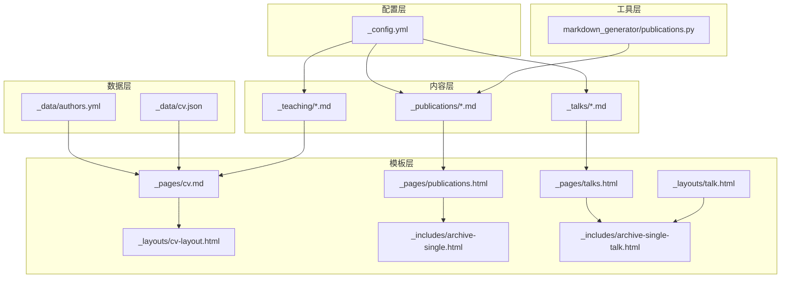
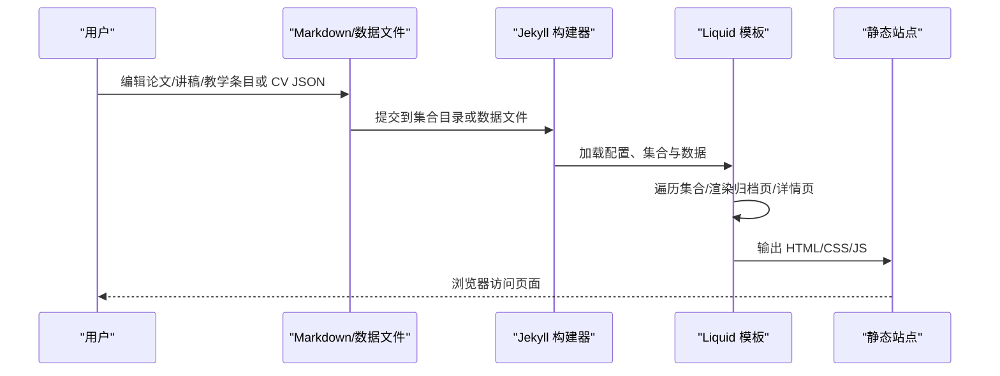
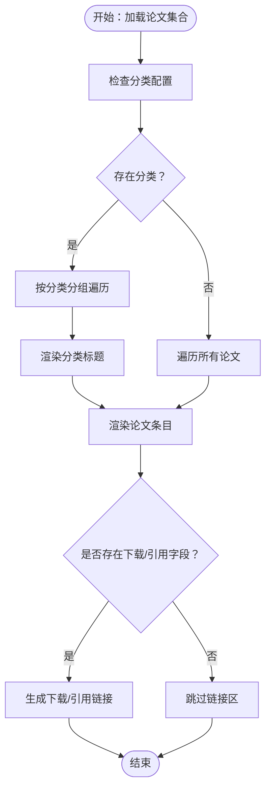
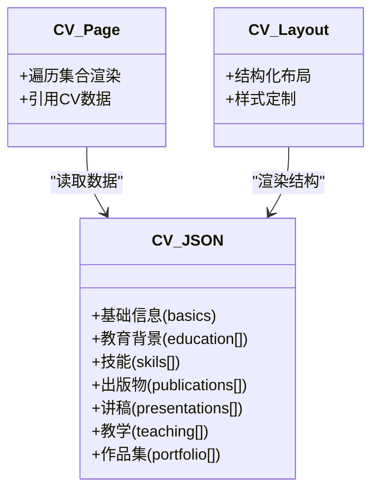
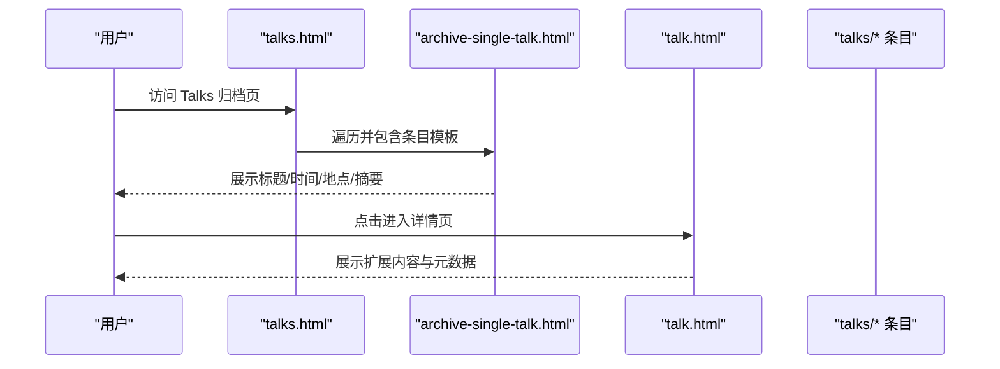
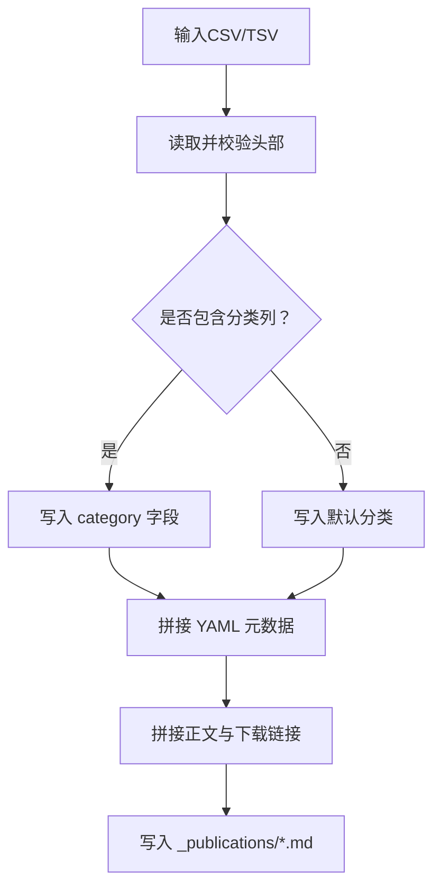
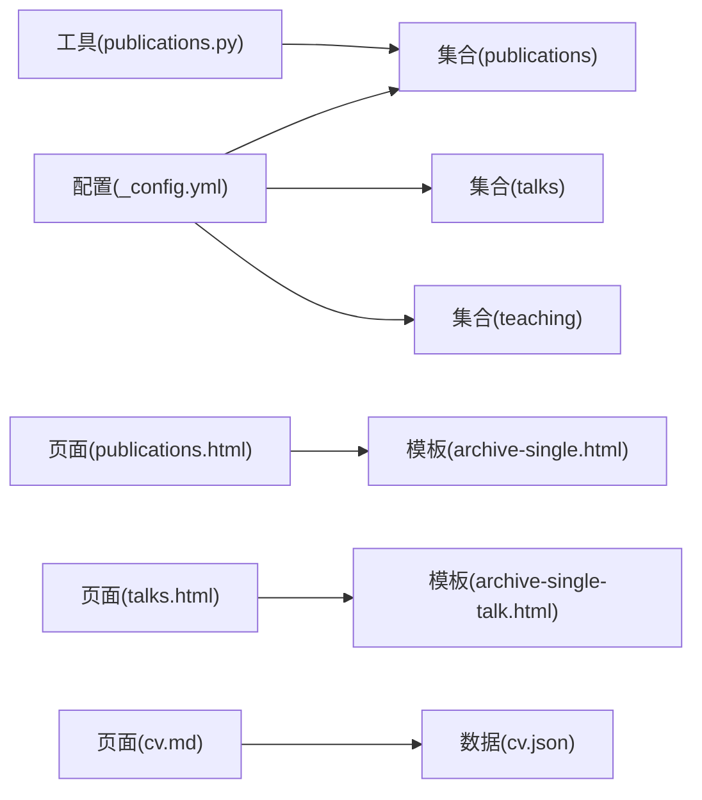

# 学术功能模块

<cite>
**本文引用的文件**
- [_config.yml](file://_config.yml)
- [_data/cv.json](file://_data/cv.json)
- [_data/authors.yml](file://_data/authors.yml)
- [_layouts/cv-layout.html](file://_layouts/cv-layout.html)
- [_layouts/talk.html](file://_layouts/talk.html)
- [_pages/publications.html](file://_pages/publications.html)
- [_pages/talks.html](file://_pages/talks.html)
- [_pages/cv.md](file://_pages/cv.md)
- [_includes/archive-single.html](file://_includes/archive-single.html)
- [_includes/archive-single-talk.html](file://_includes/archive-single-talk.html)
- [_publications/2009-10-01-paper-title-number-1.md](file://_publications/2009-10-01-paper-title-number-1.md)
- [_talks/2012-03-01-talk-1.md](file://_talks/2012-03-01-talk-1.md)
- [markdown_generator/publications.py](file://markdown_generator/publications.py)
</cite>

## 目录
1. [简介](#简介)
2. [项目结构](#项目结构)
3. [核心组件](#核心组件)
4. [架构总览](#架构总览)
5. [详细组件分析](#详细组件分析)
6. [依赖分析](#依赖分析)
7. [性能考虑](#性能考虑)
8. [故障排除指南](#故障排除指南)
9. [结论](#结论)
10. [附录](#附录)

## 简介
本文件为“学术功能模块”的综合技术文档，聚焦以下能力：
- 论文管理：论文条目的创建、分类与展示（含按类别分组）。
- 简历生成：基于 JSON 的 CV 页面渲染与个性化定制。
- 会议展示：学术会议与演讲的组织与展示。
- 数据结构与显示逻辑：论文、讲稿、教学等集合的数据模型与模板渲染规则。
- 最佳实践与工作流程：从数据输入到页面输出的完整链路。

本模块基于 Jekyll 静态站点框架，通过集合（collections）、数据文件（data files）与 Liquid 模板实现学术内容的自动化管理与展示。

## 项目结构
学术功能模块由以下关键部分组成：
- 配置层：Jekyll 配置文件定义集合、默认布局、分类体系与插件。
- 数据层：作者信息与 CV 结构化数据。
- 内容层：论文、讲稿、教学等集合条目，采用 Markdown 前言元数据驱动。
- 模板层：归档页与单页模板，负责内容渲染与链接生成。
- 工具层：Markdown 生成脚本，用于批量生成论文条目。

图表来源
- [_config.yml:223-236](file://_config.yml#L223-L236)
- [_pages/publications.html:1-37](file://_pages/publications.html#L1-L37)
- [_pages/talks.html:1-17](file://_pages/talks.html#L1-L17)
- [_pages/cv.md:1-65](file://_pages/cv.md#L1-L65)
- [_layouts/talk.html:1-79](file://_layouts/talk.html#L1-L79)
- [_layouts/cv-layout.html:1-40](file://_layouts/cv-layout.html#L1-L40)
- [_includes/archive-single.html:1-85](file://_includes/archive-single.html#L1-L85)
- [_includes/archive-single-talk.html:1-43](file://_includes/archive-single-talk.html#L1-L43)
- [markdown_generator/publications.py:1-120](file://markdown_generator/publications.py#L1-L120)

章节来源
- [_config.yml:223-236](file://_config.yml#L223-L236)
- [_pages/publications.html:1-37](file://_pages/publications.html#L1-L37)
- [_pages/talks.html:1-17](file://_pages/talks.html#L1-L17)
- [_pages/cv.md:1-65](file://_pages/cv.md#L1-L65)
- [_layouts/talk.html:1-79](file://_layouts/talk.html#L1-L79)
- [_layouts/cv-layout.html:1-40](file://_layouts/cv-layout.html#L1-L40)
- [_includes/archive-single.html:1-85](file://_includes/archive-single.html#L1-L85)
- [_includes/archive-single-talk.html:1-43](file://_includes/archive-single-talk.html#L1-L43)
- [markdown_generator/publications.py:1-120](file://markdown_generator/publications.py#L1-L120)

## 核心组件
- 论文集合与分类
  - 在配置中声明集合 publications，并设置默认布局与链接格式。
  - 支持按类别（如 manuscripts、conferences）分组展示。
- 会议/讲稿集合
  - 声明 talks 集合，使用 talk.html 布局渲染详情页。
- 教学与简历
  - 教学经验在 CV 页面中以列表形式渲染。
  - CV 页面可直接引用集合条目，或通过 JSON 数据驱动。
- 数据文件
  - authors.yml 提供作者信息，用于侧边栏与作者档案。
  - cv.json 定义 CV 的结构化数据（基本信息、教育背景、技能、出版物、讲稿、教学、作品集等）。

章节来源
- [_config.yml:223-236](file://_config.yml#L223-L236)
- [_config.yml:85-93](file://_config.yml#L85-L93)
- [_pages/publications.html:14-33](file://_pages/publications.html#L14-L33)
- [_pages/talks.html:1-17](file://_pages/talks.html#L1-L17)
- [_pages/cv.md:1-65](file://_pages/cv.md#L1-L65)
- [_data/authors.yml:1-19](file://_data/authors.yml#L1-L19)
- [_data/cv.json:1-153](file://_data/cv.json#L1-L153)

## 架构总览
学术模块的运行时数据流如下：
- 用户维护 Markdown 条目（论文、讲稿、教学）或结构化数据（CV JSON）。
- Jekyll 构建时读取配置、集合与数据文件，渲染归档页与详情页。
- 模板通过 Liquid 遍历集合，根据前言元数据生成标题、日期、链接与摘要。
- 工具脚本可批量生成符合规范的论文条目，提升内容管理效率。

图表来源
- [_config.yml:223-236](file://_config.yml#L223-L236)
- [_pages/publications.html:14-33](file://_pages/publications.html#L14-L33)
- [_pages/talks.html:14-16](file://_pages/talks.html#L14-L16)
- [_includes/archive-single.html:1-85](file://_includes/archive-single.html#L1-L85)
- [_includes/archive-single-talk.html:1-43](file://_includes/archive-single-talk.html#L1-L43)
- [_data/cv.json:1-153](file://_data/cv.json#L1-L153)

## 详细组件分析

### 论文管理组件
- 数据结构
  - 条目前言字段：标题、集合标识、分类、永久链接、摘要、日期、期刊、下载链接、推荐引用、BibTeX 链接等。
  - 分类体系：通过 category 字段区分书籍、手稿、会议论文等。
- 显示逻辑
  - 归档页按分类遍历集合，先输出分类标题，再逐条渲染。
  - 单页模板根据字段组合生成“推荐引用”与下载链接。
- 交互方式
  - 列表页点击标题进入详情页；详情页可包含扩展说明与引用信息。

图表来源
- [_pages/publications.html:14-33](file://_pages/publications.html#L14-L33)
- [_includes/archive-single.html:55-81](file://_includes/archive-single.html#L55-L81)
- [_publications/2009-10-01-paper-title-number-1.md:1-15](file://_publications/2009-10-01-paper-title-number-1.md#L1-L15)

章节来源
- [_config.yml:85-93](file://_config.yml#L85-L93)
- [_pages/publications.html:14-33](file://_pages/publications.html#L14-L33)
- [_includes/archive-single.html:55-81](file://_includes/archive-single.html#L55-L81)
- [_publications/2009-10-01-paper-title-number-1.md:1-15](file://_publications/2009-10-01-paper-title-number-1.md#L1-L15)

### 简历生成组件
- 数据结构
  - 基础信息（姓名、邮箱、电话、网站、摘要、地址）、社交资料、教育背景、技能、语言、兴趣、参考、出版物、讲稿、教学、作品集等。
- 渲染方式
  - 传统 Markdown 方式：CV 页面直接遍历集合（论文、讲稿、教学）并渲染。
  - JSON 方式：通过 cv.json 作为数据源，结合 cv-layout.html 进行结构化渲染。
- 个性化定制
  - 可通过修改 cv.json 字段与 cv-layout.html 模板实现样式与内容的灵活调整。

图表来源
- [_data/cv.json:1-153](file://_data/cv.json#L1-L153)
- [_pages/cv.md:1-65](file://_pages/cv.md#L1-L65)
- [_layouts/cv-layout.html:1-40](file://_layouts/cv-layout.html#L1-L40)

章节来源
- [_data/cv.json:1-153](file://_data/cv.json#L1-L153)
- [_pages/cv.md:1-65](file://_pages/cv.md#L1-L65)
- [_layouts/cv-layout.html:1-40](file://_layouts/cv-layout.html#L1-L40)

### 会议展示组件
- 数据结构
  - 标题、集合、类型（Talk/Tutorial）、永久链接、地点、日期、描述等。
- 显示逻辑
  - 归档页遍历 talks 集合，渲染标题、时间、地点与摘要。
  - 详情页使用 talk.html 布局，展示扩展内容与分享功能。
- 地图集成
  - 可选开启 talkmap 链接，便于可视化展示演讲足迹。

图表来源
- [_pages/talks.html:14-16](file://_pages/talks.html#L14-L16)
- [_includes/archive-single-talk.html:1-43](file://_includes/archive-single-talk.html#L1-L43)
- [_layouts/talk.html:1-79](file://_layouts/talk.html#L1-L79)
- [_talks/2012-03-01-talk-1.md:1-12](file://_talks/2012-03-01-talk-1.md#L1-L12)

章节来源
- [_pages/talks.html:1-17](file://_pages/talks.html#L1-L17)
- [_includes/archive-single-talk.html:1-43](file://_includes/archive-single-talk.html#L1-L43)
- [_layouts/talk.html:1-79](file://_layouts/talk.html#L1-L79)
- [_talks/2012-03-01-talk-1.md:1-12](file://_talks/2012-03-01-talk-1.md#L1-L12)

### 论文条目批量生成工具
- 功能概述
  - 读取 CSV/TSV 文件，按固定列名生成符合规范的论文 Markdown 条目。
  - 自动处理 YAML 转义、分类字段与永久链接命名。
- 使用流程
  - 准备数据文件（含日期、标题、期刊、摘要、引用、URL slug、PDF/幻灯片链接等）。
  - 执行脚本，生成对应 Markdown 文件至 _publications 目录。
  - 通过 Jekyll 构建后自动出现在论文归档页。

图表来源
- [markdown_generator/publications.py:37-71](file://markdown_generator/publications.py#L37-L71)
- [markdown_generator/publications.py:76-103](file://markdown_generator/publications.py#L76-L103)
- [markdown_generator/publications.py:105-120](file://markdown_generator/publications.py#L105-L120)

章节来源
- [markdown_generator/publications.py:1-120](file://markdown_generator/publications.py#L1-L120)

## 依赖分析
- 配置对集合的依赖
  - 配置文件声明 publications、talks、teaching 等集合，决定构建时的条目索引与链接规则。
- 模板对集合的依赖
  - 归档页通过 for 循环遍历集合，模板包含负责具体条目渲染。
- 数据文件对页面的依赖
  - CV 页面可直接引用集合，也可通过 cv.json 提供结构化数据。
- 工具对内容的依赖
  - 生成脚本依赖数据文件的列名与格式，确保输出的条目符合 Jekyll 规范。

图表来源
- [_config.yml:223-236](file://_config.yml#L223-L236)
- [_pages/publications.html:14-33](file://_pages/publications.html#L14-L33)
- [_pages/talks.html:14-16](file://_pages/talks.html#L14-L16)
- [_pages/cv.md:1-65](file://_pages/cv.md#L1-L65)
- [_includes/archive-single.html:1-85](file://_includes/archive-single.html#L1-L85)
- [_includes/archive-single-talk.html:1-43](file://_includes/archive-single-talk.html#L1-L43)
- [_data/cv.json:1-153](file://_data/cv.json#L1-L153)
- [markdown_generator/publications.py:1-120](file://markdown_generator/publications.py#L1-L120)

章节来源
- [_config.yml:223-236](file://_config.yml#L223-L236)
- [_pages/publications.html:14-33](file://_pages/publications.html#L14-L33)
- [_pages/talks.html:14-16](file://_pages/talks.html#L14-L16)
- [_pages/cv.md:1-65](file://_pages/cv.md#L1-L65)
- [_includes/archive-single.html:1-85](file://_includes/archive-single.html#L1-L85)
- [_includes/archive-single-talk.html:1-43](file://_includes/archive-single-talk.html#L1-L43)
- [_data/cv.json:1-153](file://_data/cv.json#L1-L153)
- [markdown_generator/publications.py:1-120](file://markdown_generator/publications.py#L1-L120)

## 性能考虑
- 构建时优化
  - 合理控制集合条目数量，避免单页渲染压力过大。
  - 使用压缩与缓存策略减少输出体积。
- 模板渲染
  - 将重复逻辑抽取到包含模板，减少重复计算。
- 外部资源
  - 下载链接与外部资源应尽量使用 HTTPS，避免阻塞。
- 数据规模
  - 对于大规模 CV 数据，优先采用 JSON 方案，配合前端轻量渲染。

## 故障排除指南
- 论文未显示在归档页
  - 检查条目前言中的集合与分类字段是否正确。
  - 确认文件命名与日期前缀符合要求。
- 分类标题不显示
  - 确保配置中已定义 publication_category 并与条目分类一致。
- 讲稿详情页缺少元数据
  - 检查 talk.html 模板中日期、地点、类型字段是否被正确渲染。
- CV 页面空白或报错
  - 检查 cv.json 格式与字段完整性；确认 cv.md 中集合引用路径正确。
- 批量生成失败
  - 确认输入文件列名与脚本期望一致；检查日期格式与 URL 链接有效性。

章节来源
- [_pages/publications.html:14-33](file://_pages/publications.html#L14-L33)
- [_layouts/talk.html:30-40](file://_layouts/talk.html#L30-L40)
- [_pages/cv.md:1-65](file://_pages/cv.md#L1-L65)
- [_data/cv.json:1-153](file://_data/cv.json#L1-L153)
- [markdown_generator/publications.py:76-103](file://markdown_generator/publications.py#L76-L103)

## 结论
本学术功能模块通过清晰的集合与数据结构设计，实现了论文、讲稿、教学与 CV 的高效管理与展示。借助模板与工具链，用户可以快速批量生成条目并保持一致的外观与交互体验。建议在实际使用中遵循统一的数据规范与工作流程，以获得最佳的维护性与扩展性。

## 附录
- 最佳实践与工作流程建议
  - 统一数据格式：论文与讲稿条目前言字段保持一致，便于模板复用。
  - 分类治理：在配置中明确分类体系，避免条目分类不一致导致的渲染异常。
  - 版本控制：将数据文件与 Markdown 条目纳入版本管理，便于追踪变更。
  - 自动化：使用生成脚本批量导入数据，减少手工录入错误。
  - 样式一致性：通过 cv-layout.html 与归档模板统一风格，必要时引入主题变量。
  - 发布验证：构建前后核对关键页面（论文、讲稿、CV），确保链接与元数据正确。