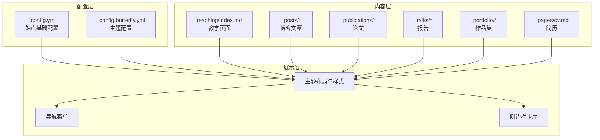
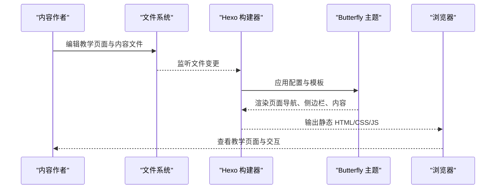
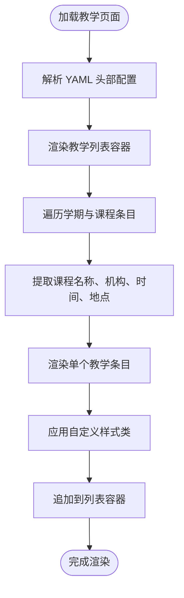
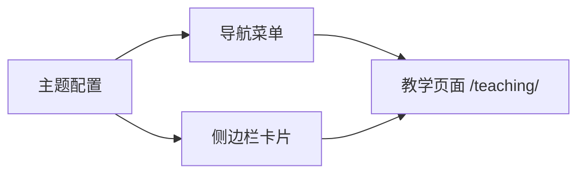
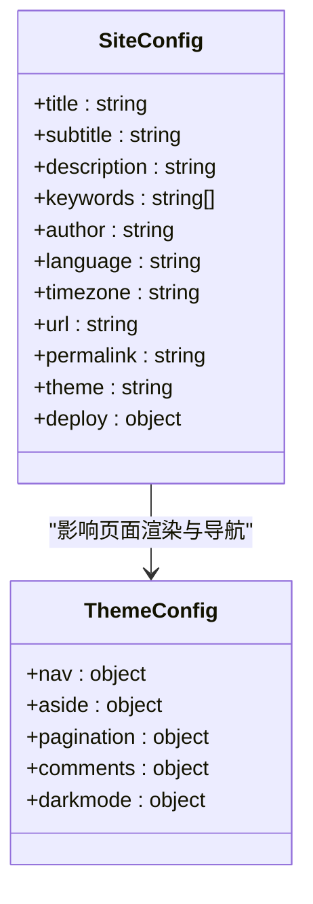
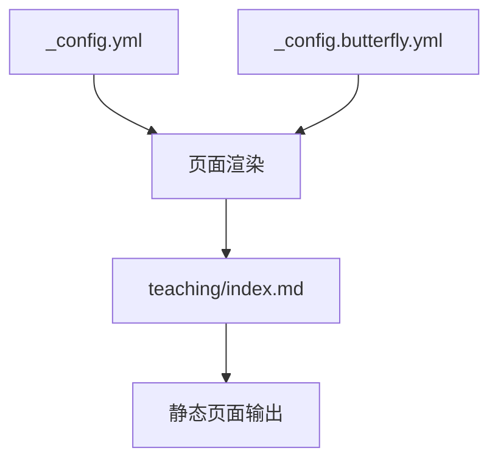

# 教学材料管理

<cite>
**本文档引用的文件**
- [hexo-site/_config.yml](file://hexo-site/_config.yml)
- [hexo-site/_config.butterfly.yml](file://hexo-site/_config.butterfly.yml)
- [hexo-site/source/teaching/index.md](file://hexo-site/source/teaching/index.md)
</cite>

## 目录
1. [引言](#引言)
2. [项目结构](#项目结构)
3. [核心组件](#核心组件)
4. [架构概览](#架构概览)
5. [详细组件分析](#详细组件分析)
6. [依赖关系分析](#依赖关系分析)
7. [性能考虑](#性能考虑)
8. [故障排除指南](#故障排除指南)
9. [结论](#结论)

## 引言

本文件针对该学术个人网站的教学材料管理功能进行系统性文档化。当前仓库采用 Jekyll/Hugo 生态（通过 hexo-site 目录体现），教学内容主要通过 Markdown 文件组织，结合主题配置实现展示与导航。文档重点覆盖以下方面：

- 教学课程与指导材料的组织结构：课程名称、学期时间、教学大纲与参考资料的呈现方式
- 教学内容的分类体系与展示方式：基于页面布局与主题样式的组织
- 教学内容的上传、管理与访问控制：基于静态站点生成与文件系统管理
- 教学评估与反馈机制的集成：评论系统的可扩展性
- 教学内容管理的工作流程：材料更新、进度跟踪与学生互动

## 项目结构

该教学材料管理功能位于 hexo-site 子项目中，采用 Hexo 主题（Butterfly）驱动的静态站点生成架构。关键结构如下：

- 配置层
  - 站点基础配置：站点标题、语言、时区、URL 规则等
  - 主题配置：导航菜单、侧边栏卡片、分页、评论等主题特性
- 内容层
  - 教学页面：teaching/index.md 提供教学经历的展示入口
  - 其他内容类型：博客文章、论文、报告、作品集、简历等
- 展示层
  - 布局与样式：通过主题样式与自定义 CSS 实现教学内容的排版与视觉呈现

**图表来源**
- [hexo-site/_config.yml:1-110](file://hexo-site/_config.yml#L1-L110)
- [hexo-site/_config.butterfly.yml:1-339](file://hexo-site/_config.butterfly.yml#L1-L339)
- [hexo-site/source/teaching/index.md:1-53](file://hexo-site/source/teaching/index.md#L1-L53)

**章节来源**
- [hexo-site/_config.yml:1-110](file://hexo-site/_config.yml#L1-L110)
- [hexo-site/_config.butterfly.yml:1-339](file://hexo-site/_config.butterfly.yml#L1-L339)
- [hexo-site/source/teaching/index.md:1-53](file://hexo-site/source/teaching/index.md#L1-L53)

## 核心组件

- 站点配置（_config.yml）
  - 定义站点元数据（标题、副标题、描述、关键词）、URL 结构、分页规则、写作参数等
  - 影响所有页面的统一风格与行为
- 主题配置（_config.butterfly.yml）
  - 导航菜单包含“教学”入口，指向 /teaching/ 路径
  - 侧边栏卡片支持作者信息、公告、近期文章、分类、标签、归档等
  - 支持分页、评论、数学公式、暗色模式等主题特性
- 教学页面（source/teaching/index.md）
  - 使用 YAML 头部声明页面类型为 "teaching"，布局为 "page"
  - 包含教学经历列表的结构化展示，使用自定义 CSS 类进行样式控制

这些组件共同构成教学材料管理的基础：配置层确保一致性和可维护性，内容层承载教学信息，展示层通过主题样式实现美观呈现。

**章节来源**
- [hexo-site/_config.yml:1-110](file://hexo-site/_config.yml#L1-L110)
- [hexo-site/_config.butterfly.yml:16-25](file://hexo-site/_config.butterfly.yml#L16-L25)
- [hexo-site/source/teaching/index.md:1-53](file://hexo-site/source/teaching/index.md#L1-L53)

## 架构概览

教学材料管理采用静态站点生成架构，核心流程如下：

该流程体现了教学内容从创作到发布的完整闭环：作者在本地编辑 Markdown 文件，Hexo 根据配置与主题模板渲染页面，最终以静态资源形式发布。

**图表来源**
- [hexo-site/_config.yml:1-110](file://hexo-site/_config.yml#L1-L110)
- [hexo-site/_config.butterfly.yml:16-25](file://hexo-site/_config.butterfly.yml#L16-L25)
- [hexo-site/source/teaching/index.md:1-53](file://hexo-site/source/teaching/index.md#L1-L53)

## 详细组件分析

### 教学页面（teaching/index.md）

- 页面头部配置
  - 类型：teaching
  - 布局：page
  - 禁用评论：false（可根据需要调整）
- 内容结构
  - 教学经历列表容器：teaching-list
  - 学期与课程条目：按年份与学期分组
  - 课程信息：课程名称、机构与部门、时间与地点
  - 描述文本：支持 Markdown 格式
- 样式控制
  - 自定义 CSS 类：teaching-list、teaching-item、teaching-title、teaching-venue
  - 通过内联样式实现间距、字体权重与颜色控制

**图表来源**
- [hexo-site/source/teaching/index.md:1-53](file://hexo-site/source/teaching/index.md#L1-L53)

**章节来源**
- [hexo-site/source/teaching/index.md:1-53](file://hexo-site/source/teaching/index.md#L1-L53)

### 导航与侧边栏（_config.butterfly.yml）

- 导航菜单
  - “教学”菜单项指向 /teaching/，确保用户可通过顶部导航访问教学页面
- 侧边栏卡片
  - 作者信息、公告、近期文章、分类、标签、归档等卡片可帮助用户快速定位教学相关内容
- 主题特性
  - 分页、评论、数学公式、暗色模式等特性可按需启用，提升教学页面的可用性与可读性

**图表来源**
- [hexo-site/_config.butterfly.yml:16-25](file://hexo-site/_config.butterfly.yml#L16-L25)
- [hexo-site/_config.butterfly.yml:73-108](file://hexo-site/_config.butterfly.yml#L73-L108)

**章节来源**
- [hexo-site/_config.butterfly.yml:16-25](file://hexo-site/_config.butterfly.yml#L16-L25)
- [hexo-site/_config.butterfly.yml:73-108](file://hexo-site/_config.butterfly.yml#L73-L108)

### 站点配置（_config.yml）

- 站点元数据与 URL 规则
  - 标题、副标题、描述、关键词、作者、语言、时区
  - URL 结构与永久链接格式
- 写作与渲染
  - 新文章命名规则、默认布局、高亮设置、分页数量
- 主题与部署
  - 主题选择（butterfly）
  - 部署配置占位（待填写）

**图表来源**
- [hexo-site/_config.yml:5-110](file://hexo-site/_config.yml#L5-L110)
- [hexo-site/_config.butterfly.yml:10-108](file://hexo-site/_config.butterfly.yml#L10-L108)

**章节来源**
- [hexo-site/_config.yml:5-110](file://hexo-site/_config.yml#L5-L110)
- [hexo-site/_config.butterfly.yml:10-108](file://hexo-site/_config.butterfly.yml#L10-L108)

## 依赖关系分析

教学材料管理功能的关键依赖关系如下：

- 配置文件之间的耦合
  - 站点配置决定整体行为（如分页、高亮、URL 结构）
  - 主题配置决定展示细节（如导航、侧边栏、评论）
- 内容与展示的解耦
  - 教学页面通过 YAML 头部声明类型与布局，主题负责渲染
  - 自定义 CSS 与内联样式用于精确控制教学条目的视觉表现

**图表来源**
- [hexo-site/_config.yml:1-110](file://hexo-site/_config.yml#L1-L110)
- [hexo-site/_config.butterfly.yml:1-339](file://hexo-site/_config.butterfly.yml#L1-L339)
- [hexo-site/source/teaching/index.md:1-53](file://hexo-site/source/teaching/index.md#L1-L53)

**章节来源**
- [hexo-site/_config.yml:1-110](file://hexo-site/_config.yml#L1-L110)
- [hexo-site/_config.butterfly.yml:1-339](file://hexo-site/_config.butterfly.yml#L1-L339)
- [hexo-site/source/teaching/index.md:1-53](file://hexo-site/source/teaching/index.md#L1-L53)

## 性能考虑

- 静态生成优势
  - 教学页面作为静态资源，无需服务器端计算，加载速度快、稳定性高
- 主题与插件优化
  - 合理配置分页与高亮，避免不必要的资源开销
  - 在不需要时禁用评论、数学公式等特性，减少页面体积
- 内容组织建议
  - 将教学材料按学期与课程分类，便于维护与检索
  - 使用简洁的 Markdown 结构，减少复杂渲染逻辑

## 故障排除指南

- 教学页面无法访问
  - 检查主题配置中的导航菜单是否正确指向 /teaching/
  - 确认教学页面的 YAML 头部类型与布局设置
- 样式显示异常
  - 检查自定义 CSS 类名是否与页面结构匹配
  - 确认主题样式未被其他配置覆盖
- 评论或交互功能问题
  - 根据主题配置启用或禁用相应功能
  - 如需外部服务，确保配置正确且网络可达

**章节来源**
- [hexo-site/_config.butterfly.yml:16-25](file://hexo-site/_config.butterfly.yml#L16-L25)
- [hexo-site/source/teaching/index.md:1-53](file://hexo-site/source/teaching/index.md#L1-L53)

## 结论

该教学材料管理功能基于 Hexo 与 Butterfly 主题构建，通过清晰的配置与内容分离实现了教学经历的结构化展示。当前实现具备以下特点：

- 组织结构清晰：按学期与课程条目组织教学信息
- 展示方式直观：通过自定义样式与主题卡片增强可读性
- 管理与访问控制：依托静态站点生成，易于版本控制与权限管理
- 扩展性强：评论系统与主题特性可按需启用，支持教学评估与反馈集成

未来可进一步完善的方向包括：引入更细粒度的分类体系、增强搜索与索引能力、集成评估与反馈模块，以及优化移动端体验。