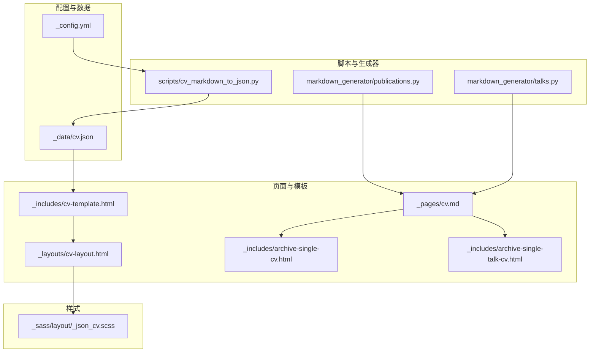
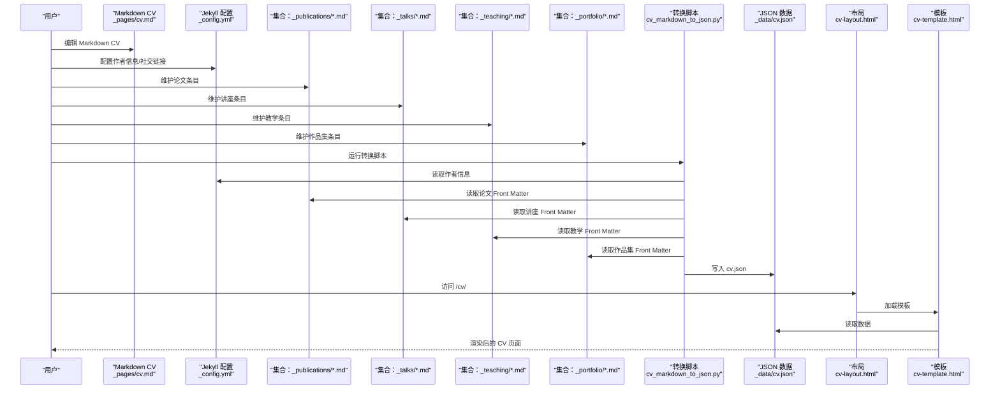
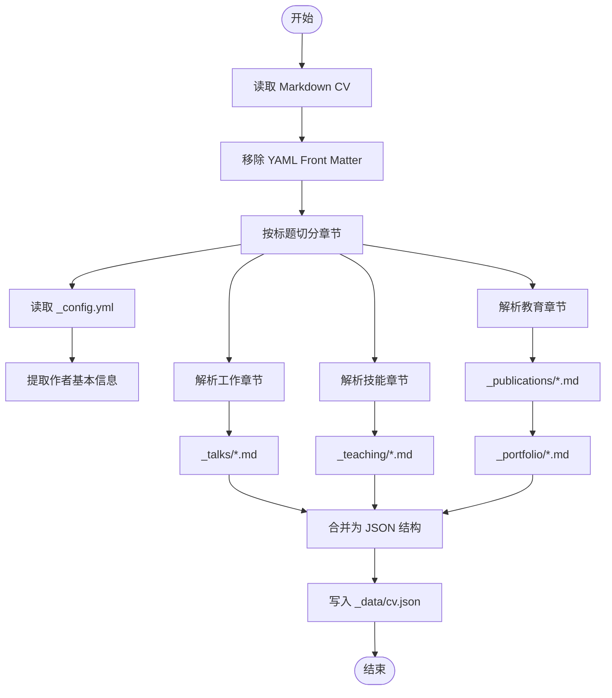
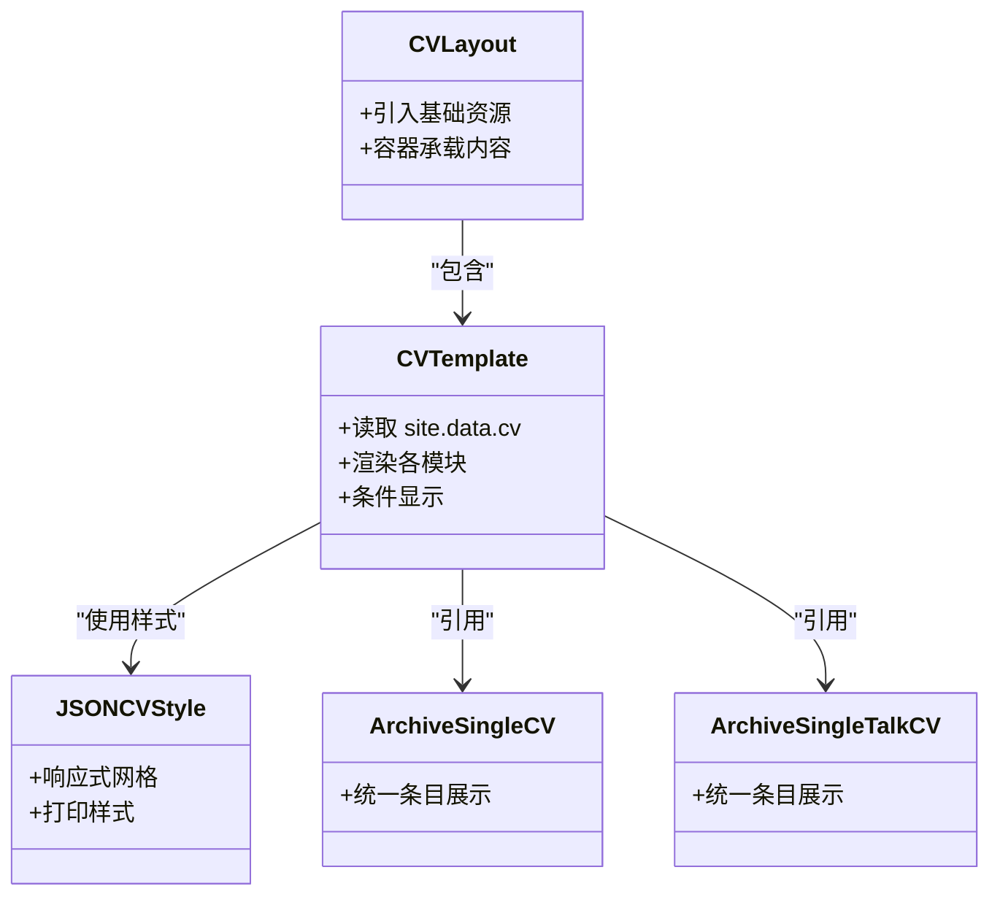
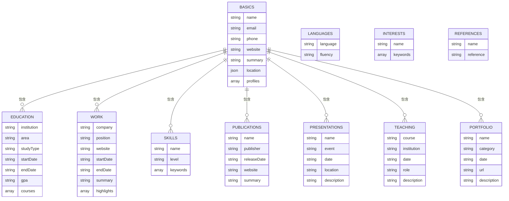
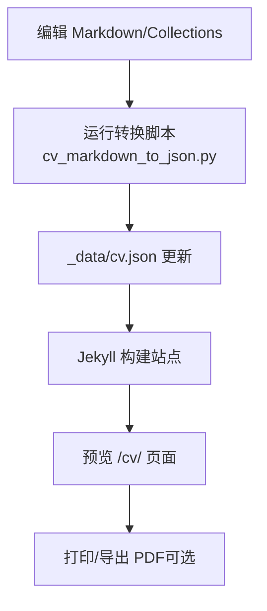
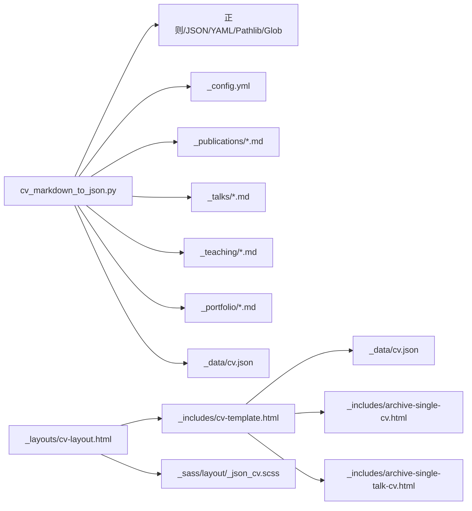

# 简历生成功能

<cite>
**本文档引用的文件**
- [_config.yml](file://_config.yml)
- [_data/cv.json](file://_data/cv.json)
- [_layouts/cv-layout.html](file://_layouts/cv-layout.html)
- [_includes/cv-template.html](file://_includes/cv-template.html)
- [_includes/archive-single-cv.html](file://_includes/archive-single-cv.html)
- [_includes/archive-single-talk-cv.html](file://_includes/archive-single-talk-cv.html)
- [_pages/cv.md](file://_pages/cv.md)
- [_sass/layout/_json_cv.scss](file://_sass/layout/_json_cv.scss)
- [scripts/cv_markdown_to_json.py](file://scripts/cv_markdown_to_json.py)
- [markdown_generator/publications.py](file://markdown_generator/publications.py)
- [markdown_generator/talks.py](file://markdown_generator/talks.py)
</cite>

## 目录
1. [简介](#简介)
2. [项目结构](#项目结构)
3. [核心组件](#核心组件)
4. [架构总览](#架构总览)
5. [详细组件分析](#详细组件分析)
6. [依赖关系分析](#依赖关系分析)
7. [性能考虑](#性能考虑)
8. [故障排除指南](#故障排除指南)
9. [结论](#结论)
10. [附录](#附录)

## 简介
本文件系统性阐述该网站的简历生成功能，重点覆盖以下方面：
- CV 页面的自动生成机制：从 Markdown 到 JSON 的转换流程与数据处理脚本
- 简历数据的结构化存储：教育背景、工作经历、技能专长、出版物列表等模块
- CV 页面的布局设计、样式定制与个性化配置
- 内容管理工作流：数据更新、版本管理与多格式导出思路

## 项目结构
围绕简历生成的关键目录与文件如下：
- 配置与数据
  - Jekyll 配置：[_config.yml] 提供站点基础信息、作者信息、集合配置等
  - 结构化数据：[_data/cv.json] 存储最终渲染使用的 JSON 格式 CV 数据
- 页面与模板
  - 布局：[_layouts/cv-layout.html] 定义 CV 页面整体骨架与资源加载
  - 模板：[_includes/cv-template.html] 将 JSON 数据渲染为 HTML 结构
  - 归档项模板：[_includes/archive-single-cv.html]、[_includes/archive-single-talk-cv.html] 用于 Publications/Talks 等集合的条目展示
  - 主页入口：[_pages/cv.md] 展示“旧版” Markdown CV（作为参考或过渡）
- 脚本与生成器
  - Markdown → JSON 转换：[scripts/cv_markdown_to_json.py]
  - 发表物 Markdown 生成：[markdown_generator/publications.py]
  - 讲座 Markdown 生成：[markdown_generator/talks.py]
- 样式
  - CV 样式：[_sass/layout/_json_cv.scss]

**图表来源**
- [_config.yml](file://_config.yml)
- [_data/cv.json](file://_data/cv.json)
- [_layouts/cv-layout.html](file://_layouts/cv-layout.html)
- [_includes/cv-template.html](file://_includes/cv-template.html)
- [_includes/archive-single-cv.html](file://_includes/archive-single-cv.html)
- [_includes/archive-single-talk-cv.html](file://_includes/archive-single-talk-cv.html)
- [_pages/cv.md](file://_pages/cv.md)
- [scripts/cv_markdown_to_json.py](file://scripts/cv_markdown_to_json.py)
- [markdown_generator/publications.py](file://markdown_generator/publications.py)
- [markdown_generator/talks.py](file://markdown_generator/talks.py)
- [_sass/layout/_json_cv.scss](file://_sass/layout/_json_cv.scss)

**章节来源**
- [_config.yml](file://_config.yml)
- [_data/cv.json](file://_data/cv.json)
- [_layouts/cv-layout.html](file://_layouts/cv-layout.html)
- [_includes/cv-template.html](file://_includes/cv-template.html)
- [_includes/archive-single-cv.html](file://_includes/archive-single-cv.html)
- [_includes/archive-single-talk-cv.html](file://_includes/archive-single-talk-cv.html)
- [_pages/cv.md](file://_pages/cv.md)
- [_sass/layout/_json_cv.scss](file://_sass/layout/_json_cv.scss)
- [scripts/cv_markdown_to_json.py](file://scripts/cv_markdown_to_json.py)
- [markdown_generator/publications.py](file://markdown_generator/publications.py)
- [markdown_generator/talks.py](file://markdown_generator/talks.py)

## 核心组件
- 配置驱动的数据源：通过 [_config.yml] 提供作者信息、社交链接、集合输出等元数据，供转换脚本读取以补全 CV 的 basics 字段
- Markdown 到 JSON 的转换器：[scripts/cv_markdown_to_json.py] 解析 Markdown 中的各节内容，结合 Jekyll 集合（_publications、_talks、_teaching、_portfolio）与配置，生成标准 JSON 结构并写入 [_data/cv.json]
- JSON 渲染模板：[_includes/cv-template.html] 以 Liquid 语法遍历 JSON 数据，按模块渲染教育、工作、技能、出版物、演讲、教学、作品集等板块
- 页面布局与样式：[_layouts/cv-layout.html] 引入基础资源与样式；[_sass/layout/_json_cv.scss] 提供响应式排版、网格布局与打印样式
- 集合归档模板：[_includes/archive-single-cv.html]、[_includes/archive-single-talk-cv.html] 用于 Publications/Talks 在 CV 页面中的条目展示

**章节来源**
- [scripts/cv_markdown_to_json.py](file://scripts/cv_markdown_to_json.py)
- [_data/cv.json](file://_data/cv.json)
- [_includes/cv-template.html](file://_includes/cv-template.html)
- [_layouts/cv-layout.html](file://_layouts/cv-layout.html)
- [_sass/layout/_json_cv.scss](file://_sass/layout/_json_cv.scss)
- [_includes/archive-single-cv.html](file://_includes/archive-single-cv.html)
- [_includes/archive-single-talk-cv.html](file://_includes/archive-single-talk-cv.html)

## 架构总览
简历生成采用“数据驱动 + 模板渲染”的分层架构：
- 数据层：Jekyll 配置与集合（Markdown 文档）构成原始数据；转换脚本将其整合为 JSON
- 处理层：Python 脚本解析 Markdown、提取 YAML Front Matter、拼装 JSON 结构
- 表现层：Liquid 模板读取 JSON 并渲染为 HTML；SCSS 提供样式与主题

**图表来源**
- [_pages/cv.md](file://_pages/cv.md)
- [_config.yml](file://_config.yml)
- [_publications/*.md](file://_publications/)
- [_talks/*.md](file://_talks/)
- [_teaching/*.md](file://_teaching/)
- [_portfolio/*.md](file://_portfolio/)
- [scripts/cv_markdown_to_json.py](file://scripts/cv_markdown_to_json.py)
- [_data/cv.json](file://_data/cv.json)
- [_layouts/cv-layout.html](file://_layouts/cv-layout.html)
- [_includes/cv-template.html](file://_includes/cv-template.html)

## 详细组件分析

### 组件一：Markdown 到 JSON 的转换流程
- 输入
  - Markdown CV 文件：[_pages/cv.md]
  - Jekyll 配置：[_config.yml]
  - 集合目录：_publications、_talks、_teaching、_portfolio
- 处理逻辑
  - 移除 YAML Front Matter 后按标题层级切分章节
  - 解析作者信息（名称、邮箱、网站、位置、摘要、社交资料）
  - 解析教育、工作、技能等章节文本
  - 从集合 Markdown 中提取 Front Matter 生成 Publications/Talks/Teaching/Portfolio 条目
  - 输出标准 JSON 至 [_data/cv.json]
- 关键实现路径
  - 转换主流程与参数解析：[scripts/cv_markdown_to_json.py](file://scripts/cv_markdown_to_json.py)
  - 教育/工作/技能解析函数：同上文件中对应 parse_* 函数
  - 集合解析函数：同上文件中 parse_publications、parse_talks、parse_teaching、parse_portfolio
  - JSON 写入与日期编码：同上文件中 create_cv_json、DateTimeEncoder

**图表来源**
- [scripts/cv_markdown_to_json.py](file://scripts/cv_markdown_to_json.py)
- [_pages/cv.md](file://_pages/cv.md)
- [_config.yml](file://_config.yml)
- [_publications/*.md](file://_publications/)
- [_talks/*.md](file://_talks/)
- [_teaching/*.md](file://_teaching/)
- [_portfolio/*.md](file://_portfolio/)
- [_data/cv.json](file://_data/cv.json)

**章节来源**
- [scripts/cv_markdown_to_json.py](file://scripts/cv_markdown_to_json.py)
- [_pages/cv.md](file://_pages/cv.md)
- [_config.yml](file://_config.yml)

### 组件二：CV 页面布局与模板渲染
- 布局
  - [_layouts/cv-layout.html] 引入基础资源、头部与脚本，容器承载内容区
- 模板
  - [_includes/cv-template.html] 读取 site.data.cv，按模块渲染：基本信息、摘要、教育、工作、技能、出版物、演讲、教学、作品集、语言、兴趣、参考
  - 使用 Liquid 循环与条件判断，确保空字段不渲染
- 归档项模板
  - [_includes/archive-single-cv.html]、[_includes/archive-single-talk-cv.html] 用于 Publications/Talks 条目的统一展示
- 样式
  - [_sass/layout/_json_cv.scss] 提供响应式网格、卡片式条目、打印样式等

**图表来源**
- [_layouts/cv-layout.html](file://_layouts/cv-layout.html)
- [_includes/cv-template.html](file://_includes/cv-template.html)
- [_includes/archive-single-cv.html](file://_includes/archive-single-cv.html)
- [_includes/archive-single-talk-cv.html](file://_includes/archive-single-talk-cv.html)
- [_sass/layout/_json_cv.scss](file://_sass/layout/_json_cv.scss)

**章节来源**
- [_layouts/cv-layout.html](file://_layouts/cv-layout.html)
- [_includes/cv-template.html](file://_includes/cv-template.html)
- [_includes/archive-single-cv.html](file://_includes/archive-single-cv.html)
- [_includes/archive-single-talk-cv.html](file://_includes/archive-single-talk-cv.html)
- [_sass/layout/_json_cv.scss](file://_sass/layout/_json_cv.scss)

### 组件三：数据结构化存储与模块定义
- JSON 数据模型（基于 [_data/cv.json]）
  - basics：姓名、邮箱、电话、网站、摘要、位置、社交资料
  - work：公司、职位、起止时间、描述、亮点
  - education：机构、专业、学位、起止时间、GPA、课程
  - skills：分类、关键词
  - languages：语言、熟练度
  - interests：兴趣点、关键词
  - references：推荐人
  - publications：论文标题、期刊、发布日期、链接、摘要
  - presentations：演讲标题、会议、日期、地点、描述
  - teaching：课程、机构、日期、角色、描述
  - portfolio：项目名称、分类、日期、链接、描述
- 模块渲染策略
  - 每个模块在模板中以独立 section 渲染，未填充则跳过
  - 时间字段通常仅显示年份（如 releaseDate、date）

**图表来源**
- [_data/cv.json](file://_data/cv.json)
- [_includes/cv-template.html](file://_includes/cv-template.html)

**章节来源**
- [_data/cv.json](file://_data/cv.json)
- [_includes/cv-template.html](file://_includes/cv-template.html)

### 组件四：内容管理与导出工作流
- 数据更新
  - 更新作者信息：编辑 [_config.yml] 中 author 字段
  - 新增/修改集合条目：在 _publications、_talks、_teaching、_portfolio 下新增 Markdown 文件（遵循 Front Matter 规范）
  - 更新 Markdown CV：编辑 [_pages/cv.md] 对应章节
- 版本管理
  - 建议对 _data/cv.json、集合 Markdown、模板文件进行版本控制
  - 可通过脚本自动化生成 JSON，减少手工维护
- 多格式导出
  - 当前系统以 JSON + Liquid 模板渲染为主
  - 如需 PDF 导出，可在本地或 CI 中集成静态站点构建后，使用浏览器打印或第三方工具进行 PDF 转换（概念性建议，非现有实现）

**图表来源**
- [scripts/cv_markdown_to_json.py](file://scripts/cv_markdown_to_json.py)
- [_data/cv.json](file://_data/cv.json)
- [_pages/cv.md](file://_pages/cv.md)
- [_publications/*.md](file://_publications/)
- [_talks/*.md](file://_talks/)
- [_teaching/*.md](file://_teaching/)
- [_portfolio/*.md](file://_portfolio/)

**章节来源**
- [scripts/cv_markdown_to_json.py](file://scripts/cv_markdown_to_json.py)
- [_data/cv.json](file://_data/cv.json)
- [_pages/cv.md](file://_pages/cv.md)

### 组件五：样式定制与个性化配置
- 主题与变量
  - SCSS 变量控制字体、颜色、边框等，便于切换主题
- 响应式设计
  - 技能与兴趣模块采用 CSS Grid 自适应布局
- 打印优化
  - 提供打印样式，简化边框与背景色，提升可读性
- 个性化
  - 可通过修改 SCSS 变量与模板结构实现不同风格的 CV 呈现

**章节来源**
- [_sass/layout/_json_cv.scss](file://_sass/layout/_json_cv.scss)
- [_includes/cv-template.html](file://_includes/cv-template.html)

## 依赖关系分析
- 脚本依赖
  - Python 脚本依赖标准库（正则、YAML、JSON、路径、glob、日期），无需额外第三方依赖
- 模板依赖
  - Liquid 模板依赖 Jekyll 的 site.data 与 collections
- 样式依赖
  - SCSS 依赖变量体系，支持主题切换

**图表来源**
- [scripts/cv_markdown_to_json.py](file://scripts/cv_markdown_to_json.py)
- [_config.yml](file://_config.yml)
- [_publications/*.md](file://_publications/)
- [_talks/*.md](file://_talks/)
- [_teaching/*.md](file://_teaching/)
- [_portfolio/*.md](file://_portfolio/)
- [_data/cv.json](file://_data/cv.json)
- [_layouts/cv-layout.html](file://_layouts/cv-layout.html)
- [_includes/cv-template.html](file://_includes/cv-template.html)
- [_includes/archive-single-cv.html](file://_includes/archive-single-cv.html)
- [_includes/archive-single-talk-cv.html](file://_includes/archive-single-talk-cv.html)
- [_sass/layout/_json_cv.scss](file://_sass/layout/_json_cv.scss)

**章节来源**
- [scripts/cv_markdown_to_json.py](file://scripts/cv_markdown_to_json.py)
- [_layouts/cv-layout.html](file://_layouts/cv-layout.html)
- [_includes/cv-template.html](file://_includes/cv-template.html)
- [_sass/layout/_json_cv.scss](file://_sass/layout/_json_cv.scss)

## 性能考虑
- 转换脚本
  - 正则匹配与文件扫描复杂度与输入规模线性相关，建议保持 Markdown 结构简洁
  - JSON 写入为一次性操作，I/O 成本低
- 模板渲染
  - Liquid 循环与条件判断开销较小，适合中等规模数据
  - 建议避免在模板中进行复杂计算，将处理前置到脚本阶段
- 样式
  - SCSS 编译后为静态 CSS，构建时一次编译，运行时零开销

## 故障排除指南
- 转换失败
  - 检查输入 Markdown 是否包含合法的章节标题与格式
  - 确认集合 Markdown 的 Front Matter 是否完整且符合预期字段
  - 查看脚本输出的提示信息，定位具体模块
- 数据未更新
  - 确认脚本已正确执行并写入 [_data/cv.json]
  - 检查 Jekyll 构建是否包含 _data 目录
- 模板渲染异常
  - 确认 JSON 字段命名与模板一致
  - 检查 Liquid 语法与条件判断
- 样式问题
  - 确认 SCSS 变量定义与主题设置一致
  - 检查浏览器缓存与构建产物

**章节来源**
- [scripts/cv_markdown_to_json.py](file://scripts/cv_markdown_to_json.py)
- [_data/cv.json](file://_data/cv.json)
- [_includes/cv-template.html](file://_includes/cv-template.html)
- [_sass/layout/_json_cv.scss](file://_sass/layout/_json_cv.scss)

## 结论
该简历生成功能以“配置 + 集合 + 脚本 + 模板”的模式实现了从 Markdown 到 JSON 再到 HTML 的自动化流水线。其优势在于：
- 数据与表现分离，易于维护与扩展
- 通过脚本集中处理数据整合，降低模板复杂度
- 模板与样式解耦，便于主题化与个性化

建议后续可考虑：
- 增加 JSON Schema 校验，提升数据质量
- 在 CI 中集成自动构建与校验流程
- 提供多格式导出（PDF）的自动化方案

## 附录
- 发表物与讲座谈的 Markdown 生成器
  - 发表物生成器：[markdown_generator/publications.py](file://markdown_generator/publications.py)
  - 讲座生成器：[markdown_generator/talks.py](file://markdown_generator/talks.py)

**章节来源**
- [markdown_generator/publications.py](file://markdown_generator/publications.py)
- [markdown_generator/talks.py](file://markdown_generator/talks.py)