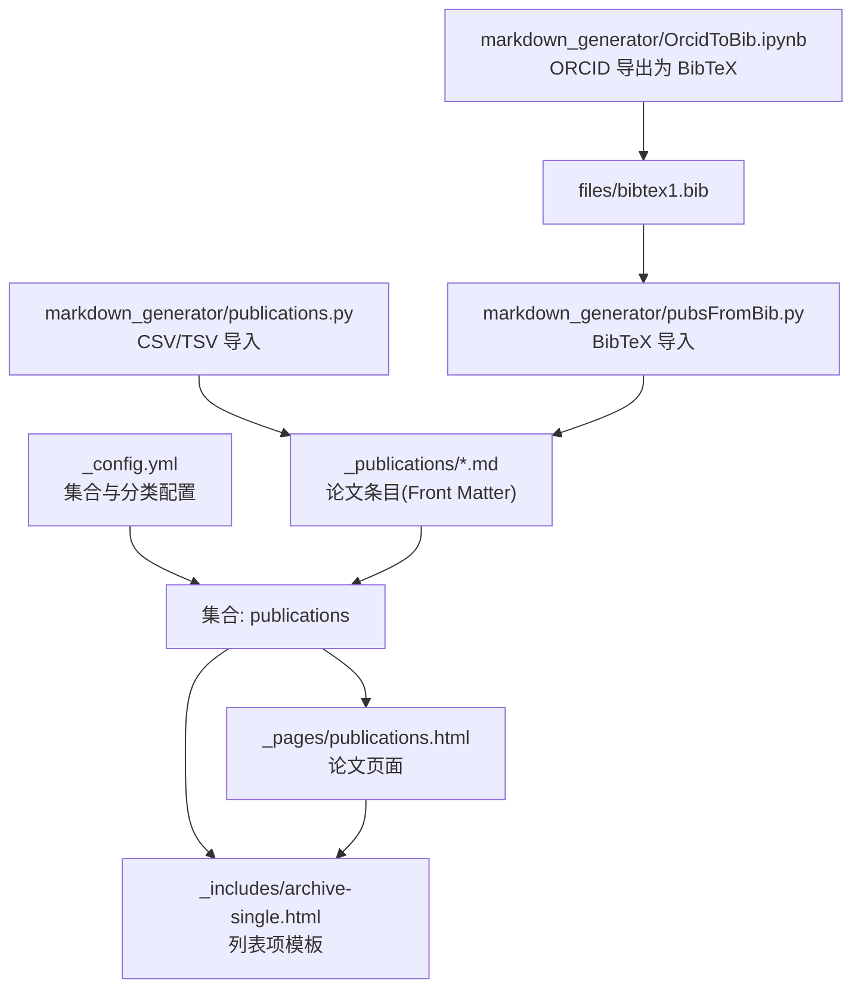
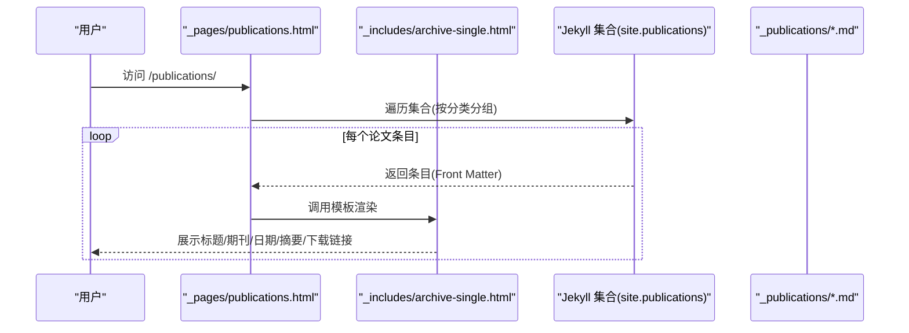
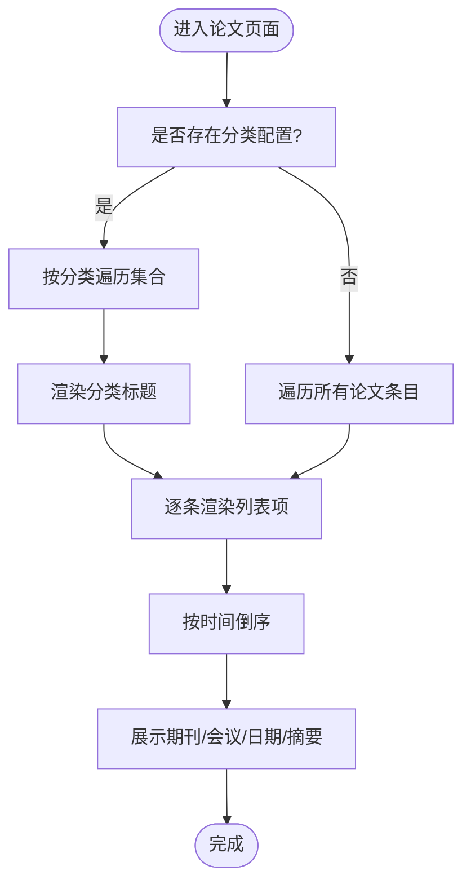
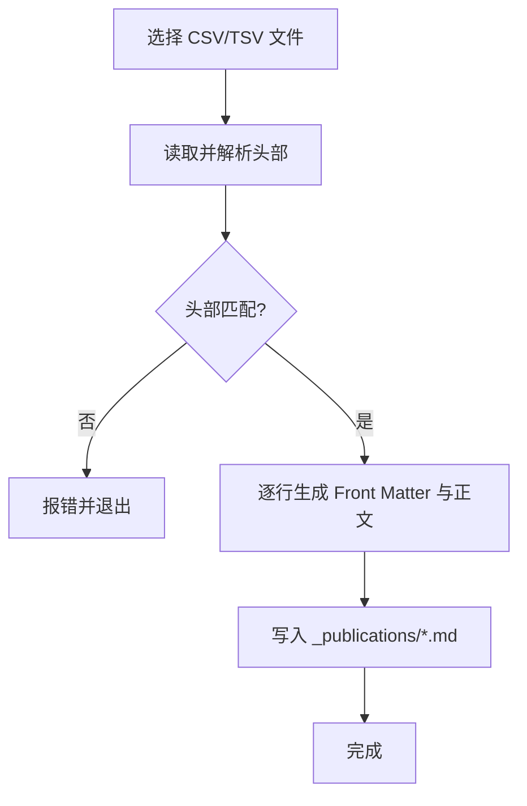
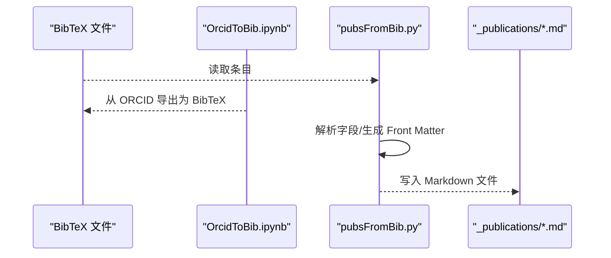
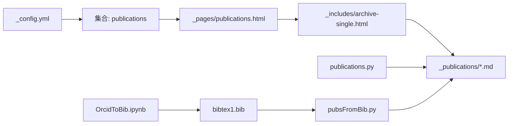

# 论文管理功能

<cite>
**本文档引用的文件**
- [_config.yml](file://_config.yml)
- [_pages/publications.html](file://_pages/publications.html)
- [_includes/archive-single.html](file://_includes/archive-single.html)
- [_publications/2009-10-01-paper-title-number-1.md](file://_publications/2009-10-01-paper-title-number-1.md)
- [_publications/2010-10-01-paper-title-number-2.md](file://_publications/2010-10-01-paper-title-number-2.md)
- [_publications/2015-10-01-paper-title-number-3.md](file://_publications/2015-10-01-paper-title-number-3.md)
- [_publications/2024-02-17-paper-title-number-4.md](file://_publications/2024-02-17-paper-title-number-4.md)
- [_publications/2025-06-08-paper-title-number-5.md](file://_publications/2025-06-08-paper-title-number-5.md)
- [markdown_generator/publications.py](file://markdown_generator/publications.py)
- [markdown_generator/publications.csv](file://markdown_generator/publications.csv)
- [markdown_generator/publications.ipynb](file://markdown_generator/publications.ipynb)
- [markdown_generator/pubsFromBib.py](file://markdown_generator/pubsFromBib.py)
- [files/bibtex1.bib](file://files/bibtex1.bib)
- [markdown_generator/OrcidToBib.ipynb](file://markdown_generator/OrcidToBib.ipynb)
</cite>

## 目录
1. [简介](#简介)
2. [项目结构](#项目结构)
3. [核心组件](#核心组件)
4. [架构总览](#架构总览)
5. [详细组件分析](#详细组件分析)
6. [依赖关系分析](#依赖关系分析)
7. [性能考虑](#性能考虑)
8. [故障排除指南](#故障排除指南)
9. [结论](#结论)
10. [附录](#附录)

## 简介
本文件系统性阐述该网站的论文管理功能，覆盖论文条目的数据结构与 Front Matter 配置、论文列表的展示逻辑与排序规则、过滤机制、创建流程与批量导入方法、数据验证规则，以及最佳实践（引用格式标准化、版本控制与备份策略）。读者无需深入技术背景即可理解并使用。

## 项目结构
论文管理功能由以下部分组成：
- 配置层：通过站点配置定义集合类型、默认布局与分类体系
- 内容层：以 Markdown 文件形式存储论文条目，采用 Front Matter 描述元数据
- 模板层：通过包含模板渲染列表项与详情页
- 批量生成器：支持从 CSV/TSV 或 BibTeX 导入并生成论文条目

图表来源
- [_config.yml:223-236](file://_config.yml#L223-L236)
- [_pages/publications.html:14-33](file://_pages/publications.html#L14-L33)
- [_includes/archive-single.html:43-47](file://_includes/archive-single.html#L43-L47)
- [markdown_generator/publications.py:37-71](file://markdown_generator/publications.py#L37-L71)
- [markdown_generator/pubsFromBib.py:57-156](file://markdown_generator/pubsFromBib.py#L57-L156)
- [files/bibtex1.bib:1-11](file://files/bibtex1.bib#L1-L11)

章节来源
- [_config.yml:223-236](file://_config.yml#L223-L236)
- [_pages/publications.html:14-33](file://_pages/publications.html#L14-L33)
- [_includes/archive-single.html:43-47](file://_includes/archive-single.html#L43-L47)

## 核心组件
- 论文集合与分类
  - 在配置中声明集合类型与永久链接规则，启用论文集合输出与分类展示
- 列表页面与模板
  - 页面按分类分组渲染；模板根据集合类型选择不同的展示样式与元信息
- 论文条目（Front Matter）
  - 包含标题、分类、永久链接、摘要、日期、期刊、论文/讲义/文献下载链接、推荐引用等字段
- 批量生成器
  - 支持 CSV/TSV 与 BibTeX 输入，自动生成符合规范的论文条目

章节来源
- [_config.yml:85-93](file://_config.yml#L85-L93)
- [_pages/publications.html:15-33](file://_pages/publications.html#L15-L33)
- [_includes/archive-single.html:43-81](file://_includes/archive-single.html#L43-L81)
- [markdown_generator/publications.py:37-71](file://markdown_generator/publications.py#L37-L71)
- [markdown_generator/pubsFromBib.py:57-156](file://markdown_generator/pubsFromBib.py#L57-L156)

## 架构总览
论文管理的端到端流程如下：

图表来源
- [_pages/publications.html:18-32](file://_pages/publications.html#L18-L32)
- [_includes/archive-single.html:29-81](file://_includes/archive-single.html#L29-L81)
- [_config.yml:223-229](file://_config.yml#L223-L229)

## 详细组件分析

### 数据结构与 Front Matter 字段
- 必填字段
  - 标题：用于页面标题与列表展示
  - 发表日期：用于排序与时间轴展示
  - 期刊/会议：用于分类与展示
- 可选字段
  - 摘要：用于列表摘要展示
  - 永久链接：控制页面 URL 结构
  - 论文/讲义/文献下载链接：提供外部资源访问
  - 推荐引用：用于全文页引用展示
- 分类字段
  - 通过分类字段实现“期刊文章/会议论文”等分组展示

章节来源
- [_publications/2009-10-01-paper-title-number-1.md:1-15](file://_publications/2009-10-01-paper-title-number-1.md#L1-L15)
- [_publications/2010-10-01-paper-title-number-2.md:1-15](file://_publications/2010-10-01-paper-title-number-2.md#L1-L15)
- [_publications/2015-10-01-paper-title-number-3.md:1-15](file://_publications/2015-10-01-paper-title-number-3.md#L1-L15)
- [_publications/2024-02-17-paper-title-number-4.md:1-14](file://_publications/2024-02-17-paper-title-number-4.md#L1-L14)
- [_publications/2025-06-08-paper-title-number-5.md:1-14](file://_publications/2025-06-08-paper-title-number-5.md#L1-L14)

### 列表显示逻辑与排序规则
- 分类分组
  - 若配置了分类体系，则按分类标题分组渲染
- 排序规则
  - 列表默认按时间倒序排列（最新在前）
- 元信息展示
  - 期刊文章：展示“发表于期刊 年份”
  - 会议论文：展示“发表于会议 年份”
  - 其他：展示标准日期格式

图表来源
- [_pages/publications.html:15-33](file://_pages/publications.html#L15-L33)
- [_includes/archive-single.html:43-47](file://_includes/archive-single.html#L43-L47)

章节来源
- [_pages/publications.html:15-33](file://_pages/publications.html#L15-L33)
- [_includes/archive-single.html:43-47](file://_includes/archive-single.html#L43-L47)

### 过滤功能
- 基于分类的过滤
  - 通过分类字段筛选特定类型（如“期刊文章/会议论文”）
- 基于日期范围的过滤
  - 可在模板中扩展条件判断实现年份或时间段过滤
- 基于关键词的过滤
  - 可结合标签或摘要字段进行内容过滤（需在模板中添加相应逻辑）

章节来源
- [_pages/publications.html:18-28](file://_pages/publications.html#L18-L28)
- [_config.yml:85-93](file://_config.yml#L85-L93)

### 创建流程与批量导入

#### 手动创建流程
- 新建文件：在论文目录下创建新文件，命名遵循“YYYY-MM-DD-描述.md”
- 编写 Front Matter：填写标题、日期、期刊、摘要、永久链接、下载链接、推荐引用等字段
- 渲染预览：本地构建检查页面渲染效果

章节来源
- [_publications/2009-10-01-paper-title-number-1.md:1-15](file://_publications/2009-10-01-paper-title-number-1.md#L1-L15)
- [_publications/2010-10-01-paper-title-number-2.md:1-15](file://_publications/2010-10-01-paper-title-number-2.md#L1-L15)

#### 批量导入方法

##### 方法一：CSV/TSV 导入（Python）
- 输入格式
  - 支持两种头部格式：旧版与新版（新版包含分类字段）
  - 字段顺序与约束详见生成器注释
- 处理流程
  - 读取文件并校验头部
  - 逐行生成 Markdown 文件，自动填充 Front Matter 与正文
  - 输出至论文目录

图表来源
- [markdown_generator/publications.py:76-103](file://markdown_generator/publications.py#L76-L103)
- [markdown_generator/publications.py:37-71](file://markdown_generator/publications.py#L37-L71)

章节来源
- [markdown_generator/publications.py:6-23](file://markdown_generator/publications.py#L6-L23)
- [markdown_generator/publications.py:76-103](file://markdown_generator/publications.py#L76-L103)
- [markdown_generator/publications.py:105-120](file://markdown_generator/publications.py#L105-L120)

##### 方法二：BibTeX 导入（Python）
- 输入格式
  - BibTeX 文件，包含条目字段（标题、作者、期刊/会议、年份、URL 等）
- 处理流程
  - 解析 BibTeX 条目，提取必要字段
  - 生成 Front Matter 与正文，并写入论文目录
  - 支持 ORCID 导出为 BibTeX 后再导入

图表来源
- [markdown_generator/pubsFromBib.py:57-156](file://markdown_generator/pubsFromBib.py#L57-L156)
- [markdown_generator/OrcidToBib.ipynb:38-94](file://markdown_generator/OrcidToBib.ipynb#L38-L94)
- [files/bibtex1.bib:1-11](file://files/bibtex1.bib#L1-L11)

章节来源
- [markdown_generator/pubsFromBib.py:19-44](file://markdown_generator/pubsFromBib.py#L19-L44)
- [markdown_generator/pubsFromBib.py:57-156](file://markdown_generator/pubsFromBib.py#L57-L156)
- [markdown_generator/OrcidToBib.ipynb:38-94](file://markdown_generator/OrcidToBib.ipynb#L38-L94)

### 数据验证规则
- 文件命名
  - 必须遵循“YYYY-MM-DD-描述.md”，描述仅允许字母、数字、连字符与下划线
- Front Matter 字段
  - 发表日期必须为有效日期
  - 摘要与下载链接可为空，但其他字段建议完整
- 模板渲染
  - 模板会根据可用字段动态展示下载链接与引用信息
- 引用格式
  - 建议统一使用“作者. 文章标题. 期刊/会议, 年份.”格式，便于生成器与模板一致化展示

章节来源
- [markdown_generator/publications.py:10-13](file://markdown_generator/publications.py#L10-L13)
- [markdown_generator/publications.py:44-58](file://markdown_generator/publications.py#L44-L58)
- [_includes/archive-single.html:55-81](file://_includes/archive-single.html#L55-L81)

## 依赖关系分析

图表来源
- [_config.yml:223-236](file://_config.yml#L223-L236)
- [_pages/publications.html:14-33](file://_pages/publications.html#L14-L33)
- [_includes/archive-single.html:43-81](file://_includes/archive-single.html#L43-L81)
- [markdown_generator/publications.py:37-71](file://markdown_generator/publications.py#L37-L71)
- [markdown_generator/pubsFromBib.py:57-156](file://markdown_generator/pubsFromBib.py#L57-L156)
- [markdown_generator/OrcidToBib.ipynb:38-94](file://markdown_generator/OrcidToBib.ipynb#L38-L94)
- [files/bibtex1.bib:1-11](file://files/bibtex1.bib#L1-L11)

章节来源
- [_config.yml:223-236](file://_config.yml#L223-L236)
- [_pages/publications.html:14-33](file://_pages/publications.html#L14-L33)
- [_includes/archive-single.html:43-81](file://_includes/archive-single.html#L43-L81)

## 性能考虑
- 列表渲染
  - 使用集合遍历与模板复用，避免重复计算
- 文件数量
  - 大量论文条目时，建议分页或按年份拆分集合
- 资源链接
  - 将大文件托管于外部服务，减少站点体积
- 构建时间
  - 批量生成器一次性生成，避免频繁增量更新导致的模板重编译

## 故障排除指南
- 列表不显示或分类缺失
  - 检查集合配置与分类字段是否正确设置
- 日期排序异常
  - 确认 Front Matter 中日期格式为有效日期
- 下载链接不显示
  - 检查对应字段是否存在且长度满足模板判断条件
- 批量导入失败
  - 校验输入文件头部与字段顺序，确保日期与链接格式正确

章节来源
- [_config.yml:85-93](file://_config.yml#L85-L93)
- [_includes/archive-single.html:55-81](file://_includes/archive-single.html#L55-L81)
- [markdown_generator/publications.py:76-103](file://markdown_generator/publications.py#L76-L103)

## 结论
该论文管理功能以 Jekyll 集合为核心，结合模板与批量生成器，实现了从数据导入到页面渲染的完整闭环。通过标准化的 Front Matter 字段与分类体系，既能满足手动维护，也能高效处理批量数据。建议在实际使用中坚持引用格式与命名规范，配合版本控制与定期备份，确保内容稳定与可追溯。

## 附录

### 最佳实践清单
- 引用格式标准化
  - 统一使用“作者. 文章标题. 期刊/会议, 年份.”格式，便于生成器与模板一致化展示
- 版本控制
  - 将论文目录纳入版本控制系统，保留历史变更记录
- 备份策略
  - 定期导出并备份论文数据（CSV/TSV/BibTeX），防止意外丢失
- 自动化流程
  - 使用批量生成器定期同步外部数据库（如 ORCID/BibTeX），减少手工录入错误

### 字段对照表
- 标题：页面标题与列表展示
- 分类：用于分组展示（如期刊文章/会议论文）
- 永久链接：控制页面 URL 结构
- 摘要：列表摘要展示
- 发表日期：排序与时间轴展示
- 期刊/会议：分类与展示
- 论文/讲义/文献下载链接：外部资源访问
- 推荐引用：全文页引用展示

章节来源
- [_publications/2009-10-01-paper-title-number-1.md:1-15](file://_publications/2009-10-01-paper-title-number-1.md#L1-L15)
- [_publications/2010-10-01-paper-title-number-2.md:1-15](file://_publications/2010-10-01-paper-title-number-2.md#L1-L15)
- [_publications/2015-10-01-paper-title-number-3.md:1-15](file://_publications/2015-10-01-paper-title-number-3.md#L1-L15)
- [_publications/2024-02-17-paper-title-number-4.md:1-14](file://_publications/2024-02-17-paper-title-number-4.md#L1-L14)
- [_publications/2025-06-08-paper-title-number-5.md:1-14](file://_publications/2025-06-08-paper-title-number-5.md#L1-L14)
- [_includes/archive-single.html:43-81](file://_includes/archive-single.html#L43-L81)
- [markdown_generator/publications.py:10-13](file://markdown_generator/publications.py#L10-L13)
- [markdown_generator/publications.py:44-58](file://markdown_generator/publications.py#L44-L58)
- [markdown_generator/pubsFromBib.py:109-112](file://markdown_generator/pubsFromBib.py#L109-L112)