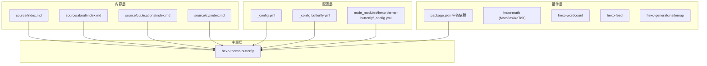
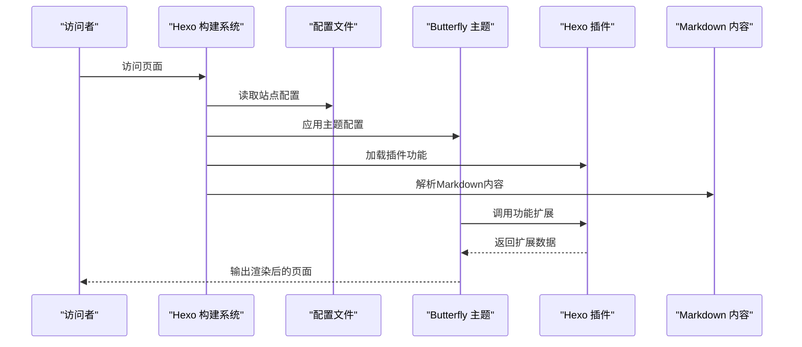
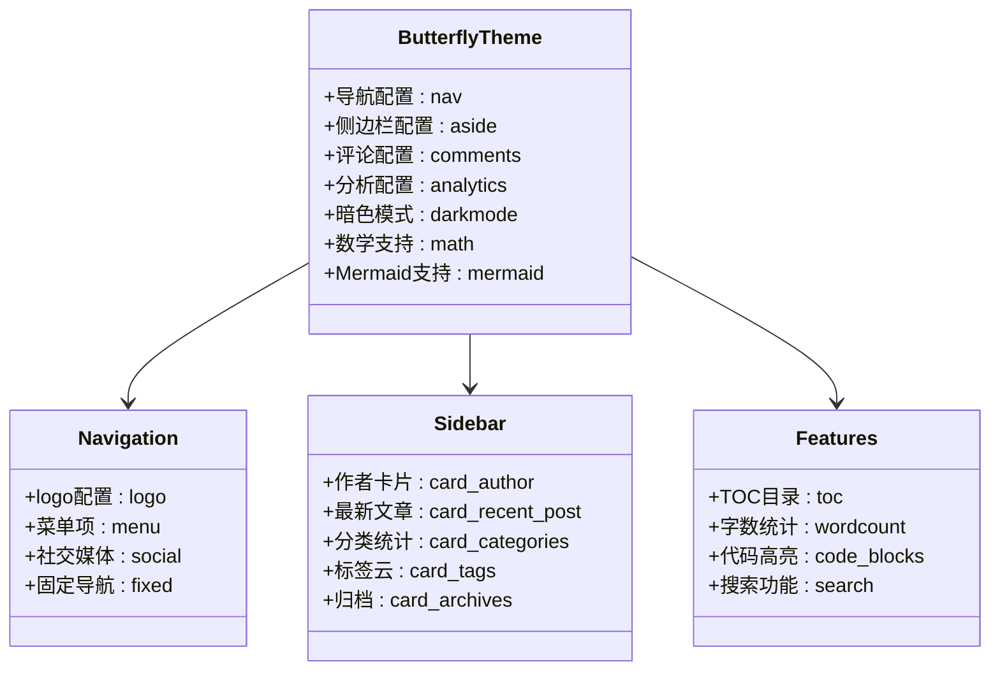
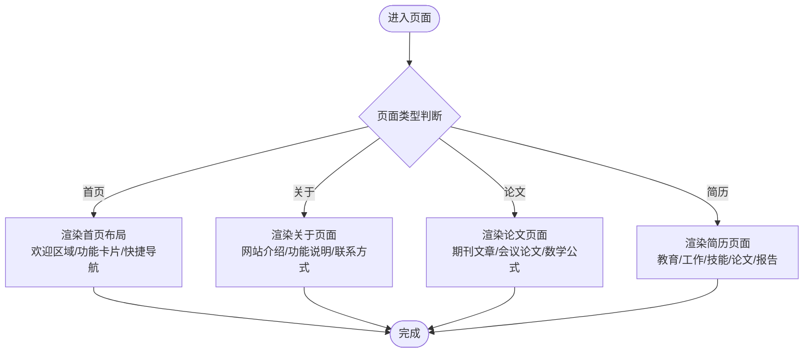
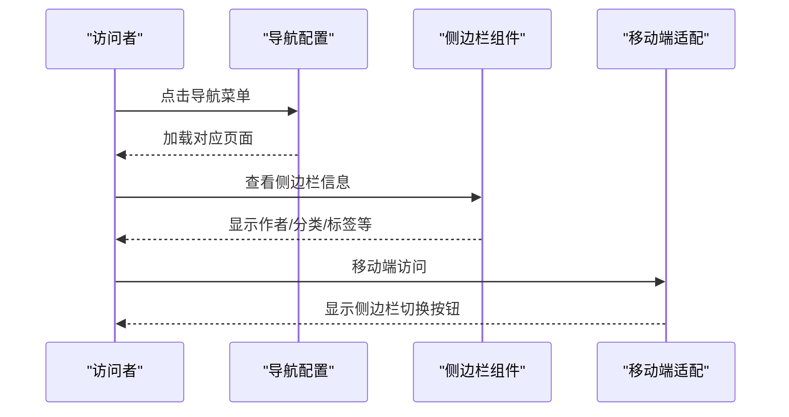
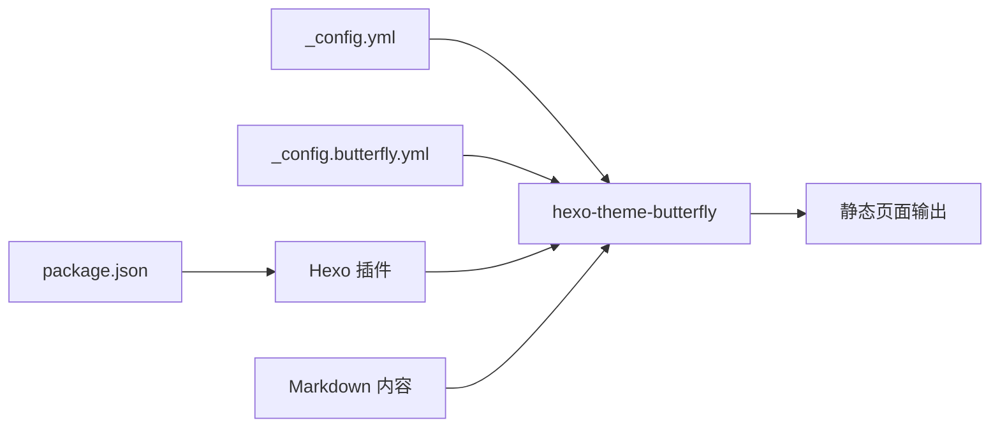

# 核心功能特性

<cite>
**本文引用的文件**
- [_config.yml](file://hexo-site/_config.yml)
- [_config.butterfly.yml](file://hexo-site/_config.butterfly.yml)
- [package.json](file://hexo-site/package.json)
- [index.md](file://hexo-site/source/index.md)
- [about/index.md](file://hexo-site/source/about/index.md)
- [publications/index.md](file://hexo-site/source/publications/index.md)
- [cv/index.md](file://hexo-site/source/cv/index.md)
- [node_modules/hexo-theme-butterfly/_config.yml](file://hexo-site/node_modules/hexo-theme-butterfly/_config.yml)
</cite>

## 更新摘要
**所做更改**
- 移除了Jekyll特定功能模块，完全转向Hexo + Butterfly主题架构
- 新增Butterfly主题的现代化功能特性说明
- 更新了学术功能集合的实现方式和配置结构
- 增加了新的主题配置选项和界面功能
- 移除了原有的Jekyll布局和集合配置

## 目录
1. [简介](#简介)
2. [项目结构](#项目结构)
3. [核心组件](#核心组件)
4. [架构总览](#架构总览)
5. [详细组件分析](#详细组件分析)
6. [依赖分析](#依赖分析)
7. [性能考虑](#性能考虑)
8. [故障排查指南](#故障排查指南)
9. [结论](#结论)
10. [附录](#附录)

## 简介
本文档面向基于Hexo + Butterfly主题的Academic Pages模板核心功能特性进行系统化说明。重点覆盖Butterfly主题的现代化功能特性、学术功能集合（论文管理、简历生成、会议展示）、响应式设计支持、评论系统集成、分析工具配置等。文档从设计目的与使用场景出发，解释各功能模块如何协同工作以及数据流向，并提供可操作的应用示例与最佳实践建议。

## 项目结构
Academic Pages基于Hexo静态站点生成器构建，采用"内容 + 主题配置 + 插件扩展"的现代化分层组织方式：
- 内容层：通过Markdown页面管理学术内容；支持首页、关于、论文、简历等页面
- 主题层：基于Butterfly主题，提供丰富的UI组件和功能配置
- 配置层：通过YAML配置文件控制主题行为、导航菜单、侧边栏等
- 插件层：通过npm包管理各种Hexo插件，扩展功能特性
- 数据层：通过页面front-matter和配置文件承载元数据

**图表来源**
- [_config.yml:119](file://hexo-site/_config.yml#L119)
- [_config.butterfly.yml:1-459](file://hexo-site/_config.butterfly.yml#L1-L459)
- [package.json:14-32](file://hexo-site/package.json#L14-L32)
- [node_modules/hexo-theme-butterfly/_config.yml:1-800](file://hexo-site/node_modules/hexo-theme-butterfly/_config.yml#L1-L800)

**章节来源**
- [_config.yml:119](file://hexo-site/_config.yml#L119)
- [_config.butterfly.yml:1-459](file://hexo-site/_config.butterfly.yml#L1-L459)
- [package.json:14-32](file://hexo-site/package.json#L14-L32)

## 核心组件
- **Butterfly主题系统**：现代化的Hexo主题，提供丰富的UI组件、暗色模式、TOC目录、数学公式支持等功能
- **学术功能集合**：通过Markdown页面实现论文、简历、关于等学术内容的管理
- **导航与侧边栏**：基于配置的导航菜单和可定制的侧边栏组件
- **评论系统**：支持多种评论提供商（Disqus、Gitalk、Waline、Utterances等）
- **分析工具**：支持百度统计、Google Analytics、Cloudflare Analytics等多种分析服务
- **响应式设计**：基于Butterfly主题的移动端适配和现代化布局
- **数学公式支持**：集成MathJax和KaTeX，支持LaTeX数学公式渲染
- **Mermaid图表**：支持客户端渲染的流程图、时序图等图表

**章节来源**
- [_config.butterfly.yml:10-459](file://hexo-site/_config.butterfly.yml#L10-L459)
- [_config.yml:119](file://hexo-site/_config.yml#L119)
- [package.json:25](file://hexo-site/package.json#L25)

## 架构总览
Academic Pages的运行时流程如下：Hexo读取配置和内容，根据Butterfly主题渲染页面；主题通过配置文件控制功能开关；插件扩展提供额外功能；最终输出静态HTML文件。

**图表来源**
- [_config.yml:119](file://hexo-site/_config.yml#L119)
- [_config.butterfly.yml:10-459](file://hexo-site/_config.butterfly.yml#L10-L459)
- [package.json:14-32](file://hexo-site/package.json#L14-L32)

## 详细组件分析

### Butterfly主题系统
- **设计目的**：提供现代化、响应式的学术网站主题，支持丰富的UI组件和功能扩展
- **使用场景**：学术主页、个人博客、作品集展示、研究组官网等
- **实现机制**：通过YAML配置文件控制主题行为，支持暗色模式、TOC目录、数学公式等
- **核心功能**：
  - 暗色模式切换和自动切换
  - 侧边栏组件（作者卡片、最新文章、分类、标签等）
  - 顶部导航栏和移动端适配
  - 代码块美化和复制功能
  - 数学公式渲染（MathJax/KaTeX）
  - Mermaid图表支持

**图表来源**
- [_config.butterfly.yml:10-459](file://hexo-site/_config.butterfly.yml#L10-L459)
- [node_modules/hexo-theme-butterfly/_config.yml:10-800](file://hexo-site/node_modules/hexo-theme-butterfly/_config.yml#L10-L800)

**章节来源**
- [_config.butterfly.yml:10-459](file://hexo-site/_config.butterfly.yml#L10-L459)

### 学术功能集合
- **首页定制**：通过自定义HTML和CSS实现现代化的首页布局，包含欢迎区域、功能卡片、快捷导航等
- **关于页面**：介绍网站功能和技术栈，提供快速导航链接
- **论文管理**：通过Markdown页面展示学术论文列表，支持LaTeX数学公式
- **简历生成**：支持教育背景、工作经历、技能、论文和报告的结构化展示
- **内容组织**：通过front-matter元数据控制页面行为和显示效果

**图表来源**
- [index.md:1-204](file://hexo-site/source/index.md#L1-L204)
- [about/index.md:1-67](file://hexo-site/source/about/index.md#L1-L67)
- [publications/index.md:1-58](file://hexo-site/source/publications/index.md#L1-L58)
- [cv/index.md:1-104](file://hexo-site/source/cv/index.md#L1-L104)

**章节来源**
- [index.md:1-204](file://hexo-site/source/index.md#L1-L204)
- [about/index.md:1-67](file://hexo-site/source/about/index.md#L1-L67)
- [publications/index.md:1-58](file://hexo-site/source/publications/index.md#L1-L58)
- [cv/index.md:1-104](file://hexo-site/source/cv/index.md#L1-L104)

### 导航与侧边栏
- **导航菜单**：通过配置文件定义菜单项、图标和链接，支持Logo显示和固定导航
- **侧边栏组件**：提供作者信息、最新文章、分类统计、标签云、归档等组件
- **移动端适配**：支持移动端侧边栏显示和触摸手势
- **自定义样式**：通过CSS变量和自定义样式调整界面外观

**图表来源**
- [_config.butterfly.yml:11-41](file://hexo-site/_config.butterfly.yml#L11-L41)
- [_config.butterfly.yml:92-144](file://hexo-site/_config.butterfly.yml#L92-L144)

**章节来源**
- [_config.butterfly.yml:11-41](file://hexo-site/_config.butterfly.yml#L11-L41)
- [_config.butterfly.yml:92-144](file://hexo-site/_config.butterfly.yml#L92-L144)

### 评论系统集成
- **支持提供商**：Disqus、DisqusJS、Livere、Gitalk、Valine、Waline、Utterances、Facebook Comments、Twikoo、Giscus、Remark42、Artalk
- **配置方式**：通过配置文件启用和设置评论系统参数
- **功能特性**：支持评论计数、懒加载、多评论系统并存等

**章节来源**
- [_config.butterfly.yml:531-656](file://hexo-site/_config.butterfly.yml#L531-L656)
- [node_modules/hexo-theme-butterfly/_config.yml:531-656](file://hexo-site/node_modules/hexo-theme-butterfly/_config.yml#L531-L656)

### 分析工具配置
- **支持提供商**：百度统计、Google Analytics、Cloudflare Analytics、Microsoft Clarity、Umami Analytics、Google Tag Manager
- **配置方式**：通过配置文件启用相应分析服务
- **功能特性**：支持多平台分析、隐私保护、自定义参数等

**章节来源**
- [_config.butterfly.yml:684-720](file://hexo-site/_config.butterfly.yml#L684-L720)
- [node_modules/hexo-theme-butterfly/_config.yml:684-720](file://hexo-site/node_modules/hexo-theme-butterfly/_config.yml#L684-L720)

### 响应式设计支持
- **移动端适配**：支持移动端导航、侧边栏、内容布局的自适应
- **暗色模式**：支持手动切换和自动切换（根据系统设置或时间段）
- **界面优化**：提供多种UI组件和自定义样式选项

**章节来源**
- [_config.butterfly.yml:268-298](file://hexo-site/_config.butterfly.yml#L268-L298)
- [_config.butterfly.yml:356-363](file://hexo-site/_config.butterfly.yml#L356-L363)

### 数学公式与图表支持
- **数学公式**：支持MathJax和KaTeX，可在文章中使用LaTeX语法
- **Mermaid图表**：支持流程图、时序图、甘特图等图表的客户端渲染
- **代码高亮**：提供多种代码块主题和功能选项

**章节来源**
- [_config.butterfly.yml:203-215](file://hexo-site/_config.butterfly.yml#L203-L215)
- [_config.butterfly.yml:211-215](file://hexo-site/_config.butterfly.yml#L211-L215)
- [_config.butterfly.yml:157-166](file://hexo-site/_config.butterfly.yml#L157-L166)

## 依赖分析
- **主题依赖**：Butterfly主题作为核心依赖，提供完整的UI框架
- **功能插件**：通过npm包管理数学公式、字数统计、RSS订阅等功能
- **配置管理**：通过YAML配置文件集中管理主题行为和功能开关
- **内容组织**：通过Markdown页面和front-matter元数据管理内容结构

**图表来源**
- [_config.yml:119](file://hexo-site/_config.yml#L119)
- [_config.butterfly.yml:10-459](file://hexo-site/_config.butterfly.yml#L10-L459)
- [package.json:14-32](file://hexo-site/package.json#L14-L32)

**章节来源**
- [_config.yml:119](file://hexo-site/_config.yml#L119)
- [package.json:14-32](file://hexo-site/package.json#L14-L32)

## 性能考虑
- **构建优化**：Hexo原生的高效构建流程，支持增量构建
- **资源压缩**：Butterfly主题内置的CSS和JavaScript优化
- **按需加载**：评论系统支持懒加载，减少初始页面大小
- **CDN支持**：可配置CDN加速静态资源加载
- **缓存策略**：支持浏览器缓存和CDN缓存配置

**章节来源**
- [_config.butterfly.yml:365-367](file://hexo-site/_config.butterfly.yml#L365-L367)
- [_config.butterfly.yml:448-459](file://hexo-site/_config.butterfly.yml#L448-L459)

## 故障排查指南
- **主题不生效**：检查_hexo.yml中的theme配置和Butterfly主题版本
- **页面空白**：确认Markdown文件的front-matter配置正确
- **功能异常**：检查相应插件是否正确安装和配置
- **导航问题**：验证导航配置的菜单项和链接路径
- **评论无法显示**：核对评论提供商的配置参数和网络连接

**章节来源**
- [_config.yml:119](file://hexo-site/_config.yml#L119)
- [_config.butterfly.yml:10-41](file://hexo-site/_config.butterfly.yml#L10-L41)
- [package.json:14-32](file://hexo-site/package.json#L14-L32)

## 结论
Academic Pages以Butterfly主题为核心，结合丰富的Hexo插件生态系统，为学术主页和作品集提供了现代化、功能完备的解决方案。通过合理的配置管理和内容组织，可以在保证性能和可维护性的同时，实现高质量的学术展示与交互体验。

## 附录
- **快速开始**：安装Node.js和npm，执行`npm install`安装依赖，使用`hexo server`启动本地服务器
- **配置清单**：重点关注主题配置、导航设置、评论系统、分析工具等关键配置项
- **功能扩展**：可通过添加Hexo插件来扩展更多功能特性

**章节来源**
- [_config.yml:1-142](file://hexo-site/_config.yml#L1-L142)
- [_config.butterfly.yml:1-459](file://hexo-site/_config.butterfly.yml#L1-L459)
- [package.json:1-35](file://hexo-site/package.json#L1-L35)