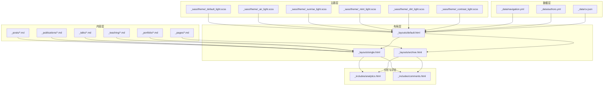
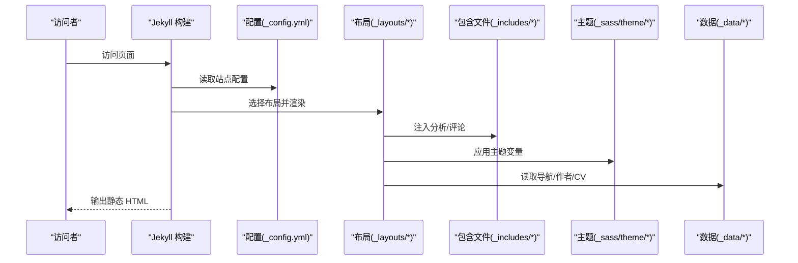
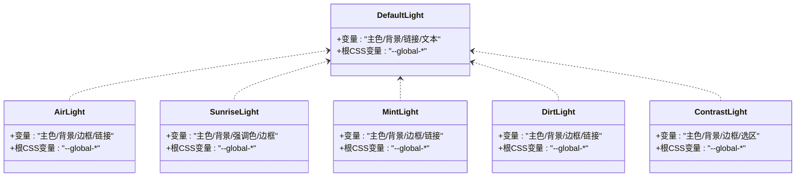
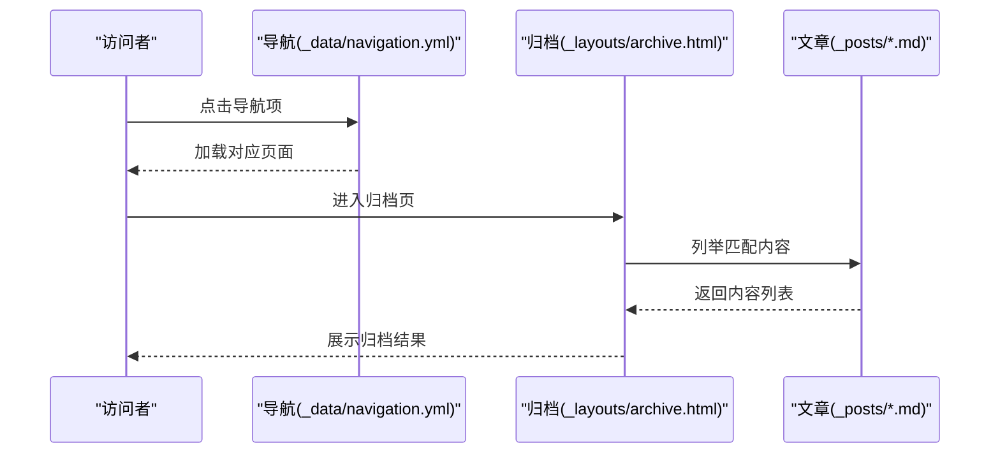
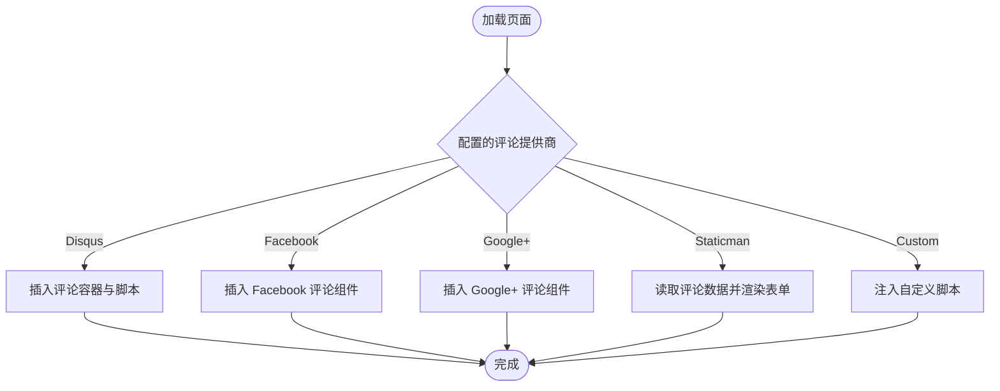
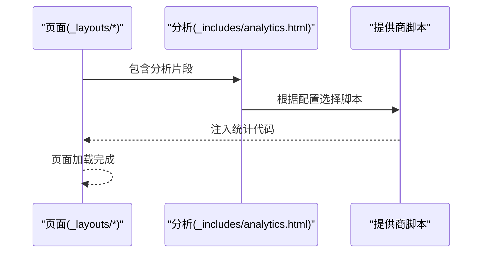
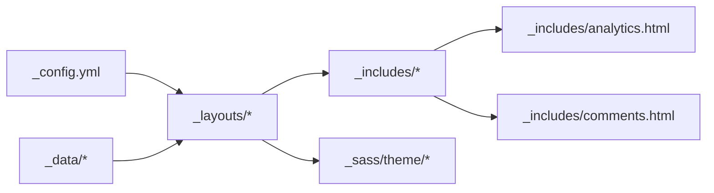

# 核心功能特性

<cite>
**本文引用的文件**
- [_config.yml](file://_config.yml)
- [README.md](file://README.md)
- [_data/navigation.yml](file://_data/navigation.yml)
- [_data/authors.yml](file://_data/authors.yml)
- [_data/cv.json](file://_data/cv.json)
- [_sass/theme/_default_light.scss](file://_sass/theme/_default_light.scss)
- [_sass/theme/_air_light.scss](file://_sass/theme/_air_light.scss)
- [_sass/theme/_sunrise_light.scss](file://_sass/theme/_sunrise_light.scss)
- [_sass/theme/_mint_light.scss](file://_sass/theme/_mint_light.scss)
- [_sass/theme/_dirt_light.scss](file://_sass/theme/_dirt_light.scss)
- [_sass/theme/_contrast_light.scss](file://_sass/theme/_contrast_light.scss)
- [_layouts/default.html](file://_layouts/default.html)
- [_layouts/single.html](file://_layouts/single.html)
- [_layouts/archive.html](file://_layouts/archive.html)
- [_includes/analytics.html](file://_includes/analytics.html)
- [_includes/comments.html](file://_includes/comments.html)
</cite>

## 目录
1. [简介](#简介)
2. [项目结构](#项目结构)
3. [核心组件](#核心组件)
4. [架构总览](#架构总览)
5. [详细组件分析](#详细组件分析)
6. [依赖分析](#依赖分析)
7. [性能考虑](#性能考虑)
8. [故障排查指南](#故障排查指南)
9. [结论](#结论)
10. [附录](#附录)

## 简介
本文件面向 Academic Pages 模板的核心功能特性进行系统化说明，重点覆盖六大主题变体系统（默认、空气、日出、薄荷、泥土、对比度）、多样的学术功能（论文管理、简历生成、会议展示）、响应式设计支持、评论系统集成、分析工具配置等。文档从设计目的与使用场景出发，解释各功能模块如何协同工作以及数据流向，并提供可操作的应用示例与最佳实践建议。

## 项目结构
Academic Pages 基于 Jekyll 静态站点生成器构建，采用“内容 + 布局 + 主题样式”的分层组织方式：
- 内容层：通过集合（collections）管理论文、讲稿、教学、作品集等学术内容；页面（pages）用于导航、归档、CV 等。
- 布局层：定义通用页面骨架与内容渲染规则，如默认布局、单页布局、归档布局等。
- 主题层：通过 SCSS 主题文件实现多套视觉风格，配合配置项切换主题。
- 数据层：通过 YAML/JSON 文件承载作者信息、导航菜单、CV 结构化数据等。
- 分析与评论：通过包含文件在页面中注入分析脚本或评论组件。



图表来源
- [_layouts/default.html:1-32](file://_layouts/default.html#L1-L32)
- [_layouts/single.html:1-110](file://_layouts/single.html#L1-L110)
- [_layouts/archive.html:1-25](file://_layouts/archive.html#L1-L25)
- [_sass/theme/_default_light.scss:1-49](file://_sass/theme/_default_light.scss#L1-L49)
- [_sass/theme/_air_light.scss:1-56](file://_sass/theme/_air_light.scss#L1-L56)
- [_sass/theme/_sunrise_light.scss:1-64](file://_sass/theme/_sunrise_light.scss#L1-L64)
- [_sass/theme/_mint_light.scss:1-65](file://_sass/theme/_mint_light.scss#L1-L65)
- [_sass/theme/_dirt_light.scss:1-63](file://_sass/theme/_dirt_light.scss#L1-L63)
- [_sass/theme/_contrast_light.scss:1-97](file://_sass/theme/_contrast_light.scss#L1-L97)
- [_data/navigation.yml:1-40](file://_data/navigation.yml#L1-L40)
- [_data/authors.yml:1-19](file://_data/authors.yml#L1-L19)
- [_data/cv.json:1-153](file://_data/cv.json#L1-L153)
- [_includes/analytics.html:1-14](file://_includes/analytics.html#L1-L14)
- [_includes/comments.html:1-84](file://_includes/comments.html#L1-L84)

章节来源
- [_config.yml:10-11](file://_config.yml#L10-L11)
- [_config.yml:223-236](file://_config.yml#L223-L236)
- [_config.yml:295-299](file://_config.yml#L295-L299)
- [_config.yml:309-325](file://_config.yml#L309-L325)

## 核心组件
- 六大主题变体系统：通过配置项选择主题，SCSS 主题文件定义颜色体系与变量，最终映射到页面根元素与 CSS 变量，实现统一的视觉风格。
- 学术功能集合：论文、讲稿、教学、作品集通过 Jekyll 集合输出为独立页面，配合单页布局统一渲染。
- 导航与归档：导航菜单由数据驱动，归档页面按分类/标签组织内容。
- 简历生成：支持 Markdown 页面与 JSON 结构化数据两种简历呈现方式。
- 评论系统：支持多种提供商（Disqus、Facebook、Google+、Staticman、自定义），按配置动态注入。
- 分析工具：支持 Google Analytics、Google Universal、GA4、自定义脚本等，按配置注入。
- 响应式设计：基于 SCSS 变量与布局组件，适配不同屏幕尺寸。

章节来源
- [_config.yml:10-11](file://_config.yml#L10-L11)
- [_config.yml:223-236](file://_config.yml#L223-L236)
- [_config.yml:295-299](file://_config.yml#L295-L299)
- [_config.yml:309-325](file://_config.yml#L309-L325)
- [_data/navigation.yml:10-40](file://_data/navigation.yml#L10-L40)
- [_data/cv.json:1-153](file://_data/cv.json#L1-L153)
- [_includes/analytics.html:1-14](file://_includes/analytics.html#L1-L14)
- [_includes/comments.html:1-84](file://_includes/comments.html#L1-L84)

## 架构总览
Academic Pages 的运行时流程如下：Jekyll 读取配置与集合，根据布局模板渲染页面；布局通过包含文件注入分析与评论；主题通过 SCSS 变量控制全局样式；导航与数据文件驱动页面结构与内容。



图表来源
- [_config.yml:10-11](file://_config.yml#L10-L11)
- [_config.yml:223-236](file://_config.yml#L223-L236)
- [_layouts/default.html:1-32](file://_layouts/default.html#L1-L32)
- [_layouts/single.html:1-110](file://_layouts/single.html#L1-L110)
- [_layouts/archive.html:1-25](file://_layouts/archive.html#L1-L25)
- [_includes/analytics.html:1-14](file://_includes/analytics.html#L1-L14)
- [_includes/comments.html:1-84](file://_includes/comments.html#L1-L84)
- [_sass/theme/_default_light.scss:1-49](file://_sass/theme/_default_light.scss#L1-L49)
- [_data/navigation.yml:10-40](file://_data/navigation.yml#L10-L40)
- [_data/authors.yml:1-19](file://_data/authors.yml#L1-L19)
- [_data/cv.json:1-153](file://_data/cv.json#L1-L153)

## 详细组件分析

### 六大主题变体系统
- 设计目的：为不同审美的用户与场景提供一致的视觉风格，便于快速切换与品牌化。
- 使用场景：学术主页、个人博客、作品集展示、团队官网等。
- 实现机制：配置项决定当前主题，SCSS 主题文件定义颜色变量与根元素 CSS 变量，布局文件在根元素上应用主题属性。
- 主题列表与特点概览：
  - 默认：专业蓝灰配色，适合通用学术场景。
  - 空气：淡蓝背景与柔和文字，营造通透感。
  - 日出：暖色调背景与强调色，突出活力。
  - 薄荷：浅绿灰背景，清新自然。
  - 泥土：大地色系，稳重内敛。
  - 对比度：高对比度设计，提升可读性与无障碍体验。



图表来源
- [_sass/theme/_default_light.scss:1-49](file://_sass/theme/_default_light.scss#L1-L49)
- [_sass/theme/_air_light.scss:1-56](file://_sass/theme/_air_light.scss#L1-L56)
- [_sass/theme/_sunrise_light.scss:1-64](file://_sass/theme/_sunrise_light.scss#L1-L64)
- [_sass/theme/_mint_light.scss:1-65](file://_sass/theme/_mint_light.scss#L1-L65)
- [_sass/theme/_dirt_light.scss:1-63](file://_sass/theme/_dirt_light.scss#L1-L63)
- [_sass/theme/_contrast_light.scss:1-97](file://_sass/theme/_contrast_light.scss#L1-L97)

章节来源
- [_config.yml:10-11](file://_config.yml#L10-L11)
- [_sass/theme/_default_light.scss:30-47](file://_sass/theme/_default_light.scss#L30-L47)
- [_sass/theme/_air_light.scss:38-55](file://_sass/theme/_air_light.scss#L38-L55)
- [_sass/theme/_sunrise_light.scss:40-57](file://_sass/theme/_sunrise_light.scss#L40-L57)
- [_sass/theme/_mint_light.scss:40-56](file://_sass/theme/_mint_light.scss#L40-L56)
- [_sass/theme/_dirt_light.scss:36-53](file://_sass/theme/_dirt_light.scss#L36-L53)
- [_sass/theme/_contrast_light.scss:42-62](file://_sass/theme/_contrast_light.scss#L42-L62)

### 多样学术功能（论文、简历、会议）
- 论文管理：通过集合 publications 输出论文页面，单页布局统一渲染标题、元信息、引用与下载链接。
- 简历生成：支持 Markdown 页面与 JSON 结构化数据两种方式；JSON 提供更丰富的结构化字段（教育、工作、技能、出版物、讲稿、教学、作品集等）。
- 会议展示：通过 talks 集合输出讲稿页面，单页布局支持日期、地点、摘要等信息。
- 教学展示：通过 teaching 集合输出教学经历页面，单页布局支持课程、机构、时间等信息。
- 作品集展示：通过 portfolio 集合输出作品页面，单页布局支持分类、链接、描述等。

```mermaid
flowchart TD
Start(["进入页面"]) --> CheckCollection{"是否属于学术集合？"}
CheckCollection --> |论文| PubRender["渲染论文布局<br/>标题/元信息/引用/下载"]
CheckCollection --> |讲稿| TalkRender["渲染讲稿布局<br/>日期/地点/摘要"]
CheckCollection --> |教学| TeachRender["渲染教学布局<br/>课程/机构/时间"]
CheckCollection --> |作品集| PortRender["渲染作品集布局<br/>分类/链接/描述"]
CheckCollection --> |简历(JSON)| CVJSON["渲染结构化简历<br/>教育/工作/技能/出版物/讲稿/教学/作品集"]
CheckCollection --> |简历(Markdown)| CVMD["渲染简历页面"]
PubRender --> End(["完成"])
TalkRender --> End
TeachRender --> End
PortRender --> End
CVJSON --> End
CVMD --> End
```

图表来源
- [_config.yml:223-236](file://_config.yml#L223-L236)
- [_layouts/single.html:1-110](file://_layouts/single.html#L1-L110)
- [_data/cv.json:1-153](file://_data/cv.json#L1-L153)

章节来源
- [_config.yml:223-236](file://_config.yml#L223-L236)
- [_layouts/single.html:37-43](file://_layouts/single.html#L37-L43)
- [_layouts/single.html:47-77](file://_layouts/single.html#L47-L77)
- [_data/cv.json:67-151](file://_data/cv.json#L67-L151)

### 导航与归档
- 导航菜单：由数据文件驱动，支持子菜单与多级结构，控制头部导航顺序与可见性。
- 归档页面：按分类/标签组织内容，支持面包屑导航与分页。
- 博客系统：通过 posts 集合与归档布局展示文章列表与详情。



图表来源
- [_data/navigation.yml:10-40](file://_data/navigation.yml#L10-L40)
- [_layouts/archive.html:1-25](file://_layouts/archive.html#L1-L25)
- [_config.yml:223-236](file://_config.yml#L223-L236)

章节来源
- [_data/navigation.yml:10-40](file://_data/navigation.yml#L10-L40)
- [_layouts/archive.html:1-25](file://_layouts/archive.html#L1-L25)

### 评论系统集成
- 支持提供商：Disqus、Facebook、Google+、Staticman、自定义。
- 渲染逻辑：根据配置选择对应提供商，注入评论区域与脚本；Staticman 支持本地存储评论数据并展示表单。
- 安全与隐私：Staticman 可对邮箱字段进行哈希处理，满足隐私要求。



图表来源
- [_includes/comments.html:1-84](file://_includes/comments.html#L1-L84)
- [_config.yml:101-127](file://_config.yml#L101-L127)

章节来源
- [_includes/comments.html:1-84](file://_includes/comments.html#L1-L84)
- [_config.yml:101-127](file://_config.yml#L101-L127)

### 分析工具配置
- 支持提供商：Google Analytics、Google Universal、GA4、自定义。
- 注入位置：在页面头部包含分析脚本，按配置条件渲染。
- 使用建议：根据合规与隐私策略选择合适方案，避免跨域与第三方追踪风险。



图表来源
- [_includes/analytics.html:1-14](file://_includes/analytics.html#L1-L14)
- [_config.yml:157-161](file://_config.yml#L157-L161)

章节来源
- [_includes/analytics.html:1-14](file://_includes/analytics.html#L1-L14)
- [_config.yml:157-161](file://_config.yml#L157-L161)

### 响应式设计支持
- 基于 SCSS 变量与布局组件，确保在桌面、平板、手机等设备上的良好显示效果。
- 主题变量统一控制边距、圆角、阴影等视觉属性，减少重复样式编写。

章节来源
- [_sass/theme/_default_light.scss:20-27](file://_sass/theme/_default_light.scss#L20-L27)
- [_sass/theme/_air_light.scss:28-35](file://_sass/theme/_air_light.scss#L28-L35)
- [_sass/theme/_sunrise_light.scss:30-37](file://_sass/theme/_sunrise_light.scss#L30-L37)
- [_sass/theme/_mint_light.scss:30-37](file://_sass/theme/_mint_light.scss#L30-L37)
- [_sass/theme/_dirt_light.scss:26-33](file://_sass/theme/_dirt_light.scss#L26-L33)
- [_sass/theme/_contrast_light.scss:32-39](file://_sass/theme/_contrast_light.scss#L32-L39)

## 依赖分析
- 组件耦合：布局与包含文件存在直接依赖；主题通过变量影响全局样式；数据文件驱动导航与内容。
- 外部依赖：评论与分析模块依赖第三方服务；集合输出依赖 Jekyll 插件与配置。
- 潜在循环：未发现直接循环依赖；布局间通过继承关系组织，避免交叉引用。



图表来源
- [_config.yml:223-236](file://_config.yml#L223-L236)
- [_layouts/default.html:1-32](file://_layouts/default.html#L1-L32)
- [_layouts/single.html:1-110](file://_layouts/single.html#L1-L110)
- [_layouts/archive.html:1-25](file://_layouts/archive.html#L1-L25)
- [_includes/analytics.html:1-14](file://_includes/analytics.html#L1-L14)
- [_includes/comments.html:1-84](file://_includes/comments.html#L1-L84)
- [_sass/theme/_default_light.scss:1-49](file://_sass/theme/_default_light.scss#L1-L49)
- [_data/navigation.yml:10-40](file://_data/navigation.yml#L10-L40)

章节来源
- [_config.yml:309-325](file://_config.yml#L309-L325)
- [_config.yml:295-299](file://_config.yml#L295-L299)

## 性能考虑
- 构建优化：启用 HTML 压缩插件，减少传输体积。
- 资源压缩：SCSS 输出压缩模式，降低 CSS 体积。
- 按需加载：分析与评论脚本仅在需要时注入，避免不必要的请求。
- 缓存策略：合理设置 CDN 与浏览器缓存，提升二次访问速度。

章节来源
- [_config.yml:357-362](file://_config.yml#L357-L362)
- [_config.yml:296-299](file://_config.yml#L296-L299)

## 故障排查指南
- 主题不生效：检查配置项是否正确设置主题名称，确认主题 SCSS 文件已编译。
- 评论无法显示：核对评论提供商配置与网络环境；Staticman 需要仓库权限与分支设置正确。
- 分析脚本未加载：确认分析提供商配置有效，且页面未禁用分析。
- 导航异常：检查导航数据文件语法与链接路径，确保无拼写错误。
- 集合页面空白：确认集合配置与 permalink 设置，检查内容文件头字段是否完整。

章节来源
- [_config.yml:10-11](file://_config.yml#L10-L11)
- [_config.yml:101-127](file://_config.yml#L101-L127)
- [_config.yml:157-161](file://_config.yml#L157-L161)
- [_data/navigation.yml:10-40](file://_data/navigation.yml#L10-L40)
- [_config.yml:223-236](file://_config.yml#L223-L236)

## 结论
Academic Pages 以清晰的分层架构与灵活的主题系统为基础，结合多样化的学术功能集合与评论、分析等扩展能力，为学术主页与个人作品集提供了开箱即用的解决方案。通过合理配置与最佳实践，可在保证性能与可维护性的同时，实现高质量的学术展示与交互体验。

## 附录
- 快速开始：参考项目自述文件中的安装与本地运行步骤。
- 配置清单：关注站点基础设置、集合输出、评论与分析提供商、Sass 输出模式等关键项。

章节来源
- [README.md:18-72](file://README.md#L18-L72)
- [_config.yml:10-11](file://_config.yml#L10-L11)
- [_config.yml:223-236](file://_config.yml#L223-L236)
- [_config.yml:309-325](file://_config.yml#L309-L325)
- [_config.yml:296-299](file://_config.yml#L296-L299)