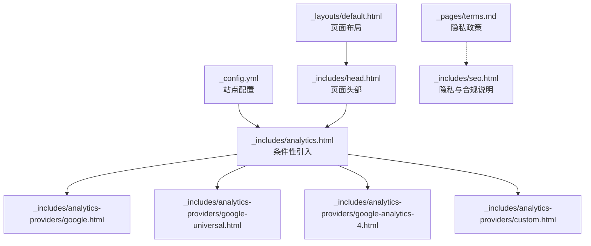
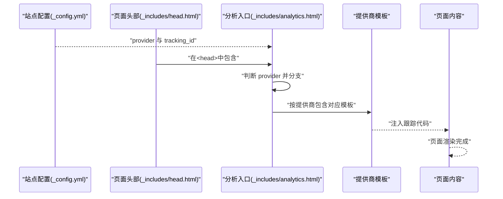
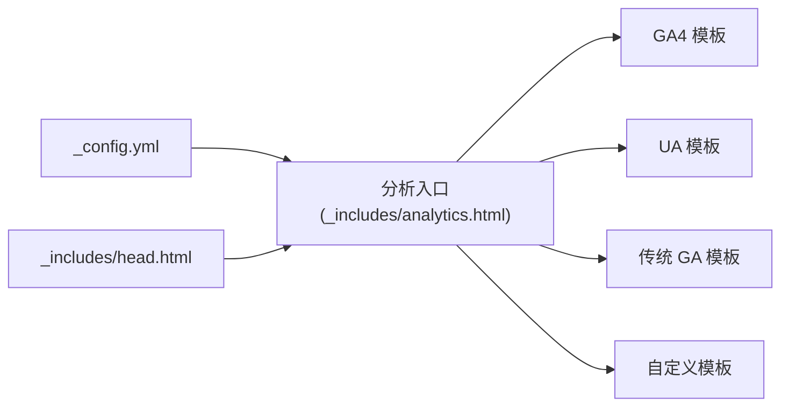

# 分析工具配置

<cite>
**本文引用的文件**
- [_config.yml](file://_config.yml)
- [_includes/analytics.html](file://_includes/analytics.html)
- [_includes/analytics-providers/google.html](file://_includes/analytics-providers/google.html)
- [_includes/analytics-providers/google-universal.html](file://_includes/analytics-providers/google-universal.html)
- [_includes/analytics-providers/google-analytics-4.html](file://_includes/analytics-providers/google-analytics-4.html)
- [_includes/analytics-providers/custom.html](file://_includes/analytics-providers/custom.html)
- [_includes/head.html](file://_includes/head.html)
- [_layouts/default.html](file://_layouts/default.html)
- [_pages/terms.md](file://_pages/terms.md)
- [_includes/seo.html](file://_includes/seo.html)
</cite>

## 目录
1. [简介](#简介)
2. [项目结构](#项目结构)
3. [核心组件](#核心组件)
4. [架构总览](#架构总览)
5. [详细组件分析](#详细组件分析)
6. [依赖分析](#依赖分析)
7. [性能考虑](#性能考虑)
8. [故障排查指南](#故障排查指南)
9. [结论](#结论)
10. [附录](#附录)

## 简介
本文件面向网站维护者与开发者，系统化说明本项目的分析工具配置与集成方式，涵盖以下主题：
- Google Analytics 4、Google Universal Analytics、传统 Google Analytics 的配置方法与跟踪代码集成
- 各版本分析工具的功能差异、数据收集方式与隐私合规要点
- 自定义分析脚本的集成方法与数据上报配置
- 性能优化建议、隐私保护设置与数据准确性验证方法
- 常见分析指标的解读与网站流量分析最佳实践

本项目基于 Jekyll 模板，分析脚本通过 Liquid 模板在构建阶段注入，支持在站点配置中选择提供商，在页面级别控制是否启用。

## 项目结构
与分析工具相关的关键文件与职责如下：
- 站点配置：在站点配置中定义分析提供商与跟踪 ID，并可全局控制是否启用分析
- 分析入口：在页面头部模板中根据配置条件性地引入分析脚本
- 提供商模板：针对不同提供商的跟踪代码模板，按需包含
- 页面控制：可在单个页面的 YAML 头部设置禁用分析
- 隐私与合规：在隐私政策页面与 SEO 模板中体现对 Cookie 与第三方分析的说明

**图表来源**
- [_config.yml](file://_config.yml)
- [_includes/analytics.html](file://_includes/analytics.html)
- [_includes/analytics-providers/google.html](file://_includes/analytics-providers/google.html)
- [_includes/analytics-providers/google-universal.html](file://_includes/analytics-providers/google-universal.html)
- [_includes/analytics-providers/google-analytics-4.html](file://_includes/analytics-providers/google-analytics-4.html)
- [_includes/analytics-providers/custom.html](file://_includes/analytics-providers/custom.html)
- [_includes/head.html](file://_includes/head.html)
- [_layouts/default.html](file://_layouts/default.html)
- [_pages/terms.md](file://_pages/terms.md)
- [_includes/seo.html](file://_includes/seo.html)

**章节来源**
- [_config.yml](file://_config.yml)
- [_includes/analytics.html](file://_includes/analytics.html)
- [_includes/analytics-providers/google.html](file://_includes/analytics-providers/google.html)
- [_includes/analytics-providers/google-universal.html](file://_includes/analytics-providers/google-universal.html)
- [_includes/analytics-providers/google-analytics-4.html](file://_includes/analytics-providers/google-analytics-4.html)
- [_includes/analytics-providers/custom.html](file://_includes/analytics-providers/custom.html)
- [_includes/head.html](file://_includes/head.html)
- [_layouts/default.html](file://_layouts/default.html)
- [_pages/terms.md](file://_pages/terms.md)
- [_includes/seo.html](file://_includes/seo.html)

## 核心组件
- 站点配置（provider 与 tracking_id）
  - 在站点配置中设置分析提供商与跟踪 ID，支持的提供商包括：false、google、google-universal、google-analytics-4、custom
  - 默认关闭分析，需显式开启
- 条件性引入分析脚本
  - 在页面头部模板中，根据站点配置与页面头信息决定是否引入分析脚本
- 提供商模板
  - 针对不同提供商的跟踪代码模板，分别对应传统 GA、Universal Analytics、GA4 与自定义脚本
- 页面级控制
  - 在页面 YAML 头部设置 analytics=false 可禁用该页面的分析脚本
- 隐私与合规
  - 隐私政策页面明确说明第三方分析（如 Google Analytics）使用 Cookie 与信标进行趋势分析，不识别个体访客
  - SEO 模板包含对隐私与验证类元标签的处理，便于搜索引擎与合规声明

**章节来源**
- [_config.yml](file://_config.yml)
- [_includes/analytics.html](file://_includes/analytics.html)
- [_pages/terms.md](file://_pages/terms.md)
- [_includes/seo.html](file://_includes/seo.html)

## 架构总览
下图展示了从站点配置到页面渲染的分析脚本注入路径，以及不同提供商模板的对应关系：

**图表来源**
- [_config.yml](file://_config.yml)
- [_includes/head.html](file://_includes/head.html)
- [_includes/analytics.html](file://_includes/analytics.html)
- [_includes/analytics-providers/google.html](file://_includes/analytics-providers/google.html)
- [_includes/analytics-providers/google-universal.html](file://_includes/analytics-providers/google-universal.html)
- [_includes/analytics-providers/google-analytics-4.html](file://_includes/analytics-providers/google-analytics-4.html)
- [_includes/analytics-providers/custom.html](file://_includes/analytics-providers/custom.html)

## 详细组件分析

### 站点配置与页面控制
- provider 与 tracking_id
  - 在站点配置中设置 provider 与 tracking_id，即可启用相应提供商的跟踪代码
  - 默认 provider 为 false，需手动开启
- 页面级禁用
  - 在页面 YAML 头部设置 analytics=false 可跳过该页面的分析脚本注入

**章节来源**
- [_config.yml](file://_config.yml)
- [_includes/analytics.html](file://_includes/analytics.html)

### 分析入口模板（条件性引入）
- 条件判断
  - 仅当站点配置中 provider 存在且页面头未显式禁用时才引入
- 分支逻辑
  - 根据 provider 值分别包含传统 GA、Universal Analytics、GA4 或自定义模板

**章节来源**
- [_includes/analytics.html](file://_includes/analytics.html)

### 传统 Google Analytics（ga.js）
- 跟踪代码特征
  - 使用旧版全局变量与异步加载脚本
  - 初始化时设置账户与发送页面浏览事件
- 适用场景
  - 适用于仍使用旧版 GA 的历史站点迁移或兼容需求
- 注意事项
  - 已停止接收新数据，建议迁移至 GA4

**章节来源**
- [_includes/analytics-providers/google.html](file://_includes/analytics-providers/google.html)

### Google Universal Analytics（analytics.js）
- 跟踪代码特征
  - 使用全局命名空间初始化与发送页面浏览事件
  - 异步加载脚本，支持后续事件上报
- 适用场景
  - 适用于仍在使用 UA 的站点，逐步向 GA4 迁移
- 注意事项
  - UA 已停止接收新数据，建议尽快迁移 GA4

**章节来源**
- [_includes/analytics-providers/google-universal.html](file://_includes/analytics-providers/google-universal.html)

### Google Analytics 4（gtag.js）
- 跟踪代码特征
  - 使用 gtag 数据层与异步加载脚本
  - 初始化时设置当前时间戳并配置跟踪 ID
- 适用场景
  - 新建或迁移中的站点推荐使用 GA4
- 配置要点
  - 在站点配置中正确填写 tracking_id
  - 可在模板中扩展更多 gtag 配置项（如自定义参数）

**章节来源**
- [_includes/analytics-providers/google-analytics-4.html](file://_includes/analytics-providers/google-analytics-4.html)

### 自定义分析脚本
- 集成方式
  - 选择 provider 为 custom 后，在自定义模板中插入自有分析脚本
- 适用场景
  - 使用非 Google 的分析方案或企业内部分析平台
- 注意事项
  - 确保脚本在页面头部正确注入，避免阻塞渲染

**章节来源**
- [_includes/analytics-providers/custom.html](file://_includes/analytics-providers/custom.html)

### 页面布局与头部模板
- 布局包含
  - 页面布局在头部包含 SEO 与自定义头部内容，分析入口位于头部模板中
- 注入时机
  - 分析脚本在页面渲染前注入，确保首屏即开始跟踪

**章节来源**
- [_layouts/default.html](file://_layouts/default.html)
- [_includes/head.html](file://_includes/head.html)

### 隐私与合规说明
- 隐私政策页面
  - 明确第三方分析（如 Google Analytics）使用 Cookie 与信标进行趋势分析，不识别个体访客
- SEO 模板
  - 包含对隐私与验证类元标签的处理，便于搜索引擎与合规声明

**章节来源**
- [_pages/terms.md](file://_pages/terms.md)
- [_includes/seo.html](file://_includes/seo.html)

## 依赖分析
- 组件耦合
  - 分析入口模板依赖站点配置中的 provider 与 tracking_id
  - 不同提供商模板相互独立，互不影响
- 控制流
  - 页面渲染前，头部模板负责引入分析脚本
  - 页面级 analytics=false 可覆盖全局配置
- 外部依赖
  - GA4 依赖 Google Tag Manager 脚本
  - Universal Analytics 依赖 analytics.js
  - 传统 GA 依赖 ga.js

**图表来源**
- [_config.yml](file://_config.yml)
- [_includes/analytics.html](file://_includes/analytics.html)
- [_includes/analytics-providers/google-analytics-4.html](file://_includes/analytics-providers/google-analytics-4.html)
- [_includes/analytics-providers/google-universal.html](file://_includes/analytics-providers/google-universal.html)
- [_includes/analytics-providers/google.html](file://_includes/analytics-providers/google.html)
- [_includes/analytics-providers/custom.html](file://_includes/analytics-providers/custom.html)
- [_includes/head.html](file://_includes/head.html)

**章节来源**
- [_config.yml](file://_config.yml)
- [_includes/analytics.html](file://_includes/analytics.html)
- [_includes/analytics-providers/google.html](file://_includes/analytics-providers/google.html)
- [_includes/analytics-providers/google-universal.html](file://_includes/analytics-providers/google-universal.html)
- [_includes/analytics-providers/google-analytics-4.html](file://_includes/analytics-providers/google-analytics-4.html)
- [_includes/analytics-providers/custom.html](file://_includes/analytics-providers/custom.html)
- [_includes/head.html](file://_includes/head.html)

## 性能考虑
- 脚本加载策略
  - GA4 与 UA 均采用异步加载脚本，避免阻塞页面渲染
- 注入位置
  - 分析脚本在页面头部注入，确保首屏即开始跟踪
- 页面级禁用
  - 对于无需分析或特殊页面，可通过页面头设置 analytics=false 实现按需禁用
- 资源体积
  - 选择 GA4 可减少历史兼容代码体积，提升加载效率
- 合规与隐私
  - 在隐私政策中明确第三方分析的使用与目的，有助于降低合规风险

[本节为通用指导，不直接分析具体文件]

## 故障排查指南
- 未看到数据上报
  - 检查站点配置中的 provider 与 tracking_id 是否正确设置
  - 确认页面未设置 analytics=false
  - 确认页面头部已包含分析入口模板
- 数据不准确
  - 检查页面是否被错误禁用分析
  - 确认跟踪 ID 与属性匹配
- 隐私与合规
  - 在隐私政策中确认对第三方分析的说明
  - 确认 SEO 模板中隐私相关元标签的正确性

**章节来源**
- [_config.yml](file://_config.yml)
- [_includes/analytics.html](file://_includes/analytics.html)
- [_pages/terms.md](file://_pages/terms.md)
- [_includes/seo.html](file://_includes/seo.html)

## 结论
本项目通过清晰的配置与模板体系，实现了对多种分析工具的灵活接入与按需控制。建议优先采用 GA4 以获得更好的数据能力与性能表现，并在站点配置中明确 tracking_id 与 provider，结合页面级禁用策略，实现精准、合规、高效的网站分析。

[本节为总结性内容，不直接分析具体文件]

## 附录

### 常见分析指标与最佳实践
- 流量与参与度
  - 独立访客、页面浏览量、平均停留时长、跳出率
  - 建议关注关键页面的跳出率与转化路径
- 设备与来源
  - 移动端占比、直接访问、自然搜索、付费广告来源
  - 优化移动端体验与关键落地页
- 行为与事件
  - 关键交互事件（如按钮点击、下载、表单提交）
  - 建议在 GA4 中配置自定义事件与转化目标
- 合规与隐私
  - 明确 Cookie 与第三方分析的使用
  - 提供隐私设置与退订渠道，遵循相关法规

[本节为通用指导，不直接分析具体文件]