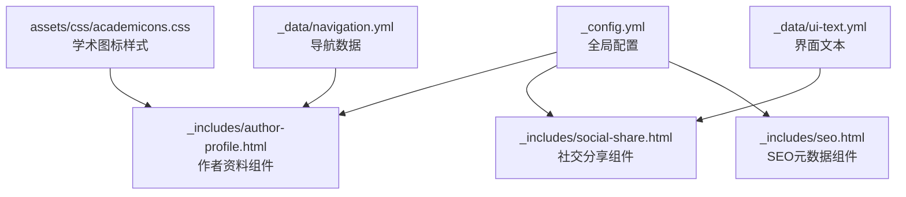
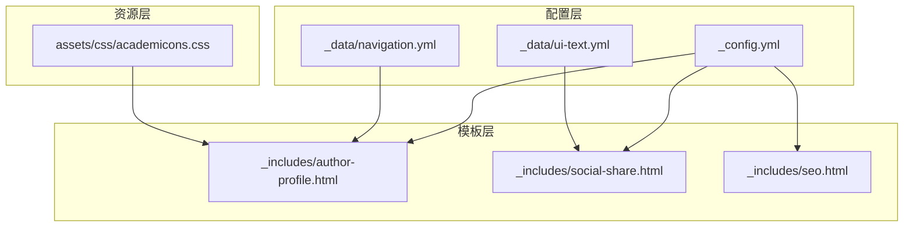
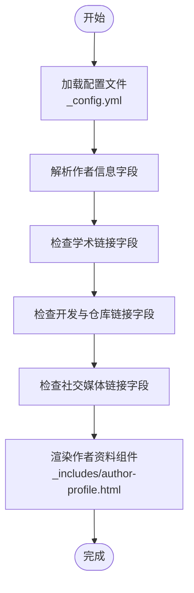
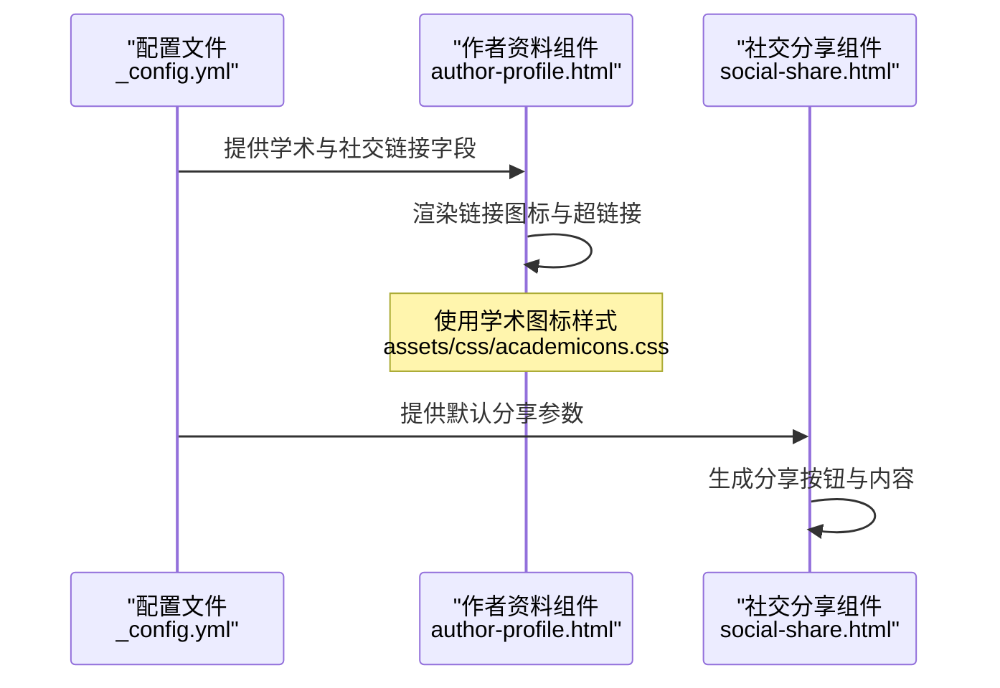
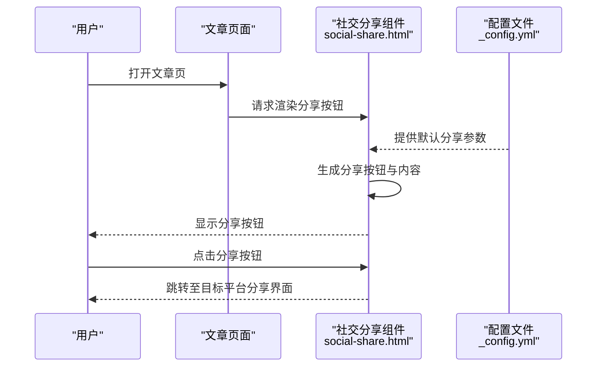
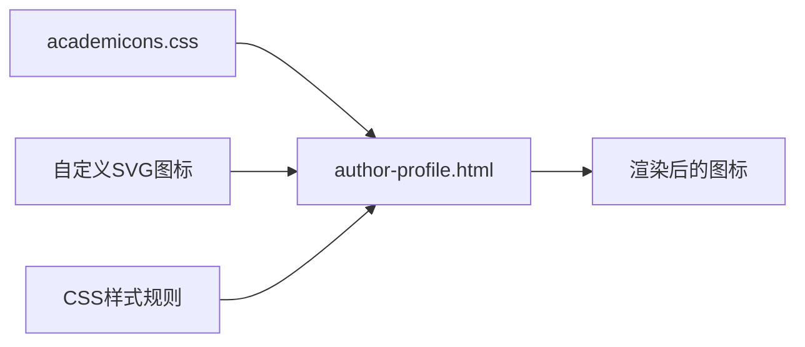
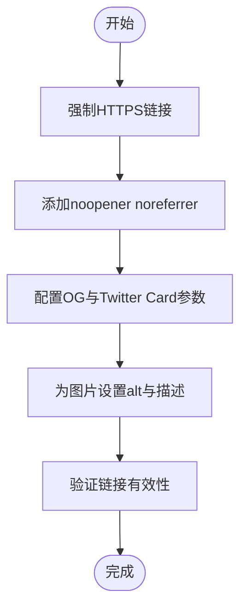
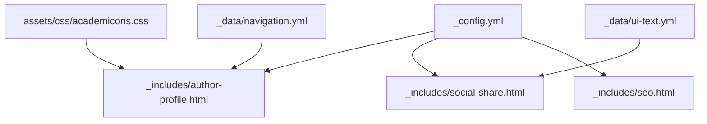

# 社交媒体链接集成

<cite>
**本文档引用的文件**
- [_config.yml](file://_config.yml)
- [author-profile.html](file://_includes/author-profile.html)
- [social-share.html](file://_includes/social-share.html)
- [academicons.css](file://assets/css/academicons.css)
- [seo.html](file://_includes/seo.html)
- [navigation.yml](file://_data/navigation.yml)
- [ui-text.yml](file://_data/ui-text.yml)
</cite>

## 目录
1. [简介](#简介)
2. [项目结构](#项目结构)
3. [核心组件](#核心组件)
4. [架构概览](#架构概览)
5. [详细组件分析](#详细组件分析)
6. [依赖关系分析](#依赖关系分析)
7. [性能考虑](#性能考虑)
8. [故障排除指南](#故障排除指南)
9. [结论](#结论)

## 简介
本文件详细说明了该Jekyll网站中社交媒体链接的集成方案，涵盖作者资料配置、各类学术与社交平台链接的添加与管理、图标设计与自定义、社交分享功能实现，以及安全配置、隐私设置和SEO优化建议。通过配置文件与模板组件的协作，系统能够灵活地展示作者信息与外部链接，并在页面层面提供社交分享能力。

## 项目结构
该站点采用标准Jekyll目录结构，社交媒体相关的关键位置如下：
- 配置中心：根目录下的配置文件用于全局设置（如作者信息、社交链接、SEO参数）
- 模板组件：_includes目录包含作者资料展示、社交分享等可复用片段
- 图标资源：assets/css包含学术图标样式文件
- 数据与本地化：_data目录包含导航、界面文本等数据文件

图表来源
- [_config.yml](file://_config.yml)
- [author-profile.html](file://_includes/author-profile.html)
- [social-share.html](file://_includes/social-share.html)
- [academicons.css](file://assets/css/academicons.css)
- [navigation.yml](file://_data/navigation.yml)
- [ui-text.yml](file://_data/ui-text.yml)

章节来源
- [_config.yml](file://_config.yml)
- [author-profile.html](file://_includes/author-profile.html)
- [social-share.html](file://_includes/social-share.html)
- [academicons.css](file://assets/css/academicons.css)
- [navigation.yml](file://_data/navigation.yml)
- [ui-text.yml](file://_data/ui-text.yml)

## 核心组件
- 作者资料组件：负责渲染头像、姓名、简介、位置、雇主、个人主页、邮箱，以及学术与社交链接等
- 社交分享组件：为文章页提供分享到社交媒体的按钮与内容
- 配置文件：集中管理作者信息、社交链接、SEO参数、分析提供商等
- 学术图标样式：提供学术平台专用图标的CSS类名与样式
- 数据与本地化：导航菜单与界面文本由数据文件驱动，便于多语言与结构化维护

章节来源
- [_config.yml](file://_config.yml)
- [author-profile.html](file://_includes/author-profile.html)
- [social-share.html](file://_includes/social-share.html)
- [academicons.css](file://assets/css/academicons.css)
- [navigation.yml](file://_data/navigation.yml)
- [ui-text.yml](file://_data/ui-text.yml)

## 架构概览
下图展示了社交媒体链接在站点中的整体架构：配置文件提供数据源，模板组件负责渲染，图标样式提供视觉表现，SEO组件确保搜索引擎友好性。

图表来源
- [_config.yml](file://_config.yml)
- [author-profile.html](file://_includes/author-profile.html)
- [social-share.html](file://_includes/social-share.html)
- [seo.html](file://_includes/seo.html)
- [navigation.yml](file://_data/navigation.yml)
- [ui-text.yml](file://_data/ui-text.yml)
- [academicons.css](file://assets/css/academicons.css)

## 详细组件分析

### 作者资料配置与管理
- 作者信息字段：头像、姓名、性别代词、简介、位置、雇主、个人主页URL、邮箱等
- 学术链接区段：Google Scholar、ORCID、PubMed、ResearchGate等学术平台链接
- 开发与仓库区段：GitHub、Bitbucket、Stack Overflow等开发平台链接
- 社交媒体区段：Facebook、Twitter/X、LinkedIn、Instagram、YouTube、Zhihu等社交平台链接
- 使用方式：在配置文件中启用相应字段并填入有效URL；未填写的字段不会显示对应图标与链接
- 自定义扩展：可通过编辑作者资料组件模板进一步扩展显示逻辑或新增平台

图表来源
- [_config.yml](file://_config.yml)
- [author-profile.html](file://_includes/author-profile.html)

章节来源
- [_config.yml](file://_config.yml)
- [author-profile.html](file://_includes/author-profile.html)

### 学术与社交平台链接配置
- Google Scholar：在学术链接区段配置Google Scholar链接
- ORCID：在学术链接区段配置ORCID链接
- Twitter/X：在社交媒体区段配置Twitter用户名或完整URL
- LinkedIn：在社交媒体区段配置LinkedIn用户名或完整URL
- 其他平台：按相同模式在对应区段添加字段并填入URL

图表来源
- [_config.yml](file://_config.yml)
- [author-profile.html](file://_includes/author-profile.html)
- [social-share.html](file://_includes/social-share.html)
- [academicons.css](file://assets/css/academicons.css)

章节来源
- [_config.yml](file://_config.yml)
- [author-profile.html](file://_includes/author-profile.html)
- [social-share.html](file://_includes/social-share.html)
- [academicons.css](file://assets/css/academicons.css)

### 社交分享功能实现
- 分享按钮：在文章布局中通过默认值控制是否显示分享按钮
- 分享内容：可配置默认的社交媒体描述与图片，用于生成预览卡片
- 组件交互：社交分享组件根据页面上下文动态生成分享链接

图表来源
- [social-share.html](file://_includes/social-share.html)
- [_config.yml](file://_config.yml)

章节来源
- [social-share.html](file://_includes/social-share.html)
- [_config.yml](file://_config.yml)

### 图标设计与自定义
- 学术图标：通过学术图标样式文件提供统一的图标类名与样式
- SVG图标替换：可在模板中使用自定义SVG作为图标，替换默认样式类
- 样式调整：通过CSS选择器对图标尺寸、颜色、间距进行统一调整
- 响应式适配：确保图标在移动端与桌面端均清晰可点击

图表来源
- [academicons.css](file://assets/css/academicons.css)
- [author-profile.html](file://_includes/author-profile.html)

章节来源
- [academicons.css](file://assets/css/academicons.css)
- [author-profile.html](file://_includes/author-profile.html)

### 安全配置、隐私设置与SEO优化
- 安全配置：仅使用HTTPS链接，避免混合内容问题；对外部链接使用rel="noopener noreferrer"增强安全性
- 隐私设置：合理控制分享内容，避免泄露敏感信息；在配置中设置默认描述与图片时注意版权与隐私
- SEO优化：通过SEO组件设置Open Graph与Twitter Card参数，提升分享预览质量；为图片设置alt属性与描述；保持链接有效性与可访问性

图表来源
- [_config.yml](file://_config.yml)
- [seo.html](file://_includes/seo.html)

章节来源
- [_config.yml](file://_config.yml)
- [seo.html](file://_includes/seo.html)

## 依赖关系分析
- 配置文件是数据源，被多个模板组件依赖
- 作者资料组件依赖配置文件中的作者信息与学术/社交链接字段
- 社交分享组件依赖配置文件中的默认分享参数
- 学术图标样式为作者资料组件提供视觉支持
- 导航与界面文本数据影响组件的呈现与国际化

图表来源
- [_config.yml](file://_config.yml)
- [author-profile.html](file://_includes/author-profile.html)
- [social-share.html](file://_includes/social-share.html)
- [seo.html](file://_includes/seo.html)
- [academicons.css](file://assets/css/academicons.css)
- [navigation.yml](file://_data/navigation.yml)
- [ui-text.yml](file://_data/ui-text.yml)

章节来源
- [_config.yml](file://_config.yml)
- [author-profile.html](file://_includes/author-profile.html)
- [social-share.html](file://_includes/social-share.html)
- [seo.html](file://_includes/seo.html)
- [academicons.css](file://assets/css/academicons.css)
- [navigation.yml](file://_data/navigation.yml)
- [ui-text.yml](file://_data/ui-text.yml)

## 性能考虑
- 减少不必要的外部资源：仅启用需要的社交平台链接，避免加载无关图标
- 合理使用图标样式：优先使用矢量图标以降低带宽占用
- 压缩与缓存：利用Jekyll压缩插件减少HTML/CSS体积，结合浏览器缓存提升加载速度
- 图片优化：为分享预览图选择合适尺寸与格式，避免过大文件影响加载

## 故障排除指南
- 链接不显示：检查配置文件中对应字段是否已启用且URL有效
- 图标缺失：确认学术图标样式文件已正确引入，或替换为可用的SVG图标
- 分享失败：核对默认分享参数配置，确保描述与图片路径正确
- SEO预览异常：检查OG与Twitter Card参数设置，确保图片可访问且尺寸符合要求

章节来源
- [_config.yml](file://_config.yml)
- [author-profile.html](file://_includes/author-profile.html)
- [social-share.html](file://_includes/social-share.html)
- [seo.html](file://_includes/seo.html)

## 结论
通过配置文件与模板组件的协同工作，该站点实现了完善的社交媒体链接集成。作者资料组件提供了统一的信息展示入口，社交分享组件增强了内容传播能力，学术图标样式保证了视觉一致性。配合安全、隐私与SEO的最佳实践，可以构建一个既专业又友好的学术与社交展示平台。