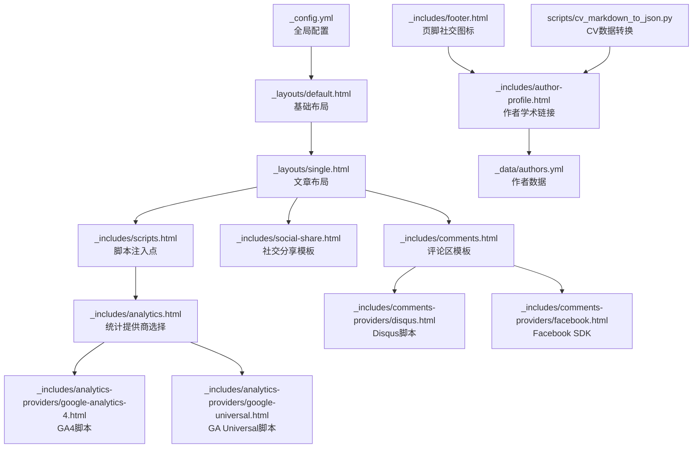
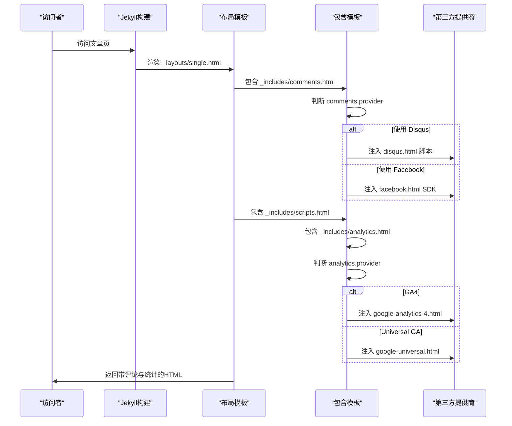
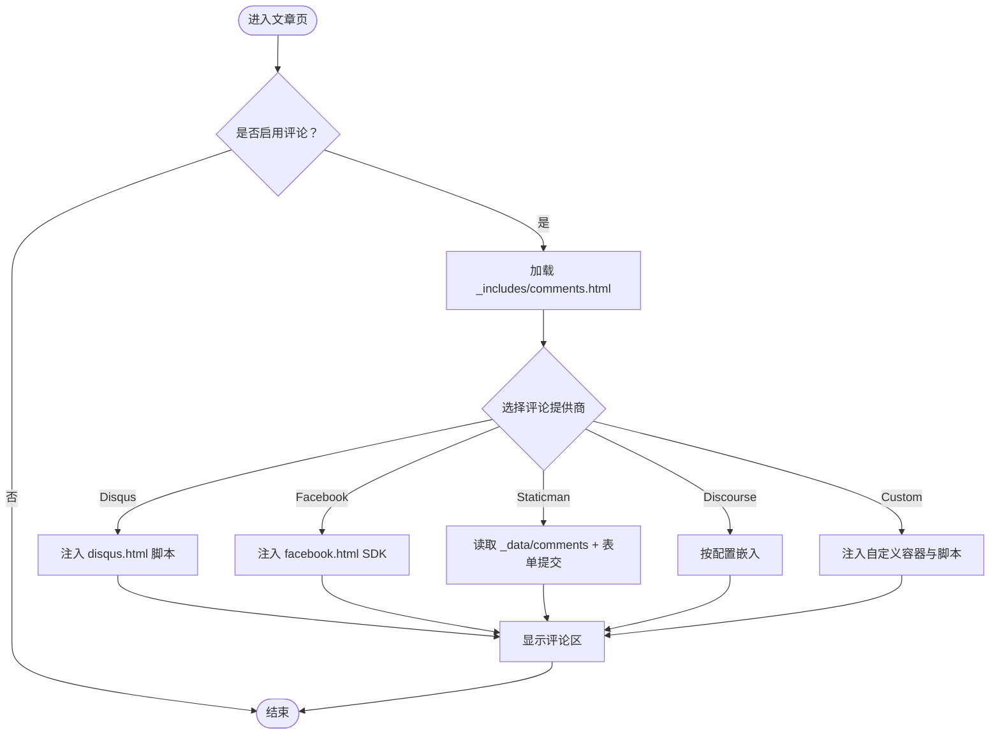
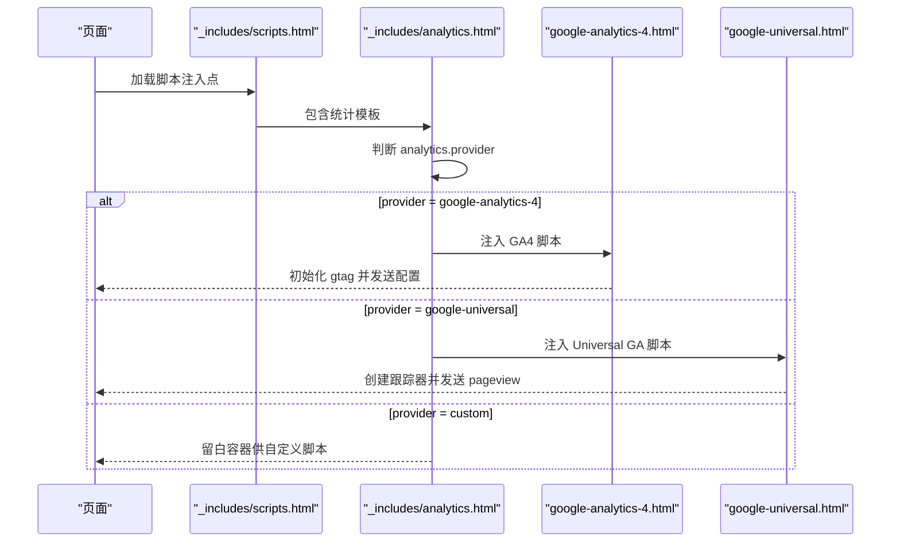
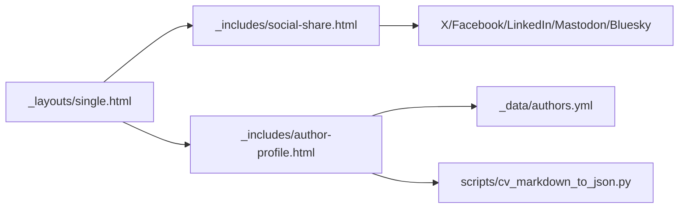
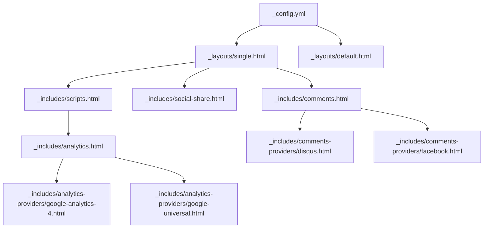

# 社交集成功能

<cite>
**本文档引用的文件**
- [_config.yml](file://_config.yml)
- [analytics.html](file://_includes/analytics.html)
- [comments.html](file://_includes/comments.html)
- [social-share.html](file://_includes/social-share.html)
- [disqus.html](file://_includes/comments-providers/disqus.html)
- [facebook.html](file://_includes/comments-providers/facebook.html)
- [google-analytics-4.html](file://_includes/analytics-providers/google-analytics-4.html)
- [google-universal.html](file://_includes/analytics-providers/google-universal.html)
- [default.html](file://_layouts/default.html)
- [single.html](file://_layouts/single.html)
- [scripts.html](file://_includes/scripts.html)
- [footer.html](file://_includes/footer.html)
- [author-profile.html](file://_includes/author-profile.html)
- [authors.yml](file://_data/authors.yml)
- [cv_markdown_to_json.py](file://scripts/cv_markdown_to_json.py)
</cite>

## 目录
1. [简介](#简介)
2. [项目结构](#项目结构)
3. [核心组件](#核心组件)
4. [架构总览](#架构总览)
5. [详细组件分析](#详细组件分析)
6. [依赖关系分析](#依赖关系分析)
7. [性能考虑](#性能考虑)
8. [故障排除指南](#故障排除指南)
9. [结论](#结论)

## 简介
本文件面向Jekyll主题中的社交集成功能，系统性说明以下能力与配置：
- 评论系统集成：Disqus、Facebook、Google+、Discourse、Staticman、自定义
- 统计分析集成：Google Analytics（Universal）、Google Analytics 4、自定义
- 社交分享与学术链接：X/Twitter、Facebook、LinkedIn、Mastodon、Bluesky、GitHub、Google Scholar、ORCID等
- 数据流向与控制流：从配置到模板渲染再到第三方服务调用
- 隐私保护与安全建议：最小化数据采集、合规嵌入与本地化处理

## 项目结构
社交集成功能主要由以下层次构成：
- 全局配置层：在站点配置中声明评论提供商、统计提供商、作者社交信息等
- 模板层：通过Liquid模板条件渲染，按需加载第三方脚本与分享按钮
- 布局层：在文章页或单页布局中包含评论区与分享区
- 数据层：作者资料与CV转换脚本，用于生成学术平台链接

**图表来源**
- [_config.yml:101-161](file://_config.yml#L101-L161)
- [default.html:1-32](file://_layouts/default.html#L1-L32)
- [single.html:1-110](file://_layouts/single.html#L1-L110)
- [comments.html:1-84](file://_includes/comments.html#L1-L84)
- [social-share.html:1-18](file://_includes/social-share.html#L1-L18)
- [scripts.html:1-4](file://_includes/scripts.html#L1-L4)
- [analytics.html:1-14](file://_includes/analytics.html#L1-L14)
- [disqus.html:1-22](file://_includes/comments-providers/disqus.html#L1-L22)
- [facebook.html:1-8](file://_includes/comments-providers/facebook.html#L1-L8)
- [google-analytics-4.html:1-9](file://_includes/analytics-providers/google-analytics-4.html#L1-L9)
- [google-universal.html:1-9](file://_includes/analytics-providers/google-universal.html#L1-L9)
- [footer.html:1-26](file://_includes/footer.html#L1-L26)
- [author-profile.html:40-74](file://_includes/author-profile.html#L40-L74)
- [authors.yml:1-19](file://_data/authors.yml#L1-L19)
- [cv_markdown_to_json.py:125-158](file://scripts/cv_markdown_to_json.py#L125-L158)

**章节来源**
- [_config.yml:101-161](file://_config.yml#L101-L161)
- [single.html:86-93](file://_layouts/single.html#L86-L93)
- [scripts.html:1-4](file://_includes/scripts.html#L1-L4)

## 核心组件
- 评论系统
  - 支持提供商：disqus、facebook、google-plus、discourse、staticman、custom
  - 渲染逻辑：根据配置选择对应模板，动态注入第三方脚本或静态评论数据
- 统计分析
  - 支持提供商：google、google-universal、google-analytics-4、custom
  - 渲染逻辑：在页面脚本注入点按提供商类型加载对应脚本
- 社交分享
  - 提供一键分享至X、Facebook、LinkedIn、Mastodon、Bluesky
- 学术与社交链接
  - 作者侧边栏展示GitHub、Google Scholar、ORCID等学术平台链接
  - 脚本可将作者配置转换为JSON格式，便于前端或外部系统消费

**章节来源**
- [_config.yml:101-161](file://_config.yml#L101-L161)
- [comments.html:5-84](file://_includes/comments.html#L5-L84)
- [analytics.html:3-12](file://_includes/analytics.html#L3-L12)
- [social-share.html:8-16](file://_includes/social-share.html#L8-L16)
- [author-profile.html:40-74](file://_includes/author-profile.html#L40-L74)
- [cv_markdown_to_json.py:125-158](file://scripts/cv_markdown_to_json.py#L125-L158)

## 架构总览
下图展示了从配置到页面渲染的关键流程，以及第三方服务的调用时机。

**图表来源**
- [single.html:86-93](file://_layouts/single.html#L86-L93)
- [comments.html:5-84](file://_includes/comments.html#L5-L84)
- [disqus.html:1-22](file://_includes/comments-providers/disqus.html#L1-L22)
- [facebook.html:1-8](file://_includes/comments-providers/facebook.html#L1-L8)
- [scripts.html:1-4](file://_includes/scripts.html#L1-L4)
- [analytics.html:3-12](file://_includes/analytics.html#L3-L12)
- [google-analytics-4.html:1-9](file://_includes/analytics-providers/google-analytics-4.html#L1-L9)
- [google-universal.html:1-9](file://_includes/analytics-providers/google-universal.html#L1-L9)

## 详细组件分析

### 评论系统集成
- 配置入口
  - 在站点配置中设置评论提供商与子项参数（如Disqus短名称、Facebook应用ID、Google+属性等）
- 渲染机制
  - 文章布局在启用评论时包含评论模板，模板根据provider分支渲染不同内容
  - Disqus：插入嵌入式评论脚本与计数脚本
  - Facebook：加载官方SDK，使用data属性驱动评论框
  - Staticman：以静态文件形式存储评论，表单提交至Staticman API
  - Discourse：通过服务端配置嵌入
  - Custom：预留容器与脚本注入点
- 数据流向
  - 页面加载 -> 读取配置 -> 条件渲染 -> 注入第三方脚本 -> 第三方服务初始化 -> 展示评论区

**图表来源**
- [comments.html:5-84](file://_includes/comments.html#L5-L84)
- [disqus.html:1-22](file://_includes/comments-providers/disqus.html#L1-L22)
- [facebook.html:1-8](file://_includes/comments-providers/facebook.html#L1-L8)

**章节来源**
- [_config.yml:101-127](file://_config.yml#L101-L127)
- [comments.html:5-84](file://_includes/comments.html#L5-L84)
- [disqus.html:1-22](file://_includes/comments-providers/disqus.html#L1-L22)
- [facebook.html:1-8](file://_includes/comments-providers/facebook.html#L1-L8)

### 统计分析集成
- 配置入口
  - 在站点配置中设置analytics.provider与tracking_id（针对Google系列）
- 渲染机制
  - 在脚本注入点包含analytics模板，按provider分支加载对应脚本
  - GA4：使用gtag管理器与配置脚本
  - Universal GA：使用analytics.js创建跟踪器并发送pageview
  - Custom：预留容器以便自行注入统计代码
- 数据流向
  - 页面加载 -> 读取配置 -> 判断提供商 -> 注入脚本 -> 初始化SDK -> 发送页面浏览事件

**图表来源**
- [scripts.html:1-4](file://_includes/scripts.html#L1-L4)
- [analytics.html:3-12](file://_includes/analytics.html#L3-L12)
- [google-analytics-4.html:1-9](file://_includes/analytics-providers/google-analytics-4.html#L1-L9)
- [google-universal.html:1-9](file://_includes/analytics-providers/google-universal.html#L1-L9)

**章节来源**
- [_config.yml:156-161](file://_config.yml#L156-L161)
- [analytics.html:3-12](file://_includes/analytics.html#L3-L12)
- [google-analytics-4.html:1-9](file://_includes/analytics-providers/google-analytics-4.html#L1-L9)
- [google-universal.html:1-9](file://_includes/analytics-providers/google-universal.html#L1-L9)

### 社交分享与学术链接
- 社交分享
  - 在文章布局中按需包含分享模板，一键分享至X、Facebook、LinkedIn、Mastodon、Bluesky
- 学术与社交链接
  - 作者侧边栏展示GitHub、Google Scholar、ORCID等学术平台链接
  - 作者数据来自配置与_data/authors.yml，CV转换脚本可将作者配置映射为JSON结构，便于前端或外部系统消费

**图表来源**
- [single.html:86-87](file://_layouts/single.html#L86-L87)
- [social-share.html:8-16](file://_includes/social-share.html#L8-L16)
- [author-profile.html:40-74](file://_includes/author-profile.html#L40-L74)
- [authors.yml:1-19](file://_data/authors.yml#L1-L19)
- [cv_markdown_to_json.py:125-158](file://scripts/cv_markdown_to_json.py#L125-L158)

**章节来源**
- [social-share.html:8-16](file://_includes/social-share.html#L8-L16)
- [author-profile.html:40-74](file://_includes/author-profile.html#L40-L74)
- [authors.yml:1-19](file://_data/authors.yml#L1-L19)
- [cv_markdown_to_json.py:125-158](file://scripts/cv_markdown_to_json.py#L125-L158)

## 依赖关系分析
- 配置到模板的耦合
  - 评论与统计均依赖站点配置中的provider字段，通过Liquid条件判断实现低耦合扩展
- 模板到第三方的依赖
  - Disqus与Facebook通过各自SDK脚本接入，GA4与Universal GA通过官方脚本接入
- 布局到包含模板的依赖
  - 文章布局在特定位置包含评论与分享模板，确保复用与一致性

**图表来源**
- [_config.yml:101-161](file://_config.yml#L101-L161)
- [single.html:86-93](file://_layouts/single.html#L86-L93)
- [scripts.html:1-4](file://_includes/scripts.html#L1-L4)
- [analytics.html:3-12](file://_includes/analytics.html#L3-L12)
- [comments.html:5-84](file://_includes/comments.html#L5-L84)
- [disqus.html:1-22](file://_includes/comments-providers/disqus.html#L1-L22)
- [facebook.html:1-8](file://_includes/comments-providers/facebook.html#L1-L8)
- [google-analytics-4.html:1-9](file://_includes/analytics-providers/google-analytics-4.html#L1-L9)
- [google-universal.html:1-9](file://_includes/analytics-providers/google-universal.html#L1-L9)

**章节来源**
- [_config.yml:101-161](file://_config.yml#L101-L161)
- [single.html:86-93](file://_layouts/single.html#L86-L93)
- [scripts.html:1-4](file://_includes/scripts.html#L1-L4)

## 性能考虑
- 脚本异步加载
  - Disqus与Facebook脚本采用异步方式注入，避免阻塞主线程
- 条件渲染
  - 仅在启用评论或统计时加载对应脚本，减少不必要的网络请求
- 最小化第三方依赖
  - 对于非必要功能（如Google+），建议禁用以降低复杂度与风险
- 缓存与压缩
  - 使用主题内置的HTML压缩与资源压缩策略，提升整体加载速度

[本节为通用指导，无需具体文件分析]

## 故障排除指南
- 评论未显示
  - 检查站点配置中的评论提供商与子项参数是否正确填写
  - 确认文章页启用了评论（默认值为启用，可在页面front matter覆盖）
  - 查看浏览器控制台是否存在脚本加载失败或跨域问题
- 分享按钮无效
  - 确认分享模板已包含在文章布局中
  - 检查URL拼接是否正确（base_path与page.url）
- 统计无数据
  - 确认analytics.provider与tracking_id配置正确
  - 检查是否被广告拦截插件阻止脚本加载
  - 在生产环境验证脚本是否成功执行

**章节来源**
- [_config.yml:101-161](file://_config.yml#L101-L161)
- [comments.html:5-84](file://_includes/comments.html#L5-L84)
- [social-share.html:8-16](file://_includes/social-share.html#L8-L16)
- [analytics.html:3-12](file://_includes/analytics.html#L3-L12)

## 结论
本主题通过清晰的配置与模板分层，实现了对主流评论与统计服务的灵活集成，同时保留了自定义扩展能力。建议在部署前完成以下工作：
- 明确隐私与合规要求，谨慎选择第三方服务
- 针对目标受众优化脚本加载策略，减少首屏阻塞
- 定期检查第三方服务的可用性与变更，确保功能稳定