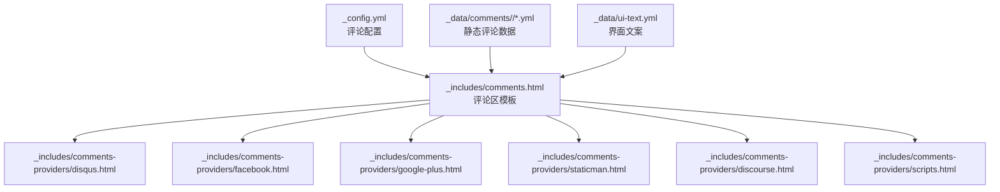
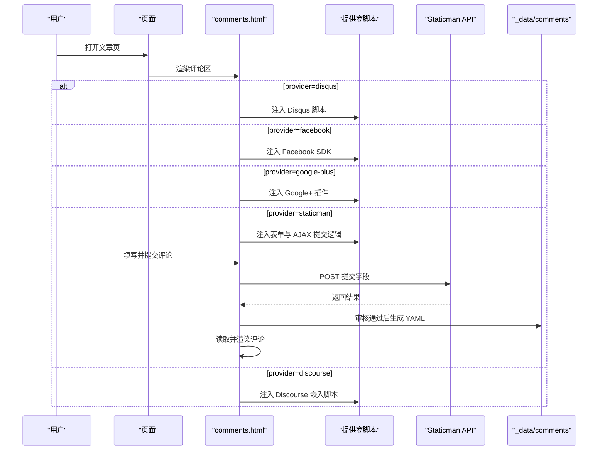
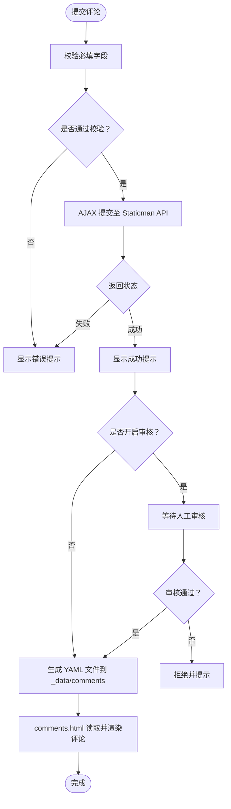
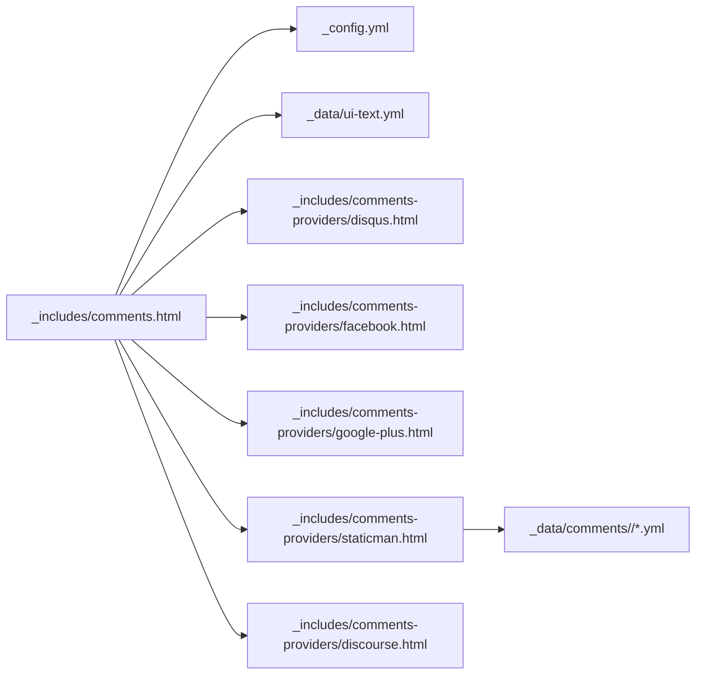

# 评论系统集成

<cite>
**本文引用的文件**
- [_config.yml](file://_config.yml)
- [_includes/comments.html](file://_includes/comments.html)
- [_includes/comments-providers/disqus.html](file://_includes/comments-providers/disqus.html)
- [_includes/comments-providers/facebook.html](file://_includes/comments-providers/facebook.html)
- [_includes/comments-providers/google-plus.html](file://_includes/comments-providers/google-plus.html)
- [_includes/comments-providers/staticman.html](file://_includes/comments-providers/staticman.html)
- [_includes/comments-providers/scripts.html](file://_includes/comments-providers/scripts.html)
- [_includes/comments-providers/discourse.html](file://_includes/comments-providers/discourse.html)
- [_includes/comment.html](file://_includes/comment.html)
- [_data/ui-text.yml](file://_data/ui-text.yml)
- [_pages/terms.md](file://_pages/terms.md)
- [_data/comments/welcome-to-jekyll/comment-1470942205700.yml](file://_data/comments/welcome-to-jekyll/comment-1470942205700.yml)
- [_data/comments/welcome-to-jekyll/comment-1470942493518.yml](file://_data/comments/welcome-to-jekyll/comment-1470942493518.yml)
</cite>

## 目录
1. [简介](#简介)
2. [项目结构](#项目结构)
3. [核心组件](#核心组件)
4. [架构总览](#架构总览)
5. [详细组件分析](#详细组件分析)
6. [依赖关系分析](#依赖关系分析)
7. [性能与可用性考虑](#性能与可用性考虑)
8. [安全与隐私配置](#安全与隐私配置)
9. [故障排除指南](#故障排除指南)
10. [结论](#结论)
11. [附录](#附录)

## 简介
本文件面向需要在 Jekyll 站点中集成评论系统的开发者与维护者，系统梳理了当前仓库内已实现的评论提供商及其配置要点，包括：
- Disqus 的嵌入与计数脚本
- Facebook 评论插件
- Google+ 评论（已停止服务）
- Staticman 静态评论与审核流程
- 自定义评论脚本注入
并结合站点配置、模板与数据文件，给出各方案的特点、优缺点、适用场景、安全与隐私建议以及常见问题排查思路。

## 项目结构
评论系统由“配置层”“模板层”“提供商脚本层”“静态数据层”四部分组成：
- 配置层：在站点配置中启用评论提供商、设置参数（如短名称、App ID、分支等）
- 模板层：根据配置选择性渲染评论区与表单
- 提供商脚本层：按提供商注入对应的 JS 脚本或 SDK
- 静态数据层：Staticman 提交的评论以 YAML 文件形式存放在 _data 下，按文章 slug 分类组织

图表来源
- [_config.yml](file://_config.yml)
- [_includes/comments.html](file://_includes/comments.html)
- [_includes/comments-providers/disqus.html](file://_includes/comments-providers/disqus.html)
- [_includes/comments-providers/facebook.html](file://_includes/comments-providers/facebook.html)
- [_includes/comments-providers/google-plus.html](file://_includes/comments-providers/google-plus.html)
- [_includes/comments-providers/staticman.html](file://_includes/comments-providers/staticman.html)
- [_includes/comments-providers/discourse.html](file://_includes/comments-providers/discourse.html)
- [_includes/comments-providers/scripts.html](file://_includes/comments-providers/scripts.html)
- [_data/ui-text.yml](file://_data/ui-text.yml)
- [_data/comments/welcome-to-jekyll/comment-1470942205700.yml](file://_data/comments/welcome-to-jekyll/comment-1470942205700.yml)

章节来源
- [_config.yml](file://_config.yml)
- [_includes/comments.html](file://_includes/comments.html)

## 核心组件
- 评论区入口模板：根据配置选择性渲染不同提供商的评论区与表单
- 提供商脚本：按提供商注入 JS 或 SDK，负责前端展示与交互
- 静态评论数据：通过 Staticman 提交并通过审核后，以 YAML 文件保存在 _data/comments 下
- 界面文案：多语言文案由 ui-text.yml 提供，用于表单提示、按钮文本等

章节来源
- [_includes/comments.html](file://_includes/comments.html)
- [_includes/comments-providers/disqus.html](file://_includes/comments-providers/disqus.html)
- [_includes/comments-providers/facebook.html](file://_includes/comments-providers/facebook.html)
- [_includes/comments-providers/google-plus.html](file://_includes/comments-providers/google-plus.html)
- [_includes/comments-providers/staticman.html](file://_includes/comments-providers/staticman.html)
- [_includes/comments-providers/discourse.html](file://_includes/comments-providers/discourse.html)
- [_includes/comments-providers/scripts.html](file://_includes/comments-providers/scripts.html)
- [_includes/comment.html](file://_includes/comment.html)
- [_data/ui-text.yml](file://_data/ui-text.yml)

## 架构总览
评论系统采用“配置驱动 + 模板选择 + 脚本注入”的模式：
- 在站点配置中选择 provider
- comments.html 根据 provider 渲染对应区块
- 对应的提供商脚本被注入到页面
- Staticman 流程中，表单提交至 Staticman API，审核通过后生成 _data/comments 下的 YAML 文件，后续由 comments.html 读取并渲染

图表来源
- [_includes/comments.html](file://_includes/comments.html)
- [_includes/comments-providers/disqus.html](file://_includes/comments-providers/disqus.html)
- [_includes/comments-providers/facebook.html](file://_includes/comments-providers/facebook.html)
- [_includes/comments-providers/google-plus.html](file://_includes/comments-providers/google-plus.html)
- [_includes/comments-providers/staticman.html](file://_includes/comments-providers/staticman.html)
- [_includes/comments-providers/discourse.html](file://_includes/comments-providers/discourse.html)

## 详细组件分析

### Disqus 集成
- 配置参数
  - provider: "disqus"
  - disqus.shortname: 站点短名称（必须）
- 行为特征
  - 注入评论嵌入脚本与计数脚本
  - 使用默认的评论容器与 noscript 提示
- 适用场景
  - 需要成熟的评论生态与统计能力
  - 对第三方托管有接受度
- 优缺点
  - 优点：生态完善、统计与管理工具成熟
  - 缺点：依赖第三方、隐私与数据控制有限

章节来源
- [_config.yml](file://_config.yml)
- [_includes/comments.html](file://_includes/comments.html)
- [_includes/comments-providers/disqus.html](file://_includes/comments-providers/disqus.html)

### Facebook 评论系统
- 配置参数
  - provider: "facebook"
  - facebook.appid: 可选（用于 SDK 初始化）
  - facebook.num_posts: 显示评论数量（默认 5）
  - facebook.colorscheme: 主题色（默认 light）
- 行为特征
  - 使用 Facebook SDK，通过 data-* 属性控制显示
- 适用场景
  - 已有 Facebook 生态或希望利用社交登录
- 优缺点
  - 优点：与社交平台深度集成
  - 缺点：需 Facebook App ID；隐私与数据受平台政策影响

章节来源
- [_config.yml](file://_config.yml)
- [_includes/comments.html](file://_includes/comments.html)
- [_includes/comments-providers/facebook.html](file://_includes/comments-providers/facebook.html)

### Google+ 评论
- 配置参数
  - provider: "google-plus"
- 行为特征
  - 注入 Google+ 评论插件脚本
  - 注意：Google+ 已停止服务，不建议使用
- 适用场景
  - 历史遗留站点（不推荐新站点启用）

章节来源
- [_config.yml](file://_config.yml)
- [_includes/comments.html](file://_includes/comments.html)
- [_includes/comments-providers/google-plus.html](file://_includes/comments-providers/google-plus.html)

### Staticman 静态评论系统
- 配置参数（来自站点配置）
  - provider: "staticman"
  - repository: 仓库名（owner/repo），用于 API 提交目标
  - staticman.branch: 提交分支（如 gh-pages）
  - staticman.allowedFields: 允许提交的字段列表
  - staticman.requiredFields: 必填字段列表
  - staticman.moderation: 是否开启审核（true/false）
  - staticman.path: 数据存放路径模板（含 {options.slug} 占位）
  - staticman.filename: 文件命名模板（含 {@timestamp} 占位）
  - staticman.format: 存储格式（yml）
  - staticman.commitMessage: 提交信息
  - staticman.transforms.email: 字段转换（如 md5）
  - staticman.generatedFields.date.type: 日期类型（如 date）
  - staticman.generatedFields.date.options.format: 日期格式（如 iso8601）
- 表单与交互
  - comments.html 中包含评论表单与提交逻辑
  - 通过 AJAX 提交至 https://api.staticman.net/v1/entry/{repository}/{branch}
  - 成功/失败状态通过页面通知元素反馈
- 数据存储机制
  - 审核通过后，评论以 YAML 文件形式保存在 _data/comments/{page.slug}/ 下
  - comments.html 读取该目录下的评论并渲染
  - 评论头像使用 Gravatar，邮箱经 md5 转换
- 适用场景
  - 希望评论数据完全托管在仓库内、无第三方依赖
  - 对隐私与数据主权有较高要求
- 优缺点
  - 优点：数据可控、无需第三方服务
  - 缺点：需自行处理审核、存储与迁移

图表来源
- [_includes/comments.html](file://_includes/comments.html)
- [_includes/comments-providers/staticman.html](file://_includes/comments-providers/staticman.html)
- [_data/comments/welcome-to-jekyll/comment-1470942205700.yml](file://_data/comments/welcome-to-jekyll/comment-1470942205700.yml)
- [_data/comments/welcome-to-jekyll/comment-1470942493518.yml](file://_data/comments/welcome-to-jekyll/comment-1470942493518.yml)

章节来源
- [_config.yml](file://_config.yml)
- [_includes/comments.html](file://_includes/comments.html)
- [_includes/comments-providers/staticman.html](file://_includes/comments-providers/staticman.html)
- [_includes/comment.html](file://_includes/comment.html)
- [_data/comments/welcome-to-jekyll/comment-1470942205700.yml](file://_data/comments/welcome-to-jekyll/comment-1470942205700.yml)
- [_data/comments/welcome-to-jekyll/comment-1470942493518.yml](file://_data/comments/welcome-to-jekyll/comment-1470942493518.yml)

### Discourse 嵌入
- 配置参数
  - provider: "discourse"
  - discourse.server: Discourse 论坛域名（如 meta.discourse.org）
- 行为特征
  - 注入 Discourse 嵌入脚本，通过 canonical URL 关联文章
- 适用场景
  - 已有 Discourse 社区或希望复用现有论坛生态
- 优缺点
  - 优点：社区功能丰富
  - 缺点：需维护独立论坛实例

章节来源
- [_config.yml](file://_config.yml)
- [_includes/comments.html](file://_includes/comments.html)
- [_includes/comments-providers/discourse.html](file://_includes/comments-providers/discourse.html)

### 自定义评论脚本
- 配置参数
  - provider: "custom"
- 行为特征
  - comments.html 中预留容器，scripts.html 根据 provider 包含对应自定义片段
  - 适合引入第三方评论或私有化部署的评论服务
- 适用场景
  - 企业级或私有化需求
- 优缺点
  - 优点：完全可控
  - 缺点：需自行维护与集成

章节来源
- [_config.yml](file://_config.yml)
- [_includes/comments.html](file://_includes/comments.html)
- [_includes/comments-providers/scripts.html](file://_includes/comments-providers/scripts.html)
- [_includes/comments-providers/custom.html](file://_includes/comments-providers/custom.html)

## 依赖关系分析
- comments.html 依赖：
  - 站点配置中的 comments.provider 与各子配置
  - ui-text.yml 中的界面文案
  - 对应的提供商脚本文件
  - Staticman 审核通过后的 _data/comments 数据
- providers 脚本文件彼此独立，互不耦合，按 provider 条件注入
- Staticman 依赖 repository 与 branch，提交字段受 allowedFields/requiredFields 控制

图表来源
- [_includes/comments.html](file://_includes/comments.html)
- [_config.yml](file://_config.yml)
- [_data/ui-text.yml](file://_data/ui-text.yml)
- [_includes/comments-providers/disqus.html](file://_includes/comments-providers/disqus.html)
- [_includes/comments-providers/facebook.html](file://_includes/comments-providers/facebook.html)
- [_includes/comments-providers/google-plus.html](file://_includes/comments-providers/google-plus.html)
- [_includes/comments-providers/staticman.html](file://_includes/comments-providers/staticman.html)
- [_includes/comments-providers/discourse.html](file://_includes/comments-providers/discourse.html)
- [_data/comments/welcome-to-jekyll/comment-1470942205700.yml](file://_data/comments/welcome-to-jekyll/comment-1470942205700.yml)

章节来源
- [_includes/comments.html](file://_includes/comments.html)
- [_config.yml](file://_config.yml)

## 性能与可用性考虑
- 脚本加载
  - Disqus/Facebook/Discourse/Google+ 均为外部脚本，建议评估其对首屏性能的影响
  - 可考虑在路由切换或滚动触发时再按需加载
- Staticman
  - 表单提交为异步请求，成功/失败均有 UI 反馈
  - 审核流程会延迟评论上线，建议在 UI 中明确提示“待审核”状态
- 国际化
  - 界面文案由 ui-text.yml 提供，确保多语言一致性

[本节为通用建议，无需特定文件引用]

## 安全与隐私配置
- 静态评论数据
  - 评论以 YAML 文件保存在 _data/comments 下，避免第三方数据库
  - email 字段经 md5 转换后用于 Gravatar 头像，注意邮箱隐私
- 提交字段控制
  - allowedFields/requiredFields 限制提交域，减少垃圾信息
  - transforms.email: md5 可隐藏明文邮箱
- 审核机制
  - moderation: true 开启人工审核，降低垃圾评论风险
- 第三方脚本
  - Disqus/Facebook/Discourse/Google+ 均引入外部资源，需关注其隐私政策
  - Google+ 已停止服务，不建议启用
- 站点隐私声明
  - terms.md 中包含隐私政策与 Cookie 使用说明，建议保持更新

章节来源
- [_config.yml](file://_config.yml)
- [_includes/comments.html](file://_includes/comments.html)
- [_includes/comments-providers/staticman.html](file://_includes/comments-providers/staticman.html)
- [_includes/comment.html](file://_includes/comment.html)
- [_pages/terms.md](file://_pages/terms.md)

## 故障排除指南
- 启用 provider 后评论区不显示
  - 检查 comments.provider 是否正确设置
  - 对于 Staticman，确认 repository 与 branch 是否填写
- Disqus 无法加载
  - 确认 disqus.shortname 已配置
  - 检查网络与 CDN 访问情况
- Facebook 评论无内容
  - 若使用 App ID，请确认已正确配置
  - 检查页面 URL 与 SDK 初始化参数
- Staticman 提交失败
  - 查看浏览器控制台错误信息
  - 确认 requiredFields 是否全部填写
  - 确认 allowedFields 与提交字段一致
  - 审核开启时，等待审核通过后查看 _data/comments 下是否生成文件
- 评论未渲染
  - 检查 page.slug 与 _data/comments 下的目录是否匹配
  - 确认 YAML 文件格式正确且包含必要字段（name/email/message/date 等）

章节来源
- [_includes/comments.html](file://_includes/comments.html)
- [_includes/comments-providers/staticman.html](file://_includes/comments-providers/staticman.html)
- [_data/comments/welcome-to-jekyll/comment-1470942205700.yml](file://_data/comments/welcome-to-jekyll/comment-1470942205700.yml)
- [_data/comments/welcome-to-jekyll/comment-1470942493518.yml](file://_data/comments/welcome-to-jekyll/comment-1470942493518.yml)

## 结论
本仓库提供了多种评论系统的集成方案，覆盖从第三方托管到静态自托管的完整路径。Staticman 方案在隐私与数据主权方面具有优势，但需要配合审核与运维；第三方提供商则在生态与易用性方面更胜一筹。建议根据站点定位、隐私策略与运维能力选择合适的方案，并在配置中严格控制字段与审核流程，以提升安全性与可用性。

[本节为总结性内容，无需特定文件引用]

## 附录

### 配置示例与最佳实践
- 启用 Disqus
  - 设置 provider 为 "disqus"，并在 disqus.shortname 填写站点短名称
- 启用 Facebook 评论
  - 设置 provider 为 "facebook"，按需配置 appid、num_posts、colorscheme
- 启用 Staticman
  - 设置 provider 为 "staticman"，填写 repository 与 branch
  - 配置 allowedFields/requiredFields、moderation、path、filename、format、transforms、generatedFields 等
  - 审核通过后，评论将以 YAML 文件形式保存在 _data/comments/{page.slug}/ 下
- 启用 Discourse
  - 设置 provider 为 "discourse"，填写 discourse.server
- 启用自定义脚本
  - 设置 provider 为 "custom"，在 comments-providers/scripts.html 中添加所需脚本

章节来源
- [_config.yml](file://_config.yml)
- [_includes/comments.html](file://_includes/comments.html)
- [_includes/comments-providers/staticman.html](file://_includes/comments-providers/staticman.html)