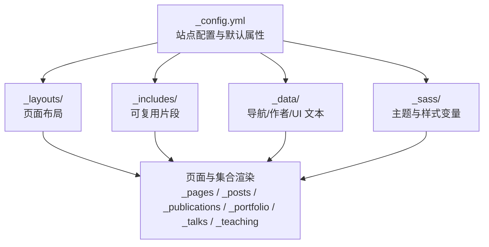
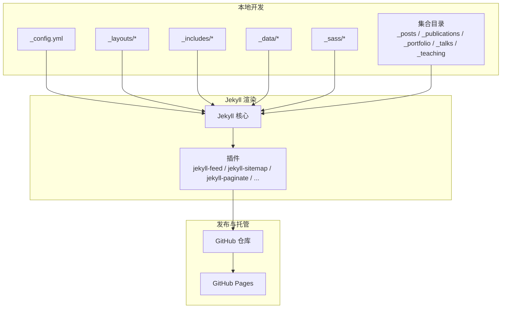
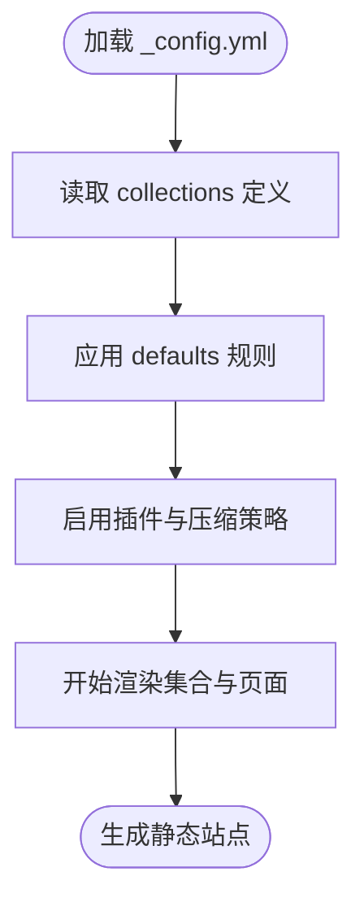
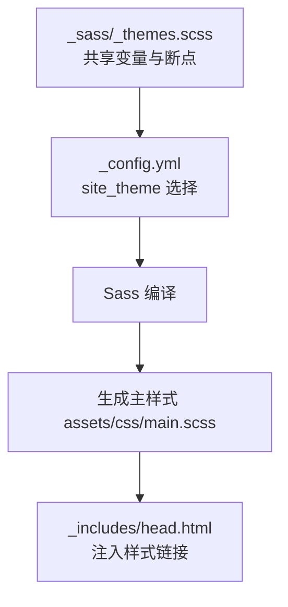
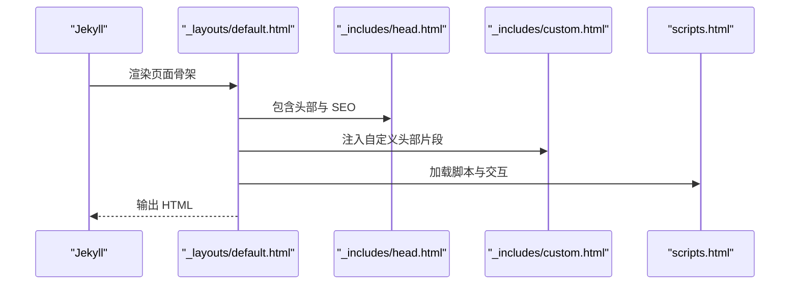
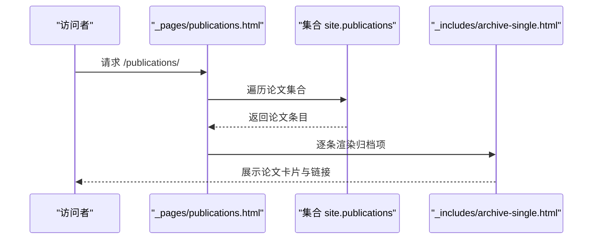
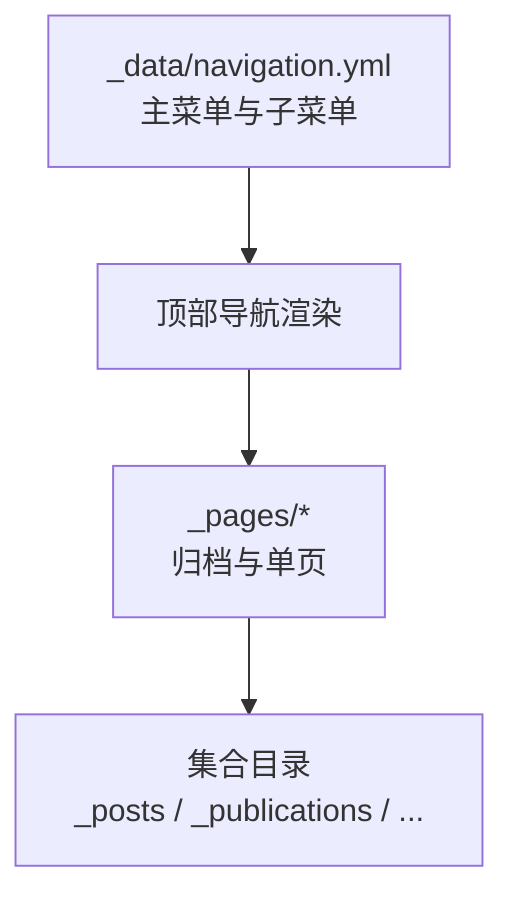
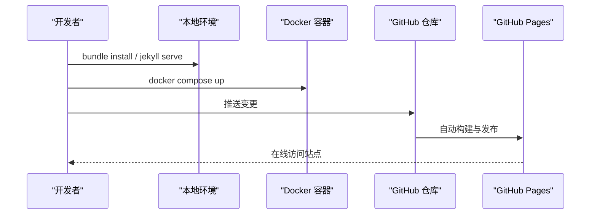
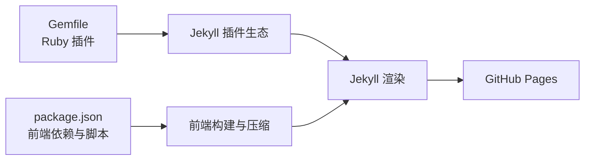

# 项目介绍

<cite>
**本文引用的文件**
- [README.md](file://README.md)
- [_config.yml](file://_config.yml)
- [Gemfile](file://Gemfile)
- [package.json](file://package.json)
- [_data/navigation.yml](file://_data/navigation.yml)
- [_sass/_themes.scss](file://_sass/_themes.scss)
- [_layouts/default.html](file://_layouts/default.html)
- [_includes/head.html](file://_includes/head.html)
- [_pages/about.md](file://_pages/about.md)
- [_pages/publications.html](file://_pages/publications.html)
- [_pages/cv.md](file://_pages/cv.md)
- [_posts/2025-03-11-my-first-blog.md](file://_posts/2025-03-11-my-first-blog.md)
- [_publications/2009-10-01-paper-title-number-1.md](file://_publications/2009-10-01-paper-title-number-1.md)
- [CONTRIBUTING.md](file://CONTRIBUTING.md)
</cite>

## 目录
1. [引言](#引言)
2. [项目结构](#项目结构)
3. [核心组件](#核心组件)
4. [架构总览](#架构总览)
5. [详细组件分析](#详细组件分析)
6. [依赖分析](#依赖分析)
7. [性能考虑](#性能考虑)
8. [故障排除指南](#故障排除指南)
9. [结论](#结论)
10. [附录](#附录)

## 引言
Academic Pages 是一个专为学术与个人专业主页设计的 GitHub Pages 网站模板。它基于 Jekyll 构建，旨在帮助研究人员、学者、学生与专业内容创作者以极低门槛创建美观、可定制且功能完备的在线展示平台。其核心价值主张包括：
- 简化学术网站创建流程：通过模板化结构与预置布局，无需复杂开发即可快速上线。
- 提供专业的学术展示能力：内置论文、报告、教学、作品集、博客等模块化集合，适配多种学术内容形态。
- 支持多主题定制：提供多种视觉主题与排版参数，满足不同风格需求。
- 开源协作与持续演进：源自 Minimal Mistakes Jekyll Theme，现由社区与维护者共同推进。

本项目面向的研究人员、学者、学生与内容创作者，既可用于个人主页、学术主页，也可作为课程网站、实验室主页或项目展示页的基础模板。

## 项目结构
该项目采用 Jekyll 的标准目录组织方式，结合 Academic Pages 的扩展特性，形成“内容 + 布局 + 数据 + 主题”的清晰分层：
- 内容层：_posts、_publications、_talks、_teaching、_portfolio 等集合目录，承载各类学术与个人内容。
- 布局层：_layouts 提供页面骨架与归档布局；_includes 提供可复用片段（头部、脚注、SEO、脚本等）。
- 配置层：_config.yml 定义站点元信息、作者信息、集合规则、插件与默认属性。
- 主题层：_sass 下的主题样式文件与共享变量，支持多主题切换与排版定制。
- 数据层：_data 下的导航、作者、UI 文本等 YAML 文件，驱动菜单与界面文案。
- 工具与脚本：markdown_generator、scripts 等辅助生成内容与转换数据。

**图示来源**
- [_config.yml:1-362](file://_config.yml#L1-L362)
- [_layouts/default.html:1-32](file://_layouts/default.html#L1-L32)
- [_includes/head.html:1-17](file://_includes/head.html#L1-L17)
- [_data/navigation.yml:1-40](file://_data/navigation.yml#L1-L40)
- [_sass/_themes.scss:1-104](file://_sass/_themes.scss#L1-L104)

**章节来源**
- [_config.yml:1-362](file://_config.yml#L1-L362)
- [_data/navigation.yml:1-40](file://_data/navigation.yml#L1-L40)
- [_sass/_themes.scss:1-104](file://_sass/_themes.scss#L1-L104)
- [_layouts/default.html:1-32](file://_layouts/default.html#L1-L32)
- [_includes/head.html:1-17](file://_includes/head.html#L1-L17)

## 核心组件
- 站点配置与集合规则：通过 _config.yml 统一管理语言、主题、作者、集合输出规则、插件与默认属性，确保页面与集合的一致行为。
- 多主题样式系统：_sass/_themes.scss 定义字体、断点、网格与品牌色等共享变量，配合主题 SCSS 文件实现主题切换与视觉定制。
- 页面骨架与 SEO：_layouts/default.html 作为通用骨架，_includes/head.html 注入 SEO、Feed 与基础样式，保证跨页面一致性。
- 导航与内容组织：_data/navigation.yml 控制顶部导航顺序与子菜单，_pages 下的归档页与单页模板驱动内容展示。
- 学术内容集合：_posts、_publications、_talks、_teaching、_portfolio 等集合目录，配合归档与单页布局，形成论文、博客、报告、教学与作品集的完整展示链路。

**章节来源**
- [_config.yml:222-293](file://_config.yml#L222-L293)
- [_sass/_themes.scss:1-104](file://_sass/_themes.scss#L1-L104)
- [_layouts/default.html:1-32](file://_layouts/default.html#L1-L32)
- [_includes/head.html:1-17](file://_includes/head.html#L1-L17)
- [_data/navigation.yml:10-40](file://_data/navigation.yml#L10-L40)

## 架构总览
Academic Pages 的运行时架构围绕 Jekyll 渲染管线展开：Jekyll 读取 _config.yml 与集合内容，按 _layouts 与 _includes 的模板组合生成静态 HTML；构建产物由 GitHub Pages 发布，实现零服务器运维的在线展示。

**图示来源**
- [_config.yml:308-325](file://_config.yml#L308-L325)
- [_layouts/default.html:1-32](file://_layouts/default.html#L1-L32)
- [_includes/head.html:1-17](file://_includes/head.html#L1-L17)
- [Gemfile:1-14](file://Gemfile#L1-L14)
- [package.json:1-42](file://package.json#L1-L42)

## 详细组件分析

### 站点配置与集合规则
- 站点基础设置：语言、主题、标题、URL、仓库等在 _config.yml 中集中定义，便于全局控制。
- 集合与默认属性：collections 字段声明教学、论文、作品集、报告等集合；defaults 为各集合设置统一布局、侧栏作者资料、社交分享、评论与相关推荐等默认行为。
- 插件与压缩：启用 jekyll-feed、jekyll-sitemap、jekyll-paginate 等插件，并通过 compress_html 对 HTML 进行压缩优化。

**图示来源**
- [_config.yml:222-293](file://_config.yml#L222-L293)
- [_config.yml:308-325](file://_config.yml#L308-L325)
- [_config.yml:356-362](file://_config.yml#L356-L362)

**章节来源**
- [_config.yml:9-362](file://_config.yml#L9-L362)

### 主题与样式系统
- 共享变量：_sass/_themes.scss 定义字体、断点、网格与品牌色等，支撑响应式与多主题基础。
- 主题选择：通过 _config.yml 的 site_theme 字段切换主题，配合主题 SCSS 实现明暗主题与风格差异。
- 排版与组件：布局 SCSS 文件控制页眉、侧边栏、表格、按钮、通知等组件样式，确保一致性与可维护性。

**图示来源**
- [_sass/_themes.scss:1-104](file://_sass/_themes.scss#L1-L104)
- [_config.yml:10-11](file://_config.yml#L10-L11)
- [_includes/head.html:15-16](file://_includes/head.html#L15-L16)

**章节来源**
- [_sass/_themes.scss:1-104](file://_sass/_themes.scss#L1-L104)
- [_config.yml:10-11](file://_config.yml#L10-L11)
- [_includes/head.html:15-16](file://_includes/head.html#L15-L16)

### 页面骨架与 SEO
- 通用骨架：_layouts/default.html 作为页面根容器，包含头部、页眉、内容区与脚本加载，支持主题数据属性与自定义片段注入。
- SEO 与 Feed：_includes/head.html 注入 SEO 元信息、Atom Feed 链接与基础样式，提升搜索引擎可见性与订阅体验。

**图示来源**
- [_layouts/default.html:1-32](file://_layouts/default.html#L1-L32)
- [_includes/head.html:1-17](file://_includes/head.html#L1-L17)

**章节来源**
- [_layouts/default.html:1-32](file://_layouts/default.html#L1-L32)
- [_includes/head.html:1-17](file://_includes/head.html#L1-L17)

### 内容集合与展示
- 论文集合：_pages/publications.html 使用归档布局，按分类渲染论文条目，支持从 Google 学者等外部渠道导流。
- CV 展示：_pages/cv.md 以归档布局整合教育、工作经历、技能、论文、报告与教学等内容，形成完整的学术履历。
- 博客与文章：_posts 下的 Markdown 条目通过 single 布局展示正文、阅读时间、评论与相关推荐，支持分类与标签归档。
- 示例条目：_publications/... 与 _posts/... 提供字段示例（如标题、摘要、日期、链接、引用等），便于快速填充。

**图示来源**
- [_pages/publications.html:1-37](file://_pages/publications.html#L1-L37)
- [_publications/2009-10-01-paper-title-number-1.md:1-15](file://_publications/2009-10-01-paper-title-number-1.md#L1-L15)

**章节来源**
- [_pages/publications.html:1-37](file://_pages/publications.html#L1-L37)
- [_pages/cv.md:1-65](file://_pages/cv.md#L1-L65)
- [_posts/2025-03-11-my-first-blog.md:1-41](file://_posts/2025-03-11-my-first-blog.md#L1-L41)
- [_publications/2009-10-01-paper-title-number-1.md:1-15](file://_publications/2009-10-01-paper-title-number-1.md#L1-L15)

### 导航与内容组织
- 导航结构：_data/navigation.yml 控制顶部导航顺序与下拉子菜单，确保论文、报告、教学、作品集、博客与 CV 等入口清晰可见。
- 页面归档：_pages 下的归档页与集合路径配合 permalink，形成稳定的永久链接与层级化浏览体验。

**图示来源**
- [_data/navigation.yml:10-40](file://_data/navigation.yml#L10-L40)
- [_pages/publications.html:1-6](file://_pages/publications.html#L1-L6)

**章节来源**
- [_data/navigation.yml:10-40](file://_data/navigation.yml#L10-L40)
- [_pages/publications.html:1-6](file://_pages/publications.html#L1-L6)

### 开发与部署流程
- 本地预览：README 提供使用 Bundler、Jekyll 与 Docker 的本地启动步骤，支持热重载与实时刷新。
- GitHub Pages 发布：通过仓库设置启用 Pages，提交即自动构建与发布，无需额外服务器。
- 维护与协作：README 明确了问题反馈与讨论渠道，CONTRIBUTING.md 阐述贡献流程与分支策略。

**图示来源**
- [README.md:18-76](file://README.md#L18-L76)
- [README.md:57-76](file://README.md#L57-L76)

**章节来源**
- [README.md:18-76](file://README.md#L18-L76)
- [README.md:74-84](file://README.md#L74-L84)
- [CONTRIBUTING.md:1-9](file://CONTRIBUTING.md#L1-L9)

## 依赖分析
- Ruby 与 Jekyll 插件：Gemfile 声明 jekyll 与常用插件（feed、sitemap、paginate、redirect-from、emoji），确保站点功能完备。
- 前端依赖与构建：package.json 定义 jQuery、FitVids、Smooth Scroll、Plotly 等前端库与压缩脚本，通过 npm 脚本进行打包与压缩。
- 构建与发布：Jekyll 读取 _config.yml 与集合，结合插件生成静态资源，GitHub Pages 自动托管。

**图示来源**
- [Gemfile:1-14](file://Gemfile#L1-L14)
- [package.json:26-41](file://package.json#L26-L41)
- [_config.yml:308-325](file://_config.yml#L308-L325)

**章节来源**
- [Gemfile:1-14](file://Gemfile#L1-L14)
- [package.json:1-42](file://package.json#L1-L42)
- [_config.yml:308-325](file://_config.yml#L308-L325)

## 性能考虑
- HTML 压缩：通过 compress_html 插件对输出 HTML 进行压缩，减少传输体积。
- 样式与脚本：Sass 编译与前端库压缩（UglifyJS）降低页面加载成本。
- 静态托管：GitHub Pages 提供全球 CDN 加速，适合静态内容分发。

**章节来源**
- [_config.yml:356-362](file://_config.yml#L356-L362)
- [package.json:36-40](file://package.json#L36-L40)

## 故障排除指南
- 本地启动失败：检查 Ruby、Bundler、Node.js 版本与权限；必要时使用本地安装路径避免权限问题。
- Docker 启动异常：确认 docker-compose.yml 与权限设置，确保端口未被占用。
- 内容不更新：确认 GitHub Pages 构建状态与分支设置，检查 _config.yml 与集合路径是否正确。
- 主题与样式问题：核对 site_theme 设置与主题 SCSS 文件是否存在冲突。

**章节来源**
- [README.md:24-56](file://README.md#L24-L56)
- [README.md:57-76](file://README.md#L57-L76)
- [_config.yml:10-11](file://_config.yml#L10-L11)

## 结论
Academic Pages 以简洁的模板化结构与强大的学术内容支持，为研究人员与内容创作者提供了“开箱即用”的专业主页解决方案。依托 Jekyll 与 GitHub Pages 的稳定生态，结合多主题与可定制的样式系统，用户可在极短时间内完成从内容创作到在线发布的全流程。同时，开源协作机制与清晰的贡献流程，保障了项目的可持续演进与社区参与。

## 附录
- 项目背景：源自 Minimal Mistakes Jekyll Theme，现由 Stuart Geiger 与 Robert Zupko 等维护者推进。
- 使用场景：个人主页、学术主页、课程网站、实验室主页、项目展示页等。
- 易用性与可定制性：通过 YAML 配置、集合目录与主题变量，实现零代码门槛的个性化定制。

**章节来源**
- [README.md:74-78](file://README.md#L74-L78)
- [_pages/about.md:18-28](file://_pages/about.md#L18-L28)