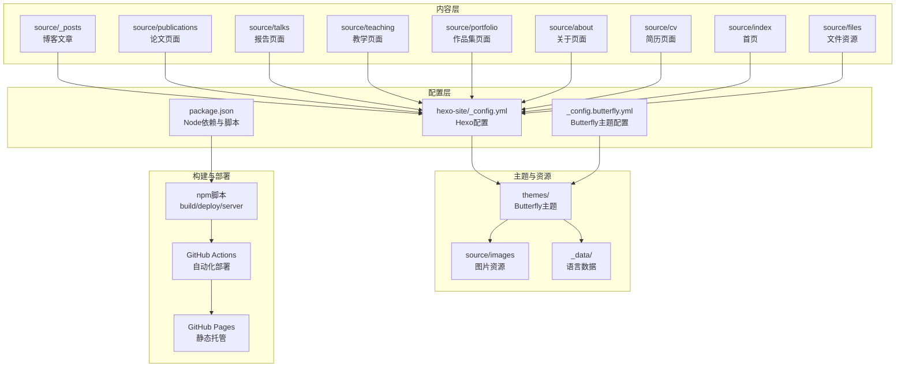
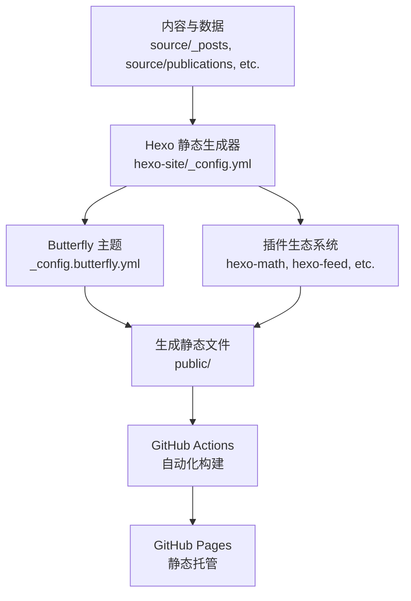
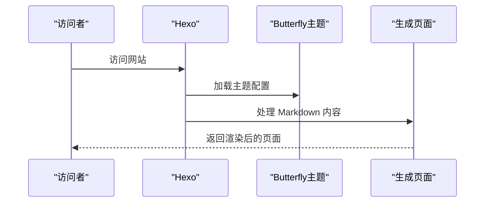
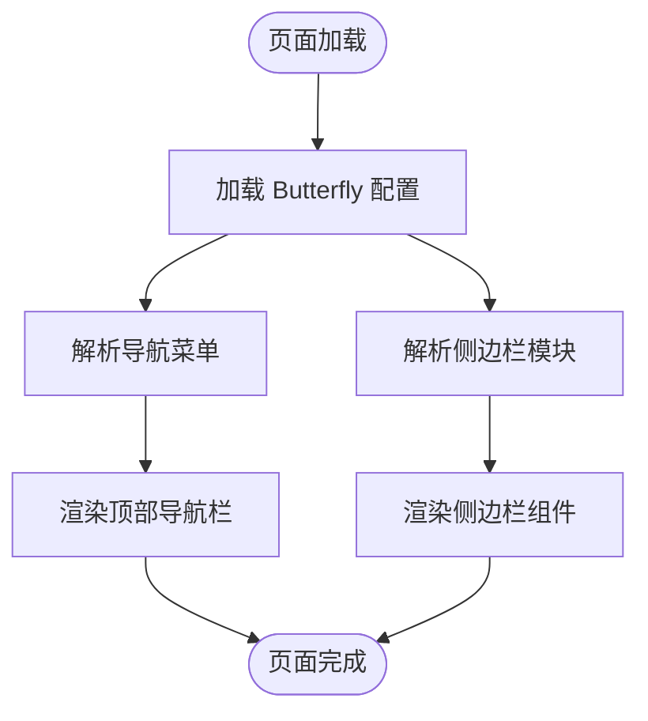
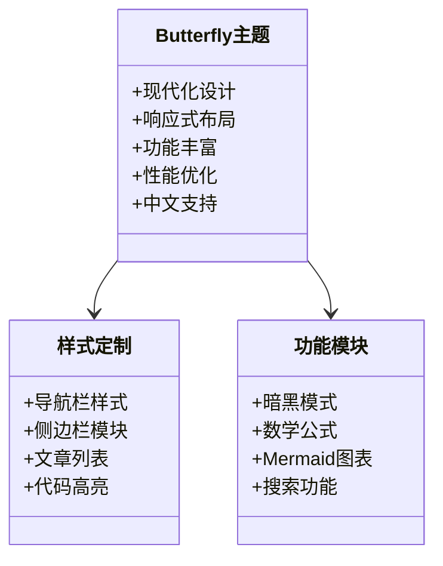
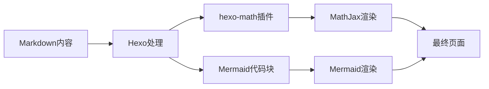
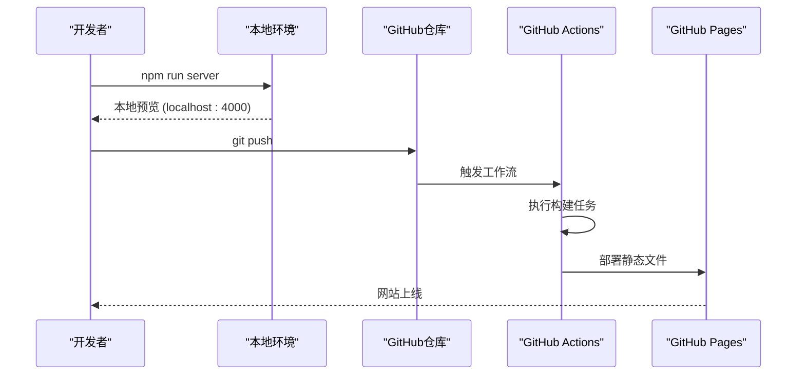
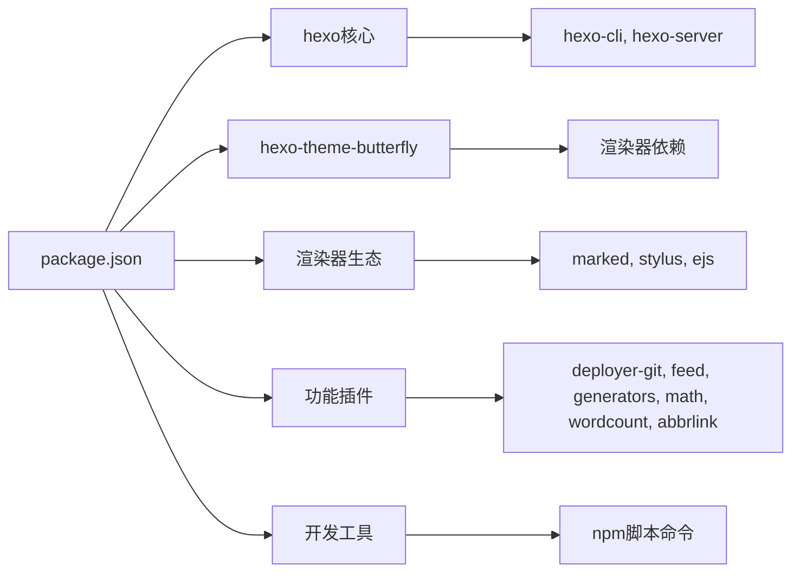

# 项目概述

<cite>
**本文引用的文件**
- [README.md](file://README.md)
- [hexo-site/_config.yml](file://hexo-site/_config.yml)
- [hexo-site/_config.butterfly.yml](file://hexo-site/_config.butterfly.yml)
- [hexo-site/package.json](file://hexo-site/package.json)
- [hexo-site/source/index.md](file://hexo-site/source/index.md)
- [hexo-site/source/about/index.md](file://hexo-site/source/about/index.md)
- [hexo-site/source/_posts/2025-03-11-useful-website.md](file://hexo-site/source/_posts/2025-03-11-useful-website.md)
- [hexo-site/source/publications/index.md](file://hexo-site/source/publications/index.md)
- [hexo-site/source/cv/index.md](file://hexo-site/source/cv/index.md)
- [hexo-site/source/portfolio/index.md](file://hexo-site/source/portfolio/index.md)
</cite>

## 更新摘要
**所做更改**
- 完全重写技术栈部分，反映从 Jekyll 到 Hexo + Butterfly 的迁移
- 更新项目结构章节，描述 Hexo 的目录组织方式
- 重构核心组件分析，基于 Hexo 配置和 Butterfly 主题
- 更新架构总览，展示 Hexo 静态站点生成流程
- 重新设计依赖关系分析，反映 Node.js 生态系统
- 更新本地开发和部署流程，基于 Hexo 命令和 GitHub Actions
- 移除 Jekyll 特定的配置和组件说明

## 目录
1. [简介](#简介)
2. [项目结构](#项目结构)
3. [核心组件](#核心组件)
4. [架构总览](#架构总览)
5. [详细组件分析](#详细组件分析)
6. [依赖关系分析](#依赖关系分析)
7. [性能考虑](#性能考虑)
8. [故障排查指南](#故障排查指南)
9. [结论](#结论)
10. [附录](#附录)

## 简介
本项目是一个基于 Hexo + Butterfly 主题的个人学术网站，专为个人与专业作品集导向的网站而设计，可直接部署在 GitHub Pages 上。项目采用现代化的 Node.js 技术栈，提供简洁美观的设计、优秀的响应式布局、丰富的功能支持（搜索、评论、目录等）、高性能优化和完善的中文支持。网站支持数学公式渲染、Mermaid 图表绘制、代码高亮与语法展示、字数统计与阅读时间估算等功能，形成统一的学术作品集门户。

- 项目定位与目标读者
  - 面向需要快速搭建个人/学术主页的用户，既适合初学者，也便于有经验的开发者进行二次开发。
  - 支持论文、报告、教学、作品集、博客等多种内容形态，形成统一的学术作品集门户。

- 开源背景与维护状态
  - 项目基于 Hexo 静态站点生成器和 Butterfly 主题构建，具有活跃的开源社区支持。
  - 通过 GitHub Actions 实现自动化部署，支持持续集成和持续部署。

- 技术栈概览
  - 前端与构建：Hexo（Node.js）、Butterfly 主题、EJS 模板引擎、Stylus 样式预处理器
  - 构建与打包：npm 脚本、Hexo 插件生态系统
  - 本地运行：Node.js、npm、Hexo CLI、GitHub Pages 自动部署

**章节来源**
- [README.md:1-97](file://README.md#L1-L97)
- [hexo-site/_config.yml:1-142](file://hexo-site/_config.yml#L1-L142)
- [hexo-site/_config.butterfly.yml:1-459](file://hexo-site/_config.butterfly.yml#L1-L459)

## 项目结构
该项目遵循 Hexo 的约定式目录组织，围绕"内容（Markdown/数据）+ 主题（Butterfly）+ 配置（YAML/JSON）+ 资源（CSS/JS/图片）"分层设计，辅以 Node.js/npm 的依赖管理和自动化部署。

- 内容层
  - source/_posts：博客文章集合，按日期命名，支持分类与标签。
  - source/publications、source/talks、source/teaching、source/portfolio：学术与作品集类集合，统一通过页面布局输出为独立页面。
  - source/about、source/cv、source/index：静态页面（如首页、关于、简历等），部分页面设置布局与元数据。
  - source/files：文件资源目录，支持 PDF、ZIP 等文件的在线访问。

- 配置层
  - hexo-site/_config.yml：Hexo 全局配置（站点信息、主题、部署、插件等）。
  - hexo-site/_config.butterfly.yml：Butterfly 主题专用配置（导航、侧边栏、功能开关等）。
  - hexo-site/package.json：Node.js 依赖与脚本命令。

- 主题与资源
  - themes：Butterfly 主题文件（由 npm 安装）。
  - source/images：网站图片资源。
  - source/_data：国际化语言数据文件。

**图示来源**
- [hexo-site/_config.yml:119-142](file://hexo-site/_config.yml#L119-L142)
- [hexo-site/_config.butterfly.yml:26-41](file://hexo-site/_config.butterfly.yml#L26-L41)
- [hexo-site/package.json:5-10](file://hexo-site/package.json#L5-L10)

**章节来源**
- [hexo-site/_config.yml:119-142](file://hexo-site/_config.yml#L119-L142)
- [hexo-site/_config.butterfly.yml:26-41](file://hexo-site/_config.butterfly.yml#L26-L41)
- [hexo-site/package.json:5-10](file://hexo-site/package.json#L5-L10)

## 核心组件
- Hexo 站点配置（hexo-site/_config.yml）
  - 全局设置：网站标题、副标题、描述、关键词、作者、语言、时区等。
  - URL 与链接：网站地址、文章链接格式、美化 URL 设置。
  - 目录结构：源文件目录、公开目录、标签、归档、分类等目录配置。
  - 写作设置：新文章文件名、默认布局、外链处理、代码高亮等。
  - 分页设置：首页每页文章数、分页目录、排序规则。
  - 主题配置：指定 Butterfly 主题及其配置。
  - 部署配置：GitHub Pages 部署设置（仓库地址、分支、提交信息）。

- Butterfly 主题配置（hexo-site/_config.butterfly.yml）
  - 导航栏设置：Logo、网站标题显示、固定导航等。
  - 导航菜单：首页、博客、简历等菜单项配置。
  - 社交媒体链接：GitHub、邮箱等社交账号链接。
  - 侧边栏配置：作者信息卡片、最新文章、分类等模块设置。
  - 功能开关：暗黑模式、数学公式、Mermaid 图表、搜索功能等。
  - 样式定制：代码块主题、分页样式、TOC 目录等。

- Node.js 与依赖管理（hexo-site/package.json）
  - Hexo 核心：hexo、hexo-cli、hexo-server。
  - 主题依赖：hexo-theme-butterfly。
  - 功能插件：hexo-deployer-git、hexo-feed、hexo-generator-*。
  - 渲染器：hexo-renderer-marked、hexo-renderer-stylus、hexo-renderer-ejs。
  - 数学支持：hexo-math。
  - 文档工具：hexo-abbrlink、hexo-wordcount。

- 内容管理系统
  - 博客文章：支持分类、标签、目录、链接缩略等元数据。
  - 学术页面：论文、报告、教学、作品集等专用页面模板。
  - 静态页面：关于、简历、首页等页面内容管理。
  - 资源文件：图片、PDF、ZIP 等文件资源管理。

**章节来源**
- [hexo-site/_config.yml:1-142](file://hexo-site/_config.yml#L1-L142)
- [hexo-site/_config.butterfly.yml:1-459](file://hexo-site/_config.butterfly.yml#L1-L459)
- [hexo-site/package.json:1-35](file://hexo-site/package.json#L1-L35)

## 架构总览
该站点采用"Hexo 静态生成 + GitHub Pages 托管"的现代化架构模式：
- 内容与数据：以 Markdown 为主，集中于 source 目录，支持多种页面类型。
- 主题系统：Butterfly 主题提供完整的 UI 组件和样式体系。
- 配置管理：YAML 配置文件驱动站点行为和主题外观。
- 插件生态：丰富的 Hexo 插件支持 SEO、RSS、sitemap、数学公式等功能。
- 构建与部署：本地使用 npm 脚本构建，GitHub Actions 自动部署到 GitHub Pages。

**图示来源**
- [hexo-site/_config.yml:119-142](file://hexo-site/_config.yml#L119-L142)
- [hexo-site/package.json:14-32](file://hexo-site/package.json#L14-L32)

**章节来源**
- [hexo-site/_config.yml:119-142](file://hexo-site/_config.yml#L119-L142)
- [hexo-site/package.json:14-32](file://hexo-site/package.json#L14-L32)

## 详细组件分析

### 页面与内容管理
- 首页（source/index.md）
  - 自定义 HTML + CSS 样式，包含欢迎区域、功能特性网格、快捷导航、联系方式等模块。
  - 支持内联样式和外部样式表，提供响应式布局和交互效果。

- 关于页面（source/about/index.md）
  - 介绍网站技术栈（Hexo + Butterfly）和功能特性。
  - 提供快速导航链接到各个内容板块。
  - 包含联系方式和致谢信息。

- 博客文章（source/_posts/*.md）
  - 支持分类、标签、目录、链接缩略等元数据。
  - 自动分页显示，支持代码高亮和数学公式渲染。

- 学术页面（source/publications/index.md, source/cv/index.md, source/portfolio/index.md）
  - 论文页面：按期刊文章和会议论文分类展示。
  - 简历页面：教育背景、工作经历、技能列表、论文和报告。
  - 作品集页面：网格布局展示作品项目。

**图示来源**
- [hexo-site/source/index.md:170-204](file://hexo-site/source/index.md#L170-L204)
- [hexo-site/source/about/index.md:20-67](file://hexo-site/source/about/index.md#L20-L67)

**章节来源**
- [hexo-site/source/index.md:170-204](file://hexo-site/source/index.md#L170-L204)
- [hexo-site/source/about/index.md:20-67](file://hexo-site/source/about/index.md#L20-L67)
- [hexo-site/source/_posts/2025-03-11-useful-website.md:1-77](file://hexo-site/source/_posts/2025-03-11-useful-website.md#L1-L77)
- [hexo-site/source/publications/index.md:10-58](file://hexo-site/source/publications/index.md#L10-L58)
- [hexo-site/source/cv/index.md:22-104](file://hexo-site/source/cv/index.md#L22-L104)
- [hexo-site/source/portfolio/index.md:10-51](file://hexo-site/source/portfolio/index.md#L10-L51)

### 导航与侧边栏系统
- 导航栏配置（_config.butterfly.yml）
  - Logo 设置：网站标识图片路径。
  - 导航菜单：首页、博客、简历等菜单项，支持图标和颜色配置。
  - 固定导航：导航栏在滚动时保持固定位置。

- 侧边栏模块（_config.butterfly.yml）
  - 作者信息卡片：个人简介、社交链接展示。
  - 最新文章：显示最近的博客文章。
  - 分类统计：文章分类的统计信息。
  - 移动端适配：侧边栏在移动端的显示行为。

**图示来源**
- [hexo-site/_config.butterfly.yml:11-41](file://hexo-site/_config.butterfly.yml#L11-L41)
- [hexo-site/_config.butterfly.yml:104-144](file://hexo-site/_config.butterfly.yml#L104-L144)

**章节来源**
- [hexo-site/_config.butterfly.yml:11-41](file://hexo-site/_config.butterfly.yml#L11-L41)
- [hexo-site/_config.butterfly.yml:104-144](file://hexo-site/_config.butterfly.yml#L104-L144)

### 主题与样式系统
- Butterfly 主题特性
  - 现代化设计：简洁美观的界面设计，支持暗黑模式。
  - 响应式布局：适配各种设备屏幕尺寸。
  - 功能丰富：内置搜索、评论、目录、代码高亮等功能。
  - 性能优化：高效的静态资源管理和加载优化。
  - 中文支持：完整的中文界面和文档支持。

- 样式定制选项
  - 导航栏样式：Logo、标题、菜单项的视觉样式。
  - 侧边栏模块：作者卡片、最新文章、分类等模块样式。
  - 文章列表：首页文章摘要、分页样式等。
  - 代码高亮：支持多种编程语言的语法高亮。

**图示来源**
- [hexo-site/_config.butterfly.yml:32-41](file://hexo-site/_config.butterfly.yml#L32-L41)
- [hexo-site/_config.butterfly.yml:268-270](file://hexo-site/_config.butterfly.yml#L268-L270)

**章节来源**
- [hexo-site/_config.butterfly.yml:32-41](file://hexo-site/_config.butterfly.yml#L32-L41)
- [hexo-site/_config.butterfly.yml:268-270](file://hexo-site/_config.butterfly.yml#L268-L270)

### 数学公式与图表支持
- 数学公式渲染（hexo-math 插件）
  - 支持 LaTeX 数学公式语法。
  - 在文章中使用 `$$` 或 `\\( \\)` 包裹数学表达式。
  - 支持行内公式和块级公式。

- Mermaid 图表支持
  - 支持流程图、序列图、类图等图表类型。
  - 通过 `mermaid` 代码块定义图表内容。
  - 客户端渲染，无需额外配置。

**图示来源**
- [hexo-site/package.json:25](file://hexo-site/package.json#L25)
- [hexo-site/_config.butterfly.yml:203-215](file://hexo-site/_config.butterfly.yml#L203-L215)

**章节来源**
- [hexo-site/package.json:25](file://hexo-site/package.json#L25)
- [hexo-site/_config.butterfly.yml:203-215](file://hexo-site/_config.butterfly.yml#L203-L215)

### 本地开发与自动化部署
- 本地开发流程
  - 安装 Node.js 和 npm。
  - 在 hexo-site 目录执行 `npm install` 安装依赖。
  - 使用 `npm run server` 启动本地服务器（默认端口 4000）。
  - 修改内容后自动热重载，实时预览效果。

- 自动化部署流程
  - 提交代码到 GitHub 仓库。
  - GitHub Actions 触发构建流程。
  - 自动部署到 GitHub Pages 分支。
  - 访问 `https://username.github.io` 查看效果。

**图示来源**
- [hexo-site/package.json:5-10](file://hexo-site/package.json#L5-L10)
- [hexo-site/_config.yml:126-142](file://hexo-site/_config.yml#L126-L142)

**章节来源**
- [hexo-site/package.json:5-10](file://hexo-site/package.json#L5-L10)
- [hexo-site/_config.yml:126-142](file://hexo-site/_config.yml#L126-L142)

## 依赖关系分析
- Hexo 核心依赖
  - hexo：静态站点生成器核心。
  - hexo-cli：命令行接口工具。
  - hexo-server：本地开发服务器。

- 主题依赖
  - hexo-theme-butterfly：Butterfly 主题核心。
  - hexo-renderer-marked：Markdown 渲染器。
  - hexo-renderer-stylus：Stylus 样式预处理器。
  - hexo-renderer-ejs：EJS 模板引擎。

- 功能插件
  - hexo-deployer-git：Git 部署插件。
  - hexo-feed：RSS/Atom 订阅生成。
  - hexo-generator-*：各类生成器（archive、category、index、sitemap、tag）。
  - hexo-math：数学公式渲染。
  - hexo-wordcount：字数统计和阅读时间计算。
  - hexo-abbrlink：文章链接缩略生成。

- 开发工具
  - npm scripts：构建、清理、部署命令。
  - 本地开发：hexo server 提供热重载功能。

**图示来源**
- [hexo-site/package.json:14-32](file://hexo-site/package.json#L14-L32)

**章节来源**
- [hexo-site/package.json:14-32](file://hexo-site/package.json#L14-L32)

## 性能考虑
- 静态资源优化
  - Hexo 自动生成静态文件，无需服务器端处理。
  - GitHub Pages 提供 CDN 加速和全球节点分布。
  - 支持图片懒加载和资源压缩。

- 主题性能特性
  - Butterfly 主题经过性能优化，减少不必要的 JavaScript。
  - 支持暗黑模式，减少视觉疲劳。
  - 响应式设计适配各种设备。

- 构建优化
  - npm 脚本提供一键构建和清理功能。
  - GitHub Actions 自动化部署，减少人工干预。
  - 支持增量构建，提高开发效率。

- SEO 优化
  - 自动生成 sitemap.xml 和 RSS/Atom 订阅。
  - 支持 meta 标签和 Open Graph 元数据。
  - 友好的 URL 结构和语义化 HTML。

**章节来源**
- [hexo-site/_config.yml:119-142](file://hexo-site/_config.yml#L119-L142)
- [hexo-site/_config.butterfly.yml:315-334](file://hexo-site/_config.butterfly.yml#L315-L334)

## 故障排查指南
- 本地开发问题
  - 确认 Node.js 版本兼容性（推荐使用 LTS 版本）。
  - 执行 `npm install` 安装所有依赖，包括 peer dependencies。
  - 使用 `npm run clean && npm run build` 清理并重新构建。
  - 检查端口占用，必要时修改本地服务器端口。

- 构建失败问题
  - 检查 Markdown 语法和 YAML front-matter 格式。
  - 确认文件编码为 UTF-8，避免中文乱码。
  - 验证图片路径和资源文件存在性。
  - 检查主题配置文件的缩进和格式。

- 部署问题
  - 确认 GitHub 仓库设置中的 Pages 配置。
  - 检查 GitHub Actions 工作流文件和权限设置。
  - 验证部署分支和目录配置。
  - 查看 Actions 日志获取详细的错误信息。

- 主题显示问题
  - 清理缓存：删除 node_modules 和 package-lock.json 重新安装。
  - 检查主题版本兼容性，必要时升级到最新版本。
  - 验证自定义样式的 CSS 语法正确性。
  - 确认图片资源路径和权限设置。

**章节来源**
- [hexo-site/package.json:5-10](file://hexo-site/package.json#L5-L10)
- [hexo-site/_config.yml:126-142](file://hexo-site/_config.yml#L126-L142)

## 结论
本项目以 Hexo 为核心，结合 Butterfly 主题和现代化的 Node.js 生态系统，提供了面向学术与个人作品集的完整解决方案。其简洁美观的设计、优秀的响应式布局、丰富的功能支持和高性能优化，使其成为个人学术主页的理想选择。通过 GitHub Actions 的自动化部署能力，用户可以专注于内容创作与展示，快速构建高质量的个人学术网站。

## 附录
- 快速开始
  - 安装 Node.js 和 npm（推荐使用 LTS 版本）。
  - 在 hexo-site 目录执行 `npm install` 安装依赖。
  - 使用 `npm run server` 启动本地服务器进行预览。
  - 修改配置文件和内容后，使用 `npm run deploy` 部署到 GitHub Pages。

- 社区与贡献
  - 通过 GitHub Issues 提交缺陷和功能请求。
  - 关注 Butterfly 主题官方文档和社区讨论。
  - 欢迎提交改进意见和主题定制建议。

**章节来源**
- [README.md:18-73](file://README.md#L18-L73)
- [hexo-site/package.json:5-10](file://hexo-site/package.json#L5-L10)
- [hexo-site/_config.yml:126-142](file://hexo-site/_config.yml#L126-L142)