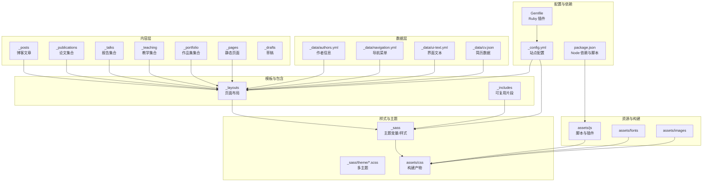
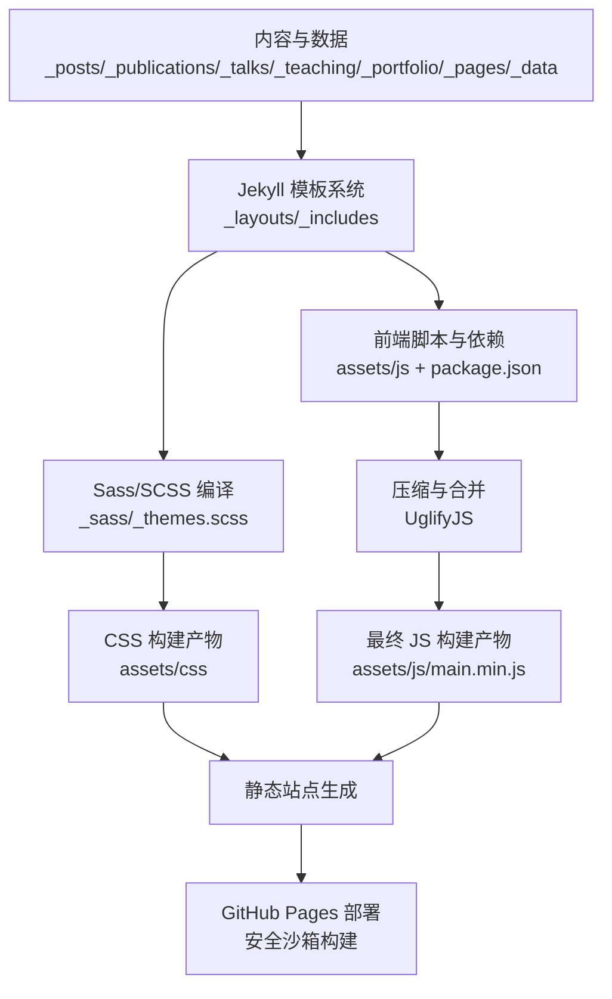
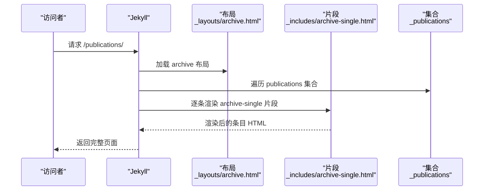
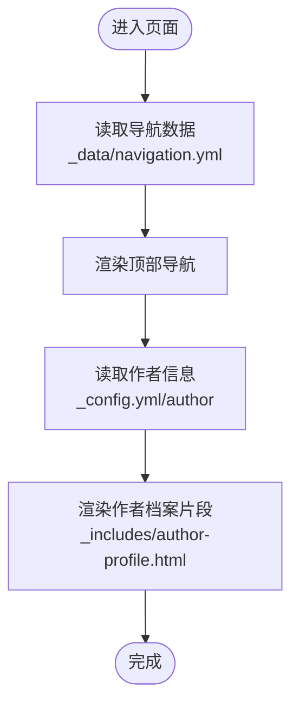
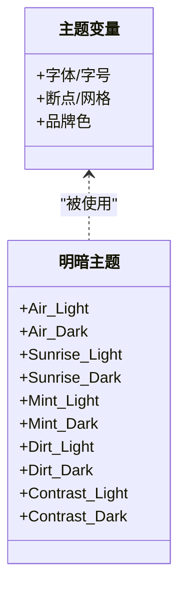
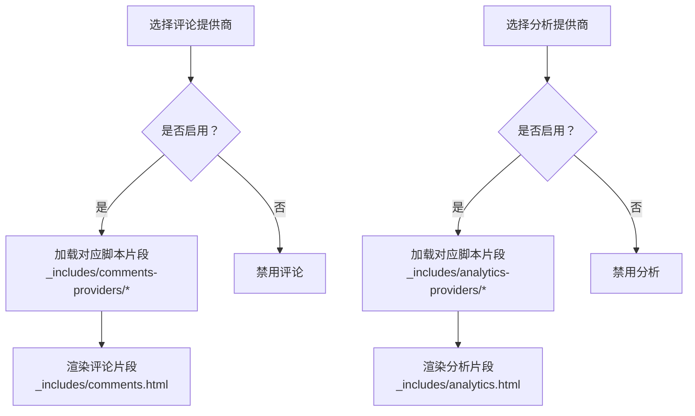
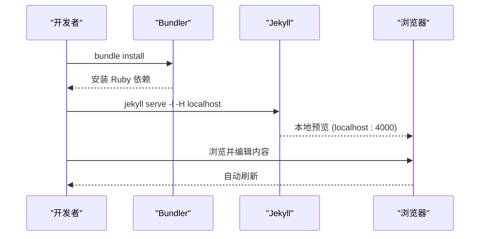
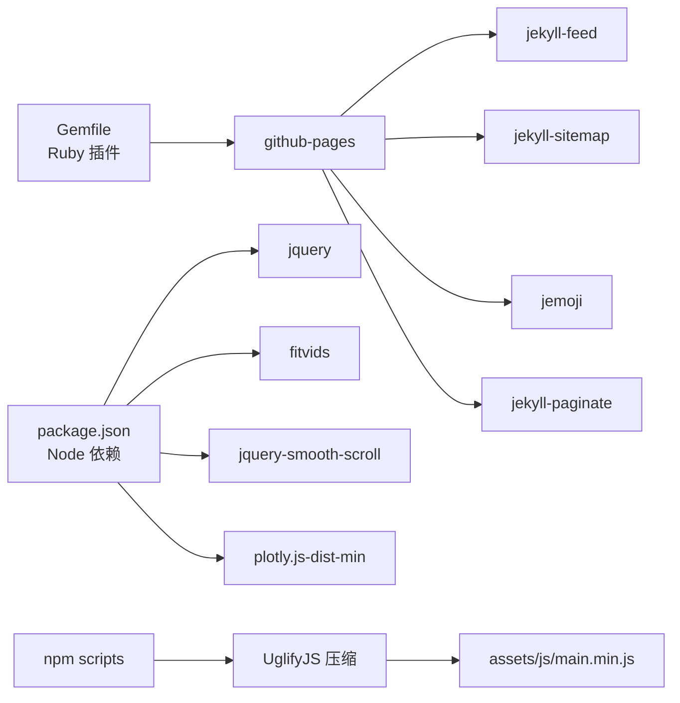

# 项目概述

<cite>
**本文引用的文件**
- [README.md](file://README.md)
- [_config.yml](file://_config.yml)
- [Gemfile](file://Gemfile)
- [package.json](file://package.json)
- [CONTRIBUTING.md](file://CONTRIBUTING.md)
- [_data/authors.yml](file://_data/authors.yml)
- [_data/navigation.yml](file://_data/navigation.yml)
- [_includes/head.html](file://_includes/head.html)
- [_layouts/default.html](file://_layouts/default.html)
- [_sass/_themes.scss](file://_sass/_themes.scss)
- [_pages/about.md](file://_pages/about.md)
- [_pages/publications.html](file://_pages/publications.html)
- [_posts/2025-03-11-my-first-blog.md](file://_posts/2025-03-11-my-first-blog.md)
- [_publications/2009-10-01-paper-title-number-1.md](file://_publications/2009-10-01-paper-title-number-1.md)
- [_talks/2012-03-01-talk-1.md](file://_talks/2012-03-01-talk-1.md)
</cite>

## 目录
1. [简介](#简介)
2. [项目结构](#项目结构)
3. [核心组件](#核心组件)
4. [架构总览](#架构总览)
5. [详细组件分析](#详细组件分析)
6. [依赖关系分析](#依赖关系分析)
7. [性能考虑](#性能考虑)
8. [故障排查指南](#故障排查指南)
9. [结论](#结论)
10. [附录](#附录)

## 简介
本项目是一个基于 Jekyll 的个人学术网站模板，专为个人与专业作品集导向的网站而设计，可直接部署在 GitHub Pages 上。它继承并扩展了 Minimal Mistakes Jekyll 主题，面向学术发布（论文、报告、教学资料）、作品集展示、博客写作等场景，提供多主题支持、响应式设计、SEO 友好、评论与统计集成等能力。项目强调“即开即用”的模板化体验，同时保留足够的可定制性以满足不同用户需求。

- 项目定位与目标读者
  - 面向需要快速搭建个人/学术主页的用户，既适合初学者，也便于有经验的开发者进行二次开发。
  - 支持论文、报告、教学、作品集、博客等多种内容形态，形成统一的学术作品集门户。

- 开源背景与维护状态
  - 项目源自 Minimal Mistakes Jekyll Theme，并由 Stuart Geiger 分叉（后脱钩）为通用模板；当前由 Robert Zupko 等维护者负责迭代与社区协作。
  - 社区采用 GitHub Issues 和 Discussions 进行问题反馈与样式讨论，欢迎贡献与提问。

- 技术栈概览
  - 前端与构建：Jekyll（Ruby）、SCSS/Sass、HTML、JavaScript（jQuery、插件脚本）
  - 构建与打包：Node.js（npm scripts）、UglifyJS 压缩、Webpack（间接通过 npm 包）
  - 本地运行：Ruby、Bundler、Jekyll、Node.js 或 Docker/DevContainer

**章节来源**
- [README.md:1-97](file://README.md#L1-L97)
- [_config.yml:1-362](file://_config.yml#L1-L362)

## 项目结构
该项目遵循 Jekyll 的约定式目录组织，围绕“内容（Markdown/数据）+ 模板（Layout/Includes）+ 样式（Sass/SCSS）+ 资源（CSS/JS/Fonts/Images）”分层设计，辅以 Ruby/Gem 与 Node.js/npm 的依赖管理。

- 内容层
  - _posts：博客文章集合，按日期命名，支持分类与标签。
  - _publications、_talks、_teaching、_portfolio：学术与作品集类集合，统一通过 collections 配置输出为独立页面。
  - _pages：静态页面（如首页、关于、归档、CV 等），部分页面设置 permalink 与作者信息。
  - _drafts：草稿目录（不参与生成）。

- 数据层
  - _data：作者信息、导航菜单、UI 文本、评论与 CV 数据等 YAML 文件，用于驱动页面渲染与链接结构。

- 模板与包含层
  - _layouts：页面布局（如 default、single、archive、talk、cv-layout 等），统一头部、页脚、脚本加载与面包屑等结构。
  - _includes：可复用片段（head、footer、scripts、评论、分析、SEO 等），实现模块化与可插拔。

- 样式与主题层
  - _sass：主题变量、断点、排版、颜色与各模块样式；_sass/theme 下提供多套明暗主题 SCSS 文件。
  - assets/css、assets/js：最终构建产物与第三方库（如 jQuery、fitvids、smooth-scroll、plotly）。

- 配置与依赖
  - _config.yml：站点全局配置（主题、作者、社交、评论、分析、集合、插件、压缩等）。
  - Gemfile：Ruby 插件与 github-pages 组合。
  - package.json：前端依赖与构建脚本（压缩 JS、监听变更）。

**图示来源**
- [_config.yml:222-293](file://_config.yml#L222-L293)
- [_data/navigation.yml:10-40](file://_data/navigation.yml#L10-L40)
- [_layouts/default.html:1-32](file://_layouts/default.html#L1-L32)
- [_sass/_themes.scss:1-104](file://_sass/_themes.scss#L1-L104)
- [package.json:26-41](file://package.json#L26-L41)

**章节来源**
- [_config.yml:222-293](file://_config.yml#L222-L293)
- [_data/navigation.yml:10-40](file://_data/navigation.yml#L10-L40)
- [_layouts/default.html:1-32](file://_layouts/default.html#L1-L32)
- [_sass/_themes.scss:1-104](file://_sass/_themes.scss#L1-L104)
- [package.json:26-41](file://package.json#L26-L41)

## 核心组件
- 站点配置（_config.yml）
  - 全局设置：语言、主题、站点名称、URL、基础路径、作者信息、社交链接、评论与分析提供商、RSS/Atom、SEO、时区等。
  - 内容集合：定义 teaching、publications、portfolio、talks 等集合的输出与永久链接规则。
  - 默认值：为 posts、pages、teaching、publications、portfolio、talks 设置默认布局与元数据。
  - 插件与白名单：启用 jekyll-feed、jekyll-sitemap、jekyll-paginate、jemoji 等，并限制 GitHub Pages 安全环境可用插件。
  - 压缩与归档：开启 HTML 压缩与分类/标签归档路径。

- Ruby 与 Jekyll 依赖（Gemfile）
  - 使用 github-pages 作为统一平台兼容包，包含 jekyll-feed、jekyll-sitemap、jemoji 等常用插件。
  - 提供本地调试所需的 webrick。

- Node.js 与前端构建（package.json）
  - 前端依赖：jquery、fitvids、jquery-smooth-scroll、plotly.js-dist-min 等。
  - 构建脚本：uglify 合并压缩 JS，onchange 监听变更并触发构建。

- 多主题与响应式设计（_sass/_themes.scss）
  - 提供字体、字号、断点、网格、品牌色等共享主题变量，支撑多套明/暗主题切换与移动端适配。

- 模板与包含（_layouts/default.html、_includes/head.html）
  - default 布局统一注入 base_path、head 片段、脚本与页脚，支持主题开关与压缩布局。
  - head 片段负责 SEO、Feed、视口、CSS 引入与基础路径。

- 数据驱动（_data/navigation.yml、_data/authors.yml）
  - 导航菜单：控制顶部菜单顺序、下拉子菜单与链接目标。
  - 作者信息：头像、姓名、简介、社交链接等，用于侧边栏作者档案。

**章节来源**
- [_config.yml:10-362](file://_config.yml#L10-L362)
- [Gemfile:1-14](file://Gemfile#L1-L14)
- [package.json:1-42](file://package.json#L1-L42)
- [_sass/_themes.scss:1-104](file://_sass/_themes.scss#L1-L104)
- [_layouts/default.html:1-32](file://_layouts/default.html#L1-L32)
- [_includes/head.html:1-17](file://_includes/head.html#L1-L17)
- [_data/navigation.yml:10-40](file://_data/navigation.yml#L10-L40)
- [_data/authors.yml:1-19](file://_data/authors.yml#L1-L19)

## 架构总览
该站点采用“静态生成 + 平台托管”的架构模式：
- 内容与数据：以 Markdown/YAML 为主，集中于 _posts、_publications、_talks、_teaching、_portfolio、_pages、_data 等目录。
- 模板系统：Jekyll 通过 _layouts 与 _includes 提供可复用的页面骨架与片段。
- 样式与主题：Sass/SCSS 编译为 CSS，配合多主题变量与断点实现响应式。
- 前端脚本：npm 管理依赖并通过 UglifyJS 压缩合并，提升加载性能。
- 构建与部署：本地使用 Bundler + Jekyll 或 Docker/DevContainer；最终由 GitHub Pages 在安全沙箱中构建并发布。

**图示来源**
- [_config.yml:295-325](file://_config.yml#L295-L325)
- [package.json:36-41](file://package.json#L36-L41)
- [_sass/_themes.scss:1-104](file://_sass/_themes.scss#L1-L104)

**章节来源**
- [_config.yml:295-325](file://_config.yml#L295-L325)
- [package.json:36-41](file://package.json#L36-L41)
- [_sass/_themes.scss:1-104](file://_sass/_themes.scss#L1-L104)

## 详细组件分析

### 页面与集合：论文、报告、教学、作品集与博客
- 论文页面（_pages/publications.html）
  - 支持按分类（books、manuscripts、conferences）分组渲染，若未定义分类则按时间倒序展示。
  - 可选链接至 Google Scholar 个人主页。
  - 使用 archive-single 片段渲染单条目。

- 报告页面（_talks/*.md）
  - 通过 collection: talks 输出为独立页面，包含地点、日期、类型等元数据。

- 教学与作品集
  - 通过 collections: teaching、portfolio 定义，统一采用 single 布局与作者档案、分享、评论等默认行为。

- 博客文章（_posts/*.md）
  - 支持 excerpt、read_time、comments、share、related 等元数据，适合知识分享与学习记录。

**图示来源**
- [_pages/publications.html:1-37](file://_pages/publications.html#L1-L37)
- [_publications/2009-10-01-paper-title-number-1.md:1-15](file://_publications/2009-10-01-paper-title-number-1.md#L1-L15)

**章节来源**
- [_pages/publications.html:1-37](file://_pages/publications.html#L1-L37)
- [_publications/2009-10-01-paper-title-number-1.md:1-15](file://_publications/2009-10-01-paper-title-number-1.md#L1-L15)
- [_talks/2012-03-01-talk-1.md:1-12](file://_talks/2012-03-01-talk-1.md#L1-L12)
- [_posts/2025-03-11-my-first-blog.md:1-41](file://_posts/2025-03-11-my-first-blog.md#L1-L41)

### 导航与作者档案
- 导航菜单（_data/navigation.yml）
  - 控制顶部菜单项顺序与下拉子菜单，支持“论文”“报告”“教学”“作品集”“博客文章”“简历”等入口。
  - “简历”提供两种形式：Markdown 页面或 JSON 生成版本（二选一）。

- 作者档案（_includes/author-profile.html）
  - 展示头像、姓名、简介、位置、雇主、邮箱等，社交链接来自 _config.yml 的 author 字段。

**图示来源**
- [_data/navigation.yml:10-40](file://_data/navigation.yml#L10-L40)
- [_config.yml:24-84](file://_config.yml#L24-L84)

**章节来源**
- [_data/navigation.yml:10-40](file://_data/navigation.yml#L10-L40)
- [_config.yml:24-84](file://_config.yml#L24-L84)

### 主题与样式系统
- 主题变量（_sass/_themes.scss）
  - 定义字体、字号、断点、网格、品牌色等，支撑 Air、Sunrise、Mint、Dirt、Contrast 等多主题。
  - 通过 SCSS 变量与 Mixins 实现跨模块一致性与可维护性。

- 布局与组件样式
  - layout 下的 _archive.scss、_page.scss、_sidebar.scss 等分别覆盖归档页、正文页、侧边栏等区域。
  - theme 下的 *_light.scss、*_dark.scss 提供明暗主题变体。

**图示来源**
- [_sass/_themes.scss:1-104](file://_sass/_themes.scss#L1-L104)

**章节来源**
- [_sass/_themes.scss:1-104](file://_sass/_themes.scss#L1-L104)

### 评论与分析集成
- 评论系统（_includes/comments-providers/* 与 _includes/comments.html）
  - 支持 disqus、discourse、facebook、staticman、google-plus、custom 等提供商。
  - _config.yml 中的 comments.provider 与对应子配置决定启用与参数。

- 分析系统（_includes/analytics-providers/* 与 _includes/analytics.html）
  - 支持 google、google-universal、google-analytics-4、custom 等。
  - _config.yml 中的 analytics.provider 与 tracking_id 控制埋点。

**图示来源**
- [_config.yml:101-130](file://_config.yml#L101-L130)
- [_config.yml:157-161](file://_config.yml#L157-L161)

**章节来源**
- [_config.yml:101-130](file://_config.yml#L101-L130)
- [_config.yml:157-161](file://_config.yml#L157-L161)

### 本地开发与容器化
- 本地运行
  - 安装 ruby-dev、bundler、nodejs；执行 bundle install；使用 jekyll serve -l -H localhost 预览。
  - 若遇到权限问题，可通过 bundle config set --local path 'vendor/bundle' 本地安装 Gems。

- Docker 与 DevContainer
  - 提供 Dockerfile 与 docker-compose.yaml，一键构建并运行本地服务。
  - VS Code Dev Container 可自动检测并启动开发容器，实时热更新。

**图示来源**
- [README.md:18-73](file://README.md#L18-L73)

**章节来源**
- [README.md:18-73](file://README.md#L18-L73)

## 依赖关系分析
- Ruby 插件生态
  - github-pages 作为统一平台包，内含 jekyll-feed、jekyll-sitemap、jemoji 等；webrick 用于本地调试。
  - 白名单限制仅允许特定插件在 GitHub Pages 安全环境中运行。

- Node.js 前端生态
  - 依赖 jquery、fitvids、jquery-smooth-scroll、plotly.js-dist-min 等，用于交互与可视化。
  - 构建脚本通过 UglifyJS 合并压缩，onchange 监听变更并触发构建。

- 样式与主题
  - _sass/_themes.scss 提供全局变量与断点，theme 下的 *_light.scss、*_dark.scss 作为主题扩展。
  - 布局样式（_sass/layout/*）与组件样式（按钮、表格、通知等）按模块组织。

**图示来源**
- [Gemfile:1-14](file://Gemfile#L1-L14)
- [package.json:26-41](file://package.json#L26-L41)

**章节来源**
- [Gemfile:1-14](file://Gemfile#L1-L14)
- [package.json:26-41](file://package.json#L26-L41)

## 性能考虑
- HTML 压缩
  - 通过 compress_html 插件对输出 HTML 进行裁剪，忽略 development 环境，减少传输体积。

- 样式与脚本优化
  - Sass/SCSS 编译为压缩样式（style: compressed），减少 CSS 体积。
  - 前端脚本通过 UglifyJS 合并与压缩，降低首屏加载时间。

- 图片与媒体
  - 建议在 assets/images 中存放优化后的图片，并结合懒加载与响应式尺寸策略。

- 静态资源缓存
  - 利用 GitHub Pages 的 CDN 与浏览器缓存机制，合理设置资源版本号或哈希命名以提升缓存命中率。

**章节来源**
- [_config.yml:357-362](file://_config.yml#L357-L362)
- [package.json:36-41](file://package.json#L36-L41)

## 故障排查指南
- 本地预览失败
  - 确认已安装 ruby-dev、bundler、nodejs；执行 bundle install；若出现权限错误，使用本地安装路径配置后重试。
  - 使用 jekyll serve 或 bundle exec jekyll serve 确保依赖版本一致。

- Docker/DevContainer 启动异常
  - 确认已赋予仓库可执行权限（chmod -R 777 .），并使用 docker compose up 启动。
  - VS Code Dev Container 应自动检测配置，必要时手动“在容器中重新打开”。

- GitHub Pages 构建失败
  - 检查 Gemfile 与 _config.yml 中的插件白名单，确保仅使用受支持的插件组合。
  - 若自定义主题或布局改动较大，建议在本地先验证无误再推送。

- 评论与分析不可用
  - 核对 _config.yml 中 comments.provider 与 analytics.provider 的配置值与子字段是否正确填写。
  - 对于 Staticman 等需服务端配置的评论系统，确认分支与路径设置符合要求。

**章节来源**
- [README.md:18-73](file://README.md#L18-L73)
- [_config.yml:101-130](file://_config.yml#L101-L130)
- [_config.yml:157-161](file://_config.yml#L157-L161)

## 结论
本项目以 Jekyll 为核心，结合 Ruby 与 Node.js 生态，提供了面向学术与个人作品集的完整解决方案。其模板化设计降低了上手门槛，同时通过数据驱动、多主题与响应式样式保障了可扩展性与一致性。借助 GitHub Pages 的自动化部署能力，用户可以专注于内容创作与展示，快速构建高质量的个人学术主页。

## 附录
- 快速开始
  - 注册 GitHub 账号并使用模板创建仓库；设置站点全局配置与内容；上传文件至 files/ 目录；在仓库设置中启用 GitHub Pages。
  - 如需本地预览，安装依赖后运行 jekyll serve；或使用 Docker/DevContainer。

- 社区与贡献
  - 通过 GitHub Issues 提交缺陷与功能请求；通过 Discussions 讨论样式与使用问题。
  - 欢迎 Fork 与 Pull Request；注意模板定制可能带来的同步冲突，必要时采用 rebase 或 cherry-pick 方式合并。

**章节来源**
- [README.md:6-16](file://README.md#L6-L16)
- [README.md:74-84](file://README.md#L74-L84)
- [CONTRIBUTING.md:1-9](file://CONTRIBUTING.md#L1-L9)